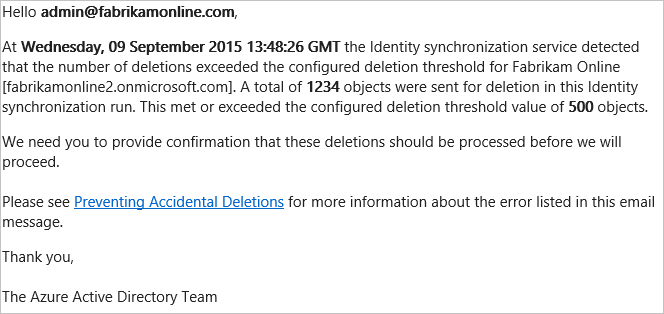
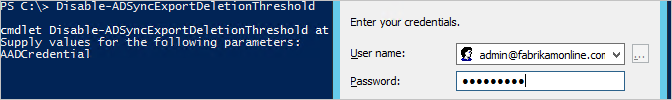

<properties
   pageTitle="Synchronisieren von Azure AD verbinden: unbeabsichtigte Löschen sperren | Microsoft Azure"
   description="In diesem Thema beschreibt das verhindern-unbeabsichtigtes löschen (verhindert wird versehentliche gelöschter Dateien)-Feature in Azure AD-Verbindung herstellen."
   services="active-directory"
   documentationCenter=""
   authors="AndKjell"
   manager="femila"
   editor=""/>

<tags
   ms.service="active-directory"
   ms.devlang="na"
   ms.topic="article"
   ms.tgt_pltfrm="na"
   ms.workload="identity"
   ms.date="09/01/2016"
   ms.author="billmath"/>

# Synchronisieren von Azure AD verbinden: unbeabsichtigte Löschen sperren
In diesem Thema beschreibt das verhindern-unbeabsichtigtes löschen (verhindert wird versehentliche gelöschter Dateien)-Feature in Azure AD-Verbindung herstellen.

Bei der Installation von Azure AD-verbinden, unbeabsichtigtes verhindern löschen ist standardmäßig aktiviert, und so konfiguriert, dass einen Export mit mehr als 500 löschen nicht zulassen. Diese Funktion dient unbeabsichtigtes Konfiguration Änderungen und Änderungen an Ihrem lokalen Verzeichnis gewarnt werden, die viele Benutzer und anderen Objekten beeinträchtigen kann.

Häufige Szenarien, wenn Sie viele Delete einschließen angezeigt wird:

- Wechselt zu [Filtern](active-directory-aadconnectsync-configure-filtering.md) , wo eine gesamte [Organisationseinheit](active-directory-aadconnectsync-configure-filtering.md#organizational-unitbased-filtering) oder [Domäne](active-directory-aadconnectsync-configure-filtering.md#domain-based-filtering) nicht ausgewählt ist.
- Alle Objekte in einer Organisationseinheit werden gelöscht.
- Eine Organisationseinheit umbenannt, damit alle Objekte darin als außerhalb des Bereichs für die Synchronisierung gelten.

Der Standardwert 500 Objekte mit PowerShell geändert werden kann mithilfe von `Enable-ADSyncExportDeletionThreshold`. Sie sollten diesen Wert, um die Größe Ihrer Organisation angepasst konfigurieren. Da der Scheduler synchronisieren alle 30 Minuten ausgeführt wird, ist der Wert die Anzahl der Löschvorgänge innerhalb von 30 Minuten angezeigt.

Treten zu viele löscht bereitgestellt werden, um in Azure AD exportiert werden, klicken Sie dann auf der Export beendet und Sie erhalten eine e-Mail-Nachricht wie folgt:

> *Hallo (technische Kontakt). Bei (Zeit) erkannt des Synchronisierungsdiensts Identität an, dass die Anzahl von Löschvorgängen den konfigurierten Löschvorgang Schwellenwert für (Organisationsname) überschritten. Eine (Anzahl) Gesamtmenge der Objekte wurden in dieser Identität Synchronisierung führen Sie zum Löschen gesendet. Erfüllt, oder den Schwellenwert konfigurierten Löschvorgang (Anzahl) Objekte überschritten. Wir benötigen Sie zur Bestätigung bereitstellen, dass die gelöschten Informationen verarbeitet werden sollen, bevor wir fortgesetzt wird. Wenden Sie verhindern versehentlichen gelöschter Dateien für Weitere Informationen zu dem Fehler aufgeführt, die in dieser e-Mail-Nachricht ein.*

Sie können auch den Status anzeigen `stopped-deletion-threshold-exceeded` Wenn Sie die **Synchronisierung Dienst-Manager** Benutzeroberfläche für das Profil exportieren aussehen.

Wenn dies unerwartete war, dann ermitteln und Maßnahmen ergreifen. Führen Sie folgende Schritte aus, um festzustellen, welche Objekte sind gelöscht werden sollen:

1. Starten Sie über das Startmenü **Synchronisierungsdiensts** .
2. Wechseln Sie zu der **Verbinder**.
3. Markieren Sie den Verbinder mit **Azure Active Directory**-Typ aus.
4. Wählen Sie unter **Aktionen** auf der rechten Seite **Suchen Verbinder Leerzeichen**ein.
5. Im Popup unter **Bereich**wählen Sie **Getrennt, da** aus, und wählen Sie eine Uhrzeit in der Vergangenheit. Klicken Sie auf **Suchen**. Diese Seite enthält eine Übersicht über alle Objekte gelöscht werden sollen. Indem Sie auf jedes Element, erhalten Sie weitere Informationen über das Objekt. Klicken Sie auf **Spalte Einstellung** im Raster sichtbar sind zusätzliche Attribute hinzuzufügen.

Wenn alle die Löschvorgänge gescannt werden sollen, klicken Sie dann folgendermaßen Sie vor:

1. Vorübergehendes Deaktivieren dieser Schutz und dem Benutzer diese löscht aufzurufen, führen Sie das PowerShell-Cmdlet: `Disable-ADSyncExportDeletionThreshold`. Geben Sie eine Azure AD globaler Administrator-Konto und das Kennwort ein.

2. Wählen Sie mit Azure Active Directory Connector weiterhin ausgewählt die Aktion **Ausführen** und dann auf **Exportieren**.
3. Um den Schutz wieder zu aktivieren, führen Sie das PowerShell-Cmdlet: `Enable-ADSyncExportDeletionThreshold`.

## Nächste Schritte

**Themen (Übersicht)**

- [Synchronisieren von Azure AD verbinden: verstehen und Anpassen der Synchronisierung](active-directory-aadconnectsync-whatis.md)
- [Integrieren von Ihrem lokalen Identitäten in Azure Active Directory](active-directory-aadconnect.md)
