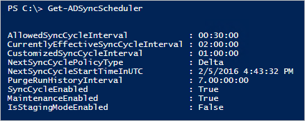
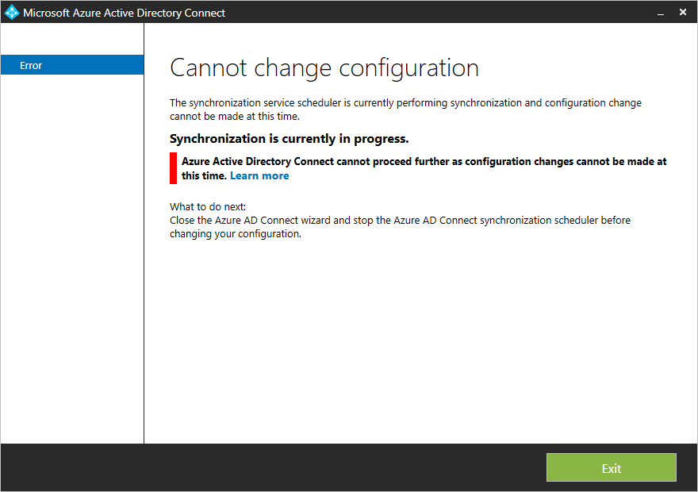
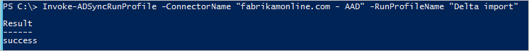

<properties
   pageTitle="Synchronisieren von Azure AD verbinden: Scheduler | Microsoft Azure"
   description="In diesem Thema werden das integrierten Scheduler Feature in Azure AD verbinden synchronisieren."
   services="active-directory"
   documentationCenter=""
   authors="AndKjell"
   manager="femila"
   editor=""/>

<tags
   ms.service="active-directory"
   ms.devlang="na"
   ms.topic="article"
   ms.tgt_pltfrm="na"
   ms.workload="identity"
   ms.date="08/04/2016"
   ms.author="billmath"/>

# <a name="azure-ad-connect-sync-scheduler"></a>Synchronisieren von Azure AD verbinden: Scheduler
In diesem Thema werden die integrierten Scheduler in Azure AD verbinden synchronisieren (auch bekannt als Synchronisieren-Engine).

Diese Funktion wurde mit Build 1.1.105.0 (veröffentlicht Februar 2016) eingeführt werden.

## <a name="overview"></a>(Übersicht)
Azure AD verbinden synchronisieren werden Änderungen, die in Ihrem lokalen Verzeichnis mit einem Planer weiterhin synchronisiert. Es gibt zwei Scheduler Prozesse, eine für Kennwort synchronisieren und ein anderes Objekt/Attribut synchronisieren und Wartungsaufgaben an. In diesem Thema wird letztere behandelt.

In früheren Versionen wurde der Scheduler für Objekte und Attribute außerhalb der Synchronisierungs-Engine und der Windows-Taskplaner oder einem separaten Windows-Dienst wurde verwendet, um die Synchronisierung auslösen. Der Scheduler wird mit der integrierten 1.1 Versionen zu synchronisieren-engine und einige Anpassung zu erlauben. Die neue Standard-Synchronisierung Häufigkeit ist 30 Minuten.

Der Scheduler ist verantwortlich für zwei Aufgaben:

- **Aus-und Synchronisierung**. Der Vorgang zum Importieren und synchronisieren Änderungen exportieren.
- **Wartungsaufgaben**. Erneuern Sie Schlüssel und Zertifikate für das Zurücksetzen von Kennwörtern und Gerät Registrierung Service (DRS). Löschen Sie ALTER Einträge im Protokoll Vorgänge an.

Der Scheduler selbst immer ausgeführt wird, aber es kann konfiguriert werden, wenn Sie nur eine oder keine der folgenden Aufgaben ausführen. Beispielsweise wenn Sie einen eigenen Synchronisierung Zyklus Prozess haben müssen, können Sie diese Aufgabe in der Scheduler deaktivieren jedoch weiterhin die Wartungsaufgabe ausführen.

## <a name="scheduler-configuration"></a>Scheduler-Konfiguration
Wechseln Sie zum Anzeigen Ihrer aktuellen Konfiguration Einstellungen zu PowerShell und ausführen `Get-ADSyncScheduler`. Es wird Sie ungefähr wie folgt angezeigt:



Wenn **der Befehl "Synchronisieren" oder Cmdlet ist nicht verfügbar** angezeigt, wenn Sie dieses Cmdlet ausführen, wird das PowerShell-Modul nicht geladen. Dies kann geschehen, wenn Sie Azure AD verbinden auf einem Domain Controller oder auf einem Server mit höheren PowerShell Einschränkungsebenen als Standardeinstellungen ausführen. Wenn dieser Fehler angezeigt wird, führen Sie dann `Import-Module ADSync` das Cmdlet zur Verfügung stellen.

- **AllowedSyncCycleInterval**. Die am häufigsten können Azure AD Synchronisierung auftreten. Sie können nicht häufiger als dies synchronisieren und weiterhin unterstützt werden.
- **CurrentlyEffectiveSyncCycleInterval**. Den Terminplan momentan in Kraft. Er muss den gleichen Wert wie CustomizedSyncInterval (wenn festlegen) Wenn sie nicht mehr als AllowedSyncInterval häufige ist. Wenn Sie CustomizedSyncCycleInterval ändern, wird dies nach der nächsten Synchronisierungszyklus wirksam werden.
- **CustomizedSyncCycleInterval**. Wenn Sie den Zeitplan an, bei einem beliebigen anderen Häufigkeit als den Standardwert 30 Minuten ausführen möchten, konfigurieren Sie diese Einstellung. In der Abbildung oben der Scheduler hat stattdessen auszuführenden stündlich festgelegt wurde. Wenn Sie dies auf einen Wert kleiner als AllowedSyncInterval festlegen, wird der letztere verwendet werden.
- **NextSyncCyclePolicyType**. Delta oder Initiale. Legt fest, ob die nächste Abfolge nur Prozess Delta Änderungen, sollte oder wenn Sie die nächste Abfolge führen Sie eine vollständige sollte importieren und synchronisieren möchten, welche würde auch eine neuen oder geänderten Regeln erneut verarbeiten.
- **NextSyncCycleStartTimeInUTC**. Nächste Mal beginnt der Scheduler beim nächsten Zyklus synchronisieren.
- **PurgeRunHistoryInterval**. Die Uhrzeit Vorgang Protokolle beibehalten werden sollten. Diese können die Synchronisierung Dienst-Manager überprüft werden. Standardmäßig wird diese 7 Tage lang beibehalten.
- **SyncCycleEnabled**. Zeigt an, ob der Scheduler die importieren, synchronisieren und Prozesse exportieren als Teil der Vorgang ausgeführt wird.
- **MaintenanceEnabled**. Gibt an, ob die Verwaltungsvorgang aktiviert ist. Die Zertifikate/Schlüssel aktualisieren wird und bereinigen Sie das Protokoll Vorgänge.
- **IsStagingModeEnabled**. Zeigt, wenn [das staging Modus](active-directory-aadconnectsync-operations.md#staging-mode) aktiviert ist.

Ändern Sie einige der diese Einstellungen mit `Set-ADSyncScheduler`. Die folgenden Parameter können geändert werden:

- CustomizedSyncCycleInterval
- NextSyncCyclePolicyType
- PurgeRunHistoryInterval
- SyncCycleEnabled
- MaintenanceEnabled

Die Konfiguration der Scheduler wird in Azure AD gespeichert. Wenn Sie einen staging-Server verfügen, wird auf dem primären Server geändert auch den Bereitstellungsserver (mit Ausnahme von IsStagingModeEnabled) Effekt.

### <a name="customizedsynccycleinterval"></a>CustomizedSyncCycleInterval
Syntax:`Set-ADSyncScheduler -CustomizedSyncCycleInterval d.HH:mm:ss`  
d - Tage, HH - Stunden, mm - Minuten, ss - Sekunden

Beispiel:`Set-ADSyncScheduler -CustomizedSyncCycleInterval 03:00:00`  
Ändert den Zeitplan an alle 3 Stunden auszuführen.

Beispiel:`Set-ADSyncScheduler -CustomizedSyncCycleInterval 1.0:0:0`  
Ändert den Zeitplan an täglich auszuführen.

## <a name="start-the-scheduler"></a>Starten Sie den scheduler
Der Scheduler wird standardmäßig alle 30 Minuten ausgeführt. In einigen Fällen soll einen Zyklus synchronisieren zwischen die geplanten durchläuft ausgeführt, oder Sie einen anderen Typ ausführen müssen.

**Delta synchronisieren Kreis**  
Delta synchronisieren Zyklus umfasst die folgenden Schritte aus:

- Delta importieren auf alle Verbinder
- Delta Synchronisieren aller Verbinder
- Klicken Sie auf alle Verbinder exportieren

Möglicherweise sind Sie haben dringende ändern, die sofort synchronisiert werden müssen also warum Sie manuell einen Zyklus ausführen müssen. Wenn Sie manuell einen Kreis, führen Sie dann aus der PowerShell ausführen müssen `Start-ADSyncSyncCycle -PolicyType Delta`.

**Vollständige Synchronisierung Kreis**  
Wenn Sie eine der folgenden Konfiguration Änderungen vorgenommen haben, müssen Sie einen vollständigen Synchronisierung Zyklus (auch bekannt als ausführen Initiale):

- Mehrere Objekte oder Attributen aus der Quellverzeichnis importiert werden hinzugefügt
- Die Synchronisierungsregeln Änderungen vorgenommen
- Geändert [Filtern](active-directory-aadconnectsync-configure-filtering.md) , sodass dieselbe Anzahl von Objekten eingeschlossen werden sollen

Wenn Sie eine der folgenden Änderungen vorgenommen haben, müssen Sie einen vollständige Synchronisierung Zyklus ausführen, damit die Synchronisierung-Engine die Möglichkeit hat zu Quellbereichs neu zu konsolidieren die Verbinder Leerzeichen. Ein vollständige Synchronisierung Zyklus umfasst die folgenden Schritte aus:

- Klicken Sie auf alle Verbinder vollständigen Import
- Vollständige Synchronisieren aller Verbinder
- Klicken Sie auf alle Verbinder exportieren

Führen Sie zum Starten eines vollständigen Synchronisierung Zyklus `Start-ADSyncSyncCycle -PolicyType Initial` aus einer PowerShell-Eingabeaufforderung. Dadurch wird einen vollständige Synchronisierung Zyklus gestartet.

## <a name="stop-the-scheduler"></a>Beenden Sie den scheduler
Wenn der Scheduler Synchronisationszyklus gerade ausgeführt wird, müssen Sie es beenden. Beispielsweise wenn Sie den Installationsassistenten starten und es wird dieser Fehler angezeigt:



Wenn ein synchronisieren Zyklus ausgeführt wird, können nicht Sie Konfiguration Änderungen vornehmen. Sie können warten, bis der Scheduler hat den Vorgang abgeschlossen, aber Sie können die es, damit Sie sofort die Änderungen vornehmen können. Beenden des aktuellen Zyklus ist nicht gefährlichen und nächsten ausführen alle Änderungen, die noch nicht verarbeitet verarbeitet werden.

1. Ein anderer Benutzer den Zeitplan an, deren aktuellen Zyklus mit dem PowerShell-Cmdlet beenden Sie zunächst `Stop-ADSyncSyncCycle`.
2. Das beenden den Scheduler wird nicht des aktuellen Verbinders aus den aktuellen Vorgang. Um den Verbinder, um Beenden erzwingen, passiert Folgendes: 
    - Starten Sie über das Startmenü **Synchronisierung Dienst** ein. Wechseln Sie zu der **Verbinder**, markieren Sie den Verbinder mit dem Status **ausgeführt** und wählen Sie aus den Aktionen **Beenden** aus.

Der Scheduler noch aktiv ist und auf der nächsten Gelegenheit wieder gestartet.

## <a name="custom-scheduler"></a>Benutzerdefinierten Planer
Die in diesem Abschnitt dokumentierten Cmdlets sind nur in Build [1.1.130.0](active-directory-aadconnect-version-history.md#111300) und höher verfügbar.

Wenn der integrierten Scheduler nicht Ihren Anforderungen erfüllt, können Sie die Verbinder mithilfe der PowerShell planen.

### <a name="invoke-adsyncrunprofile"></a>Rufen Sie ADSyncRunProfile
Sie können ein Profil für einen Verbinder auf diese Weise starten:

```
Invoke-ADSyncRunProfile -ConnectorName "name of connector" -RunProfileName "name of profile"
```

Die Namen für [Verbinder Namen](active-directory-aadconnectsync-service-manager-ui-connectors.md) und [Profilnamen ausführen](active-directory-aadconnectsync-service-manager-ui-connectors.md#configure-run-profiles) verwendet finden Sie in der [Benutzeroberfläche Synchronisierung Dienst-Manager](active-directory-aadconnectsync-service-manager-ui.md).

  

Die `Invoke-ADSyncRunProfile` Cmdlet ist synchron, d. h. es wird erst zurückgegeben, Steuerelement der Verbinder Abschluss des Vorgangs, erfolgreich oder mit einem Fehler.

Wenn Sie Ihre Verbinder planen, empfiehlt es sich, diese in der folgenden Reihenfolge planen:

1. (Vollständigen/Delta) Importieren Sie aus lokalen Verzeichnisse durchsuchen, wie z. B. Active Directory
2. (Vollständigen/Delta) Importieren von Azure AD
3. (Vollständigen/Delta) Synchronisierung von lokalen Verzeichnisse durchsuchen, wie z. B. Active Directory
4. (Vollständigen/Delta) Synchronisation aus dem Azure Active Directory
5. Exportieren in Azure AD
6. Exportieren Sie nach lokalen Verzeichnisse durchsuchen, wie z. B. Active Directory

Wenn Sie die integrierten Scheduler betrachten, ist dies der Reihenfolge, die die Verbinder ausgeführt werden kann.

### <a name="get-adsyncconnectorrunstatus"></a>Get-ADSyncConnectorRunStatus
Sie können auch überwachen synchronisieren-Engine, um festzustellen, ob es belegt oder bereit ist. Dieses Cmdlet gibt ein leeres Ergebnis zurück, wenn das Modul für die Synchronisierung im Leerlauf ist und einen Verbinder wird nicht ausgeführt. Wenn Sie ein Verbinder ausgeführt wird, wird der Name des Verbinders zurückgegeben.

```
Get-ADSyncConnectorRunStatus
```

  
In der Abbildung oben befindet sich die erste Zeile in einem Zustand, in dem die Synchronisierung-Engine im Leerlauf befindet. Die zweite Zeile aus, wenn der Azure AD-Connector ausgeführt wird.

## <a name="scheduler-and-installation-wizard"></a>Planer und Installation-Assistenten
Wenn Sie den Installationsassistenten zu starten, wird der Scheduler vorübergehend deaktiviert werden. Dies ist, da davon ausgegangen wird, werden Sie Konfiguration Änderungen vornehmen und diese können nicht angewendet werden, wenn die Synchronisierung-Engine aktiv ausgeführt wird. Aus diesem Grund lassen Sie nicht den Assistenten zum Installieren geöffnet, da sie die Synchronisierung-Engine aus Synchronisierung Aktionen ausgeführt werden, angehalten wird.

## <a name="next-steps"></a>Nächste Schritte
Erfahren Sie mehr über die Konfiguration [Azure AD verbinden synchronisieren](active-directory-aadconnectsync-whatis.md) .

Erfahren Sie mehr über die [Integration von Ihrem lokalen Identitäten mit Azure Active Directory](active-directory-aadconnect.md).
