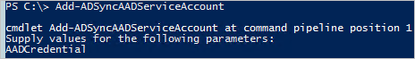

<properties
    pageTitle="Synchronisieren von Azure AD verbinden: zum Verwalten des Dienstkontos Azure AD-| Microsoft Azure"
    description="In diesem Thema Dokumente des Dienstkontos Azure AD-wiederherstellen."
    services="active-directory"
    keywords="AADSTS70002, AADSTS50054, zum Zurücksetzen des Kennworts für Azure AD verbinden synchronisieren Dienstkontos Verbinder"
    documentationCenter=""
    authors="andkjell"
    manager="femila"
    editor=""/>

<tags
    ms.service="active-directory"
    ms.workload="identity"
    ms.tgt_pltfrm="na"
    ms.devlang="na"
    ms.topic="article"
    ms.date="09/01/2016"
    ms.author="billmath"/>

# Synchronisieren von Azure AD verbinden: zum Verwalten des Dienstkontos Azure AD-
Vom Azure AD-Connector verwendete Dienstkonto Dienst kostenlos sein sollte. Wenn Sie die Anmeldeinformationen zurückzusetzen müssen, dann ist dieses Thema für Sie. Angenommen, wenn Fehler ein globaler Administrator hat zurücksetzen das Kennwort des Dienstkontos mithilfe der PowerShell.

## Zurücksetzen der Anmeldeinformationen
Wenn das Dienstkonto Azure AD Netzwerke definiert Azure AD aufgrund von Authentifizierungsproblemen kontaktieren kann, kann das Kennwort zurückgesetzt werden.

1. Melden Sie sich bei dem Azure AD verbinden Synchronisierungsserver und starten Sie PowerShell.
2. Führen Sie `Add-ADSyncAADServiceAccount`.  

3. Bereitstellen von Azure AD-globaler Administrator-Anmeldeberechtigungen.

Dieses Cmdlet legt das Kennwort für das Dienstkonto und in Azure AD- sowohl in der Synchronisierungs-Engine zu aktualisieren.

## Bekannte Probleme können Schritten lösen.
In diesem Abschnitt wird eine Liste der vom Kunden, die mit einer Anmeldeinformationen für das Dienstkonto Azure AD-zurücksetzen behoben wurden gemeldeten Fehler an.

-----------
Ereignis 6900  
Der Server ist ein unerwarteter Fehler bei der Verarbeitung Benachrichtigung Kennwort ändern:  
AADSTS70002: Fehler überprüfen Anmeldeinformationen. AADSTS50054: Altes Kennwort wird für die Authentifizierung verwendet.

----------
Ereignis 659  
Fehler beim Abrufen der Konfiguration Kennwort synchronisieren. Microsoft.IdentityModel.Clients.ActiveDirectory.AdalServiceException:  
AADSTS70002: Fehler überprüfen Anmeldeinformationen. AADSTS50054: Altes Kennwort wird für die Authentifizierung verwendet.

## Nächste Schritte

**Themen (Übersicht)**

- [Synchronisieren von Azure AD verbinden: verstehen und Anpassen der Synchronisierung](active-directory-aadconnectsync-whatis.md)
- [Integrieren von Ihrem lokalen Identitäten in Azure Active Directory](active-directory-aadconnect.md)
