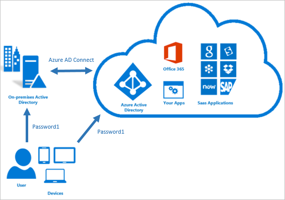
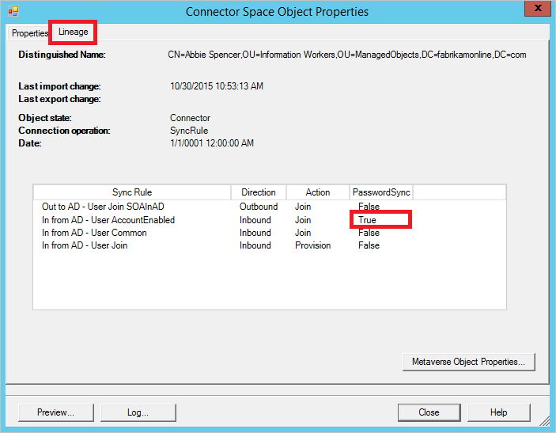
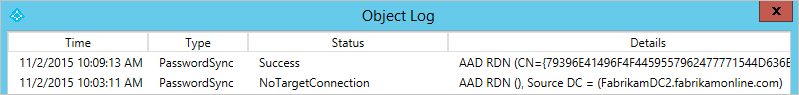
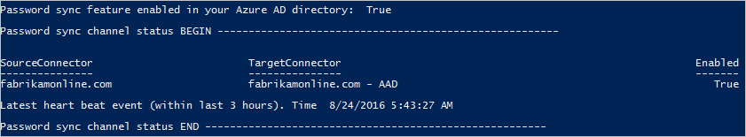

<properties
    pageTitle="Implementieren der Synchronisierung von Kennwörtern mit Azure AD verbinden synchronisieren | Microsoft Azure"
    description="Enthält Informationen zur Funktionsweise der Synchronisierung von Kennwörtern und zu aktivieren."
    services="active-directory"
    documentationCenter=""
    authors="markusvi"
    manager="femila"
    editor=""/>
<tags
    ms.service="active-directory"
    ms.workload="identity"
    ms.tgt_pltfrm="na"
    ms.devlang="na"
    ms.topic="article"
    ms.date="08/24/2016"
    ms.author="markusvi;andkjell"/>


# <a name="implementing-password-synchronization-with-azure-ad-connect-sync"></a>Implementieren der Synchronisierung von Kennwörtern mit Azure AD verbinden synchronisieren
Dieses Thema enthält Sie mit den Informationen, die Sie benötigen für die Synchronisierung Ihrer Kennwörter der Benutzer aus einem lokalen Active Directory (AD) zu einem cloudbasierten Azure Active Directory (Azure AD).

## <a name="what-is-password-synchronization"></a>Was ist die Synchronisierung von Kennwörtern
Die Wahrscheinlichkeit, dass Sie Ihre Arbeit erledigen aufgrund eines vergessenen Kennworts blockiert werden bezieht sich auf die Anzahl der anderen Kennwörter, die Sie beachten müssen. Denken Sie daran, je höher die Wahrscheinlichkeit eine vergessen, Sie müssen weitere Kennwörter. Die meisten Helpdesk Ressourcen anfordern der Fragen und Anrufe über das Zurücksetzen von Kennwörtern und andere Probleme im Zusammenhang mit dem Kennwort.

Synchronisierung von Kennwörtern ist ein Feature für die Synchronisierung Benutzerkennwörter aus einem lokalen Active Directory, um eine cloudbasierte Azure Active Directory (Azure AD).
Dieses Feature ermöglicht es Ihnen für die Anmeldung bei Azure Active Directory-Dienste (z. B. Office 365, Microsoft Intune, CRM Online und Azure-Active Directory-Domänendiensten) Sie mit dem Anmelden bei Ihrem lokalen Active Directory dasselbe Kennwort verwenden.



Durch Verringern der Anzahl von Kennwörtern, die Ihre Benutzer zu nur eine erhalten bleiben müssen, Synchronisierung von Kennwörtern können Sie Folgendes ausführen:

- Verbesserung der Produktivität Benutzer
- Verringern Sie Ihre Helpdesk-Kosten  

Auch wenn Sie [**einen Partnerverbund mit AD FS**](https://channel9.msdn.com/Series/Azure-Active-Directory-Videos-Demos/Configuring-AD-FS-for-user-sign-in-with-Azure-AD-Connect)verwenden auswählen, können Sie optional Synchronisierung von Kennwörtern als Sicherung aktivieren für den Fall, dass Ihre AD FS-Infrastruktur schlägt fehl.

Synchronisierung von Kennwörtern ist eine Erweiterung für die Directory-Synchronisierung-Funktion von Azure AD verbinden synchronisieren implementiert. Um die Synchronisierung von Kennwörtern in Ihrer Umgebung verwenden zu können, müssen Sie:

- Verbinden von Azure AD-Installation  
- Konfigurieren der Verzeichnissynchronisation zwischen der lokalen AD und Ihre Azure-Active Directory
- Aktivieren Sie die Synchronisierung von Kennwörtern

Weitere Informationen hierzu finden Sie unter [Integration von Ihrem lokalen Identitäten mit Azure Active Directory](active-directory-aadconnect.md)

> [AZURE.NOTE] Weitere Informationen zur Active Directory-Domänendiensten, die für die Synchronisierung von FIPS und das Kennwort konfiguriert werden, finden Sie unter [Kennwort synchronisieren und FIPS](#password-synchronization-and-fips).

## <a name="how-password-synchronization-works"></a>Funktionsweise der Synchronisierung von Kennwörtern
Active Directory-Domänendienst speichert Kennwörter in Form einer Hash Wert Darstellung des eigentlichen Benutzerkennworts an. Ein Hashwert ist ein Ergebnis einer unidirektionale mathematische Funktion (das "*hashing Algorithmus*"). Es gibt keine Möglichkeit, die als Ergebnis einer einseitigen Funktion zur nur-Text-Version ein Kennwort zurückgesetzt. Sie können eine Kennworthash melden Sie sich mit Ihrem lokalen Netzwerk nutzen.

Um Ihr Kennwort zu synchronisieren, extrahiert Azure AD verbinden Synchronisieren Ihrer Kennworthash aus dem lokalen Active Directory. Zusätzliche Sicherheit Verarbeitung wird auf den Kennworthash angewendet werden, bevor sie auf den Authentifizierungsdienst Azure Active Directory synchronisiert wird. Kennwörter werden auf einzelne Benutzer und chronologisch synchronisiert.

Ist-Datenfluss des Prozesses Synchronisierung Kennwort ähnelt der Synchronisierung von Benutzerdaten wie DisplayName oder e-Mail-Adressen. Kennwörter werden jedoch häufiger als im Fenster standard Directory-Synchronisierung für andere Attribute synchronisiert. Das Synchronisierung des Kennworts werden alle 2 Minuten ausgeführt wird. Sie können die Häufigkeit dieses Prozesses nicht ändern. Wenn Sie ein Kennwort synchronisieren, wird das vorhandene Kennwort für die Cloud überschrieben.

Beim ersten aktivieren das Feature zur Synchronisierung von Kennwörtern können sie die Kennwörter aller Benutzer der im Bereich erste Synchronisierung ausführt. Sie können keinen explizit eine Teilmenge der Benutzerkennwörter definieren, die Sie synchronisieren möchten.

Wenn Sie eine lokale Kennwort ändern, wird das aktualisierte Kennwort, besonders häufig in wenigen Minuten synchronisiert.
Das Feature zur Synchronisierung von Kennwörtern wiederholt automatisch Fehler beim Synchronisierungsversuchen. Falls ein Fehler bei dem Versuch, ein Kennwort für die Synchronisierung auftritt, wird ein Fehler in der Ereignisanzeige protokolliert.

Die Synchronisierung von eines Kennworts hat keine Auswirkung auf den aktuell angemeldeten Benutzer.
Ihre aktuelle Sitzung des Cloud-Dienst ist nicht sofort durch eine Änderung synchronisierten Kennwort betroffen, das auftritt, während Sie auf einen Clouddienst angemeldet sind. Cloud-Dienst erneute Authentifizierung erforderlich ist, müssen Sie jedoch das neue Kennwort bereitstellen.

> [AZURE.NOTE] Kennwort synchronisieren ist nur für das Objekt Typ Benutzer in Active Directory unterstützt. Es wird für den Objekttyp iNetOrgPerson nicht unterstützt.

### <a name="how-password-synchronization-works-with-azure-ad-domain-services"></a>Funktionsweise der Synchronisierung von Kennwörtern mit Azure Active Directory-Domänendiensten
Sie können auch die Synchronisierungsfunktion Kennwort verwenden, für die Synchronisierung Ihrer lokalen Kennwörter mit den [Azure-Active Directory-Domänendiensten](../active-directory-domain-services/active-directory-ds-overview.md). Dieses Szenario ermöglicht die Azure AD-Domänendienste Authentifizierung die Benutzer in der Cloud mit allen Methoden in Ihrem lokalen Active Directory. Zur Darstellung von diesem Szenario ähnelt der Active Directory-Migration (ADMT) in einer lokalen Umgebung verwenden.

### <a name="security-considerations"></a>Zur Sicherheit
Beim Synchronisieren von Kennwörtern, wird die nur-Text-Version Ihres Kennworts nicht für die Synchronisierungsfunktion Kennwort zu Azure AD- oder einer der zugeordneten Dienste verfügbar gemacht.

Es ist auch keine erforderlich auf den lokalen Active Directory das Kennwort in einem rückwärts verschlüsselten Format zu speichern. Eine Übersicht der den Active Directory-Kennworthash wird verwendet, für die Übermittlung zwischen der lokalen AD und Azure-Active Directory. Die Übersicht der den Kennworthash kann Zugriff auf Ressourcen in der lokalen Umgebung verwendet werden.

### <a name="password-policy-considerations"></a>Kennwort Richtlinie Aspekte
Es gibt zwei Arten von Kennwortrichtlinien, die betroffen sind, indem Sie die Synchronisierung von Kennwörtern aktivieren:

1. Komplexität Kennwortrichtlinien
2. Richtlinie für den Kennwortablauf

**Komplexität Kennwortrichtlinien**  
Wenn Sie die Synchronisierung von Kennwörtern aktivieren, überschreiben die Komplexität Kennwortrichtlinien in Ihrem lokalen Active Directory Komplexität Richtlinien in der Cloud für synchronisierte Benutzer aus. Alle gültige Kennwörtern von Ihrem lokalen Active Directory können Sie Azure AD-Dienste zuzugreifen.

> [AZURE.NOTE] Kennwörter für Benutzer, die direkt in der Cloud erstellt wurden werden weiterhin Kennwortrichtlinien wie in der Cloud definiert sind.

**Richtlinie für den Kennwortablauf**  
Wenn ein Benutzer im Bereich der Synchronisierung von Kennwörtern ist, wird das Kontokennwort Cloud,*Dass es nie abläuft"*festgelegt.
Sie können weiterhin melden Sie sich bei Ihrem Cloud-Diensten mit einer synchronisierten Kennwort ein, die in Ihrer lokalen Umgebung abgelaufen. Cloud Kennwort wird das nächste Mal aktualisiert, wenn, das Sie das Kennwort in der lokalen Umgebung ändern.

### <a name="overwriting-synchronized-passwords"></a>Überschreiben Kennwörter synchronisiert
Ein Administrator kann das Kennwort mithilfe der Windows PowerShell manuell zurücksetzen.

In diesem Fall das neue Kennwort überschreibt synchronisierten Ihr Kennwort ein, und alle in der Cloud definierte Kennwortrichtlinien gelten für das neue Kennwort ein.

Wenn Sie Ihr Kennwort lokal ändern erneut, das neue Kennwort ein synchronisiert ist in der Cloud, und das Kennwort manuell aktualisierte überschreibt.

## <a name="enabling-password-synchronization"></a>Aktivieren der Synchronisierung von Kennwörtern
Synchronisierung von Kennwörtern wird automatisch aktiviert, bei der Installation von Azure AD Verbinden mit den **Express-Einstellungen**. Weitere Informationen hierzu finden Sie unter [Erste Schritte mit Azure AD Verbinden mit express-Einstellungen](./connect/active-directory-aadconnect-get-started-express.md).

Wenn Sie bei der Installation von Azure AD verbinden benutzerdefinierte Einstellungen verwenden, können Sie die Synchronisierung von Kennwörtern auf der Anmeldeseite für Benutzer. Weitere Informationen hierzu finden Sie unter [benutzerdefinierte Installation von Azure AD verbinden](./connect/active-directory-aadconnect-get-started-custom.md).


### <a name="password-synchronization-and-fips"></a>Synchronisierung von Kennwörtern und FIPS
Wenn der Server gemäß FIPS Federal Information Processing Standard () gesperrt wurde, hat MD5 deaktiviert wurde.

**Um MD5 für Synchronisierung von Kennwörtern zu aktivieren, führen Sie die folgenden Schritte aus:**

1. Wechseln Sie zu **%programfiles%\Azure AD Sync\Bin**.
2. Öffnen Sie **miiserver.exe.config**.
3. Wechseln Sie zu der **Konfiguration/Runtime** -Knoten (am Ende der Datei).
4. Fügen Sie den folgenden Knoten hinzu:`<enforceFIPSPolicy enabled="false"/>`
5. Die Änderungen zu speichern.

Als Referenz ist dieser Ausschnitt an, wie es aussehen soll:

```
    <configuration>
        <runtime>
            <enforceFIPSPolicy enabled="false"/>
        </runtime>
    </configuration>
```

Informationen zu Sicherheit und FIPS finden Sie unter [AAD Kennwort synchronisieren, Verschlüsselung und FIPS-Konformität](https://blogs.technet.microsoft.com/enterprisemobility/2014/06/28/aad-password-sync-encryption-and-fips-compliance/)

## <a name="troubleshooting-password-synchronization"></a>Problembehandlung bei der Synchronisierung von Kennwörtern
Wenn Kennwörter nicht synchronisiert werden, wie erwartet, können sie entweder für eine Teilmenge der Benutzer oder für alle Benutzer sein.

- Wenn Sie ein Problem mit den einzelnen Objekten haben, lesen Sie [Behandeln von einem Objekt, die Kennwörter nicht synchronisiert wird](#troubleshoot-one-object-that-is-not-synchronizing-passwords).
- Wenn Sie ein Problem haben, werden keine Kennwörter synchronisiert, finden Sie unter [Behandeln von Problemen, die keine Kennwörter synchronisiert werden](#troubleshoot-issues-where-no-passwords-are-synchronized).

### <a name="troubleshoot-one-object-that-is-not-synchronizing-passwords"></a>Behandeln von Problemen mit einem Objekt, das nicht Synchronisieren von Kennwörtern
Sie können ganz einfach Kennwort Synchronisierungsprobleme beheben, indem Sie überprüfen des Status eines Objekts.

Starten Sie in **Active Directory-Benutzer und Computer**. Suchen Sie den Benutzer aus, und stellen Sie sicher, dass **Benutzer muss Kennwort bei der nächsten Anmeldung ändern** nicht ausgewählt ist.
  
Wenn es aktiviert ist, dann bitten Sie den Benutzer anmelden und das Kennwort ändern. Temporäre Kennwörter werden nicht in Azure Active Directory synchronisiert.

Wenn sie in Active Directory richtig aussieht, besteht der nächste Schritt so folgen Sie den Benutzer in der Synchronisierungs-Engine. Folgen Sie den Benutzer aus lokalen Active Directory zu Azure AD, können Sie sehen, ist es eine beschreibende Fehlermeldung auf das Objekt.

1. Starten Sie die **[Synchronisierung Dienst-Manager](active-directory-aadconnectsync-service-manager-ui.md)**.
2. Klicken Sie auf **Verbinder**.
3. Wählen Sie aus der **Active Directory Connector** , in dem sich der Benutzer befindet.
4. Wählen Sie die **Suche Verbinder Leerzeichen**aus.
5. Suchen Sie den Benutzer, den Sie suchen aus.
6. Wählen Sie die Registerkarte **Datenherkunft** , und stellen Sie sicher, dass mindestens eine Regel für synchronisieren **Kennwort synchronisieren** als **Wahr**angezeigt wird. In der Standardkonfiguration, wird der Name der Regel synchronisieren **In aus dem Active Directory - Benutzer AccountEnabled**.  
      
7. [Folgen Sie den Benutzer](active-directory-aadconnectsync-service-manager-ui-connectors.md#follow-an-object-and-its-data-through-the-system) durch Metaverse zu den Abstand Azure AD-Verbinder. Das Connector-Objekt sollte eine ausgehende Regel mit **Kennwort synchronisieren** auf **True**festgelegt haben. In der Standardkonfiguration ist der Name der Regel synchronisieren **Out-AAD - Benutzer teilnehmen**.  
      
8. Wenn Sie das Kennwort synchronisieren Details des Objekts für der letzten Woche angezeigt wird, klicken Sie auf **Protokoll...**.  
      

In der Statusspalte kann die folgenden Werte aufweisen:

Status | Beschreibung
---- | -----
Erfolg | Kennwort wurde erfolgreich synchronisiert.
FilteredByTarget | Kennwort wird auf **Benutzer muss Kennwort bei der nächsten Anmeldung ändern**festgelegt. Kennwort wurde nicht synchronisiert.
NoTargetConnection | Kein Objekt im Metaverse oder in dem Bereich der Azure AD-Verbinder.
SourceConnectorNotPresent | Kein Objekt in der lokalen Active Directory Connector-Speicherplatz gefunden.
TargetNotExportedToDirectory | Das Objekt, in dem Bereich der Azure AD-Connector wurde nicht exportiert.
MigratedCheckDetailsForMoreInfo | Vertrieb vor Build 1.0.9125.0 erstellt wurde und im Zustand legacy angezeigt wird.

### <a name="troubleshoot-issues-where-no-passwords-are-synchronized"></a>Behandeln von Problemen, die keine Kennwörter synchronisiert werden
Sie zunächst das Skript im Abschnitt [erhalten Sie den Status der synchronisierungseinstellungen Kennwort](#get-the-status-of-password-sync-settings)ausgeführt. Es gibt Ihnen einen Überblick über die Konfiguration des Kennworts synchronisieren.  
  
Führen Sie Wenn das Feature in Azure AD nicht aktiviert ist oder der Synchronisierungsstatus-Kanal nicht aktiviert ist, dann den Assistenten zum Installieren von verbinden. Wählen Sie **Optionen für die Synchronisierung anpassen** und Aufheben der Markierung eines Kennworts synchronisieren. Diese Änderung wird das Feature vorübergehend deaktiviert. Klicken Sie dann den Assistenten erneut ausführen und Kennwort synchronisieren wieder zu aktivieren. Führen Sie das Skript erneut aus, um sicherzustellen, dass die Konfiguration richtig ist.

Wenn das Skript, dass zeigt ist es keine Heartbeat, und führen Sie dann das Skript in [Trigger eine vollständige Synchronisierung aller Kennwörter](#trigger-a-full-sync-of-all-passwords). Dieses Skript kann auch für andere Szenarien verwendet werden, in dem die Konfiguration korrekt ist jedoch Kennwörter nicht synchronisiert werden.

#### <a name="get-the-status-of-password-sync-settings"></a>Den Status der synchronisierungseinstellungen Kennwort abrufen

```
Import-Module ADSync
$connectors = Get-ADSyncConnector
$aadConnectors = $connectors | Where-Object {$_.SubType -eq "Windows Azure Active Directory (Microsoft)"}
$adConnectors = $connectors | Where-Object {$_.ConnectorTypeName -eq "AD"}
if ($aadConnectors -ne $null -and $adConnectors -ne $null)
{
    if ($aadConnectors.Count -eq 1)
    {
        $features = Get-ADSyncAADCompanyFeature -ConnectorName $aadConnectors[0].Name
        Write-Host
        Write-Host "Password sync feature enabled in your Azure AD directory: "  $features.PasswordHashSync
        foreach ($adConnector in $adConnectors)
        {
            Write-Host
            Write-Host "Password sync channel status BEGIN ------------------------------------------------------- "
            Write-Host
            Get-ADSyncAADPasswordSyncConfiguration -SourceConnector $adConnector.Name
            Write-Host
            $pingEvents =
                Get-EventLog -LogName "Application" -Source "Directory Synchronization" -InstanceId 654  -After (Get-Date).AddHours(-3) |
                    Where-Object { $_.Message.ToUpperInvariant().Contains($adConnector.Identifier.ToString("D").ToUpperInvariant()) } |
                    Sort-Object { $_.Time } -Descending
            if ($pingEvents -ne $null)
            {
                Write-Host "Latest heart beat event (within last 3 hours). Time " $pingEvents[0].TimeWritten
            }
            else
            {
                Write-Warning "No ping event found within last 3 hours."
            }
            Write-Host
            Write-Host "Password sync channel status END ------------------------------------------------------- "
            Write-Host
        }
    }
    else
    {
        Write-Warning "More than one Azure AD Connectors found. Please update the script to use the appropriate Connector."
    }
}
Write-Host
if ($aadConnectors -eq $null)
{
    Write-Warning "No Azure AD Connector was found."
}
if ($adConnectors -eq $null)
{
    Write-Warning "No AD DS Connector was found."
}
Write-Host
```

#### <a name="trigger-a-full-sync-of-all-passwords"></a>Auslösen einer vollständigen Synchronisierungs aller Kennwörter
Sie können eine vollständige Synchronisierung aller Kennwörter mithilfe des folgenden Skripts auslösen:

```
$adConnector = "<CASE SENSITIVE AD CONNECTOR NAME>"
$aadConnector = "<CASE SENSITIVE AAD CONNECTOR NAME>"
Import-Module adsync
$c = Get-ADSyncConnector -Name $adConnector
$p = New-Object Microsoft.IdentityManagement.PowerShell.ObjectModel.ConfigurationParameter "Microsoft.Synchronize.ForceFullPasswordSync", String, ConnectorGlobal, $null, $null, $null
$p.Value = 1
$c.GlobalParameters.Remove($p.Name)
$c.GlobalParameters.Add($p)
$c = Add-ADSyncConnector -Connector $c
Set-ADSyncAADPasswordSyncConfiguration -SourceConnector $adConnector -TargetConnector $aadConnector -Enable $false
Set-ADSyncAADPasswordSyncConfiguration -SourceConnector $adConnector -TargetConnector $aadConnector -Enable $true
```

## <a name="next-steps"></a>Nächste Schritte

* [Azure AD verbinden synchronisieren: Anpassen von Optionen für die Synchronisierung](active-directory-aadconnectsync-whatis.md)
* [Integrieren von Ihrem lokalen Identitäten in Azure Active Directory](active-directory-aadconnect.md)
