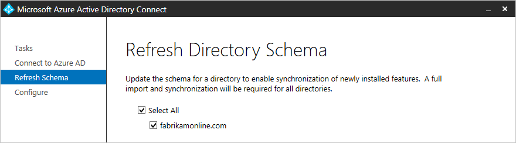

<properties
    pageTitle="Synchronisieren von Azure AD verbinden: Ausführen des Installationsassistenten ein zweites Mal | Microsoft Azure"
    description="Erläutert, wie der Assistent zum Installieren der zweiten funktioniert Zeit, die Sie auszuführen."
    keywords="Der Assistent zum Installieren von Azure AD verbinden können Sie die Wartung Einstellungen der zweiten Zeitangabe konfigurieren, für die Ausführung"
    services="active-directory"
    documentationCenter=""
    authors="andkjell"
    manager="femila"
    editor=""/>

<tags
    ms.service="active-directory"
    ms.workload="identity"
    ms.tgt_pltfrm="na"
    ms.devlang="na"
    ms.topic="article"
    ms.date="08/31/2016"
    ms.author="billmath"/>

# Synchronisieren von Azure AD verbinden: Installationsassistenten ein zweites Mal ausgeführt.
Beim ersten Ausführen des Installationsassistenten Azure AD verbinden, führt sie Sie durch zum Konfigurieren der Installation. Wenn Sie den Installationsassistenten erneut ausführen, bietet es Optionen für die Wartung.

Sie können den Assistenten zum Installieren finden, in das Startmenü mit dem Namen **Azure AD verbinden**.

Wenn Sie den Installationsassistenten zu starten, wird eine Seite mit den folgenden Optionen:

Wenn Sie mit Azure AD verbinden ADFS installiert haben, haben Sie noch mehr Optionen aus. Die zusätzlichen Optionen, die Sie für ADFS haben, werden in [ADFS Management](active-directory-aadconnect-federation-management.md#ad-fs-management)beschrieben.

Wählen Sie eine der Aufgaben aus, und klicken Sie auf **Weiter** .

> [AZURE.IMPORTANT] Während der Installationsassistent geöffnet ist, werden alle Vorgänge in der Synchronisierungs-Engine angehalten. Stellen Sie sicher, dass Sie den Assistenten zum Installieren schließen, sobald Sie die Konfiguration Änderungen abgeschlossen haben.

## Aktuelle Konfiguration anzeigen
Diese Option bietet Ihnen einen schnellen Überblick über den derzeit konfigurierten Optionen.

Klicken Sie auf **zurück** , um zurückzukehren. Wenn Sie **Beenden**auswählen, schließen Sie den Assistenten zum Installieren.

## Anpassen von Optionen für die Synchronisierung
Diese Option dient zum Ändern der Konfigurations synchronisieren. Eine Teilmenge der Optionen aus dem Pfad der benutzerdefinierten Konfiguration Installation angezeigt. Diese Option wird angezeigt, auch wenn Sie zunächst express-Installation verwendet haben.

- [Fügen Sie weitere Verzeichnisse](active-directory-aadconnect-get-started-custom.md#connect-your-directories). Entfernen eines Verzeichnisses, finden Sie unter [Löschen ein Verbinders](active-directory-aadconnectsync-service-manager-ui-connectors.md#delete).
- [Domäne ändern und Organisationseinheit Filtern](active-directory-aadconnect-get-started-custom.md#domain-and-ou-filtering).
- Entfernen Sie die Gruppe zu filtern.
- [Optionale Features ändern](active-directory-aadconnect-get-started-custom.md#optional-features).

Die anderen Optionen aus der Erstinstallation können nicht geändert werden und sind nicht verfügbar. Diese Optionen sind:

- Ändern Sie das Attribut für UserPrincipalName und SourceAnchor verwendet.
- Ändern Sie die verknüpfen Methode für Objekte aus anderen Gesamtstruktur ein.
- Aktivieren Sie die Gruppen basierende filtern.

## Verzeichnisschema aktualisieren
Diese Option wird verwendet, wenn Sie das Schema, in einem der lokalen geändert haben AD DS-Gesamtstrukturen. Angenommen, Sie möglicherweise Exchange installiert oder Upgrade auf Windows Server 2012 über ein Schema Geräteobjekte. In diesem Fall müssen Sie anweisen, Azure AD verbinden, lesen das Schema erneut aus AD DS und seinen Cache aktualisieren. Diese Aktion erneut generiert auch die Regeln synchronisieren. Wenn Sie das Exchange-Schema als Beispiel hinzufügen, werden die synchronisieren Regeln für Exchange an der Konfiguration hinzugefügt.

Wenn Sie diese Option auswählen, werden alle Verzeichnisse in der Konfiguration aufgeführt. Behalten die Standardeinstellung und allen Gesamtstrukturen aktualisieren, oder Aufheben der Markierung eines einige Felder.

## Konfigurieren von staging Modus
Mit dieser Option können Sie aktivieren oder deaktivieren staging Modus auf dem Server. Weitere Informationen über das staging Modus und wie sie genutzt werden kann bei [Vorgängen](active-directory-aadconnectsync-operations.md#staging-mode)gefunden werden.

Die Option wird angezeigt, wenn Staging derzeit aktiviert oder deaktiviert ist:  

Um den Status zu ändern, wählen Sie diese Option aus, und aktivieren Sie oder deaktivieren Sie das Kontrollkästchen.  

## Ändern der Benutzer anmelden
Mit dieser Option können Sie von Kennwort synchronisieren Föderation oder umgekehrt ändern. Sie können nicht in **nicht konfigurieren**ändern.

Weitere Informationen zu dieser Option finden Sie unter [Benutzer anmelden](active-directory-aadconnect-user-signin.md#changing-user-sign-in-method).

## Nächste Schritte

- Erfahren Sie mehr über das Konfigurationsmodell, Azure AD verbinden synchronisieren in [Grundlegendes zu deklarative bereitgestellt](active-directory-aadconnectsync-understanding-declarative-provisioning.md)werden sollen.

**Themen (Übersicht)**

- [Synchronisieren von Azure AD verbinden: verstehen und Anpassen der Synchronisierung](active-directory-aadconnectsync-whatis.md)
- [Integrieren von Ihrem lokalen Identitäten in Azure Active Directory](active-directory-aadconnect.md)
