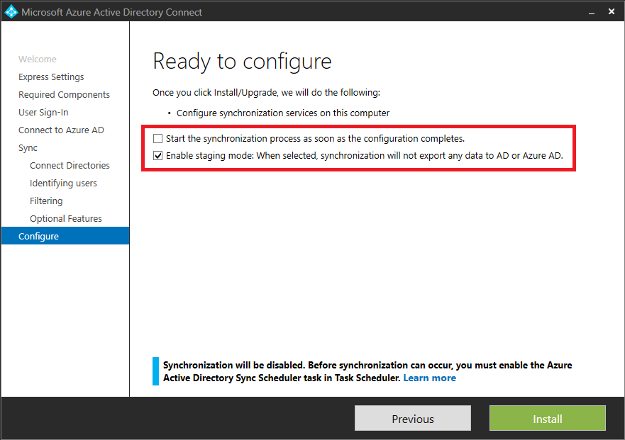

<properties
   pageTitle="Synchronisieren von Azure AD verbinden: Aspekte und Betriebsaufgaben | Microsoft Azure"
   description="In diesem Thema werden Betriebsaufgaben für Azure AD verbinden synchronisieren und wie Sie für diese Komponente Betrieb vorbereiten."
   services="active-directory"
   documentationCenter=""
   authors="AndKjell"
   manager="femila"
   editor=""/>

<tags
   ms.service="active-directory"
   ms.devlang="na"
   ms.topic="article"
   ms.tgt_pltfrm="na"
   ms.workload="identity"
   ms.date="09/01/2016"
   ms.author="billmath"/>

# Synchronisieren von Azure AD verbinden: Betriebsaufgaben und Aspekte
Ziel dieses Themas ist es, Betriebsaufgaben für Azure AD verbinden synchronisieren zu beschreiben.

## Staging-Modus
Staging Modus kann für mehrere Szenarien, einschließlich verwendet werden:

-   Hohe Verfügbarkeit.
-   Testen und Bereitstellen von neuen Konfiguration Änderungen.
-   Stellen Sie vor einem neuen Server, und nehmen Sie die alte außer Betrieb.

Mit einem Server im staging Modus können Sie Änderungen an der Konfiguration vornehmen und eine Vorschau die Änderungen, bevor Sie den Server aktivieren. Außerdem können Sie zum Ausführen der vollständigen Import und vollständige Synchronisation aus, um sicherzustellen, dass alle Änderungen erwartet werden, bevor Sie diese Änderungen in Ihre Umgebung Herstellung vornehmen.

Während der Installation können Sie den Server im **Modus staging**auswählen. Diese Aktion wird der Server für den Import und Synchronisierung aktiv, aber keine Exporte ausgeführt werden. Ein Server im staging Modus wird Kennwort synchronisieren oder Kennwort abgeschlossenen writebackvorgängen, auch wenn Sie diese Features während der Installation ausgewählt haben, nicht ausgeführt. Wenn Sie staging-Modus deaktivieren, wird der Server startet den Export, Kennwort synchronisieren aktiviert und Kennwort abgeschlossenen writebackvorgängen ermöglicht.

Sie können weiterhin einen Export erzwingen, indem Sie mit der Synchronisierung Dienst-Manager.

Ein Server im Modus staging weiterhin Änderungen aus Active Directory und Azure AD-empfängt. Es hat immer eine Kopie der neuesten Änderungen und kann sehr schnell übernehmen über den Zuständigkeiten eines anderen Servers. Wenn Sie zu Ihrem primären Server Konfiguration Änderungen vornehmen, ist es sicherstellen, dass Sie auf dem Server in das staging Modus die gleichen Änderungen vorzunehmen.

Für alle von Ihnen mit Kenntnisse ältere synchronisieren Technologien unterscheidet sich der staging Modus, da der Server über eine eigene SQL-Datenbank verfügt. Diese Architektur ermöglicht den staging Modus Server in einem anderen Datencenter zur Verfügung gestellt werden.

### Überprüfen Sie die Konfiguration von einem server
Wenn Sie diese Methode anwenden möchten, gehen Sie folgendermaßen vor:

1. [Vorbereiten](#prepare)
2. [Importieren und synchronisieren](#import-and-synchronize)
3. [Vergewissern Sie sich](#verify)
4. [Active Server wechseln](#switch-active-server)

#### Vorbereiten

1. Installieren von Azure AD-verbinden, wählen Sie **das staging Modus**und Aufheben der Markierung auf der letzten Seite im Assistenten zum Installieren **Starten Sie die Synchronisierung** . In diesem Modus können Sie die Synchronisierung-Engine manuell ausführen.

2. Melden Sie sich deaktivieren/anmelden, und wählen Sie über das Startmenü **Synchronisierungsdiensts**aus.

#### Importieren und synchronisieren

1. Wählen Sie **Verbinder**aus, und wählen Sie den ersten Connector mit dem Typ **Active Directory-Domänendiensten**. Klicken Sie auf **Ausführen**, wählen Sie **vollständige importieren**und auf **OK**. Führen Sie diese Schritte für alle Verbinder dieses Typs aus.
2. Markieren Sie den Verbinder mit Typ **Azure Active Directory (Microsoft)**. Klicken Sie auf **Ausführen**, wählen Sie **vollständige importieren**und auf **OK**.
3. Stellen Sie sicher, dass die Registerkarte Verbinder weiterhin ausgewählt ist. Klicken Sie für jeden Verbinder mit Typ **Active Directory-Domänendiensten**auf **Ausführen**, wählen Sie **Delta-Synchronisierung**und auf **OK**.
4. Markieren Sie den Verbinder mit Typ **Azure Active Directory (Microsoft)**. Klicken Sie auf **Ausführen**, wählen Sie **Delta-Synchronisierung**und auf **OK**.

Haben Sie jetzt eingestufte Exportieren ändert sich in Azure AD- und lokalen AD (Wenn Sie Exchange-hybridbereitstellung verwenden). Die nächsten Schritte können Sie prüfen, was ist zu ändern, bevor Sie tatsächlich den Export in die Verzeichnisse zu starten.

#### Vergewissern Sie sich

1. Starten Sie eine Befehlszeilenprompt, und wechseln Sie zu`%ProgramFiles%\Microsoft Azure AD Sync\bin`
2. Ausführen:`csexport "Name of Connector" %temp%\export.xml /f:x`  
Der Name des Verbinders finden Sie im Synchronisierungsdiensts. Es hat einen Namen, die ähnliche "contoso.com – AAD" für Azure AD.
3. Ausführen:`CSExportAnalyzer %temp%\export.xml > %temp%\export.csv`
4. Sie haben eine Datei in %TEMP% mit dem Namen export.csv, die in Microsoft Excel untersucht werden kann. Diese Datei enthält alle Änderungen, die exportiert werden sollen.
5. Nehmen Sie die notwendigen Änderungen vor der Daten oder die Konfiguration, und führen Sie diese Schritte erneut (importieren und synchronisieren und überprüfen), bis die Änderungen, die exportiert werden sollen erwartet werden.

**Grundlegendes zu der Datei export.csv**

Die meisten der Datei wird sofort verständlich. Einige Abkürzungen für die Interpretation:

- OMODT – Änderung Objekttyp. Gibt an, ob der Vorgang auf Objektebene einer hinzufügen, aktualisieren oder löschen.
- AMODT – Attribut Änderung Typ. Gibt an, ob der Vorgang auf eine Attributebene einer hinzufügen, aktualisieren oder löschen.

Ist der Attributwert mit mehreren Werten, wird dann nicht jeder Änderung angezeigt. Nur die Anzahl der Werte hinzugefügt oder entfernt wird angezeigt.

#### Active Server wechseln

1. Klicken Sie auf die gerade aktive Server den Server schalten Sie aus (DirSync/FIM/Azure AD-Synchronisierung), damit es nicht exportieren ist zu Azure AD oder legen Sie es in das staging Modus (Azure AD verbinden).
2. Führen Sie den Installationsassistenten auf dem Server in **das staging Modus** und **staging-Modus**deaktivieren.

## Wiederherstellung
Teil des Entwurfs Implementierung ist planen, was zu tun ist, ist es einem Datenverlust Stelle, an der Sie den Synchronisierungsserver gehen verloren. Es gibt verschiedene Modelle verwenden und welche Faktoren einschließlich abhängt:

-   Was ist der Fehlertoleranz für nicht ändern können lassen Objekte in Azure AD während der Ausfall wird?
-   Wenn Sie die Synchronisierung von Kennwörtern verwenden, akzeptieren die Benutzer, dass sie haben das alte Kennwort in Azure AD verwenden, falls diese lokale ändern?
-   Haben Sie eine Abhängigkeit auf in Echtzeit JOIN-Operationen, wie z. B. Kennwort abgeschlossenen writebackvorgängen?

Je nach Antworten auf diese Fragen und den Richtlinien Ihrer Organisation kann eine der folgenden Strategien implementiert werden:

-   Erstellen Sie bei Bedarf neu.
-   Haben Sie einen freien standby-Server, als **das staging Modus**bezeichnet.
-   Verwenden von virtuellen Computern.

Wenn Sie nicht die integrierte SQL Express-Datenbank verwenden, sollten Sie auch im Abschnitt [SQL hohen Verfügbarkeit](#sql-high-availability) überprüfen.

### Erstellen Sie bei Bedarf neu.
Eine geeignete Strategie ist für eine erneute Erstellung Server bei Bedarf planen. Installieren Sie in der Regel von synchronisieren-Engine und Aktionen, die ein paar Stunden die ursprüngliche importieren und synchronisieren bewältigt werden können. Wenn es ein freier Server nicht verfügbar ist, ist es möglich, einen Domänencontroller vorübergehend zu verwenden, um die Synchronisierungs-Engine zu hosten.

Synchronisieren-Engine-Server speichert keine Zustand über die Objekte, damit die Datenbank aus den Daten in Active Directory und Azure AD-neu erstellt werden kann. Das Attribut **SourceAnchor** ist, Objekte aus lokal und in der Cloud beizutreten verwendet. Wenn Sie den Server mit vorhandenen Objekten lokal und der Cloud, und klicken Sie dann das Modul für die Synchronisierung dieser Objekte zusammen erneut auf Neuinstallation entspricht neu erstellen. Maßnahmen, die Sie dokumentieren und speichern müssen, sind die geänderte Konfiguration auf dem Server, wie z. B. Filtern und Synchronisierung Regeln. Diese benutzerdefinierten Konfigurationen müssen erneut angewendet werden, bevor Sie die Synchronisierung starten.

### Haben Sie einen freien standby-Server - Modus staging
Wenn Sie eine komplexere Umgebung verfügen, wird empfohlen, haben Sie einen oder mehrere standby-Server. Während der Installation können Sie einen Server als in **staging-Modus**aktivieren.

Weitere Informationen hierzu finden Sie unter [staging Modus](#staging-mode).

### Verwenden von virtuellen Computern
Eine allgemeine und unterstützte Methode ist auf das Modul für die Synchronisierung eines virtuellen Computers ausgeführt werden. Für den Fall, dass ein Problem auf dem Host ist, kann das Bild mit dem Synchronisieren-Engine Server an einen anderen Server migriert werden.

### SQL-hohe Verfügbarkeit
Wenn Sie nicht die SQL Server Express, die mit Azure AD verbinden stammen verwenden, sollten auch hoher Verfügbarkeit für SQL Server eingestuft. Die unterstützt nur hohen Verfügbarkeit-Lösung ist SQL Cluster. Nicht unterstützte Lösungen sind Spiegelung und immer auf.

## Nächste Schritte

**Themen (Übersicht)**  

- [Synchronisieren von Azure AD verbinden: verstehen und Anpassen der Synchronisierung](active-directory-aadconnectsync-whatis.md)  
- [Integrieren von Ihrem lokalen Identitäten in Azure Active Directory](active-directory-aadconnect.md)  
