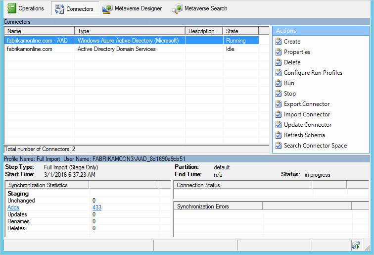
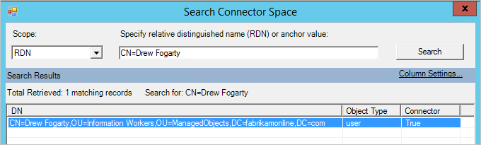
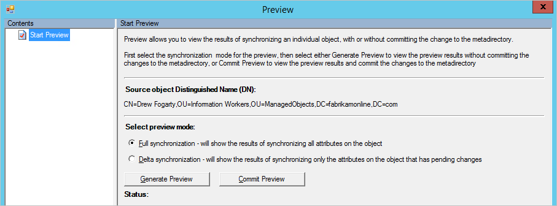
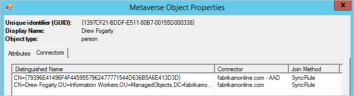

<properties
    pageTitle="Synchronisieren von Azure AD verbinden: Synchronisierung Dienst-Manager UI | Microsoft Azure"
    description="Verstehen der Verbinder Registerkarte Synchronisierung Dienst-Manager für Azure AD verbinden."
    services="active-directory"
    documentationCenter=""
    authors="andkjell"
    manager="femila"
    editor=""/>

<tags
    ms.service="active-directory"
    ms.workload="identity"
    ms.tgt_pltfrm="na"
    ms.devlang="na"
    ms.topic="article"
    ms.date="09/07/2016"
    ms.author="billmath"/>

# Synchronisieren von Azure AD verbinden: Synchronisation Dienst-Manager

[Vorgänge](active-directory-aadconnectsync-service-manager-ui-operations.md) | [Verbinder](active-directory-aadconnectsync-service-manager-ui-connectors.md) | [Metaverse-Designer](active-directory-aadconnectsync-service-manager-ui-mvdesigner.md) | [Metaverse-Suche](active-directory-aadconnectsync-service-manager-ui-mvsearch.md)
--- | --- | --- | ---

Die Registerkarte Verbinder wird verwendet, um die alle Systeme verwalten, mit denen die Synchronisierung-Engine verbunden ist.

## Connector-Aktionen

Aktion | Kommentar
--- | ---
Erstellen | Verwenden Sie nicht. Verwenden Sie für die Verbindung mit zusätzlichen AD Gesamtstrukturen den Assistenten zum Installieren.
Eigenschaften | Für die Domäne und Organisationseinheit Filtern verwendet.
[Löschen](#delete) | So löschen Sie entweder die Daten in dem Bereich Verbinder oder Löschen der Verbindung mit einer Gesamtstruktur verwendet.
[Konfigurieren von Profilen ausführen](#configure-run-profiles) | Eine Ausnahme bilden jedoch Domäne filtern, nichts hier konfigurieren. Sie können diese Aktion verwenden, bereits konfigurierten ausführen Profile anzeigen.
Ausführen | Zum Starten einer einmaligen Ausführen eines Profils verwendet.
Beenden | Hält einen Verbinder gerade ein Profil ausgeführt.
Exportieren von Verbinder | Verwenden Sie nicht.
Importieren Sie Verbinder | Verwenden Sie nicht.
Aktualisieren Sie Verbinder | Verwenden Sie nicht.
Schema aktualisieren | Aktualisiert das Schema Cache. Es wird empfohlen, verwenden Sie stattdessen die Option im Assistenten zum Installieren, seit, die auch Updates Regeln synchronisieren.
[Suche Verbinder Speicherplatz](#search-connector-space) | Verwendet, um Objekte zu suchen, und folgen Sie [ein Objekt und seine Daten über das System](#follow-an-object-and-its-data-through-the-system).

### Löschen
Die Löschaktion ist für zwei verschiedene Dinge verwendet.

Die Option **nur Verbinder Space löschen** entfernt alle Daten, aber behalten Sie die Konfiguration.

Die Option **Verbinder löschen und Verbinder Leerzeichen** entfernt die Daten und der Konfiguration. Diese Option wird verwendet, wenn Sie nicht mehr zu einer Gesamtstruktur verbinden möchten.

Beide Optionen alle Objekte synchronisieren und aktualisieren die Objekte. Diese Aktion ist eine umfangreiche Operation.

### Konfigurieren von Profilen ausführen
Mit dieser Option können Sie die für einen Verbinder konfigurierten ausführen Profile anzeigen.

### Suche Verbinder Speicherplatz
Die Verbinder Leerzeichen Suchaktion eignet sich zum Suchen nach Objekten und Behandeln von Datenproblemen.

Beginnen Sie, indem Sie einen **Bereich**auswählen. Sie können basierend auf Daten (RDN, DN, Anker, untergeordnete Struktur), suchen oder Bundesland des Objekts (alle anderen Optionen).  
  
Wenn Sie beispielsweise eine untergeordnete Struktur suchen ausführen, erhalten Sie alle Objekte in einer Organisationseinheit aus.
 aus diesem Raster können Sie ein Objekt, wählen Sie **Eigenschaften**, und [Führen Sie es](#follow-an-object-and-its-data-through-the-system) aus der Quelle Verbinder Leerzeichen über Metaverse sowie zum Ziel Verbinder Speicherplatz auswählen.

## Führen Sie ein Objekt und seine Daten über das system
Bei der Problembehandlung ein Problem mit den Daten, führen Sie ein Objekt aus der Quelle Verbinder Leerzeichen zu Metaverse und an die Zielwebsite Connector-Speicherplatz ist eine Key Prozedur zu verstehen, warum Daten nicht die erwarteten Werte enthalten.

### Verbinder Leerzeichen Objekteigenschaften
**Importieren**  
Wenn Sie ein Objekt Cs öffnen, gibt es mehrere Registerkarten oben an. Die Registerkarte **Importieren** zeigt die Daten, die nach einem Import bereitgestellt werden.
 den **Alten Wert** zeigt an, was derzeit gespeichert ist, in das System und den **Neuen Wert** aus der Quellsystem empfangen wurde, und was nicht noch angewendet wurde. In diesem Fall, da die der Synchronisierungsfehler ist aufgetreten, kann die Änderung angewendet werden.

**Fehler**  
Die Fehlerseite wird nur angezeigt, wenn es ein Problem mit dem Objekt liegt. Finden Sie die Details auf der Seite "Vorgänge" für Weitere Informationen zur [Problembehandlung bei Synchronisierungsfehlern](active-directory-aadconnectsync-service-manager-ui-operations.md#troubleshoot-errors-in-operations-tab)aus.

**Datenherkunft**  
Die Registerkarte Datenherkunft zeigt an, wie das Connector-Objekt auf das Objekt Metaverse verknüpft ist. Sie können angezeigt, wenn der Verbinder importiert eine Änderung letzten aus dem verbundenen System und welche Regeln zum Auffüllen von Daten im Metaverse angewendet.
 In der Spalte **Aktion** können Sie sehen, es ist eine Regel für **eingehende** synchronisieren mit der Aktion **Bereitstellen**. Der angibt, dass das Objekt Metaverse solange dieser Connector-Objekt vorhanden ist, erhalten bleibt. Wenn die Regelliste synchronisieren stattdessen eine Regel synchronisieren mit Richtung **ausgehend** und **Bereitstellen von**angezeigt wird, gibt es an, dass dieses Objekt gelöscht werden, wenn das Objekt Metaverse gelöscht wird.
 erkennen Sie auch in der Spalte **PasswordSync** , der Abstand eingehenden Verbinder Änderungen vor, um das Kennwort beisteuern kann, da ein synchronisieren Regel den Wert **True**hat. Dieses Kennwort wird dann an Azure AD durch die Regel für ausgehenden gesendet.

Auf der Registerkarte Datenherkunft erhalten in das Metaversum Sie durch Klicken auf [Metaverse Objekteigenschaften](#metaverse-object-properties).

Am Ende aller Registerkarten befinden sich zwei Schaltflächen: **Vorschau** und der **Protokolldateien**.

**Vorschau**  
Die Vorschauseite wird verwendet, um ein einzelnes Objekt zu synchronisieren. Es ist sinnvoll, wenn Sie einige Kunden synchronisieren Regeln Problembehandlung sind und das Verhalten einer Änderung auf ein einzelnes Objekt anzeigen möchten. Sie können zwischen **Vollständigen synchronisieren** und **Delta synchronisieren**auswählen. Sie können auch zwischen **Vorschau generieren**, sodass nur die Änderung im Speicher gespeichert sind, und **Vorschau abzuschließen**, welche Phasen alle Änderungen Ziel Verbinder Leerzeichen auswählen.
 können Sie prüfen, das Objekt und welche Regel für ein bestimmtes Attribut Verkehr angewendet.

**Log**  
Die Seite Log wird verwendet, um den Synchronisierungsstatus Kennwort und den Verlauf, [Problembehandlung bei der Synchronisierung von Kennwörtern](active-directory-aadconnectsync-implement-password-synchronization.md#troubleshoot-password-synchronization) finden Sie weitere Informationen finden Sie unter.

### Metaverse Objekteigenschaften
**Attribute**  
Klicken Sie auf der Registerkarte Attribute sehen Sie die Werte, und welche Verbinder beigetragen es.

**Verbinder**  
Die Registerkarte Connectors Zeigt alle Verbinder Leerzeichen, die eine Darstellung des Objekts verfügen.
 auf dieser Registerkarte können Sie navigieren zu den [Verbinder Leerzeichen Objekt](#connector-space-object-properties)auch.

## Nächste Schritte
Erfahren Sie mehr über die Konfiguration [Azure AD verbinden synchronisieren](active-directory-aadconnectsync-whatis.md) .

Erfahren Sie mehr über die [Integration von Ihrem lokalen Identitäten mit Azure Active Directory](active-directory-aadconnect.md).
