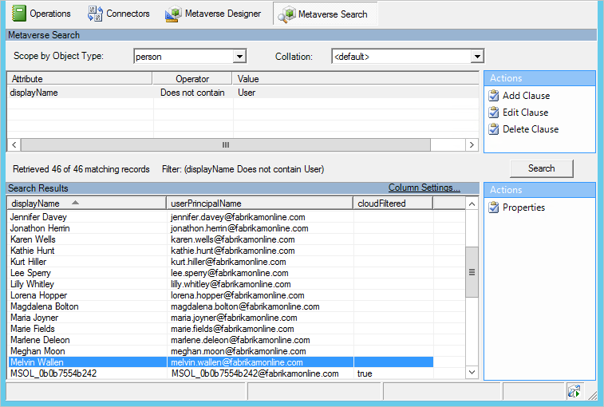

<properties
    pageTitle="Synchronisieren von Azure AD verbinden: Synchronisation Dienst-Manager UI | Microsoft Azure"
    description="Verstehen der Registerkarte Metaverse suchen im Synchronisation-Manager für Azure AD verbinden."
    services="active-directory"
    documentationCenter=""
    authors="andkjell"
    manager="femila"
    editor=""/>

<tags
    ms.service="active-directory"
    ms.workload="identity"
    ms.tgt_pltfrm="na"
    ms.devlang="na"
    ms.topic="article"
    ms.date="09/07/2016"
    ms.author="billmath"/>

# Synchronisieren von Azure AD verbinden: Synchronisierung Dienst-Manager

[Vorgänge](active-directory-aadconnectsync-service-manager-ui-operations.md) | [Verbinder](active-directory-aadconnectsync-service-manager-ui-connectors.md) | [Metaverse-Designer](active-directory-aadconnectsync-service-manager-ui-mvdesigner.md) | [Metaverse-Suche](active-directory-aadconnectsync-service-manager-ui-mvsearch.md)
--- | --- | --- | ---

Die Registerkarte Metaverse suchen eignet sich zur Behandlung dieses Problems datenbezogene Probleme. In der oberen Hälfte können Sie eine Abfrage, basierend auf einer Kombination von Attributen erstellen. Wenn Sie Ihre Abfrage sind, klicken Sie auf **Suchen**. Das Ergebnis wird im untersten Raster angezeigt. Sie können auswählen, welche Spalten mit **Spalteneinstellungen**angezeigt werden soll.

Wählen Sie in den Suchergebnissen ein Objekt und **Eigenschaften** , um die [Objekteigenschaften Metaverse](active-directory-aadconnectsync-service-manager-ui-connectors.md#metaverse-object-properties)anzuzeigen.

## Nächste Schritte
Erfahren Sie mehr über die Konfiguration [Azure AD verbinden synchronisieren](active-directory-aadconnectsync-whatis.md) .

Erfahren Sie mehr über die [Integration von Ihrem lokalen Identitäten mit Azure Active Directory](active-directory-aadconnect.md).
