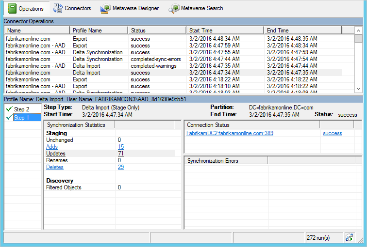
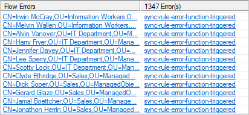

<properties
    pageTitle="Synchronisieren von Azure AD verbinden: Synchronisation Dienst-Manager UI | Microsoft Azure"
    description="Verstehen Sie die Registerkarte Vorgänge in der Synchronisierung Dienst-Manager für Azure AD verbinden."
    services="active-directory"
    documentationCenter=""
    authors="andkjell"
    manager="femila"
    editor=""/>

<tags
    ms.service="active-directory"
    ms.workload="identity"
    ms.tgt_pltfrm="na"
    ms.devlang="na"
    ms.topic="article"
    ms.date="09/07/2016"
    ms.author="billmath"/>

# Synchronisieren von Azure AD verbinden: Synchronisierung Dienst-Manager

[Vorgänge](active-directory-aadconnectsync-service-manager-ui-operations.md) | [Verbinder](active-directory-aadconnectsync-service-manager-ui-connectors.md) | [Metaverse-Designer](active-directory-aadconnectsync-service-manager-ui-mvdesigner.md) | [Metaverse-Suche](active-directory-aadconnectsync-service-manager-ui-mvsearch.md)
--- | --- | --- | ---

Die Registerkarte Vorgänge zeigt die Ergebnisse aus den letzten Vorgängen. Diese Registerkarte ist, um zu verstehen und Behandeln von Problemen.

## Verstehen der Informationen, die auf der Registerkarte Vorgänge angezeigt
In der oberen Hälfte zeigt alle Zeilen in ständige Reihenfolge an. Standardmäßig das Protokoll Vorgänge behält Informationen der letzten sieben Tage, aber diese Einstellung mit der [Scheduler](active-directory-aadconnectsync-feature-scheduler.md)geändert werden kann. Für jeden Testlauf suchen möchten, die nicht über eine Erfolgsmeldung angezeigt werden soll. Sie können die Sortierung durch Klicken auf die Spaltenüberschriften ändern.

In der Spalte **Status** wird die wichtigsten Informationen und zeigt das am häufigsten schwerwiegende Problem einer ausführen. Hier finden Sie eine kurze Zusammenfassung der am häufigsten verwendeten Status in der Reihenfolge der Priorität zu ermitteln (wo * mehrere mögliche Fehlerzeichenfolgen anzugeben).

Status | Kommentar
--- | ---
gestoppt: * | Ausführen konnte nicht abgeschlossen werden. Wenn beispielsweise remote-System ist nicht verfügbar und kann keine Verbindung hergestellt werden.
beendet-Fehler-limit | Es gibt mehr als 5.000 Fehler aus. Ausführen wurde durch die große Anzahl der Fehler automatisch beendet.
abgeschlossene -\*-Fehler | Das Ausführen abgeschlossen, es gibt jedoch einige Fehler (weniger als 5.000), die untersucht werden sollte.
abgeschlossene -\*-Warnungen | Abgeschlossen ausführen, aber einige Daten ist nicht im erwarteten Zustand. Wenn Sie Fehler haben, wird diese Meldung normalerweise nur ein auftretendes Problem. Bis Sie Fehler berücksichtigt haben, sollten Sie keine Warnungen untersuchen.
Erfolg | Keine Probleme vor.

Wenn Sie eine Zeile auswählen, wird aktualisiert unten die Details, die ausgeführt werden. In ganz links in der unteren haben Sie möglicherweise eine Liste **Schritt #**sagen. Diese Liste wird nur angezeigt, wenn Sie mehrere Domänen in der Gesamtstruktur vorhanden, wobei jede Domäne durch einen Schritt angegeben ist. Den Namen der Domäne finden Sie unter der Überschrift **Partition**. Klicken Sie unter **Statistische Daten der Synchronisation**finden Sie weitere Informationen über die Anzahl der Änderungen, die verarbeitet wurden. Sie können die Links, um eine Liste der geänderten Objekte abrufen klicken. Wenn Sie Objekte mit Fehlern, diesen Fehler unter **Synchronisierungsfehler**angezeigt weisen.

## Problembehandlung bei Synchronisierungsfehlern in der Registerkarte "Vorgänge"
  
Wenn Sie Fehler haben, sind sowohl das Objekt in Fehler und den Fehler selbst Links, die enthält weitere Informationen.

Beginnen Sie, indem Sie auf die zurück-Zeichenfolge (**Synchronisieren-Regel-Fehler-Funktion ausgelöst** in der Abbildung). Es wird eine Übersicht über das Objekt zuerst angezeigt. Um den tatsächlichen Fehler anzuzeigen, klicken Sie auf die Schaltfläche **Stapel Spur**. Diese Spur bietet Debuggen die Informationen für den Fehler an.

**Tipp:** Sie können mit der rechten Maustaste in das Feld **Anrufen Stapelinformationen** , und wählen **Alles markieren**und **Kopieren**. Dann können Sie den Stapel kopieren und prüfen Sie den Fehler in Ihrem bevorzugten Editor wie Editor.

- Ist der Fehler aus **SyncRulesEngine**, muss die Anruf Stapelinformationen zuerst eine Liste aller Attribute, klicken Sie auf das Objekt. Führen Sie einen Bildlauf nach unten aus, bis Sie die Überschrift sehen **InnerException = >**.  
  
Die Linie nach zeigt den Fehler an. In der Abbildung oben befindet sich der Fehler in einer benutzerdefinierten synchronisieren Regel-Fabrikam erstellt.

Wenn Sie der Fehler selbst nicht genügend Informationen erhalten, ist es sich an die Daten selbst. Sie können die Verknüpfung mit dem Objekt-ID, und [Führen Sie ein Objekt und seine Daten über das System](active-directory-aadconnectsync-service-manager-ui-connectors.md#follow-an-object-and-its-data-through-the-system)klicken.

## Nächste Schritte
Erfahren Sie mehr über die Konfiguration [Azure AD verbinden synchronisieren](active-directory-aadconnectsync-whatis.md) .

Erfahren Sie mehr über die [Integration von Ihrem lokalen Identitäten mit Azure Active Directory](active-directory-aadconnect.md).
