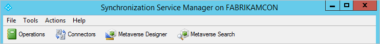

<properties
    pageTitle="Synchronisieren von Azure AD verbinden: Synchronisierung Dienst-Manager UI | Microsoft Azure"
    description="Verstehen Sie Synchronisierung Dienst-Manager für Azure AD verbinden."
    services="active-directory"
    documentationCenter=""
    authors="andkjell"
    manager="femila"
    editor=""/>

<tags
    ms.service="active-directory"
    ms.workload="identity"
    ms.tgt_pltfrm="na"
    ms.devlang="na"
    ms.topic="article"
    ms.date="09/07/2016"
    ms.author="billmath"/>

# Synchronisieren von Azure AD verbinden: Synchronisation Dienst-Manager

[Vorgänge](active-directory-aadconnectsync-service-manager-ui-operations.md) | [Verbinder](active-directory-aadconnectsync-service-manager-ui-connectors.md) | [Metaverse-Designer](active-directory-aadconnectsync-service-manager-ui-mvdesigner.md) | [Metaverse-Suche](active-directory-aadconnectsync-service-manager-ui-mvsearch.md)
--- | --- | --- | ---

Die Benutzeroberfläche für die **Synchronisierung Dienst-Manager** wird so konfigurieren Sie erweiterte Aspekte der Synchronisierungs-Engine und die Betrieb Aspekte des Diensts finden Sie unter verwendet.

Starten Sie **Synchronisation Dienst-Manager** Benutzeroberfläche über das Startmenü. Es heißt **Synchronisierungsdiensts** und finden Sie in der Gruppe **Azure AD verbinden** .  

Klicken Sie auf die Links oben in diesem Thema erfahren Sie mehr über die verschiedenen Registerkarten auf der Benutzeroberfläche angezeigt.

## Nächste Schritte
Erfahren Sie mehr über die Konfiguration [Azure AD verbinden synchronisieren](active-directory-aadconnectsync-whatis.md) .

Erfahren Sie mehr über die [Integration von Ihrem lokalen Identitäten mit Azure Active Directory](active-directory-aadconnect.md).
