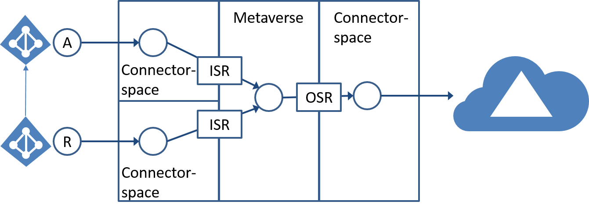

<properties
    pageTitle="Synchronisieren von Azure AD verbinden: technischen Konzepte | Microsoft Azure"
    description="Erläutert die technischen Konzepte von Azure AD verbinden synchronisieren."
    services="active-directory"
    documentationCenter=""
    authors="markusvi"
    manager="femila"
    editor=""/>

<tags
    ms.service="active-directory"
    ms.workload="identity"
    ms.tgt_pltfrm="na"
    ms.devlang="na"
    ms.topic="article"
    ms.date="10/10/2016"
    ms.author="markusvi;andkjell"/>

# Synchronisieren von Azure AD verbinden: technische Konzepte
Dieser Artikel bietet einen Überblick über das Thema [Grundlegendes zu Architektur](active-directory-aadconnectsync-technical-concepts.md).

Synchronisieren von Azure AD Verbinden basiert auf eine einfarbige metadirectory Synchronisierung Plattform.
In den folgenden Abschnitten werden die Konzepte für die Synchronisierung metadirectory vorgestellt.
Bei MIIS, ILM und FIM erstellen, stellt Azure Active Directory-Synchronisierungsdienste nächste Plattform für das Herstellen einer Verbindung mit Datenquellen, Synchronisieren von Daten zwischen Datenquellen sowie die Bereitstellung und Entfernung von Identitäten.

Die folgenden Abschnitte enthalten weitere Details des Synchronisierungsdiensts FIM folgende Aspekte:

- Verbinder
- Attributfluss
- Verbinder Speicherplatz
- Metaverse
- Bereitgestellt

## Verbinder

Die Codemodule, mit denen die Kommunikation mit einem verbundenen Verzeichnis werden Verbinder (ehemals Management Agents (MAs)) bezeichnet.

Diese werden auf dem Computer mit Azure AD verbinden synchronisieren installiert.
Der Verbinder ermöglichen das ohne Agents mithilfe der remote-Systemprotokolle auf die Bereitstellung von speziellem Agents angewiesen Sie sich unterhalten. Dies bedeutet, dass bei verringertem Risiko und Bereitstellungszeiten, besonders, wenn kritische Applikationen und Systeme zur Verfügung stehen.

In der Abbildung oben der Verbinder ist ein Synonym für den Verbinder Abstand jedoch umfasst alle Kommunikation mit dem externen System.

Der Verbinder ist verantwortlich für alle importieren und Exportieren von Funktionen in das System und freigibt Entwickler aus zu verstehen, wie die Verbindung zu jedem System systembedingt herstellen, bei Verwendung von deklarativen provisioning Datentransformationen anpassen benötigen.

Importe und Exporte treten nur geplant, gleicht für weiteren Schutz von Änderungen, die in das System durchgeführt werden, da Änderungen nicht automatisch an die verbundenen Datenquelle weiter gehen Sie wie folgt. Darüber hinaus können Entwickler auch eigene Verbinder zum Herstellen einer Verbindung mit nahezu jeder Datenquelle erstellen.

## Attributfluss

Metaverse ist der konsolidierte Ansicht alle verknüpften Identitäten von benachbarten Verbinder Leerzeichen. In der Abbildung oben ist Attributfluss durch Linien mit Pfeilspitzen für eingehende und ausgehende Verkehr zu sehen. Attributfluss ist die Vorgehensweise zum Kopieren oder Transformieren von Daten von einem System in ein anderes und weisen Sie alle Zahlungen (eingehende und ausgehende).

Attributfluss findet zwischen den Abstand Verbinder und Metaverse bidirektionale Kommunikation Synchronisierung (vollständigen oder Delta) Vorgänge geplant ausführen.

Attributfluss findet nur statt, wenn diese Synchronisierung ausgeführt werden. Attribut Zahlungen werden Synchronisierungsregeln definiert. Dies kann eingehende (ISR in der Abbildung oben) oder ausgehende (OSR in der Abbildung oben).

## Verbundenen system

Verbundenes System (QuickInfos verbundenen Verzeichnis) ist verweisen auf remote-System Azure AD verbinden synchronisieren mit hergestellt hat und lesen und Schreiben Identitätsdaten ein, an und von.

## Verbinder Speicherplatz

Jeder verbundenen Datenquelle wird als eine gefilterte Teilmenge der Objekte und Attribute in dem Bereich Verbinder dargestellt.
Dies kann der Synchronisierungsdienst lokal ohne die remote-System kontaktieren beim Synchronisieren der Objekte bearbeiten und Interaktion zu Importe beschränkt und nur exportiert.

Wenn der Datenquelle und den Verbinder verfügen, die Möglichkeit, die eine Liste der Änderungen (ein Delta importieren), erhöht dann Effizienz erheblich als nur ändert sich seit der letzte Umfragen Zyklus ausgetauscht werden. Der Verbinder Platz isoliert die verbundenen Datenquelle von Änderungen, die erfordern, dass der Verbinder Terminplan importiert und exportiert automatisch weitergegeben. Diese hinzugefügten Versicherung gewährt Ihnen ein sicheres Gefühl beim Testen, Vorschau oder das nächste Update zu bestätigen.

## Metaverse

Metaverse ist der konsolidierte Ansicht alle verknüpften Identitäten von benachbarten Verbinder Leerzeichen.

Während der Identitäten miteinander verknüpft sind und für verschiedene Attribute durch Importieren Fluss Zuordnungen Zertifizierungsstelle zugeordnet ist, werden in das zentralen Metaverse-Objekt zu aggregieren Informationen aus mehreren Systemen. In diesem Objekt Attribut Datenfluss enthalten Zuordnungen Information zu ausgehenden Systeme werden.

Objekte werden erstellt, wenn eine autorisierende System in das Metaversum Projekte. Sobald alle Verbindungen entfernt werden, wird das Objekt Metaverse gelöscht.

Full können direkt bearbeitet werden. Alle Daten in das Objekt müssen über Attributfluss beigetragen werden. Metaverse unterhält beständigen Verbinder mit jedem Raum Verbinder. Diese Connectors erfordern keine Auswertung entsprechend für jede Synchronisation ausführen. Dies bedeutet, dass Azure AD verbinden synchronisieren nicht das passende remote-Objekt jedes Mal suchen. Dadurch wird die Notwendigkeit der teure Agents zum Ändern von Attributen zu verhindern, die normalerweise für das Abgleichen der Objekte zuständig wäre verhindert.

Bei neuen Datenquellen entdecken, die möglicherweise bereits vorhandenen Objekte besitzen, die verwaltet werden müssen, werden mit der eine Verknüpfung Regel so genannten Azure AD verbinden synchronisieren potenzielle Kandidaten mit dem eine Verknüpfung hergestellt ausgewertet.
Sobald die Verknüpfung eingerichtet ist, diese Bewertung nicht wiederholt werden und normalen Attributfluss zwischen der remote verbundenen Datenquelle und Metaverse auftreten kann.

## Bereitgestellt

Wenn eine autorisierende Quellprojekte kann ein neues Objekt in das Metaversum ein neues Verbinder Leerzeichen Objekt in ein anderes Verbinder, die eine untergeordnete verbundene Datenquelle darstellt erstellt werden.

Dies stellt grundsätzlich eine Verknüpfung her, und Attributfluss kann bidirektionale Kommunikation fortfahren.

Wenn Sie eine Regel bestimmt, dass ein neues Verbinder Leerzeichen Objekt erstellt werden muss, wird provisioning genannt werden. Jedoch, da dieser Vorgang nur innerhalb der Verbinder Platz stattfindet, ist es nicht in der verbundenen Datenquelle übertragen bis ein Export durchgeführt wird.

## Zusätzliche Ressourcen

* [Azure AD verbinden synchronisieren: Anpassen von Optionen für die Synchronisierung](active-directory-aadconnectsync-whatis.md)
* [Integrieren von Ihrem lokalen Identitäten in Azure Active Directory](active-directory-aadconnect.md)

<!--Image references-->
[1]: ./media/active-directory-aadsync-technical-concepts/ic750598.png
