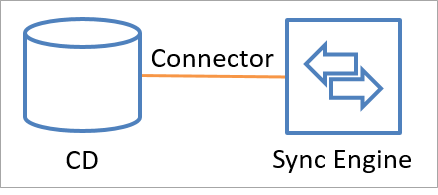
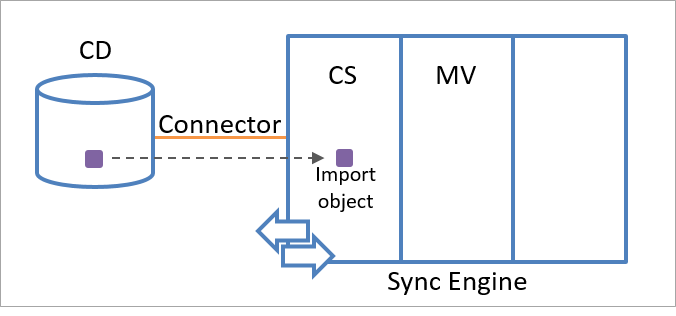
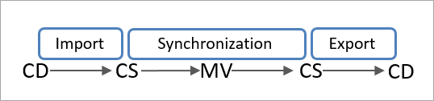

<properties
   pageTitle="Synchronisieren von Azure AD verbinden: Grundlegendes zu der Architektur | Microsoft Azure"
   description="In diesem Thema beschreibt die Architektur von Azure AD verbinden synchronisieren und erläutert die Begriffe verwendet."
   services="active-directory"
   documentationCenter=""
   authors="andkjell"
   manager="femila"
   editor=""/>

<tags
   ms.service="active-directory"
   ms.workload="identity"
   ms.tgt_pltfrm="na"
   ms.devlang="na"
   ms.topic="article"
   ms.date="08/31/2016"
   ms.author="billmath"/>

# Synchronisieren von Azure AD verbinden: die Architektur kennen
In diesem Thema werden die grundlegende Architektur für Azure AD verbinden synchronisieren behandelt. In vielen Aspekten ähnelt seine Vorgänger MIIS 2003, 2007 ILM und FIM 2010. Azure AD verbinden synchronisieren ist die Weiterentwicklung von diese Technologien. Wenn Sie eine der folgenden früheren Technologien vertraut sind, wird der Inhalt dieses Themas ebenfalls Ihnen vertraut sein. Wenn Sie neu bei der Synchronisierung sind, dann ist dieses Thema für Sie. Es ist jedoch nicht erforderlich, die Details dieses Themas erfolgreich in Azure AD verbinden synchronisieren (Sync-Engine wird in diesem Thema genannt) Anpassungen vornehmen kennen.

## Architektur
Die Synchronisierung-Engine erstellt eine integrierte Ansicht der Objekte, die in mehreren verbundenen Datenquellen gespeichert werden und Identitätsinformationen in diesen Datenquellen verwaltet. Diese integrierte Ansicht wird durch die Identitätsdaten aus verbundenen Datenquellen und eine Reihe von Regeln, die bestimmen, wie diese Informationen verarbeitet bestimmt.

### Verbundenen Datenquellen und Verbinder
Die Synchronisierung-Engine verarbeitet Identitätsinformationen aus anderen Datenrepositorys, wie etwa Active Directory oder SQL Server-Datenbank. Jeder Datenrepository, die die Daten in einem Format datenbankähnliche organisiert und bereitstellt standard Daten-Access Methoden, ist ein potenzieller Datenquelle Kandidat für die Synchronisierungs-Engine. Die Datenrepositorys, die durch synchronisieren-Engine synchronisiert werden, werden **Datenquellen** oder **verbundene Verzeichnisse** (CD) bezeichnet.

Die Synchronisierung-Engine kapselt Interaktion mit einem verbundenen Datenquelle innerhalb eines Moduls **Verbinder**genannt. Jeder verbundenen Datenquelle hat einen bestimmten Verbinder. Der Verbinder übersetzt einen erforderlichen Vorgang in das Format, das die verbundenen Datenquelle versteht.

Verbinder stellen API-Aufrufe zum Austauschen von Identitätsinformationen (Lesen und Schreiben) mit einer verbundenen Datenquelle an. Es ist es möglich, einen benutzerdefinierten Verbinder mit extensible Connectivity Framework hinzuzufügen. Die folgende Abbildung zeigt, wie ein Verbinders verbundenen Datenquelle und das Modul für die Synchronisierung besteht.

Daten können in eine beliebige Richtung Datenfluss, aber es kann keine Datenfluss zweiseitiger gleichzeitig. Kurzum, ein Verbinders kann Daten aus der verbundenen Datenquelle zu synchronisieren-Engine oder aus synchronisieren-Engine zur verbundenen Datenquelle Datenfluss können konfiguriert werden, aber nur eine dieser Operationen einem beliebigen Zeitpunkt für ein Objekt und Attribut auftreten kann. Die Richtung kann für verschiedene Objekte und andere Attribute abweichen.

Um einen Verbinder zu konfigurieren, geben Sie die Objekttypen, die Sie synchronisieren möchten. Angeben der Objekttypen definiert den Bereich der Objekte, die in die Synchronisierung enthalten sind. Im nächsten Schritt wird der bekanntermaßen als Attributliste einbezogen werden, wählen Sie die Attribute zu synchronisieren. Diese Einstellungen können jederzeit Reaktion auf Änderungen an den Richtlinien des Unternehmens geändert werden. Wenn Sie den Assistenten zum Installieren von Azure AD verbinden verwenden, werden diese Einstellungen für Sie konfiguriert.

Um Objekte mit einer verbundenen Datenquelle exportieren möchten, muss die Liste der Attribute einbezogen werden die minimal Attribute erforderlich, um einen bestimmten Objekttyp in einer verbundenen Datenquelle erstellen mindestens beinhalten. Beispielsweise muss das Attribut **sAMAccountName** enthalten sein, in der Attributliste einbezogen werden, zu einem Objekt in Active Directory zu exportieren, da alle Benutzerobjekte in Active Directory eine **sAMAccountName** definiert sein müssen. In diesem Fall unterstützt der Assistenten zum Installieren dieser Konfiguration für Sie.

Wenn die verbundenen Datenquelle strukturelle Komponenten, wie z. B. Partitionen oder Container zum Organisieren von Objekten, verwendet können Sie die Bereiche in der verbundenen Datenquelle einschränken, die für eine bestimmte Lösung verwendet werden.

### Interne Struktur des Namespace-Engine synchronisieren
Der gesamte synchronisieren-Engine Namespace besteht aus zwei Namespaces, in denen die Identitätsinformationen gespeichert. Zwei Namespaces sind:

- Der Verbinder Leerzeichen (CS)
- Metaverse (MV)

Der **Verbinder Speicherplatz** ist einen Staging-Bereich, der Darstellungen von der festgelegten Objekte aus einer verbundenen Datenquelle und den Attributen, die in der Liste der Attribute einbezogen werden angegebenen enthält. Synchronisieren-Engine verwendet den Verbinder Abstand aus, um festzustellen, was in der verbundenen Datenquelle geändert hat und eingehende Änderungen Phaseneigenschaften. Synchronisieren-Engine verwendet auch den Connector-Speicherplatz auf Phaseneigenschaften ausgehende Änderungen für die in der verbundenen Datenquelle exportieren. Die Synchronisierung-Engine unterhält ein Leerzeichen distinct Verbinder als Staging-Bereich für jeden Verbinder.

Mithilfe eines Staging-Bereichs synchronisieren-Engine bleibt unabhängig von den verbundenen Datenquellen und wird durch ihre Verfügbarkeit und Verfügbarkeit nicht beeinflusst. Daher können Sie die Identitätsinformationen zu einem beliebigen Zeitpunkt mithilfe der Daten in den Bereich Staging verarbeiten. Die Synchronisierung-Engine kann nur die geänderte innerhalb der verbundenen Datenquelle seit der letzten Kommunikation Sitzung beendet oder Pushbenachrichtigungen, nur die Änderungen Identitätsinformationen, die die verbundenen Datenquelle noch nicht erhalten hat, die den Netzwerkverkehr zwischen den Synchronisierungs-Engine und der verbundenen Datenquelle reduziert anfordern.

Darüber hinaus speichert synchronisieren-Engine Statusinformationen zu allen Objekten, dass es in dem Bereich Verbinder Stufen. Wenn Sie neue Daten eingeht, wertet synchronisieren-Engine immer, ob die Daten bereits synchronisiert wurde.

**Metaverse** ist ein Speicherbereich, der aggregierten Identitätsdaten aus mehreren verbundenen Datenquellen, eine einzelne globale, integrierte Übersicht über alle kombinierten Objekte enthält. Metaverse-Objekte werden basierend auf der persönlichen Informationen erstellt, die abgerufen werden, aus den verbundenen Datenquellen und eine Reihe von Regeln, mit die Sie den Synchronisierungsvorgang anpassen können.

Die folgende Abbildung zeigt den Verbinder Leerzeichen Namespace und Metaverse-Namespaces innerhalb des Moduls synchronisieren.

## Synchronisieren-Engine Identitätsobjekte
Die Objekte in der Synchronisierungs-Engine sind Darstellungen von entweder Objekte in der verbundenen Datenquelle oder integrierte Ansicht, die Engine Synchronisieren dieser Objekte enthält. Jeder synchronisieren-Engine-Objekt müssen eine GUID (globally unique Identifier). GUIDs stellen Datenintegrität und express Beziehungen zwischen Objekten.

### Connector-Objekte
Wenn-Engine synchronisieren mit einer verbundenen Datenquelle kommuniziert, liest die Identitätsinformationen in der verbundenen Datenquelle und verwendet diese Informationen, um eine Darstellung des Identitätsobjekts im Bereich Verbinder zu erstellen. Erstellen oder löschen diese Objekte einzeln. Alle Objekte in einem Verbinder Leerzeichen können Sie jedoch manuell löschen.

Alle Objekte in dem Bereich Verbinder stehen zwei Attribute:

- Eine GUID (globally unique Identifier)
- Einen definierten Namen (auch als DN bezeichnet)

Wenn die verbundenen Datenquelle das Objekt ein eindeutigen Attribut zuweist, können Objekte in dem Bereich Verbinder ebenfalls ein Ankerattribut enthalten. Das Ankerattribut identifiziert eindeutig ein Objekt in der verbundenen Datenquelle. Die Synchronisierung-Engine verwendet den Anker, die entsprechende-Darstellung dieses Objekt in der verbundenen Datenquelle gesucht werden soll. Synchronisieren-Engine wird davon ausgegangen, dass die Verankerung des Objekt nie über die Lebensdauer des Objekts geändert wird.

Viele der Verbinder mithilfe einen bestimmten eindeutigen Bezeichner Anker automatisch für jedes Objekt generieren, importiert werden. Active Directory Connector verwendet beispielsweise das **Objekt-GUID** -Attribut für einen Anker an. Verbundenen Datenquellen, die keine eindeutig definierte eindeutige ID bereitstellen, können Sie als Teil der Konfiguration des Connectors Anker Generation angeben.

Dieses Fall Verankerung aus einem beruht oder mehr eindeutige Attribute eines Objekts, weder über die Änderungen, und das eindeutig eingeben identifiziert das Objekt, in dem Bereich Verbinder (beispielsweise eine Personalnummer oder eine Benutzer-ID).

Ein Verbinder Leerzeichen Objekt kann eine der folgenden Aktionen aus:

- Ein staging Objekt
- Eines Platzhalters

### Staging-Objekte
Ein staging Objekt stellt eine Instanz der vorgesehenen Objekttypen aus der verbundenen Datenquelle an. Zusätzlich zu den GUID und den definierten Namen verfügt über ein staging Objekt immer auf einen Wert, der den Typ des Objekts angibt.

Staging-Objekte, die immer importiert wurden, müssen einen Wert für das Ankerattribut. Einen Wert für das Ankerattribut keinen Staging Objekte, die neu synchronisieren-Engine bereitgestellt worden und gerade in der verbundenen Datenquelle erstellt wird.

Staging Objekte beinhalten außerdem aktuelle Werte von Attributen Business und Informationen zum Betrieb von synchronisieren-Engine Durchführung des Synchronisierung erforderlich. Informationen zum Betrieb enthält Kennzeichen, die den Typ des Updates angeben, die für das staging Objekt bereitgestellt werden. Wenn ein Objekt staging neue Identitätsinformationen aus der verbundenen Datenquelle erhalten hat, die noch nicht verarbeitet wurden, wird das Objekt als **Ausstehend importieren**gekennzeichnet. Wenn ein Objekt staging neue Identitätsinformationen, die noch nicht in der verbundenen Datenquelle exportiert wurden enthält, wird es als **Ausstehend exportieren**gekennzeichnet.

Eine staging Objekt kann es sich um ein Objekt importieren oder exportieren Objekt sein. Die Synchronisierung-Engine erstellt Objekt importieren mithilfe von Objektinformationen aus der verbundenen Datenquelle empfangen. Beim Synchronisieren-Engine Informationen über das Vorhandensein eines neuen Objekts erhält, eine der in der Verbinder ausgewählten Objekttypen entspricht, wird ein Objekt importieren als Darstellung des Objekts in der verbundenen Datenquelle in dem Bereich Verbinder erstellt.

Die folgende Abbildung zeigt ein Objekt importieren, die ein Objekt in der verbundenen Datenquelle darstellt.

Synchronisieren-Engine wird ein Objekt exportieren mithilfe des Objektinformationen im Metaverse erstellt. Exportieren von Objekten werden in der verbundenen Datenquelle während der nächsten Kommunikation Sitzung exportiert. Aus der Sicht der Synchronisierungs-Engine gehen Sie wie folgt Exportieren von Objekten in der verbundenen Datenquelle noch nicht vorhanden. Daher ist das Ankerattribut für ein Objekt exportieren nicht verfügbar. Nachdem sie das Objekt aus synchronisieren-Engine empfangen hat, wird die verbundenen Datenquelle einen eindeutigen Wert für das Ankerattribut des Objekts erstellt.

Die folgende Abbildung zeigt, wie ein Objekt exportieren mit Identitätsinformationen im Metaverse erstellt wird.

Die Synchronisierung-Engine bestätigt den Export des Objekts, indem Sie das Objekt aus der verbundenen Datenquelle importieren. Exportieren von Objekten werden Objekte importieren aus, wenn synchronisieren-Engine beim nächsten Import aus dieser verbundenen Datenquelle empfängt.

### Platzhalter
Die Synchronisierung-Engine verwendet einen flachen Namespace zum Speichern von Objekten. Einige verbundenen Datenquellen wie Active Directory wird jedoch einen hierarchischen Namespace verwenden. Um Informationen aus einem hierarchischen Namespace in einer flachen Namespace transformieren, verwendet synchronisieren-Engine Platzhalter, um die Hierarchie beibehalten.

Jeder Platzhalter stellt eine Komponente (z. B. einer Organisationseinheit) von einer hierarchischen Objektnamen, der wurde nicht in synchronisieren-Engine importiert, aber ist erforderlich, um den hierarchischen Namen zu erstellen. Diese ausfüllen Lücken erstellte Verweise in der verbundenen Datenquelle auf Objekte, die nicht Objekte in dem Bereich Verbinder staging sind.

Die Synchronisierung-Engine verwendet auch Platzhalter zum Speichern von Objekten verwiesen wird, die noch nicht importiert wurden. Wenn synchronisieren so konfiguriert ist, um das Manager-Attribut für das Objekt *Abbie Stefan* und den empfangenen Wert hinzufügen beträgt beispielsweise ein Objekt, das nicht importierten noch, wie z. B. wurde *CN Lee Sperry, CN = = Benutzer, DC = Fabrikam, DC = com*, die Managerinformationen werden als Platzhalter in dem Bereich Verbinder gespeichert. Wenn das Managerobjekt später importiert sind, wird das Platzhalterobjekt durch das staging Objekt überschrieben, die den Vorgesetzten darstellt.

### Metaverse-Objekten
Ein Metaverse-Objekt enthält die Aggregierte Ansicht die synchronisieren-Engine hat das staging Objekte in dem Bereich Verbinder. Synchronisieren-Engine erstellt Metaverse-Objekte unter Verwendung der Informationen in Objekte importieren. Mehrere Objekte der Verbinder Abstand zu einem einzelnen Metaverse-Objekt verknüpft werden können, aber ein Verbinder Leerzeichen Objekt kann nicht mehr als ein Metaverse-Objekt verknüpft werden.

Metaverse-Objekten können nicht manuell erstellt oder gelöscht werden. Die Synchronisierung-Engine löscht automatisch Metaverse-Objekte, die nicht über eine Verknüpfung zu einem beliebigen Verbinder Leerzeichen Objekt in dem Bereich Verbinder verfügen.

Um einen entsprechenden Objekttyp in Metaverse Objekte innerhalb einer verbundenen Datenquelle zuzuordnen, bietet synchronisieren-Engine ein extensible Schema mit einer vordefinierten Reihe von Objekttypen und die zugehörigen Attribute. Sie können neue Objekttypen und Attribute für Metaverse-Objekte erstellen. Eindeutiges oder mehrwertigen Attributen sein, und Attribute vom Typ können Zeichenfolgen, Verweise, Zahlen und boolesche Werte sein.

### Beziehungen zwischen staging und Metaverse-Objekten
Innerhalb des Namespace-Engine synchronisieren aktiviert ist Datenfluss von der Link Beziehung zwischen staging und Metaverse-Objekten. Ein staging Objekt, das zu einem Objekt Metaverse verknüpft ist wird als **Objekt beigetreten** (oder **Connector-Objekts**) bezeichnet. Ein staging Objekt, das nicht zu einem Objekt Metaverse verknüpft ist wird als **Objekt getrennt** (oder **Disconnector Objekt**) bezeichnet. Die Begriffe beigetreten und getrennt werden nicht mit der Verbinder importieren und Exportieren von Daten aus einem verbundenen Verzeichnis verantwortlich verwechselt bevorzugte.

Platzhalter werden nie Metaverse-Objekt verknüpft.

Eine verknüpfte Objekt umfasst ein staging Objekt und deren verknüpfte Beziehung zu einem einzelnen Metaverse-Objekt. Verknüpfte Objekte werden verwendet, mit dem Attributwerte zwischen einer Verbinder Leerzeichen und ein Objekt Metaverse synchronisiert.

Wenn ein Objekt staging eine verknüpfte Objekt während der Synchronisierung wird, können Attribute zwischen dem staging Objekt und dem Metaverse-Objekt übertragen werden. Attributfluss bidirektionaler ist und mithilfe von Attribut-Regeln importieren und Exportieren Attribut Regeln konfiguriert ist.

Ein einzelner Connector Leerzeichen Objekt kann nur ein Metaverse-Objekt verknüpft werden. Jedes Objekt Metaverse kann jedoch auf mehrere Verbinder Leerzeichen Objekte in derselben oder in verschiedenen Verbinder Leerzeichen, verknüpft werden, wie in der folgenden Abbildung gezeigt.

Die verknüpfte Beziehung zwischen dem staging Objekt und ein Metaverse-Objekt ist beständig und kann nur von Regeln, die Sie angeben, entfernt werden.

Ein eigenständige Objekt ist ein staging Objekt, das nicht auf ein beliebiges Objekt Metaverse verknüpft ist. Das Attribut, die Werte für eine eigenständige Objekt nicht sind verarbeitet einen weiteren innerhalb der Metaverse. Das Attributwerte des entsprechenden Objekts in der verbundenen Datenquelle werden von synchronisieren-Engine nicht aktualisiert werden.

Mithilfe von eigenständige Objekte können synchronisieren-Engine Identitätsinformationen speichern und später zu verarbeiten. Ein Objekt staging als eigenständige Objekt in dem Bereich Verbinder planmäßigen hat viele Vorteile. Da das System die benötigten Informationen über das Objekt bereits bereitgestellt wurde, ist es nicht erforderlich, um eine Darstellung des Objekts erneut beim nächsten Import aus der verbundenen Datenquelle erstellen. Auf diese Weise synchronisieren-Engine ist immer eine vollständige Momentaufnahme der verbundenen Datenquelle, auch wenn keine Verbindung zur Datenquelle verbundenen vorhanden ist. Eigenständige Objekte können in verknüpfte Objekte und umgekehrt, je nach den Regeln konvertiert, die Sie angeben.

Objekt importieren, wird als eigenständige Objekt erstellt. Objekt exportieren muss eine verknüpfte Objekt. Die Systemlogik erzwingt diese Regel und löscht alle exportieren-Objekt, das kein verknüpfte Objekt ist.

## Synchronisieren-Engine Identität-Prozess
Der Identität-Prozess steuert, wie die Identitätsinformationen zwischen unterschiedlichen verbundenen Datenquellen aktualisiert wird. Identitätsmanagement tritt in drei Prozesse:

- Importieren
- Synchronisierung
- Exportieren

Während des Importvorgangs wertet synchronisieren-Engine die eingehende Identitätsinformationen aus einer verbundenen Datenquelle an. Wenn Änderungen erkannt werden, sie entweder neue staging Objekte erstellt oder aktualisiert werden vorhandene staging Objekte in dem Bereich Verbinder für die Synchronisierung.

Während der Synchronisierung synchronisieren-Engine aktualisiert Metaverse um vorgenommenen Änderungen anzuzeigen, die in dem Bereich Verbinder aufgetreten sind und den Abstand Verbinder, um die Änderungen wirken sich aus, die im Metaverse aufgetreten sind.

Verschiebt während des Exportvorgangs synchronisieren-Engine, Änderungen, die auf das staging von Objekten bereitgestellt werden, die als ausstehende exportieren gekennzeichnet sind.

Die folgende Abbildung zeigt, wo jedes der Prozesse als Identität für den Informationsfluss aus einem verbundenen Datenquelle in eine andere tritt auf.

### Beim Importieren
Während des Importvorgangs wertet synchronisieren-Engine Aktualisierungen Identitätsinformationen an. Synchronisieren-Engine vergleicht die Identitätsinformationen aus der verbundenen Datenquelle mit der eines Objekts staging Identitätsinformationen erhalten und bestimmt, ob das staging Objekt Updates erfordert. Ist es erforderlich, vor das staging Objekt mit neuen Daten aktualisieren, ist das staging Objekt als ausstehende importieren gekennzeichnet.

Durch das staging von Objekten in den Verbinder Abstand vor der Synchronisierung kann synchronisieren-Engine nur die Identitätsinformationen zu verarbeiten, die geändert wurde. Dieses Verfahren bietet folgende Vorteile:

- **Effiziente Synchronisation**. Die Menge der Daten, die während der Synchronisierung verarbeitet wird minimiert.
- **Effizientes erneute Synchronisierung**. Sie können ändern, wie synchronisieren-Engine Identitätsinformationen verarbeitet, ohne eine neue Verbindung herstellen der Synchronisierungs-Engine zur Datenquelle.
- **Möglichkeit einer Vorschau auf Synchronisierung**. Sie können eine Vorschau, Synchronisierung, um sicherzustellen, dass Ihre Annahmen in Bezug der Identität-Prozess richtig sind.

Für jedes Objekt in der Verbinder angegeben versucht die Synchronisierung-Engine zuerst um eine Darstellung des Objekts in den Verbinder Abstand des Verbinders zu suchen. Synchronisieren-Engine untersucht alle staging Objekte in dem Bereich Verbinder und versucht, ein entsprechendes Stagingordners Objekt zu finden, das kein entsprechendes Ankerattribut hat. Wenn kein vorhandenes Stagingordners Objekt kein entsprechendes Ankerattribut besitzt, versucht synchronisieren-Engine ein entsprechendes Stagingordners Objekt mit dem gleichen definierten Namen zu finden.

Beim Synchronisieren-Engine ein staging Objekt, die durch einen distinguished Name, aber nicht von Anker entspricht findet, tritt ein besondere Verhalten auf das folgende:

- Weist das Objekt befindet sich in dem Bereich Verbinder kein Anker, klicken Sie dann synchronisieren-Engine entfernt dieses Objekt aus der Verbinder Speicherplatz und kennzeichnet des Metaverse-Objekts, das sie als **Wiederholen, auf der nächsten Synchronisierung ausführen provisioning**verknüpft ist. Anschließend wird das neue importieren Objekt erstellt.
- Wenn das Objekt befindet sich in dem Bereich Verbinder Anker aufweist, nimmt synchronisieren-Engine an, dass dieses Objekt umbenannt wurde oder das im verbundenen Verzeichnis gelöscht. Es weist einen temporären, neuen definierten Namen für das Connector-Objekt, sodass es das eingehende Objekt Phaseneigenschaften kann. Das alte Objekt wird dann **vorübergehende**, warten auf den Verbinder, um das Umbenennen oder löschen, um das Problem zu lösen zu importieren.

Wenn synchronisieren-Engine ein staging Objekt sucht, die das Objekt in der Verbinder angegebenen entspricht, wird bestimmt, welche Arten von Änderungen zu übernehmen. Beispielsweise synchronisieren-Engine möglicherweise umbenennen oder löschen Sie das Objekt in der verbundenen Datenquelle, oder es möglicherweise nur die Werte des Objekts Attribut aktualisieren.

Staging Objekte mit aktualisierten Daten werden als ausstehende importieren markiert. Verschiedene Typen von ausstehend Importe sind verfügbar. Je nach dem Ergebnis des Importvorgangs verfügt über ein staging Objekt in den Verbinder Abstand eine der folgenden vorliegen, deren Typen importieren:

- **Keine**. Keine Änderungen an der Attribute des Objekts staging stehen zur Verfügung. Synchronisieren-Engine kennzeichnet dieses Typs nicht als ausstehende importieren.
- **Hinzufügen**. Das staging Objekt ist ein neues importieren Objekt in dem Bereich Verbinder. Synchronisieren-Engine kennzeichnet dieses Typs als ausstehende für die weitere Verarbeitung im Metaverse importieren.
- **Aktualisieren**. Synchronisieren-Engine findet ein entsprechendes Stagingordners Objekt in dem Bereich Verbinder und kennzeichnet dieses Typs als ausstehend importieren, sodass Updates an die Attribute im Metaverse verarbeitet werden können. Umbenennen von Objekt vorgenommene Aktualisierungen umfassen.
- **Löschen**. Synchronisieren-Engine findet ein entsprechendes Stagingordners Objekt in dem Bereich Verbinder und kennzeichnet dieses Typs als ausstehend importieren aus, damit das verknüpfte Objekt gelöscht werden kann.
- **Löschen/hinzufügen**. Synchronisieren-Engine findet ein entsprechendes Stagingordners Objekt in dem Bereich Verbinder, aber die Objekttypen stimmen nicht überein. In diesem Fall eines löschen hinzufügen Änderung bereitgestellt wird. A löschen-add-Änderung der Synchronisierungs-Engine zeigt an, dass eine vollständige erneute Synchronisierung dieses Objekts erfolgen muss, da verschiedene Sätze von Regeln auf dieses Objekt angewendet werden, wenn das Objekt geben die Änderungen.

Durch Festlegen des Status ausstehend Importieren eines Objekts staging, ist es möglich, erheblich reduzieren die Menge der Daten, die während der Synchronisierung verarbeitet werden, da dieser Vorgang also ermöglicht das System, um nur die Objekte zu verarbeiten, die Daten aktualisiert haben.

### Synchronisierung
Synchronisierung besteht aus zwei verknüpften Prozesse:

- Eingehende Synchronisation, wenn der Inhalt des Metaverses mithilfe der Daten in dem Bereich Netzwerke aktualisiert wird.
- Ausgehende Synchronisierung, wenn der Inhalt des Leerzeichens Verbinder mithilfe der Daten im Metaverse aktualisiert wird.

Mithilfe der Informationen in dem Bereich Verbinder bereitgestellt, erstellt der Synchronisierungsprozess eingehende im Metaverse der integrierten Überblick über die Daten, die in den verbundenen Datenquellen gespeichert ist. Alle staging Objekte oder nur die mit einer ausstehenden Importieren von Informationen werden aggregiert, je nachdem, wie die Regeln konfiguriert werden.

Ausgehende Synchronisation Prozess-Updates exportieren Objekte, wenn Metaverse-Objekte ändern.

Eingehende Synchronisierung erstellt die integrierte Ansicht im Metaverse Identität Informationen, die von den verbundenen Datenquellen empfangen wird. Synchronisieren-Engine kann Prozessinformationen Identität zu einem beliebigen Zeitpunkt mithilfe der neuesten Identitätsinformationen, die Sie aus der Quelle der verbundenen Daten.

**Eingehende Synchronisierung**

Eingehende Synchronisierung umfasst folgende Prozesse an:

- **Bereitstellen von** (auch als **Projektion** ist es wichtig, dieses Verfahren von ausgehenden Synchronisierung-Bereitstellung zu unterscheiden). Die Synchronisierung-Engine erstellt ein neues Metaverse-Objekt basierend auf einer staging Objekt und verknüpft diese. Bereitstellen von wird ein Vorgang auf Objektebene.
- **Teilnehmen an**. Die synchronisieren-Engine verknüpft ein staging-Objekt auf ein vorhandenes Metaverse-Objekt. Eine Verknüpfung ist ein Vorgang auf Objektebene.
- **Importieren Attributfluss**. Synchronisieren-Engine aktualisiert das Attribut Wertemenge, Attributfluss, der das Objekt im Metaverse. Importieren Attributfluss ist ein Attribut Ebene Vorgang, der eine Verknüpfung zwischen einem staging Objekt und ein Metaverse-Objekt erfordert.

Bereitstellen von ist der einzige Prozess, der Objekte im Metaverse erstellt wird. Bereitstellen von wirkt sich auf nur Objekte importieren, die eigenständige Objekte sind. Während der bereitstellen erstellt synchronisieren-Engine ein Metaverse-Objekt, das den Objekttyp des Objekts importieren entspricht und stellt eine Verknüpfung zwischen beide Objekte, wodurch eine verknüpfte Objekt her.

Der Verknüpfung Prozess stellt auch eine Verknüpfung zwischen Objekte importieren und ein Metaverse-Objekt her. Der Unterschied zwischen Verknüpfung und Bereitstellen von ist, dass der Join-Vorgang erforderlich ist, dass das Importobjekt auf ein vorhandenes Metaverse-Objekt, die Stelle, an der der Prozess bereitstellen ein neuen Metaverse-Objekts erstellt verknüpft sind.

Synchronisieren-Engine versucht, die Teilnahme an Objekt importieren zu einem Objekt Metaverse mithilfe von Kriterien, die in der Regel Synchronisierung Konfiguration angegeben ist.

Während der bereitstellen und teilnehmen links synchronisieren-Engine ein eigenständige Objekt zu einem Metaverse-Objekt, wodurch sie verknüpft. Wenn diese auf Objektebene Vorgänge abgeschlossen sind, kann synchronisieren-Engine Attribut der zugehörigen Metaverse-Objekt zu aktualisieren. Dieser Vorgang wird importieren Attributfluss bezeichnet.

Importieren Attributfluss tritt auf alle Objekte auf Importieren, die neue Daten ausführen und zu einem Objekt Metaverse verknüpft sind.

**Ausgehende Synchronisierung**

Ausgehende Synchronisation Updates exportieren Objekte an, wenn ein Metaverse-Objekt ändern, jedoch nicht gelöscht. Das Ziel eines ausgehenden Synchronisierung ist zu überprüfen, ob die Änderungen mit Metaverse-Objekten Aktualisierungen staging Objekte in der Verbinder Leerzeichen erforderlich. In einigen Fällen können die Änderungen die Staging erforderlich Objekte in alle Verbinder Leerzeichen aktualisiert werden. Staging-Objekte, die geändert werden, werden als ausstehende exportieren, wodurch sie Objekte exportieren gekennzeichnet. Diese Objekte werden später abgelegt in der verbundenen Datenquelle während des Exportvorgangs exportieren.

Ausgehende Synchronisierung besteht aus drei Prozesse:

- **Bereitgestellt**
- **Aufheben der Bereitstellung**
- **Exportieren von Attributfluss**

Bereitstellung und Entfernung sind beide Vorgänge auf Objektebene. Aufheben der Bereitstellung, hängt davon ab, bereitgestellt werden, da nur provisioning initiieren kann. Entfernung wird ausgelöst, wenn die Verknüpfung zwischen Metaverse-Objekt und ein Objekt exportieren provisioning entfernt werden.

Bereitgestellt wird immer ausgelöst, wenn Änderungen auf Full angewendet werden. Wenn Metaverse-Objekte geändert werden, kann synchronisieren-Engine als Teil der Bereitstellung Prozess eine der folgenden Aufgaben ausführen:

- Erstellen Sie verknüpfte Objekte, wo ein Metaverse-Objekt zu einem neu erstellten exportieren Objekt verknüpft ist.
- Benennen Sie eine verknüpfte Objekt.
- Entfernen von Verknüpfungen zwischen Metaverse-Objekt und staging-Objekte, erstellen ein Objekt eigenständige an.

Synchronisieren-Engine zum Erstellen eines neuen Connectorobjekts provisioning erforderlich ist, ist das staging Objekt mit dem Metaverse-Objekt verknüpft ist immer ein Objekt exportieren, da das Objekt in der verbundenen Datenquelle noch nicht vorhanden ist.

Wenn provisioning synchronisieren-Engine So entfernen Sie eine verknüpfte Objekt, und erstellen eine eigenständige Objekt, erfordert wird ausgelöst, aufheben. Der Vorgang deprovisioning löscht das Objekt.

Während die Entfernung löscht löschen ein Objekt exportieren physisch das Objekt nicht. Das Objekt wird als **gelöscht**, gekennzeichnet, d. h., der Löschvorgang auf das Objekt bereitgestellt wird.

Exportieren Attributfluss tritt auch während der ausgehenden Synchronisierung, ähnlich wie, importieren Attributfluss während eingehende Synchronisierung auftritt. Exportieren Attributfluss findet nur zwischen Metaverse und Export-Objekte, die verbunden sind.

### Exportvorgang
Während des Exportvorgangs untersucht synchronisieren-Engine alle exportieren-Objekte, die als ausstehende exportieren in dem Bereich Verbinder gekennzeichnet sind, und sendet dann Updates an der verbundenen Datenquelle an.

Ermitteln Sie die Synchronisierung-Engine den Erfolg für einen Exportvorgang, aber nicht ausreichend ermittelt werden, dass der Identität-Prozess abgeschlossen ist. Objekte in der verbundenen Datenquelle können immer durch andere Prozesse geändert werden. Da synchronisieren-Engine keine dauerhafte Verbindung zur Datenquelle verbundenen verfügt, reicht nicht Annahmen über die Eigenschaften eines Objekts in der verbundenen Datenquelle auf Grundlage einer erfolgreichen Export Benachrichtigung treffen werden.

Ein Vorgang in der verbundenen Datenquelle konnte beispielsweise die Attribute des Objekts wieder auf ihre ursprünglichen Werte ändern (d. h., die verbundenen Datenquelle konnte überschreiben Sie die Werte sofort, nachdem die Daten von synchronisieren-Engine abgelegt und erfolgreich in der verbundenen Datenquelle angewendet werden).

Das Synchronisieren-Engine Stores exportieren und Importieren von Statusinformationen zu den einzelnen Objekten staging. Wenn Sie Werte in den Attributen, die in der Liste der Attribute einbezogen werden angegeben werden, die seit der letzten Export geändert haben, wird die Speicherung importieren und Exportieren von Status ermöglicht synchronisieren-Engine ordnungsgemäß reagieren. Synchronisieren-Engine verwendet den Importvorgang, um Attributwerte, die in der verbundenen Datenquelle exportiert wurden, zu bestätigen. Ein Vergleich zwischen den importierten und exportierten Informationen, ermöglicht wie in der folgenden Abbildung gezeigt synchronisieren-Engine, um festzustellen, ob der Export erfolgreich war, oder wenn sie wiederholt werden muss.

Angenommen, wenn synchronisieren-Engine Attribut C,, das einen Wert von 5, mit einer verbundenen Datenquelle verfügt exportiert, speichert C = 5 im zugehörigen exportieren Status Speicher. Jede zusätzliche exportieren auf dieses Objektergebnisse in dem Versuch, C = 5 in der verbundenen Datenquelle erneut exportieren, da synchronisieren-Engine wird davon ausgegangen, dass dieser Wert nicht dauerhaft auf das Objekt angewendet wurde (d. h., es sei denn, ein anderer Wert aus der verbundenen Datenquelle zuletzt importiert wurde). Der Export-Speicher ist deaktiviert, wenn bei einem Importvorgang auf das Objekt C = 5 empfangen wird.

## Nächste Schritte
Erfahren Sie mehr über die Konfiguration [Azure AD verbinden synchronisieren](active-directory-aadconnectsync-whatis.md) .

Erfahren Sie mehr über die [Integration von Ihrem lokalen Identitäten mit Azure Active Directory](active-directory-aadconnect.md).
