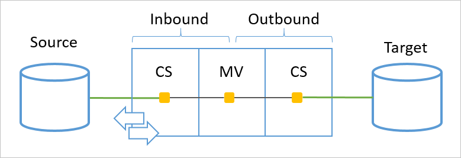
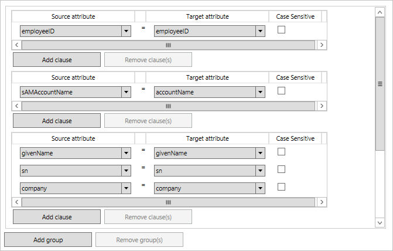
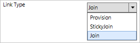
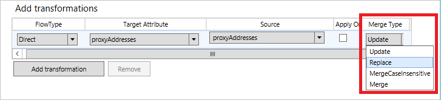
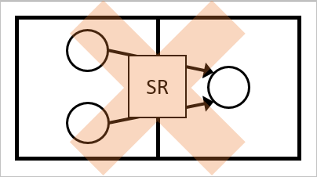

<properties
    pageTitle="Synchronisieren von Azure AD verbinden: Grundlegendes zu deklarative Provisioning | Microsoft Azure"
    description="Erläutert das deklarative provisioning Konfigurationsmodell in Azure AD-Verbindung herstellen."
    services="active-directory"
    documentationCenter=""
    authors="andkjell"
    manager="femila"
    editor=""/>

<tags
    ms.service="active-directory"
    ms.workload="identity"
    ms.tgt_pltfrm="na"
    ms.devlang="na"
    ms.topic="article"
    ms.date="08/29/2016"
    ms.author="billmath"/>

# Synchronisieren von Azure AD verbinden: Grundlegendes zu deklarative bereitgestellt
In diesem Thema wird erläutert, das Konfigurationsmodell in Azure AD-Verbindung herstellen. Das Modell heißt deklarative bereitgestellt, und es ermöglicht Ihnen, die Konfiguration problemlos ändern. Viele Merkmale, die in diesem Artikel beschrieben sind erweiterte und nicht für die meisten Kunden Szenarios erforderlich.

## (Übersicht)
Deklarative provisioning Objekte aus verbundenen Quellverzeichnis stammen verarbeitet und bestimmt, wie das Objekt und die Attribute aus einer Quelle auf ein Ziel transformiert werden soll. Ein Objekt in einer synchronisieren Verkaufspipeline verarbeitet wird und der Verkaufspipeline gilt für eingehenden und ausgehenden Regeln. Eine eingehende Regel aus einem Leerzeichen Verbinder zu Metaverse und eine ausgehende Regel aus Metaverse zu einem Verbinder Leerzeichen.

  

Der Verkaufspipeline verfügt über mehrere verschiedene Module. Jeweils ist ein Konzept in Objekt Synchronisierung verantwortlich.

  

- Quelle, das Quellobjekt
- [Bereich](#scope), findet alle synchronisieren Regeln, die sich im Bereich befinden.
- [Teilnehmen an](#join), bestimmt die Beziehung zwischen Verbinder Leerzeichen und metaverse
- [Transformieren](#transform), berechnet wie Attribute umgewandelt werden soll, und Datenfluss
- [Rangfolge](#precedence)aufgelöst in Konflikt stehenden Attribut Beiträge
- Ziel, das Zielobjekt

## Bereich
Das Bereich Modul ist Auswertung ein Objekts und bestimmt die Regeln, die im Bereich sind und in der Verarbeitung berücksichtigt werden sollen. Je nach den Werten der Attribute auf das Objekt werden andere synchronisieren Regeln ausgewertet, um Umfang sein. Beispielsweise verfügt über ein deaktivierten Benutzer mit kein Exchange-Postfach unterschiedliche Regeln als eines aktivierten Benutzer mit einem Postfach.  
  

Sie können der Umfang wird als Gruppen und Klauseln definiert. Die Klauseln sind innerhalb einer Gruppe. Zwischen alle Klauseln in einer Gruppe wird eine logische und verwendet. Zum Beispiel (Department = IT und Land = Dänemark). Ein logisches "oder" wird zwischen Gruppen verwendet.

  
Der Bereich in der folgenden Abbildung als gelesen werden sollte (Abteilung = IT und Land = Dänemark) oder (Land = Schweden). Ist Umfang, wenn entweder Gruppe 1 oder 2 WAHR, und klicken Sie dann auf die Regel ausgewertet wird.

Das Bereich Modul unterstützt die folgenden Vorgänge an.

Vorgang | Beschreibung
--- | ---
GLEICH, NOTEQUAL | Eine Zeichenfolge vergleichen, der ausgewertet wird, ist der Wert gleich dem Wert in das Attribut. Mehrwertige Attribute finden Sie unter ISIN und ISNOTIN.
LESSTHAN, LESSTHAN_OR_EQUAL | Eine Zeichenfolge vergleichen, der ausgewertet wird, ist der Wert kleiner als der Wert das Attribut.
ENTHÄLT, NOTCONTAINS | Eine Zeichenfolge vergleichen, der ausgewertet wird, wenn der Wert innerhalb der Wert in das Attribut dort gefunden werden kann.
STARTSWITH, NOTSTARTSWITH | Eine Zeichenfolge vergleichen, der ausgewertet wird, ist der Wert in den Anfang des Werts in das Attribut.
ENDSWITH, NOTENDSWITH | Eine Zeichenfolge vergleichen, der ausgewertet wird, ist der Wert in das Ende des Werts im Attribut.
GRÖßER ALS, GREATERTHAN_OR_EQUAL | Eine Zeichenfolge vergleichen, der ausgewertet wird, wenn der Wert größer als der Wert das Attribut ist.
ISNULL, ISNOTNULL | Ausgewertet wird, wenn das Attribut nicht vorhanden ist aus dem Objekt. Wenn das Attribut nicht vorhanden ist und daher null ist, ist die Regel im Bereich.
ISIN, ISNOTIN | Ergibt, wenn der Wert in der definierte Attribut vorhanden ist. Dieser Vorgang ist das mehrwertige Variation gleich und NOTEQUAL. Das Attribut ein mehrwertiges Attribut werden soll, und wenn der Wert in eines der Attributwerte gefunden werden kann, klicken Sie dann die Regel handelt es sich im Bereich.
ISBITSET, ISNOTBITSET | Ergibt, wenn ein bestimmtes Bit festgelegt ist. Beispielsweise kann verwendet werden, ausgewertet werden die Bits in UserAccountControl, um festzustellen, ob ein Benutzer aktiviert oder deaktiviert ist.
ISMEMBEROF, ISNOTMEMBEROF | Der Wert sollte DN zu einer Gruppe in der Verbinder Leerzeichen enthalten. Wenn das Objekt ein Mitglied der Gruppe angegeben ist, ist die Regel im Bereich.

## Teilnehmen an
Das Verknüpfung Modul in der Verkaufspipeline synchronisieren ist verantwortlich für die Suche nach der Beziehung zwischen dem Objekt in der Quelle und ein Objekt in der Zielliste. Klicken Sie auf eine eingehende Regel wäre diese Beziehung eines Objekts in einem Verbinder Leerzeichen eine Beziehung zu einem Objekt im Metaverse suchen.  
  
Das Ziel wird angezeigt, wenn ein Objekt bereits im Metaverse, einen anderen Connector erstellte vorhanden ist, es zugeordnet werden soll. Beispielsweise sollten in einer Ressource-Konto-Struktur der Benutzer der Kontengesamtstruktur mit der Benutzer von der Ressourcengesamtstruktur verknüpft werden.

Verknüpfungen werden hauptsächlich auf eingehende Regeln zum Connector-Objekte zusammen mit dasselbe Objekt Metaverse zu verknüpfen.

Die Verknüpfungen werden als eine oder mehrere Gruppen definiert. In einer Gruppe müssen Sie Klauseln. Zwischen alle Klauseln in einer Gruppe wird eine logische und verwendet. Ein logisches "oder" wird zwischen Gruppen verwendet. Die Gruppen werden in der Reihenfolge von oben nach unten verarbeitet. Wenn eine Gruppe genau eine Übereinstimmung mit einem Objekt in der Zielliste gefunden hat, werden dann keine anderen Verknüpfung Regeln ausgewertet. Wenn 0 (null) oder mehr als ein einziges Objekt gefunden wird, wird der fortgesetzt zur nächsten Gruppe von Regeln. Daher sollten die Regeln in der Reihenfolge der am häufigsten explizite ersten erstellten oder mehr fuzzy am Ende.  
  
Die Verknüpfungen in der folgenden Abbildung sind von oben nach unten bearbeitet. Zuerst sieht der Verkaufspipeline synchronisieren, wenn es eine Übereinstimmung für EmployeeID. Wenn dies nicht der Fall ist, sieht die zweite Regel, wenn Sie den Namen des Kontos verwendet werden kann, um die Objekte miteinander zu verbinden. Ist, die keine Übereinstimmung entweder, ist die dritte und letzte Regel mehr Fuzzyübereinstimmung mit dem Namen des Benutzers ein.

Wenn alle Verknüpfung Regeln ausgewertet wurden, und nicht genau eine Übereinstimmung vorhanden ist, wird auf der Seite **Beschreibung** der **Verknüpfungsart** verwendet. Wenn diese Option **Bereitstellen**festgelegt ist, wird ein neues Objekt in der Zielliste erstellt haben.  
  

Objekt sollten nur eine einzelne synchronisieren Regel mit Verknüpfung Regeln Umfang haben. Wenn mehrere synchronisieren Regeln, Verknüpfung definiert ist, tritt ein Fehler auf. Vorrang wird kein Verknüpfung Konflikte behoben werden können. Objekt müssen eine Regel für die Verknüpfung im Bereich für Attribute mit der gleichen ein-/ausgehende Richtung übertragen. Wenn Sie um Attribute eingehenden und ausgehenden auf dasselbe Objekt benötigen, müssen Sie eine eingehende und eine ausgehende synchronisieren Regel mit Verknüpfung verfügen.

Ausgehende Verknüpfung weist ein besonderes Verhalten beim Versuch, ein Objekt in ein Ziel Verbinder Leerzeichen bereitstellen. DN-Attribut wird verwendet, um zuerst versuchen, eine Reverse-Verknüpfung. Wenn bereits ein Objekt in der Zielliste Verbinder Bereich mit den gleichen DN vorhanden ist, werden die Objekte hinzugefügt.

Das Modul für die Verknüpfung wird nur ausgewertet, sobald eine neuen Regel auf Synchronisieren Wenn Umfang-Zeile. Wenn ein Objekt beigetreten ist, ist es nicht trennen, auch wenn die Verknüpfungskriterien ist nicht mehr erfüllt. Wenn Sie ein Objekt entfernen möchten, muss die Synchronisierung Regel, die die Objekte verknüpft außerhalb des Bereichs wechseln.

### Metaverse löschen
Ein Metaverse-Objekt bleibt, wie lange als vorhanden ist, dass eine Synchronisierung Regel Umfang mit **Verknüpfungsart** **Bereitstellen** oder **StickyJoin**festgelegt. Eine StickyJoin wird verwendet, wenn ein Verbinders beim Bereitstellen eines neuen Objekts zu Metaverse nicht zulässig ist, aber wenn er hinzugefügt wurde, die sie vor dem Löschen des Metaverse-Objekts in der Quelle gelöscht werden muss.

Wenn ein Objekt Metaverse gelöscht wird, werden alle Objekte, die eine ausgehende synchronisieren Regel zum **Bereitstellen von** markiert zugeordneten für eine Löschen markiert.

## Transformationen
Die Transformationen werden verwendet, um die definieren, wie Attribute aus der Quelle auf das Ziel übertragen werden soll. Die Zahlungen können eine der folgenden **Arten Fluss**haben: direkte, Konstante oder Ausdruck. Ein direkter Fluss, fließt einen Attributwert als – ohne zusätzliche Transformationen ist. Ein konstanter Wert legt den angegebenen Wert fest. Ein Ausdruck verwendet deklarative provisioning Ausdruckssprache zum express wie die Transformation werden sollen. Die Details zu der Ausdruckssprache finden Sie unter dem Thema [deklarative provisioning Ausdruckssprache Grundlegendes zu](active-directory-aadconnectsync-understanding-declarative-provisioning-expressions.md) .

  

Das Kontrollkästchen **einmal anwenden** definiert, dass das Attribut nur festgelegt werden soll, wenn das Objekt neu erstellt wird. Diese Konfiguration kann beispielsweise verwendet werden, um ein neues Erstmaliges Kennwort festzulegen.

### Zusammenführen von Attributwerte
Es gibt eine Einstellung, um festzustellen, ob das mehrwertige Attribute aus mehreren verschiedenen Verbinder zusammengeführt werden sollen, in das Attribut Zahlungen. Der Standardwert ist **Aktualisieren**, was bedeutet, dass die Regel synchronisieren mit höchsten Rang gewonnen sollte.

  

Es gibt auch **Zusammenführen** und **MergeCaseInsensitive**. Mit diesen Optionen können Sie die Werte aus verschiedenen Quellen zusammenführen. Beispielsweise kann verwendet werden, um das Element oder ProxyAddresses Attribut aus mehreren verschiedenen Gesamtstrukturen zusammenzuführen. Wenn Sie diese Option verwenden, müssen alle synchronisieren Regeln für ein Objekt im Bereich desselben Typs Seriendruck verwenden. Sie können keine **Update** aus einen Verbinder und **Zusammenführen** von einem anderen definiert. Wenn Sie versuchen, erhalten Sie eine Fehlermeldung.

Der Unterschied zwischen **Zusammenführen** und **MergeCaseInsensitive** Weise doppelte Attributwerte verarbeiten. Das Modul für die Synchronisierung wird sichergestellt, dass doppelte Werte in der Zielattribut nicht eingefügt werden. Mit **MergeCaseInsensitive**doppelte Werte mit nur einen Unterschied für den Fall, dass Sie nicht vertraut sind, vorhanden sein. Angenommen, Sie sollten nicht finden Sie unter beide "SMTP:bob@contoso.com" und "smtp:bob@contoso.com" in das Zielattribut. **Zusammenführen** ist nur die genauen Werte und ansehen mehrere Werte, wobei es nur eine Unterschied zwischen gibt möglicherweise Fall vorhanden sein.

Die Option **Ersetzen** entspricht dem **Update**, aber sie wird nicht verwendet.

### Steuern der Attribut Ablauf des Nachrichtenflusses
Wenn mehrere synchronisieren eingehende Regeln zur Teilnahme an der gleichen Metaverse-Attribut konfiguriert sind, wird der Rangfolge den Gewinner bestimmt. Die Regel synchronisieren mit höchsten Rang (kleinsten numerischen Wert) ist den Wert zu beteiligen gezeigt. Sie können dieses Dialogfeld für ausgehende Regeln. Synchronisieren mit den höchsten Vorrang Wins Regel und den Wert an das verbundene Verzeichnis mitwirken.

In einigen Fällen sollten statt mitwirken einen Wert, die Regel synchronisieren ermitteln Verhalten andere Regeln. Es gibt einige speziellen literalen für diesem Fall verwendet.

Für eingehende Regeln für die Synchronisierung kann der literalen- **NULL** verwendet werden um anzugeben, dass illustrieren keinen Wert beteiligen hat. Eine weitere Regel mit niedriger Priorität kann einen Wert mitwirken. Wenn keine Regel einen Wert beigetragen haben, und klicken Sie dann das Metaverse-Attribut entfernt wird. Für eine ausgehende Regel ist **NULL** der Endwert nachdem alle synchronisieren Regeln verarbeitet wurden, wird der Wert im verbundenen Verzeichnis entfernt.

Ähnelt dem literalen **AuthoritativeNull** auf **NULL** , jedoch mit dem Unterschied, dass keine unteren Vorrangregeln einen Wert beitragen können.

Ein Attributfluss können Sie auch **IgnoreThisFlow**. Es ähnelt dem NULL im Sinne, die es gibt an, dass nichts Beitrag vorhanden ist. Der Unterschied besteht darin, dass sie einen bereits vorhandenen Wert in der Zielliste nicht entfernt werden. Es ist wie der Attributfluss nie es wurde.

Hier ist ein Beispiel:

In *Out-AD - Benutzer Exchange-Hybrid* kann der folgende Fluss gefunden werden:  
`IIF([cloudSOAExchMailbox] = True,[cloudMSExchSafeSendersHash],IgnoreThisFlow)`  
Dieser Ausdruck als gelesen werden sollte: Wenn das Postfach in Azure AD befindet, klicken Sie dann das Attribut aus Azure AD-zu-AD Datenfluss. Wenn dies nicht der Fall ist, nicht wieder etwas Active Directory Datenfluss. In diesem Fall möchten sie den vorhandenen Wert in Active Directory gespeichert.

### ImportedValue
Die Funktion ImportedValue unterscheidet sich alle anderen Funktionen zur Verfügung, da das Attributname muss in Anführungszeichen statt in eckigen Klammern eingeschlossen sein:  
`ImportedValue("proxyAddresses")`.

Während der Synchronisierung in der Regel verwendet ein Attribut der Erwartungswert, auch wenn noch nicht noch exportiert wurden oder ein Fehler zurückgeliefert während des Exportvorgangs ("oberen Rand der Tower"). Eine eingehende Synchronisierung wird davon ausgegangen, dass ein Attribut, die noch ein verbundenes Verzeichnis schließlich erreicht noch nicht erreicht. In einigen Fällen ist es wichtig, nur einen Wert zu synchronisieren, der vom verbundenen Verzeichnis ("Hologramm und Delta Tower importieren") bestätigt wurde.

Ein Beispiel für diese Funktion finden Sie in der Regel Out-of-Box-Synchronisierung *In aus dem Active Directory – Benutzer häufig von Exchange*. Hybrid Exchange sollte der Wertzuwachs von Exchange online nur synchronisiert werden, wenn bestätigt wurde, dass der Wert erfolgreich exportiert wurde:  
`proxyAddresses` <- `RemoveDuplicates(Trim(ImportedValue("proxyAddresses")))`

## Rangfolge
Wenn mehrere synchronisieren Regeln versuchen, den gleichen Attributwert an die Zielwebsite mitwirken, wird der Rangfolgewert den Gewinner bestimmt. Die Regel mit höchsten Rang, niedrigsten numerischen Wert, wird das Attribut in Konflikt beteiligen gezeigt.

  

Diese Reihenfolge kann zum Definieren von präziser Attribut Zahlungen für eine kleine Gruppe von Objekten verwendet werden. Beispielsweise stellen die Out-von-Feld-Regeln sicher, dass die Attribute von einem aktivierten Konto (**Benutzer AccountEnabled**) Rang aus anderen Konten haben.

Rangfolge kann zwischen Verbindern definiert werden. Die ermöglicht es Connectors mit besser Daten Werte zuerst beteiligen möchten.

### Mehrere Objekte aus den gleichen Verbinder Speicherplatz
Wenn Sie mehrere Objekte in den gleichen Verbinder Speicherplatz auf dasselbe Objekt Metaverse verbunden haben, muss der Rangfolge angepasst werden. Wenn mehrere Objekte im Bereich der gleichen synchronisieren Regel befinden, ist das Modul für die Synchronisierung nicht zum Bestimmen der Rangfolge können. Es ist nicht eindeutig beteiligt, welche Quellobjekt mit den Wert Metaverse. Diese Konfiguration wird als mehrdeutige gemeldet, auch wenn die Attribute in der Quelle den gleichen Wert aufweisen.  
  

In diesem Szenario müssen Sie den Bereich der Regeln synchronisieren so ändern, dass die Quellobjekte verschiedenen synchronisieren Regeln Umfang haben. Mit der Sie verschiedene Rangfolge zu definieren.  
  

## Nächste Schritte

- Weitere Informationen zu der Ausdruckssprache in [Grundlegendes zu deklarative Provisioning Ausdrücke](active-directory-aadconnectsync-understanding-declarative-provisioning-expressions.md).
- Finden Sie unter wie deklarative verwendeten Out-of-Box Verständnis [der Standard-Konfigurations](active-directory-aadconnectsync-understanding-default-configuration.md)bereitgestellt wird.
- Informationen Sie zum Praxis mit deklarativen provisioning in [So stellen Sie eine Änderung an der Standardkonfiguration](active-directory-aadconnectsync-change-the-configuration.md)geändert haben.
- Fahren Sie mit Benutzern und Kontakten [Grundlegendes zu Benutzern und Kontakten](active-directory-aadconnectsync-understanding-users-and-contacts.md)Zusammenwirken bei lesen.

**Themen (Übersicht)**

- [Synchronisieren von Azure AD verbinden: verstehen und Anpassen der Synchronisierung](active-directory-aadconnectsync-whatis.md)
- [Integrieren von Ihrem lokalen Identitäten in Azure Active Directory](active-directory-aadconnect.md)

**Verweis Themen**

- [Synchronisieren von Azure AD verbinden: über Funktionen](active-directory-aadconnectsync-functions-reference.md)
