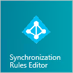
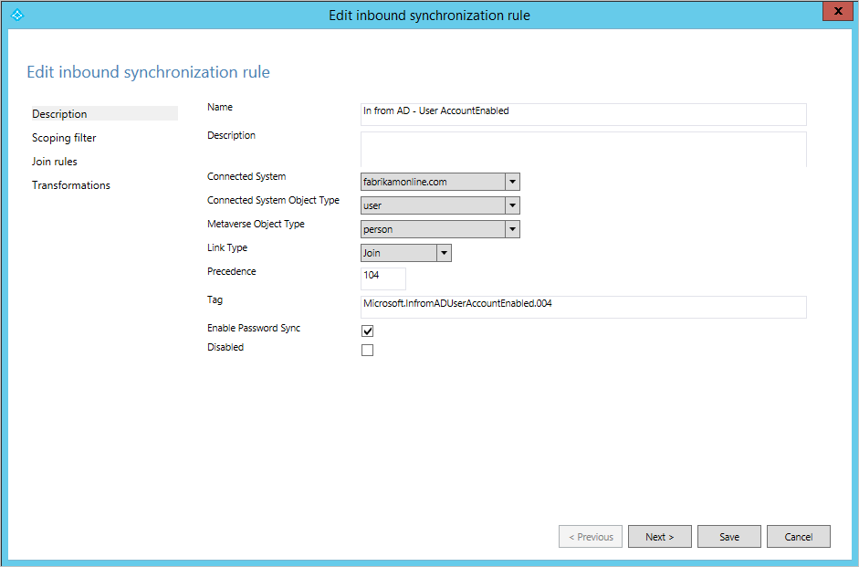

<properties
    pageTitle="Synchronisieren von Azure AD verbinden: Grundlegendes zu der Standard-Konfiguration | Microsoft Azure"
    description="In diesem Artikel werden die standardmäßige Konfiguration in Azure AD verbinden synchronisieren."
    services="active-directory"
    documentationCenter=""
    authors="andkjell"
    manager="femila"
    editor=""/>
<tags
    ms.service="active-directory"
    ms.workload="identity"
    ms.tgt_pltfrm="na"
    ms.devlang="na"
    ms.topic="article"
    ms.date="09/01/2016"
    ms.author="billmath"/>

# <a name="azure-ad-connect-sync-understanding-the-default-configuration"></a>Synchronisieren von Azure AD verbinden: Grundlegendes zu der Standard-Konfiguration
In diesem Artikel wird erläutert, die von Out-of-Box-Konfigurationsregeln. Diese Dokumente, die Regeln und wie diese Regeln für die Konfiguration auswirken. Es führt Sie auch durch die Standardkonfiguration von Azure AD verbinden synchronisieren. Das Ziel ist, dass der Leser wie Konfigurationsmodell deklarative bereitgestellt versteht, mit der Bezeichnung in ein praktisches Beispiel funktioniert. In diesem Artikel wird vorausgesetzt, dass Sie bereits installiert haben und Konfigurieren von Azure AD verbinden Synchronisieren mithilfe des Assistenten.

Um die Details des Konfigurationsmodells zu verstehen, lesen Sie [Grundlegendes zu deklarative bereitgestellt](active-directory-aadconnectsync-understanding-declarative-provisioning.md).

## <a name="out-of-box-rules-from-on-premises-to-azure-ad"></a>Out-of-Box-Regeln aus lokalen zu Azure AD
Die folgenden Ausdrücke können in der Out-of-Box-Konfiguration gefunden werden.

### <a name="user-out-of-box-rules"></a>Benutzer Out-of-Box-Regeln
Diese Regeln gelten auch für den Objekttyp iNetOrgPerson.

Ein Benutzerobjekt erfüllen muss, mit die folgenden synchronisiert werden:

- Sie müssen eine SourceAnchor.
- Nachdem Sie das Objekt in Azure Active Directory erstellt wurde, kann SourceAnchor nicht ändern. Wenn der Wert geänderte lokal ist, reagiert das Objekt synchronisieren, bis der SourceAnchor wieder in den vorherigen Wert geändert wird.
- Das Attribut AccountEnabled (UserAccountControl) muss aufgefüllt haben. Mit einem lokalen Active Directory ist dieses Attribut immer vorhanden und eingetragenen.

Die folgenden Benutzerobjekte sind **nicht** in Azure Active Directory synchronisiert:

- `IsPresent([isCriticalSystemObject])`. Vergewissern Sie sich viele Out-of-Box-Objekte in Active Directory, wie etwa das integrierte Administratorkonto, nicht synchronisiert werden.
- `IsPresent([sAMAccountName]) = False`. Stellen Sie sicher, dass Benutzerobjekte ohne sAMAccountName-Attribut nicht synchronisiert werden. Diesem Fall geschieht jedoch nur praktisch in eine Domäne von NT 4 aktualisiert.
- `Left([sAMAccountName], 4) = "AAD_"`, `Left([sAMAccountName], 5) = "MSOL_"`. Synchronisieren von Azure AD verbinden synchronisieren und deren früheren Versionen verwendete Dienstkonto nicht.
- Synchronisieren Sie Exchange-Konten, die nicht in Exchange Online funktioniert nicht.
    - `[sAMAccountName] = "SUPPORT_388945a0"`
    - `Left([mailNickname], 14) = "SystemMailbox{"`
    - `(Left([mailNickname], 4) = "CAS_" && (InStr([mailNickname], "}") > 0))`
    - `(Left([sAMAccountName], 4) = "CAS_" && (InStr([sAMAccountName], "}")> 0))`
- Synchronisieren Sie Objekte, die nicht in Exchange Online funktioniert nicht.
`CBool(IIF(IsPresent([msExchRecipientTypeDetails]),BitAnd([msExchRecipientTypeDetails],&H21C07000) > 0,NULL))`  
Diese Bitmaske (& H21C07000) würde sich die folgenden Objekte filtern:
    - E-Mail-aktivierten Öffentlichen Ordners
    - System Attendant-Postfach
    - Postfach Datenbank Postfach (Systempostfach)
    - Universeller Sicherheitsgruppe (würde nicht für einen Benutzer anwenden, aber Vorversionen vorhanden ist)
    - Nicht-Universal Gruppe (würde nicht für einen Benutzer anwenden, aber Vorversionen vorhanden ist)
    - Postfach Plan
    - Discovery-Postfachs
- `CBool(InStr(DNComponent(CRef([dn]),1),"\\0ACNF:")>0)`. Synchronisieren Sie Replikation Opfer Objekte nicht.

Die folgenden Regeln Attribut Ursachen zurückzuführen:

- `sourceAnchor <- IIF([msExchRecipientTypeDetails]=2,NULL,..)`. Das Attribut SourceAnchor ist nicht von verknüpften Postfächern beigetragen. Es wird vorausgesetzt, dass ein verknüpftes Postfach gefunden wurde, den tatsächlichen Kontonamen später verknüpft ist.
- Exchange meldet, dass die Attribute nur synchronisiert werden, wenn das Attribut **MailNickName** ein Wert vorhanden ist.
- Wenn es mehrere Weisen, werden Attribute in der folgenden Reihenfolge verbraucht:
    1. Im Zusammenhang mit der Anmeldung Attribute (beispielsweise UserPrincipalName) werden von mit ein aktiviertes Konto bereitgestellt.
    2. Attributen, die in einer Exchange globale Adressliste (Global Address List) gefunden werden können, werden von mit einem Exchange-Postfach bereitgestellt.
    3. Wenn kein Postfach nicht gefunden werden kann, können diese Attribute aus einem beliebigen Gesamtstruktur stammen.
    4. Exchange bezogene Attribute (nicht sichtbar ist, in der globalen Adressliste technische Attribute) werden aus der Gesamtstruktur bereitgestellt, in dem `mailNickname ISNOTNULL`.
    5. Es gibt mehrere Gesamtstrukturen, die eine der folgenden Regeln erfüllen möchten, wird die Erstellung Reihenfolge (Datum/Uhrzeit) die Verbinder (Gesamtstrukturen) verwendet, um zu bestimmen, welche Gesamtstruktur die Attributen beiträgt.

### <a name="contact-out-of-box-rules"></a>Wenden Sie sich an Out-of-Box-Regeln
Ein Kontakt Objekt erfüllen muss, mit die folgenden synchronisiert werden:

- Der Kontakt muss e-Mail-aktiviert sein. Es wird mit den folgenden Regeln überprüft werden sollen:
    - `IsPresent([proxyAddresses]) = True)`. Das Attribut ProxyAddresses muss ausgefüllt werden.
    - Eine primäre e-Mail-Adresse kann entweder das Attribut ProxyAddresses oder das Attribut Mail gefunden werden. Das Vorhandensein eines @ wird verwendet, um sicherzustellen, dass der Inhalt einer e-Mail-Adresse ist. Eine dieser beiden Regeln muss wahr ausgewertet werden.
        - `(Contains([proxyAddresses], "SMTP:") > 0) && (InStr(Item([proxyAddresses], Contains([proxyAddresses], "SMTP:")), "@") > 0))`. Gibt es ein Eintrag mit "SMTP:" und liegt, kann eine @ in der Zeichenfolge gefunden werden?
        - `(IsPresent([mail]) = True && (InStr([mail], "@") > 0)`. Ist das Attribut Mail ausgefüllt, und wenn Ja, kann ein @ in der Zeichenfolge gefunden werden?

Die folgenden Kontakt Objekte sind **nicht** in Azure Active Directory synchronisiert:

- `IsPresent([isCriticalSystemObject])`. Vergewissern Sie sich, keine Kontakt Objekte als wichtig markiert synchronisiert werden. Mit einer Standardkonfiguration dürfen nicht darstellen.
- `((InStr([displayName], "(MSOL)") > 0) && (CBool([msExchHideFromAddressLists])))`.
- `(Left([mailNickname], 4) = "CAS_" && (InStr([mailNickname], "}") > 0))`. Dieser Objekte würde nicht in Exchange Online arbeiten.
- `CBool(InStr(DNComponent(CRef([dn]),1),"\\0ACNF:")>0)`. Synchronisieren Sie Replikation Opfer Objekte nicht.

### <a name="group-out-of-box-rules"></a>Gruppieren von Out-of-Box-Regeln
Ein Gruppenobjekt erfüllen muss, mit die folgenden synchronisiert werden:

- Sie müssen weniger als 50.000 Mitglieder. Diese Anzahl ist die Anzahl der Mitglieder der lokalen Gruppe.
    - Wenn sie weitere Mitglieder aufweist, bevor Synchronisierung zum ersten Mal startet, wird die Gruppe nicht synchronisiert.
    - Wenn die Anzahl der Mitglieder wächst, aus denen es anfangs erstellt wurde, klicken Sie dann bei 50.000 Mitglieder erreichen stoppt das Programm synchronisieren, bis die Anzahl der Mitgliedschaft wieder niedriger als 50.000 ist.
    - Hinweis: Die Anzahl der 50.000 Mitgliedschaft wird auch durch Azure AD erzwungen. Sie sind nicht mehr Gruppen mit weitere Mitglieder synchronisiert, selbst wenn Sie ändern oder entfernen diese Regel.
- Wenn die Gruppe eine **Verteilergruppe**ist, muss auch e-Mail aktiviert sein. Finden Sie unter [Kontakt Out-of-Box-Regeln](#contact-out-of-box-rules) für diese Regel erzwungen wird.

Sind die folgenden Objekte gruppieren **nicht** in Azure Active Directory synchronisiert:

- `IsPresent([isCriticalSystemObject])`. Vergewissern Sie sich viele Out-of-Box-Objekte in Active Directory, wie z. B. integrierten Gruppe der Administratoren, die nicht synchronisiert werden.
- `[sAMAccountName] = "MSOL_AD_Sync_RichCoexistence"`. Legacy Gruppe von DirSync verwendet.
- `BitAnd([msExchRecipientTypeDetails],&amp;H40000000)`. Rollengruppe.
- `CBool(InStr(DNComponent(CRef([dn]),1),"\\0ACNF:")>0)`. Synchronisieren Sie Replikation Opfer Objekte nicht.

### <a name="foreignsecurityprincipal-out-of-box-rules"></a>ForeignSecurityPrincipal Out-of-Box-Regeln
FSPs "eine" beigetreten sind (\*) Objekt im Metaverse. Tatsächlich passiert diese Verknüpfung nur für Benutzer und Sicherheitsgruppen. Diese Konfiguration wird sichergestellt, dass gesamtstrukturübergreifende Mitgliedschaften gelöst und in Azure AD richtig dargestellt werden.

### <a name="computer-out-of-box-rules"></a>Computer Out-of-Box-Regeln
Ein Computerobjekt erfüllen muss, mit die folgenden synchronisiert werden:

- `userCertificate ISNOTNULL`. Dieses Attribut nur 10 Windows-Computer zu füllen. Alle Computerobjekte mit einem Wert in dieses Attribut synchronisiert werden.

## <a name="understanding-the-out-of-box-rules-scenario"></a>Grundlegendes zu dem Szenario Out-of-Box-Regeln
In diesem Beispiel verwenden wir eine Bereitstellung mit einem Konto (A), eine Ressourcengesamtstruktur (R) und eine Azure AD-Verzeichnis.


In dieser Konfiguration wird davon ausgegangen, dass ein aktiviertes Konto in der Kontengesamtstruktur und in der Ressourcengesamtstruktur mit eines verknüpften Postfachs ein deaktiviertes Konto vorhanden ist.

Unser Ziel mit der Standardkonfiguration lautet:

- Attributen, die im Zusammenhang mit der Anmeldung werden aus mit dem aktivierten Konto synchronisiert.
- Attributen, die in der globalen Adressliste (Global Address List) gefunden werden können, werden von mit dem Postfach synchronisiert. Wenn kein Postfach nicht gefunden werden kann, wird jeder anderen Gesamtstruktur verwendet.
- Wenn ein verknüpftes Postfach gefunden wird, muss das verknüpfte aktivierte Konto für das Objekt, das in Azure AD exportiert werden gefunden werden.

### <a name="synchronization-rule-editor"></a>Synchronisation Regel-Editor
Die Konfiguration angezeigt und mit dem Tool Synchronisation Regeln Editor (SRE) geändert werden kann und eine Verknüpfung finden Sie im Startmenü.



Die SRE ist eine Ressource Kit-Tool und erfolgt die Installation mit Azure AD verbinden synchronisieren. Zum Starten können, müssen Sie Mitglied der Gruppe ADSyncAdmins sein. Wenn sie gestartet wurde, wird ungefähr wie folgt aus:


In diesem Bereich wird alle Synchronisierungsregeln für die Konfiguration erstellt. Jede Zeile in der Tabelle ist eine Synchronisierung Regel. Auf der linken Seite unter Regeltypen werden zwei verschiedenen Arten aufgelistet: eingehende und ausgehende. Eingehende und ausgehende aus der Ansicht des Metaverses ist. Sie sind hauptsächlich den Fokus auf die eingehenden Regeln in dieser Übersicht gezeigt. Die tatsächliche Regelliste Synchronisierung hängt der erkannten Schema in Active Directory. Klicken Sie in der Abbildung oben der Kontengesamtstruktur (fabrikamonline.com) hat keinen Dienste, wie etwa Exchange und Lync und keine Regeln für die Synchronisierung für diese Dienste erstellt wurde. Jedoch finden Sie unter der Ressourcengesamtstruktur (res.fabrikamonline.com) Sie Regeln für die Synchronisierung für diese Dienste. Der Inhalt der Regeln unterscheidet sich je nach der Version gefunden. In einer Bereitstellung mit Exchange 2013 sind beispielsweise weitere Attribut Zahlungen als in Exchange 2010/2007 konfiguriert.

### <a name="synchronization-rule"></a>Regel für die Synchronisierung
Eine Synchronisierung Regel handelt es sich um ein Konfigurationsobjekt mit einer Reihe von Attributen entdeckt, wenn eine Bedingung erfüllt ist. Hiermit wird auch beschreiben, wie ein Objekt in ein Leerzeichen Verbinder auf ein Objekt im Metaverse, bekannt als **Verknüpfung** oder **entsprechen**verknüpft ist. Die Synchronisierungsregeln haben Vorrang Wert zeigt an, wie diese miteinander verknüpfen. Eine Regel für die Synchronisierung mit einem unteren numerischen Wert hat Vorrang und ein Konflikt Attribut Fluss, Vorrang die Auflösung Konflikt gewinnt.

Betrachten Sie beispielsweise die Regel für die Synchronisierung **In aus dem Active Directory – Benutzer AccountEnabled**. Markieren Sie diese Zeile in der SRE, und wählen Sie **Bearbeiten**aus.

Da diese Regel einer Out-of-Box-Regel ist, erhalten Sie eine Warnung, wenn Sie die Regel öffnen. Sie sollten keine [Änderungen Out-of-Box-Regeln](active-directory-aadconnectsync-best-practices-changing-default-configuration.md), gemacht werden, damit Sie gefragt werden, was Ihre Absichten sind. In diesem Fall Sie nur die Regel anzeigen möchten. Wählen Sie **Nein**aus.


Eine Regel für die Synchronisierung ist in vier Konfiguration Abschnitte gegliedert: Beschreibung, filtern, Verknüpfung Regeln und Transformationen Bereichsdefinition.

#### <a name="description"></a>Beschreibung
Der erste Abschnitt enthält grundlegenden Informationen, wie Sie einen Namen und eine Beschreibung an.



Finden Sie auch Informationen über die verbundenen System mit dieser Regel, verknüpft ist der Objekttyp im verbundenen System, die, dem Sie auf angewendet wird, und den Objekttyp Metaverse. Der Objekttyp Metaverse ist immer Person unabhängig davon, wenn der Quelle Objekttyp Benutzer, iNetOrgPerson oder Kontakt ist. Der Objekttyp Metaverse sollte nie ändern, sodass sie als generische Typ erstellt wurde. Der Verknüpfungstyp kann teilnehmen, StickyJoin oder Bereitstellen festgelegt werden. Diese Einstellung funktioniert zusammen mit den Abschnitt Regeln teilnehmen an und wird später behandelt.

Sie können auch sehen, dass diese Regel synchronisieren für Kennwort synchronisieren verwendet wird. Wenn ein Benutzer im Bereich für diese Regel synchronisieren ist, ist das Kennwort synchronisiert aus lokalen Cloud (vorausgesetzt, dass Sie das Kennwort ein Feature zur Synchronisierung aktiviert haben).

#### <a name="scoping-filter"></a>Festlegen des Gültigkeitsbereichs von Filtern
Im Abschnitt Filter Bereichsdefinition dient zum Konfigurieren, wann eine Synchronisation Regel gelten soll. Da der Name der Regel Synchronisierung Sie sich sehen zeigt an, nur für Benutzer aktiviert angewendet werden soll, wird der Bereich, damit die Active Directory-Attribut **UserAccountControl** nicht das Bit 2 sein muss konfiguriert festlegen. Wenn das Modul für die Synchronisierung ein Benutzers in Active Directory findet, gilt dies mit dieser Regel synchronisieren, wenn **UserAccountControl** auf den Dezimalwert 512 (aktiviert normaler Benutzer) festgelegt ist. Es gilt nicht die Regel, wenn der Benutzer **UserAccountControl** auf 514 (Deaktivierte normaler Benutzer) festgelegt wurde.


Die Bereiche Eigenschaftenfilter Gruppen und Klauseln, die geschachtelt werden können. Für eine Synchronisierung Regel anwenden müssen alle Klauseln innerhalb einer Gruppe erfüllt werden. Wenn Sie mehrere Gruppen definiert sind, muss mindestens eine Gruppe für die Regel anwenden erfüllt werden. D. h., ein logisches oder zwischen Gruppen und einer logischen ausgewertet wird und innerhalb einer Gruppe ausgewertet wird. Ein Beispiel für diese Konfiguration finden Sie in der ausgehenden Synchronisation Regel **Out-AAD – Group Join**. Es gibt mehrere Synchronisierung Filter Gruppen angezeigt, beispielsweise eine für Sicherheitsgruppen (`securityEnabled EQUAL True`) und eine für Verteilergruppen (`securityEnabled EQUAL False`).


Mit dieser Regel wird verwendet, um die definieren, welche Gruppen in Azure Active Directory bereitgestellt werden sollte. Verteilergruppen muss e-Mail-aktivierten mit Azure Active Directory synchronisiert werden, aber für Sicherheitsgruppen eine e-Mail-Nachricht ist nicht erforderlich.

#### <a name="join-rules"></a>Teilnehmen an Regeln
Der dritte Abschnitt wird verwendet, um die Beziehung zwischen Objekten in dem Bereich Verbinder und Full konfigurieren. Die Regel, die Sie bei einer früheren Version vergeblich haben hat keine Konfiguration für die Regeln für die Teilnahme an stattdessen Sie beabsichtigen, eigenständig **In aus dem Active Directory – Benutzer teilnehmen**.


Der Inhalt der Verknüpfung Regel hängt die passende Option im Assistenten zum Installieren ausgewählt. Eine eingehende Regel die Auswertung beginnt mit einem Objekt in der Quelle Verbinder Platz und jede Gruppe in der Verknüpfung Regeln nacheinander ausgewertet wird. Wenn Sie ein Quellobjekt ausgewertet wird, um genau ein Objekt im Metaverse mithilfe einer Verknüpfung Regeln entsprechen, werden die Objekte hinzugefügt. Wenn alle Regeln ausgewertet wurden und keine Übereinstimmung vorhanden ist, wird auf der Beschreibungsseite der Verknüpfungstyp verwendet. Wenn dieser Konfiguration **Bereitstellen**festgelegt ist, wird ein neues Objekt in der Zielliste, Metaverse erstellt. Um ein neues Objekt in das Metaversum Bereitstellung ist auch bekannt als **Projekt** ein Objekt Metaverse.

Die Verknüpfung Regeln werden nur einmal ausgewertet. Wenn ein Verbinder Leerzeichen Objekt und ein Metaverse-Objekt verknüpft werden, bleiben sie verknüpfte, wie der Bereich der Regel Synchronisation immer noch einverstanden ist.

Bei der Auswertung von Regeln für die Synchronisierung muss nur eine Synchronisierung Regel mit Verknüpfung Regeln definiert Umfang sein. Wenn mehrere Regeln zur Synchronisierung mit Verknüpfung Regeln für ein einziges Objekt gefunden werden, wird ein Fehler ausgelöst. Aus diesem Grund ist es empfehlenswert, dass nur eine Regel für die Synchronisierung mit Verknüpfung definiert werden, wenn mehrere Synchronisierungsregeln für ein Objekt im Bereich befinden. In der Out-of-Box-Konfiguration für Azure AD verbinden synchronisieren können diese Regeln gefunden werden, indem Sie den Namen und suchen, die mit dem Wort am Ende des Namens **Teilnehmen an** . Eine Regel Synchronisation ohne keine Verknüpfung Regeln für gilt die Zahlungen Attribut aus, wenn eine andere Synchronisation Regel miteinander verbunden sind und die Objekte oder nach der Bereitstellung eines neuen Objekts in der Zielliste.

Wenn Sie das Bild oben betrachten, können Sie sehen, dass die Regel versucht, die Teilnahme **ObjectSID** mit **MsExchMasterAccountSid** (Exchange) und **MsRTCSIP-OriginatorSid** (Lync), welche was wir in eine Konto-Topologie erwarten ist. Sie finden die gleiche Regel für alle Gesamtstrukturen. Ausgegangen ist, dass jede Gesamtstruktur eine Firma oder Ressource Gesamtstruktur sein kann. Diese Konfiguration funktioniert auch, wenn Sie über Konten verfügen, die in einer einzelnen Gesamtstruktur live und keine verknüpft werden müssen.

#### <a name="transformations"></a>Transformationen
Im Abschnitt Transformation definiert alle Attribut Zahlungen, die das Ziel-Objekt anwenden, wenn die Objekte verknüpft sind und der Bereichsfilter erfüllt ist. Wechseln zurück zu den **In aus dem Active Directory – Benutzer AccountEnabled** Synchronisierung Regel, suchen Sie die folgenden Transformationen:


Um diese Konfiguration im Kontext, in eine Konto-Ressourcen Gesamtstruktur-Bereitstellung setzen wird davon ausgegangen, um ein aktiviertes Konto in der Kontengesamtstruktur und ein deaktiviertes Konto in der Ressourcengesamtstruktur mit Exchange und Lync-Einstellungen zu finden. Die Synchronisierung Regel Sie sich sehen enthält die Attribute für die Anmeldung erforderlich ist, und diese Attribute sollte Datenfluss aus der Gesamtstruktur, in ein aktiviertes Konto vorhanden ist. Alle diese Attribut Zahlungen sind in einer Regel für die Synchronisierung aufzustellen.

Eine Transformation kann andere Typen haben: Konstante, direkte und Ausdruck.

- Ein konstanter Datenfluss fließt immer einen Wert hartcodierte. In der obigen Fall legt immer den Wert **True** im Metaverse Attribut mit dem Namen **AccountEnabled**.
- Ein direkter Fluss fließt immer den Wert für das Attribut in der Quelle auf das Zielattribut als-ist.
- Der dritte Flusstyp Ausdruck und dies für erweiterte Konfigurationen zulässt.

Der Ausdruckssprache ist VBA (Visual Basic für Applikationen), damit Personen, die mit der Benutzeroberfläche von Microsoft Office oder VBScript wird das Format erkannt. Attribute sind in rechteckige Klammern gesetzt, [AttributeName] eingeschlossen. Namen von Attributen und Funktionsnamen Groß-und Kleinschreibung, aber die Synchronisierung Regel-Editor wertet die Ausdrücke und bieten eine Warnung aus, wenn der Ausdruck nicht gültig ist. Alle Ausdrücke werden in einer einzigen Zeile mit verschachtelten Funktionen ausgedrückt. Um mit der Konfiguration Sprache anzuzeigen, so sieht des Ablaufs für PwdLastSet, jedoch mit zusätzlichen Kommentare eingefügt:

```
// If-then-else
IIF(
// (The evaluation for IIF) Is the attribute pwdLastSet present in AD?
IsPresent([pwdLastSet]),
// (The True part of IIF) If it is, then from right to left, convert the AD time format to a .Net datetime, change it to the time format used by Azure AD, and finally convert it to a string.
CStr(FormatDateTime(DateFromNum([pwdLastSet]),"yyyyMMddHHmmss.0Z")),
// (The False part of IIF) Nothing to contribute
NULL
)
```

Weitere Informationen zu den Ausdruckssprache für Attribut Zahlungen finden Sie unter [Grundlegendes zu deklarative Provisioning Ausdrücke](active-directory-aadconnectsync-understanding-declarative-provisioning-expressions.md) .

### <a name="precedence"></a>Rangfolge
Haben Sie nun einige Regeln für einzelne Synchronisation betrachtet, aber die Regeln in der Konfiguration zusammenarbeiten. In einigen Fällen ist ein Attributwert aus mehreren Synchronisierungsregeln der gleichen Target-Attribut beigetragen. In diesem Fall wird Attribut der Rangfolge verwendet, um zu bestimmen, welche Attribut wins. Betrachten Sie beispielsweise das Attribut SourceAnchor aus. Dieses Attribut ist ein wichtiges Attribut bei Azure AD anmelden können. Finden Sie eine Attributfluss für dieses Attribut in zwei verschiedenen Synchronisierungsregeln **In aus dem Active Directory – Benutzer AccountEnabled** und **In aus dem Active Directory – Benutzer allgemeine**. Aufgrund der Rangfolge der Synchronisierung ist das Attribut SourceAnchor aus mit ein aktiviertes Konto zuerst beigetragen, wenn es mehrere Objekte mit dem Metaverse-Objekt verknüpft sind. Es sind keine Konten aktivierten, und das Modul für die Synchronisierung verwendet die Regel für alle erfassen Synchronisation **In aus dem Active Directory – Benutzer allgemeine**. Diese Konfiguration stellt sicher, dass auch für Konten, die deaktiviert sind, immer noch eine SourceAnchor ist.


Die Rangfolge für Synchronisation Regeln wird vom Assistenten in Gruppen festgelegt. Alle Regeln in einer Gruppe denselben Namen haben, aber sie zu anderen verbundenen Verzeichnissen verbunden sind. Der Installationsassistent bietet die Regel **In aus dem Active Directory – Benutzer teilnehmen** höchsten Rangfolge und es durchläuft alle Over verbunden AD Verzeichnisse durchsuchen. Klicken Sie dann lange mit der nächsten Gruppen von Regeln in einer vordefinierten Reihenfolge. In einer Gruppe werden die Regeln in der Reihenfolge hinzugefügt, die im Assistenten die Verbinder hinzugefügt wurden. Ein weiterer Connector mithilfe des Assistenten hinzugefügt wird, die Synchronisierungsregeln werden neu angeordnet und die Regeln für den neuen Connector letzten in jeder Gruppe eingefügt.

### <a name="putting-it-all-together"></a>Zusammenstellen der
Wir nun wissen genug über Regeln für das Verständnis der Funktionsweise der Konfigurations für die Synchronisierungsregeln kann. Wenn Sie einem Benutzer und den Attributen, die zum Metaverse beigetragen werden betrachten, werden die Regeln in der folgenden Reihenfolge angewendet:

Namen | Kommentar
:------------- | :-------------
In aus dem Active Directory-Benutzer-Verknüpfung | Regel für die Teilnahme an der Verbinder Leerzeichen Objekte mit Metaverse.
In aus dem Active Directory-Benutzerkonto aktiviert. | Erforderliche Attribute für eine Anmelden bei Azure AD- und Office 365. Wir wollen diese Attribute des Kontos aktiviert.
In aus dem Active Directory – Benutzer gemeinsamer aus Exchange | Attribute in der globalen Adressliste gefunden. Angenommen, dass die Qualität der Daten in der Gesamtstruktur am besten geeignet ist, in dem wir das Postfach des Benutzers gefunden haben.
In aus dem Active Directory – Benutzer gemeinsamer | Attribute in der globalen Adressliste gefunden. Für den Fall, dass wir ein Postfach gefunden haben, kann alle anderen verknüpfte Objekt den Attributwert mitwirken.
In aus dem Active Directory – Exchange-Benutzers | Nur vorhanden ist, wenn Exchange erkannt wurde. Er fließt aller Infrastruktur Exchange-Attribute aus.
In aus dem Active Directory – Benutzer Lync | Nur vorhanden ist, wenn Lync erkannt wurde. Er fließt alle Infrastruktur Lync-Attribute.

## <a name="next-steps"></a>Nächste Schritte

- Weitere Informationen zum Konfigurationsmodell in [Grundlegendes zu deklarative bereitgestellt](active-directory-aadconnectsync-understanding-declarative-provisioning.md).
- Weitere Informationen zu der Ausdruckssprache in [Grundlegendes zu deklarative Provisioning Ausdrücke](active-directory-aadconnectsync-understanding-declarative-provisioning-expressions.md).
- Weiterlesen Sie [Grundlegendes zu Benutzern und Kontakten](active-directory-aadconnectsync-understanding-users-and-contacts.md) wie die Out-of-Box-Konfiguration arbeitet
- Informationen Sie zum Praxis mit deklarativen provisioning in [So nehmen Sie eine Änderung an der Standardkonfiguration](active-directory-aadconnectsync-change-the-configuration.md)geändert haben.

**Themen (Übersicht)**

- [Synchronisieren von Azure AD verbinden: verstehen und Anpassen der Synchronisierung](active-directory-aadconnectsync-whatis.md)
- [Integrieren von Ihrem lokalen Identitäten in Azure Active Directory](active-directory-aadconnect.md)
