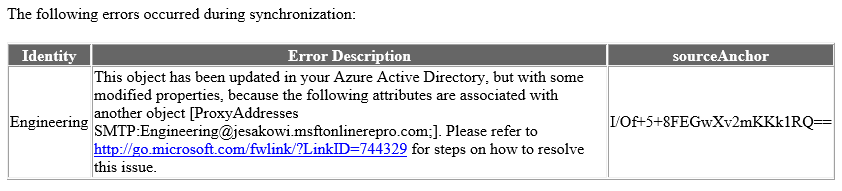

<properties
    pageTitle="Identität Synchronisierung und doppelt Attribut Stabilität | Microsoft Azure"
    description="Neues Verhalten zur Behandlung von Objekten mit dem UPN oder ProxyAddress Konflikte während der Directory-Synchronisierung mit Azure AD verbinden."
    services="active-directory"
    documentationCenter=""
    authors="markusvi"
    manager="femila"
    editor=""/>

<tags
    ms.service="active-directory"
    ms.workload="identity"
    ms.tgt_pltfrm="na"
    ms.devlang="na"
    ms.topic="article"
    ms.date="09/29/2016"
    ms.author="markusvi"/>

# Identität Synchronisierung und doppelt Attribut Stabilität
Doppelte Attribut Stabilität ist ein Feature in Azure Active Directory, mit denen Reibung zurückzuführen **UserPrincipalName** und **ProxyAddress** Konflikte beim Ausführen eines Microsoft Synchronisierung Tools umgangen werden.

Diese zwei Attribute sind im Allgemeinen erforderlich, für alle **Benutzer**, die **Gruppe**oder **Kontakt** Objekte in einem angegebenen Azure Active Directory-Mandanten eindeutig sein.

> [AZURE.NOTE] Nur Benutzer können Benutzerprinzipalnamen haben.

Das neue Verhalten, das mit diesem Feature können in der Cloud Teil der Verkaufspipeline synchronisieren, daher Client unabhängig und für jedes Produkt Synchronisation von Microsoft Azure AD verbinden, DirSync und MIM + Netzwerke einschließlich relevant ist. Der generische Begriff "Synchronisierungsclient" wird in diesem Dokument zum eine dieser Produkte darstellen.

## Aktuelle Verhalten
Ist beim Versuch, ein neues Objekt mit einem Wert (Benutzerprinzipalnamen) oder ProxyAddress bereitzustellen, die diese Einschränkung Eindeutigkeit verletzt wird, blockiert Azure Active Directory das Objekt erstellt wird. Auf ähnliche Weise, wenn ein Objekt mit einem nicht eindeutigen Benutzerprinzipalnamen oder ProxyAddress aktualisiert wird, schlägt die Aktualisierung. Die Bereitstellung Versuch oder aktualisieren, die vom Synchronisierungsclient bei jedem exportieren Zyklus wiederholt wird, und weiterhin ein Fehler auftritt, bis der Konflikt gelöst wird. E-Mail-Bericht Fehler wird bei jedem Versuch generiert und ein Fehler wird durch den-Synchronisierungsclient protokolliert.

## Verhalten mit doppelten Attribut Stabilität
Statt weiß nicht vollständig bereitstellen oder ein Objekts mit zwei Attribute aktualisieren, isoliert"Azure Active Directory" das doppelte Attribut, das Eindeutigkeit verletzt würden. Ist dieses Attribut erforderlich, für die Bereitstellung, wie UserPrincipalName, weisen Sie den Dienst einen Platzhalterwert. Das Format der folgenden temporäre Werte ist  
"***<OriginalPrefix>+<4DigitNumber>@<InitialTenantDomain>. onmicrosoft.com***".  
Wenn das Attribut nicht erforderlich ist, wie eine **ProxyAddress**ist, das Attribut Konflikt isoliert Azure Active Directory einfach und läuft mit der Erstellung des Objekts oder aktualisieren.

Informationen zu den Konflikt wird in Quarantäne das Attribut an, in der gleichen Fehler Bericht e-Mail, die in das alte Verhalten verwendet gesendet. Jedoch dieser Informationen wird nur angezeigt, in dem Fehlerbericht einmal, wenn die Quarantäne geschieht, es nicht weiter in zukünftigen e-Mails angemeldet sein. Auch, da das Exportieren für dieses Objekt erfolgreich abgeschlossen ist, der-Synchronisierungsclient meldet einen Fehler nicht und keine Wiederholung erstellen / Aktualisierungsvorgang bei nachfolgenden synchronisieren Zyklen.

Um dieses Verhalten unterstützt wurde ein neues Attribut für die Benutzer, Gruppen- und Kontakt Objektklassen hinzugefügt:  
**DirSyncProvisioningErrors**

Dies ist ein mehrwertiges Attribut, mit dem Speichern der in Konflikt stehenden Attribute, die die Eindeutigkeit verletzt würde normalerweise hinzugefügt werden soll. Ein Hintergrund Zeitmessung Vorgang wurde in Azure Active Directory aktiviert, das Sie stündlich doppeltes Attributkonflikte gesucht, die behoben wurden, automatisch die entsprechenden Attribute aus der Quarantäne entfernt und ausgeführt wird.

### Doppeltes Attribut Stabilität aktivieren
Doppelte Attribut Stabilität werden dem neuen Standardverhalten über alle Azure Active Directory-Mandanten. Klicken Sie auf werden für alle Mandanten standardmäßig, die Synchronisierung zum ersten Mal auf 22. August 2016 oder höher aktiviert. Mandanten, die vor diesem Datum synchronisieren aktiviert werden das Feature in Stapeln aktiviert haben. Dieser Einführung in September 2016 beginnt, und eine e-Mail-Benachrichtigung an des Mandanten Tech Kontakt mit einem bestimmten Datum, wenn das Feature aktiviert werden, gesendet.

Doppelte Attribut Stabilität eingeschaltet kann nicht deaktiviert werden.

Um zu überprüfen, ob das Feature für Ihren Mandanten aktiviert ist, können Sie dazu die neueste Version des Moduls Azure-Active Directory-PowerShell herunterladen und ausführen:

`Get-MsolDirSyncFeatures -Feature DuplicateUPNResiliency`

`Get-MsolDirSyncFeatures -Feature DuplicateProxyAddressResiliency`

Wenn Sie möchten die vorausschauende das Feature aktiviert haben, bevor sie für Ihren Mandanten aktiviert ist, können Sie dazu die neueste Version des Moduls Azure-Active Directory-PowerShell herunterladen und ausführen:

`Set-MsolDirSyncFeature -Feature DuplicateUPNResiliency -Enable $true`

`Set-MsolDirSyncFeature -Feature DuplicateProxyAddressResiliency -Enable $true`

## Identifizieren Objekte mit DirSyncProvisioningErrors
Es gibt derzeit zwei Methoden, um Objekte zu identifizieren, die diese Fehler aufgrund doppelter Eigenschaftenkonflikte, Azure-Active Directory-PowerShell und im Office 365-Administratorportal aufweisen. Es ist geplant, um zusätzliche Portal basierte Berichterstattung zukünftig zu erweitern.

### Azure-Active Directory-PowerShell
Für die in diesem Thema PowerShell-Cmdlets gilt Folgendes:

- Alle der folgenden Cmdlets Groß-/Kleinschreibung.
- Die **– ErrorCategory PropertyConflict** sein enthalten. Derzeit keine anderen Typen von **ErrorCategory**vorhanden sind, aber dies kann in der Zukunft erweitert werden.

Zunächst erste Schritte durch **Verbinden-MsolService** ausgeführt und Eingeben von Anmeldeinformationen für mandantenadministrator.

Klicken Sie dann verwenden Sie die folgenden Cmdlets und Operatoren ein Fehler auf verschiedene Arten anzeigen:

1. [Zeigen Sie alle](#see-all)

2. [Nach Eigenschaftentyp](#by-property-type)

3. [Durch den Wert in Konflikt stehenden](#by-conflicting-value)

4. [Verwenden einer Zeichenfolge suchen](#using-a-string-search)

5. [Sortiert](#sorted)

6. [In eine begrenzte Menge oder alle](#in-a-limited-quantity-or-all)

#### Zeigen Sie alle
Nachdem die Verbindung hergestellt wurde, ausführen, um eine allgemeine Übersicht über das Attribut bereitgestellt finden Sie unter Fehler in den Mandanten:

`Get-MsolDirSyncProvisioningError -ErrorCategory PropertyConflict`

Dies führt zu einem Ergebnis wie folgt aus:  
   

#### Nach Eigenschaftentyp
Wenn Fehler nach Eigenschaftentyp anzeigen möchten, fügen Sie die Kennzeichnung **- Eigenschaftenname** mit dem Argument **UserPrincipalName** oder **ProxyAddresses** hinzu:

`Get-MsolDirSyncProvisioningError -ErrorCategory PropertyConflict -PropertyName UserPrincipalName`

Oder

`Get-MsolDirSyncProvisioningError -ErrorCategory PropertyConflict -PropertyName ProxyAddresses`

#### Durch den Wert in Konflikt stehenden
Zum Anzeigen von Fehlern bei der Bezug auf eine bestimmte Eigenschaft hinzufügen auf die **- Eigenschaftswert** Kennzeichnung (**- Eigenschaftenname** muss ebenfalls verwendet werden, wenn diese Kennzeichnung hinzufügen):

`Get-MsolDirSyncProvisioningError -ErrorCategory PropertyConflict -PropertyValue User@domain.com -PropertyName UserPrincipalName`

#### Verwenden einer Zeichenfolge suchen
Zum Ausführen einer allgemeinen Zeichenfolge suchen, verwenden Sie die Kennzeichnung **- Suchzeichenfolge** . Dies kann unabhängig voneinander verwendet werden von allen der oben genannten Kennzeichen, mit Ausnahme von **-ErrorCategory PropertyConflict**, die immer erforderlich ist:

`Get-MsolDirSyncProvisioningError -ErrorCategory PropertyConflict -SearchString User`

#### In eine begrenzte Menge oder alle
1. **MaxResults <Int> ** können verwendet werden, um die Abfrage auf eine bestimmte Anzahl von Werten zu beschränken.

2. **Alle** können verwendet werden, stellen Sie sicher, dass alle Ergebnisse in der Groß-/Kleinschreibung abgerufen werden, die eine große Anzahl von Fehlern vorhanden ist.

`Get-MsolDirSyncProvisioningError -ErrorCategory PropertyConflict -MaxResults 5`

## Verwaltungsportal von Office 365

Sie können in der Office 365-Verwaltungskonsole Directory Synchronisierungsfehler anzeigen. Der Bericht in Office 365-Portal zeigt nur **Benutzer** -Objekte, die dieser Fehler enthalten. Informationen zu Konflikten zwischen **Gruppen** und **Kontakte**wird nicht angezeigt.

![Aktive Benutzer] (./media/active-directory-aadconnectsyncservice-duplicate-attribute-resiliency/1234.png "Aktive Benutzer")

Anweisungen zum Verzeichnis Synchronisierungsfehlern in Office 365 Administrationscenter anzeigen finden Sie unter [identifizieren Directory Synchronisierungsfehlern in Office 365](https://support.office.com/en-us/article/Identify-directory-synchronization-errors-in-Office-365-b4fc07a5-97ea-4ca6-9692-108acab74067).

### Identität Synchronisierung Fehlerbericht
Wenn ein Objekt mit einen Konflikt Doppeltes Attribut erfolgt mit diesem neuen Verhalten ist eine Benachrichtigung in der Standardansicht Identität Synchronisation Fehlerbericht e-Mail, die an das technische Benachrichtigung gesendet werden enthalten wenden Sie sich an für den Mandanten. Es gibt jedoch eine wichtige Änderung in dieses Verhalten. In der Vergangenheit würde Informationen über einen Konflikt Doppeltes Attribut in jeder nachfolgenden Fehlerbericht einbezogen werden, bis der Konflikt behoben wurde. Mit diesem neuen Verhalten wird die Fehler Benachrichtigung für einen angegebenen Konflikt nur einmal - gleichzeitig angezeigt, das in Konflikt stehende Attribut isoliert wird.

Hier ist ein Beispiel für wie die e-Mail-Benachrichtigung für einen Konflikt ProxyAddress aussieht:  
      

## Auflösen von Konflikten
Problembehandlung bei Strategie und Auflösung Taktiken für diese Fehler sollte nicht gegenüber variieren Doppeltes Attribut Fehler in der Vergangenheit verarbeitet wurden. Der einzige Unterschied ist, dass die Aufgabe Timer durch den Mandanten klicken Sie auf der Seite Dienst automatisch das betreffende Attribut auf das richtige Objekt hinzufügen zieht, nachdem der Konflikt gelöst wird.

Im folgende Artikel zeigt verschiedene Problembehandlung und Auflösung Strategien: [Duplizieren oder ungültige Attribute Verzeichnissynchronisation in Office 365 zu verhindern](https://support.microsoft.com/kb/2647098).

## Bekannte Probleme
Keiner der folgenden bekannten Probleme bewirkt, dass Daten Verlust oder einen bestimmten Dienst Leistungsabfall. Mehrere Empfänger Layoutgründen sind, andere standard "*Pre Stabilität*" Doppeltes Attribut Fehler ausgelöst wird, statt isolieren das Attribut Konflikt auslösen und ein anderes bewirkt, dass bestimmte Fehler zu erfordern zusätzliche manuelle beheben auszurichten.

**Core Verhalten:**

1. Objekte mit bestimmten Attribut Konfigurationen weiterhin exportieren Fehler im Gegensatz zu den doppelten Attribute isoliert zu erhalten.  
Beispiel:

    ein. Neue Benutzer wird in Active Directory mit dem Benutzerprinzipalnamen erstellt **Joe@contoso.com** und ProxyAddress**smtp:Joe@contoso.com**

    b. Die Eigenschaften des Objekts in Konflikt mit einer vorhandenen Gruppe, wo finde ich ProxyAddress **SMTP:Joe@contoso.com**.

    c. Beim Exportieren wird ein **ProxyAddress Konflikt** Fehler ausgegeben, anstatt die Konflikt Attribute unter Quarantäne gestellt. Der Vorgang ist bei jeder nachfolgenden synchronisieren Zyklus wiederholt, wie sie hätte sein möchten, bevor das Stabilität Feature aktiviert wurde.

2. Wenn zwei Gruppen lokal mit der gleichen SMTP-Adresse erstellt werden, schlägt eine beim ersten mit einer doppelten **ProxyAddress** Standardfehler bereitstellen. Der doppelte Wert wird jedoch ordnungsgemäß bei der nächsten Synchronisierung Zyklus isoliert.

**Office-Portals Bericht**:

1. Die ausführliche Fehlermeldung für zwei Objekte in einer Gruppe von Benutzerprinzipalnamen Konflikt ist gleich. Dies zeigt an, dass sie beide ihrem Benutzerprinzipalnamen geändert ausgeführt wurde / isoliert, wenn Sie wirklich nur eine von ihnen Daten geändert haben.

2. Die ausführliche Fehlermeldung für einen Konflikt UPN zeigt dieser falschen Wert für einen Benutzer, der deren UPN geändert/unter Quarantäne gestellt wurde. Beispiel:

    ein. **Benutzer A** synchronisiert zuerst mit **UPN = User@contoso.com **.

    b. **Benutzer B** wollten Nächstes mit synchronisiert werden **UPN = User@contoso.com **.

    c. **Benutzer B** Benutzerprinzipalnamen wird geändert, um **User1234@contoso.onmicrosoft.com** und **User@contoso.com** **DirSyncProvisioningErrors**hinzugefügt wird.

    d. Die Fehlermeldung für **Benutzer B** sollte darauf hinzuweisen, dass **Benutzer A** bereits hat **User@contoso.com** wie einen UPN, aber es zeigt **Benutzer B** eigenen DisplayName.

**Identität Synchronisierung Fehlerbericht**:

Der Link für *die einzelnen Schritte zum zum Beheben dieses Problems* ist falsch:  
      

Es sollte auf [https://aka.ms/duplicateattributeresiliency](https://aka.ms/duplicateattributeresiliency)verweisen.

## Siehe auch

- [Synchronisieren von Azure AD verbinden](active-directory-aadconnectsync-whatis.md)

- [Integrieren von Ihrem lokalen Identitäten in Azure Active Directory](active-directory-aadconnect.md)

- [Identifizieren Sie Directory Synchronisierungsfehlern in Office 365](https://support.office.com/en-us/article/Identify-directory-synchronization-errors-in-Office-365-b4fc07a5-97ea-4ca6-9692-108acab74067)
