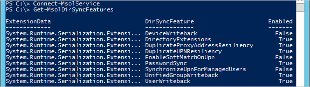

<properties
    pageTitle="Azure AD verbinden synchronisieren Service-Features und Konfiguration | Microsoft Azure"
    description="Beschreibt Dienst Seite Features für die Synchronisierungsdienst Azure AD verbinden."
    services="active-directory"
    documentationCenter=""
    authors="andkjell"
    manager="femila"
    editor=""/>

<tags
    ms.service="active-directory"
    ms.workload="identity"
    ms.tgt_pltfrm="na"
    ms.devlang="na"
    ms.topic="article"
    ms.date="08/22/2016"
    ms.author="andkjell;markvi"/>

# <a name="azure-ad-connect-sync-service-features"></a>Azure AD verbinden synchronisieren Service-features

Die Synchronisierungsfunktion von Azure AD verbinden besteht aus zwei Komponenten:

- Die lokale Komponente den Namen **Azure AD verbinden synchronisieren**, auch als **Synchronisieren-Engine**bezeichnet.
- Der Dienst, die in Azure AD auch bekannt als **Azure AD verbinden Sync-Diensts**

In diesem Thema wird erläutert, wie die folgenden Features des Windows **Azure AD verbinden Synchronisierungsdienst** funktionieren und wie Sie sie mithilfe der Windows PowerShell konfigurieren können.

Diese Einstellungen werden durch die [Azure Active Directory-Modul für Windows PowerShell](http://aka.ms/aadposh)konfiguriert. Herunterladen Sie und installieren Sie es getrennt von Azure AD-verbinden. Die in diesem Thema dokumentierten Cmdlets wurden in der [2016 März lassen Sie wieder los (Build 9031.1)](http://social.technet.microsoft.com/wiki/contents/articles/28552.microsoft-azure-active-directory-powershell-module-version-release-history.aspx#Version_9031_1)eingeführt werden. Wenn Sie verfügen nicht über die in diesem Thema dokumentierten Cmdlets oder sie nicht das gleiche Ergebnis erzeugen, stellen Sie sicher, dass Sie die neueste Version ausführen.

Führen Sie zum Anzeigen der Konfigurations in Ihrem Verzeichnis Azure AD- `Get-MsolDirSyncFeatures`.  


Zahlreiche diese Einstellungen können nur von Azure AD verbinden geändert werden.

Die folgenden Einstellungen konfiguriert werden, indem `Set-MsolDirSyncFeature`:

DirSyncFeature | Kommentar
--- | ---
[DuplicateProxyAddressResiliency<br/>DuplicateUPNResiliency](#duplicate-attribute-resiliency) | Diese Berechtigung ermöglicht ein Attribut unter Quarantäne gestellt werden, wenn es sich um ein Duplikat der ein anderes Objekt statt weiß nicht das gesamte Objekt während des Exportvorgangs ist.
[EnableSoftMatchOnUpn](#userprincipalname-soft-match) | Können Objekte zu verknüpfende UserPrincipalName zusätzlich primäre SMTP-Adresse ein.
[SynchronizeUpnForManagedUsers](#synchronize-userprincipalname-updates) | Ermöglicht die synchronisieren-Engine das Attribut UserPrincipalName für verwaltete/lizenziert (nicht Partnerbenutzern) Benutzer zu aktualisieren.

Nachdem Sie ein Feature aktiviert haben, kann es wieder deaktiviert werden.

>[AZURE.NOTE] Von 24 August 2016 das Feature *Duplizieren Attribut Stabilität* ist standardmäßig aktiviert für neue Azure AD Verzeichnisse durchsuchen. Dieses Feature wird auch Variationswebsites und auf Verzeichnisse vor diesem Datum erstellten aktiviert werden. Sie erhalten eine e-Mail-Benachrichtigung, wenn Ihr Verzeichnis ist dieses Feature aktiviert wird abgerufen.

Die folgenden Einstellungen werden durch Azure AD Verbinden konfiguriert und kann nicht geändert werden, indem Sie `Set-MsolDirSyncFeature`:

DirSyncFeature | Kommentar
--- | ---
DeviceWriteback | [Azure AD-verbinden: Aktivieren Gerät abgeschlossenen writebackvorgängen](active-directory-aadconnect-feature-device-writeback.md)
DirectoryExtensions | [Synchronisieren von Azure AD verbinden: Directory-Erweiterungen](active-directory-aadconnectsync-feature-directory-extensions.md)
PasswordSync | [Implementieren der Synchronisierung von Kennwörtern mit Azure AD verbinden synchronisieren](active-directory-aadconnectsync-implement-password-synchronization.md)
UnifiedGroupWriteback | [Vorschau: Gruppe abgeschlossenen writebackvorgängen](active-directory-aadconnect-feature-preview.md#group-writeback)
UserWriteback | Zurzeit nicht unterstützt.

## <a name="duplicate-attribute-resiliency"></a>Doppeltes Attribut Stabilität
Statt fehlerhafte Bereitstellen von Objekten mit doppelten Benutzerprinzipalnamen / ProxyAddresses, das Attribut duplizierte "isoliert" und ein temporärer Wert zugeordnet ist. Wenn der Konflikt gelöst ist, wird automatisch der temporäre UPN auf den richtigen Wert geändert. Dieses Verhalten kann für Benutzerprinzipalnamen und ProxyAddress separat aktiviert werden. Weitere Informationen hierzu finden Sie unter [Identität Synchronisierung und Doppeltes Attribut Stabilität](active-directory-aadconnectsyncservice-duplicate-attribute-resiliency.md).

## <a name="userprincipalname-soft-match"></a>UserPrincipalName weiche Übereinstimmung
Wenn dieses Feature aktiviert ist, ist weiche-Übereinstimmung für Benutzerprinzipalnamen sowie die [primäre SMTP-Adresse](https://support.microsoft.com/kb/2641663), aktiviert immer aktiviert ist. Weiche-Vergleich wird verwendet, um die vorhandenen Cloud-Benutzer in Azure AD für lokale Benutzer übereinstimmen.

Im Bedarfsfall Übereinstimmung lokalen Active Directory-Konten mit vorhandenen Konten erstellt, in der Cloud nicht Exchange Online verwenden, und dann dieses Feature ist hilfreich. In diesem Szenario verfügen Sie möglicherweise nicht in der Regel einen Grund für das Attribut für SMTP finden Sie in der Cloud festlegen.

Dieses Feature ist auf standardmäßig für neu Azure AD-Verzeichnisse erstellt. Sie können sehen, wenn diese Funktion für Sie, indem Sie ausführen aktiviert ist:  
```
Get-MsolDirSyncFeatures -Feature EnableSoftMatchOnUpn
```

Wenn diese Funktion nicht für Ihr Azure AD-Verzeichnis aktiviert ist, können Sie ihn durch Ausführen aktivieren:  
```
Set-MsolDirSyncFeature -Feature EnableSoftMatchOnUpn -Enable $true
```

## <a name="synchronize-userprincipalname-updates"></a>Synchronisieren von UserPrincipalName updates
In der Vergangenheit Updates für das Attribut UserPrincipalName mithilfe des Diensts für die Synchronisierung aus lokalen wurde blockiert, es sei denn, Sie beide der folgenden Bedingungen zutreffen:

- Der Benutzer ist (nicht Partnerbenutzern) verwaltet.
- Der Benutzer verfügt über keine Lizenz zugewiesen wurde.

Weitere Informationen hierzu finden Sie unter [Benutzernamen in Office 365, Azure, oder Intune nicht die lokale Benutzerprinzipalnamen oder alternative Anmelde-ID entsprechen](https://support.microsoft.com/kb/2523192).

Aktivieren dieses Feature ermöglicht die Synchronisierung-Engine UserPrincipalName aktualisiert, wenn der lokale geänderte und verwenden Sie ein Kennwort synchronisieren. Wenn Sie einen Partnerverbund verwenden, wird dieses Feature nicht unterstützt.

Dieses Feature ist auf standardmäßig für neu Azure AD-Verzeichnisse erstellt. Sie können sehen, wenn dieses Feature für Sie, indem Sie ausführen aktiviert ist:  
```
Get-MsolDirSyncFeatures -Feature SynchronizeUpnForManagedUsers
```

Wenn diese Funktion nicht für Ihr Azure AD-Verzeichnis aktiviert ist, können Sie ihn durch Ausführen aktivieren:  
```
Set-MsolDirSyncFeature -Feature SynchronizeUpnForManagedUsers -Enable $true
```

Wenn dieses Feature aktiviert haben, bleibt als vorhandenen UserPrincipalName Werten-ist. Auf der nächsten Änderung der UserPrincipalName Attribut lokal wird der normalen Delta synchronisieren Benutzer Benutzerprinzipalnamen aktualisiert.  

## <a name="see-also"></a>Siehe auch

- [Synchronisieren von Azure AD verbinden](active-directory-aadconnectsync-whatis.md)
- [Integration von Ihrem lokalen Identitäten mit Azure Active Directory](active-directory-aadconnect.md).
