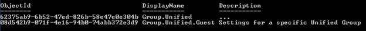
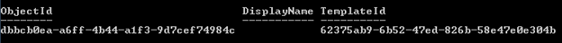

<properties
    pageTitle="Azure Active Directory-Cmdlets für die Konfiguration von gruppeneinstellungen | Microsoft Azure"
    description="Wie verwalten Sie die Einstellungen für Cmdlets Azure Active Directory-Gruppen."
    services="active-directory"
    documentationCenter=""
    authors="curtand"
    manager="femila"
    editor=""/>

<tags
    ms.service="active-directory"
    ms.workload="identity"
    ms.tgt_pltfrm="na"
    ms.devlang="na"
    ms.topic="article"
    ms.date="09/22/2016"
    ms.author="curtand"/>

# Azure Active Directory-Cmdlets für die Konfiguration von gruppeneinstellungen

Die folgenden Einstellungen für unified Gruppen können in Ihrem Verzeichnis konfiguriert sein:

1.  Klassifizierung: eine durch Trennzeichen getrennte Liste Klassifizierung, die Benutzer einer Gruppe festgelegt werden können. Beispiele für wäre "Als", "Geheim" und "Verwendete Geheimnis".

2.  Verwendung Richtlinien URL: eine URL, die Benutzer auf den Nutzungsbedingungen für die Verwendung von Unified Gruppen verweist, wie von Ihrer Organisation definiert sind. Diese URL wird in der Benutzeroberfläche angezeigt, in dem Benutzer Gruppen verwenden.

3.  Gruppieren der Erstellung aktiviert:, ob keine, einige oder alle Benutzer dürfen Unified Gruppen erstellen. Wenn auf festgelegt wird, können alle Benutzer Gruppen erstellen. Wenn auf off eingestellt, können keine Benutzer Gruppen erstellen. Wenn deaktivieren, Sie können auch angeben eine Sicherheitsgruppe gruppiert, deren Benutzer, die weiterhin berechtigt sind, zu erstellen.

Diese Einstellungen werden mithilfe eines Einstellungen konfiguriert und SettingsTemplate Objekten. Anfangs, sehen Sie alle Einstellungsobjekte nicht in Ihrem Verzeichnis. Dies bedeutet, dass das Verzeichnis mit den Standardeinstellungen konfiguriert ist. Wenn Sie die Standardeinstellungen ändern möchten, erstellen Sie ein neues Einstellungsobjekt mithilfe einer Vorlage Einstellungen. Vorlagen werden von Microsoft definiert.

Sie können das Modul, enthält die für diese Vorgänge von der [Website Microsoft verbinden](http://connect.microsoft.com/site1164/Downloads/DownloadDetails.aspx?DownloadID=59185)verwendeten Cmdlets herunterladen.

## Erstellen von Einstellungen auf Verzeichnisebene

Diese Schritte beträchtlich erhöhen Einstellungen Verzeichnis auf oberster Ebene auf alle Office-Gruppen im Verzeichnis anwenden.

1. Wenn Sie nicht, welche SettingTemplate wissen verwendet wird, gibt dieses Cmdlet die Liste der Vorlagen Einstellungen aus:

    `Get-MsolAllSettingTemplate`

    

2. Wenn die URL einer Verwendung Richtlinie hinzufügen möchten, müssen Sie zuerst das Objekt SettingsTemplate abzurufen, das der Verwendung URL Durchschnittswert definiert; d. h., die Group.Unified Vorlage:

    `$template = Get-MsolSettingTemplate –TemplateId 62375ab9-6b52-47ed-826b-58e47e0e304b`

3. Als Nächstes erstellen Sie ein neues Einstellungsobjekt auf der Grundlage dieser Vorlage ein:

    `$setting = $template.CreateSettingsObject()`

4. Klicken Sie dann Aktualisieren der Durchschnittswert Verwendung:

    `$setting["UsageGuidelinesUrl"] = "<https://guideline.com>"`

5. Wenden Sie anschließend die Einstellungen aus:

    `New-MsolSettings –SettingsObject $setting`

    

Hier sind die Einstellungen in der Group.Unified SettingsTemplate definiert.

 **Einstellung**                          | **Beschreibung**                                                                                             
--------------------------------------|-----------------------------------------------
 <ul><li>ClassificationList<li>Typ: Zeichenfolge<li>Standard: ""                  | Eine durch Trennzeichen getrennte Liste gültiger Klassifizierung Werte, die Unified Gruppen angewendet werden können.                
 <ul><li>EnableGroupCreation<li>Type: boolesche<li>Standard: WAHR              | Die Kennzeichnung, die angibt, ob die Erstellung von einheitliche Gruppe im Verzeichnis zulässig ist.                               
 <ul><li>GroupCreationAllowedGroupId<li>Typ: Zeichenfolge<li>Standard: ""         | GUID der Sicherheitsgruppe, die zum Erstellen von Gruppen Unified zulässig ist es auch bei EnableGroupCreation == False.
 <ul><li>UsageGuidelinesUrl<li>Typ: Zeichenfolge<li>Standard: ""                  | Ein Link zu den Richtlinien für die Verwendung von Gruppe.                                                                       

## Lesen Sie die Einstellungen auf der Verzeichnisebene

Schritte Weitere Einstellungen Verzeichnis auf oberster Ebene, die für alle Office-Gruppen im Verzeichnis gelten.

1. Lesen Sie alle vorhandenen Verzeichnis Einstellungen:

    `Get-MsolAllSettings`

2. Lesen Sie alle Einstellungen für eine bestimmte Gruppe an:

    `Get-MsolAllSettings -TargetType Groups -TargetObjectId <groupObjectId>`

3. Lesen Sie bestimmte Directory Einstellungen SettingId GUID verwenden:

    `Get-MsolSettings –SettingId dbbcb0ea-a6ff-4b44-a1f3-9d7cef74984c`

    

## Update-Einstellungen auf Verzeichnis-Ebene

Diese Schritte aktualisieren Einstellungen Verzeichnis auf oberster Ebene, die für alle Office-Gruppen im Verzeichnis gelten.

1. Rufen Sie das vorhandene Einstellungsobjekt ein:

    `$setting = Get-MsolSettings –SettingId dbbcb0ea-a6ff-4b44-a1f3-9d7cef74984c`

2. Rufen Sie den Wert aus, die, den Sie aktualisieren möchten:

    `$value = $Setting.GetSettingsValue()`

3. Aktualisieren Sie den Wert ein:

    `$value["AllowToAddGuests"] = "false"`

4. Aktualisieren Sie die Einstellung an:

    `Set-MsolSettings –SettingId dbbcb0ea-a6ff-4b44-a1f3-9d7cef74984c –SettingsValue $value`

## Entfernen von Einstellungen auf Verzeichnis-Ebene

Dieser Schritt entfernt Einstellungen Verzeichnis auf oberster Ebene, die für alle Office-Gruppen im Verzeichnis gelten.

    `Remove-MsolSettings –SettingId dbbcb0ea-a6ff-4b44-a1f3-9d7cef74984c`

## Cmdlet-syntaxreferenz

Bei [Azure-Active Directory-Cmdlets](http://go.microsoft.com/fwlink/p/?LinkId=808260)finden Sie weitere Azure-Active Directory-PowerShell-Dokumentation.

## SettingsTemplate Objekt Bezug (Group.Unified SettingsTemplate Objekt)

- "Name": "EnableGroupCreation", "Typ": "System.Boolean", "Standardwert": "true", "Beschreibung": "Boolesche Kennzeichnung, ob das einheitliche Gruppe Creation-Feature aktiviert ist."

- "Name": "GroupCreationAllowedGroupId", "Typ": "System.Guid", "Standardwert": "", "Beschreibung": "GUID der Sicherheitsgruppe, die auf weißer Liste einheitliche Gruppen erstellen".

- "Name": "ClassificationList", "Typ": "System.String", "Standardwert": "", "Beschreibung": "Eine durch Trennzeichen getrennte Liste gültiger Klassifizierung Werte, einheitliche Gruppen angewendet werden können."

- "Name": "UsageGuidelinesUrl", "Typ": "System.String", "Standardwert": "", "Beschreibung": "Einen Link zu den Richtlinien für die Verwendung von Gruppe."

Namen | Typ | Standardwert | Beschreibung
----------  | ----------  | ---------  | ----------
"EnableGroupCreation"  | "System.Boolean"  | "true"  | "Boolesche Kennzeichnung, ob das einheitliche Gruppe Creation-Feature aktiviert ist."
"GroupCreationAllowedGroupId"  | "System.Guid"  | ""  | "GUID der Sicherheitsgruppe, die auf weißer Liste zum Erstellen von Gruppen Unified ist."
"ClassificationList"  | "System.String"  | ""  | "Eine durch Trennzeichen getrennte Liste gültiger Klassifizierung Werte, die Unified Gruppen angewendet werden können."
"UsageGuidelinesUrl"  | "System.String"  | ""  | "Einen Link zu den Richtlinien für die Verwendung von Gruppe."

## Nächste Schritte

Bei [Azure-Active Directory-Cmdlets](http://go.microsoft.com/fwlink/p/?LinkId=808260)finden Sie weitere Azure-Active Directory-PowerShell-Dokumentation.

Zusätzliche Anweisung von Microsoft-Programm-Manager Robert de Jong ist unter [Roberts Gruppen Blog](http://robsgroupsblog.com/blog/configuring-settings-for-office-365-groups-in-azure-ad)verfügbar.

* [Verwalten des Zugriffs auf Ressourcen mit Azure-Active Directory-Gruppen](active-directory-manage-groups.md)

* [Integrieren von Ihrem lokalen Identitäten in Azure Active Directory](active-directory-aadconnect.md)
