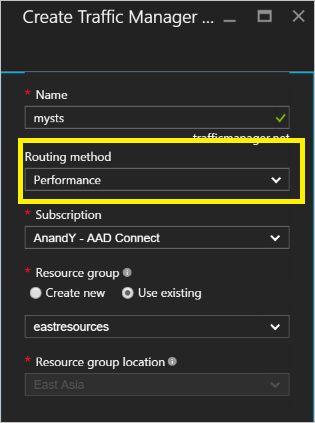
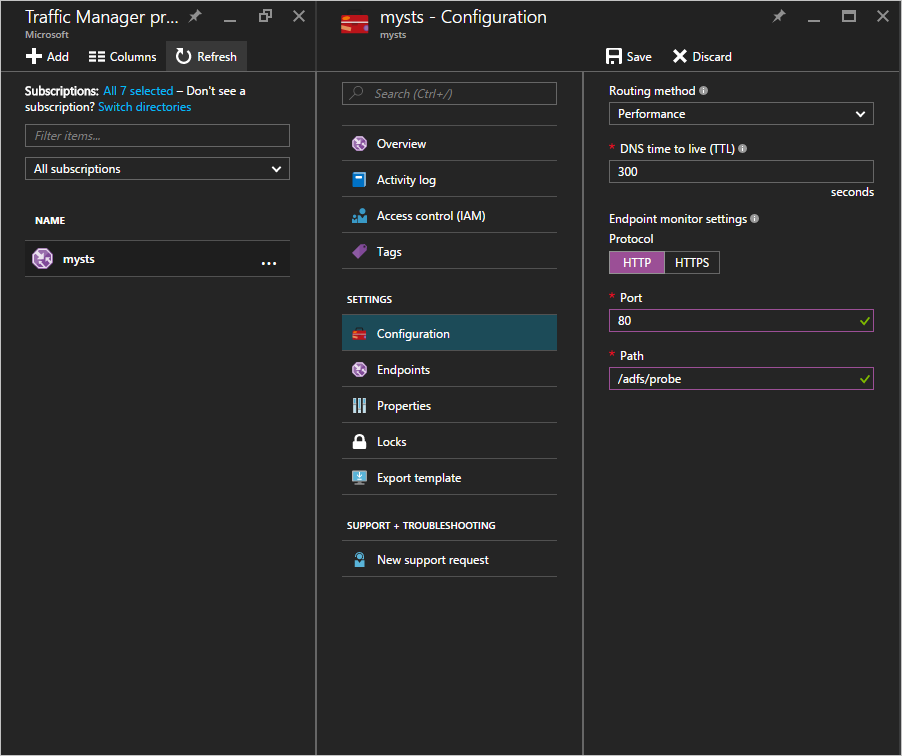

<properties
    pageTitle="Hohe Verfügbarkeit Cross geografischen AD FS-Bereitstellung in Azure mit Azure Datenverkehr Manager | Microsoft Azure"
    description="In diesem Dokument erfahren Sie, wie AD FS in Azure für hohen Verfügbarkeit bereitgestellt."
    keywords="AD fs mit Azure Datenverkehr-Manager und Adfs mit Azure Datenverkehr Manager geografischen, Multi Datacenter, geografische Rechenzentren, geografische Multi-Rechenzentren, AD FS in Azure bereitstellen, Azure Adfs, Azure Adfs, Azure Ad fs bereitstellen, Adfs bereitstellen, Bereitstellen von Ad fs, Adfs in Azure Adfs in Azure bereitstellen, Bereitstellen von AD FS in Azure, Adfs Azure, Einführung in AD FS, Azure, AD FS in Azure Iaas , ADFS, Adfs in Azure verschieben"
    services="active-directory"
    documentationCenter=""
    authors="anandyadavmsft"
    manager="femila"
    editor=""/>

<tags
    ms.service="active-directory"
    ms.workload="identity"
    ms.tgt_pltfrm="na"
    ms.devlang="na"
    ms.topic="get-started-article"
    ms.date="09/01/2016"
    ms.author="anandy;billmath"/>
    
#Hohe Verfügbarkeit Cross geografischen AD FS-Bereitstellung in Azure mit Azure Datenverkehr Manager

[AD FS-Bereitstellung in Azure](active-directory-aadconnect-azure-adfs.md) enthält schrittweise Richtlinie anderem Ort tätig, wie Sie eine einfache AD FS-Infrastruktur für Ihre Organisation in Azure bereitstellen können. Dieser Artikel enthält die nächsten Schritte zum Erstellen einer Kreuzes geografischen bereitstellungs von AD FS in Azure mit [Azure Datenverkehr-Manager](../traffic-manager/traffic-manager-overview.md). Azure Datenverkehr-Manager trägt dazu bei, indem Sie machen einen geografischen verteilt hohen Verfügbarkeit und leistungsstarke AD FS-Infrastruktur für Ihre Organisation erstellen verwenden des Bereichs der Weiterleitung Methoden für verschiedene Ansprüche aus der Infrastruktur verfügbar.

Eine Infrastruktur mit hoher verfügbare Cross geografischen AD FS aktiviert:

* **Beseitigung einzelne Aspekte des Fehlers:** Mit Failoverfunktionen von Azure Datenverkehr Manager können Sie eine AD FS-Infrastruktur mit hoher verfügbare erzielen, auch wenn eine der die Data Centers in einen Teil des Globus nach unten wechselt
* **Verbesserte Leistung:** Können die vorgeschlagenen Bereitstellung in diesem Artikel eine leistungsstarke AD FS-Infrastruktur bereitstellen, die Benutzer authentifiziert schneller helfen können. 

##Entwurfsgrundsätze

Die grundlegenden Entwurfsaufgaben Grundsätze werden dieselbe in Entwurfsprinzipien im Artikel AD FS-Bereitstellung in Azure aufgeführt. Das Diagramm oben zeigt eine einfache Erweiterung der grundlegenden Bereitstellung zu einem anderen geografische Region. Nachstehend sind einige Punkte, die die Bereitstellung für die neue geografische Region erweitern

* **Virtuellen Netzwerk:** Sie sollten ein neues virtuelles Netzwerk in die geografische Region erstellen, die Sie zusätzliche AD FS-Infrastruktur bereitstellen möchten. Im obigen Diagramm sehen Sie Geo1 VNET und Geo2 VNET als die beiden virtuelle Netzwerke in jeder geografische Region ein.

* **Domänencontroller und AD FS-Servern in neue geografische VNET:** Es wird empfohlen, Domäne bereitgestellt, die in die neue geografische Region Controller, damit die ADFS-Server in der neuen Region nicht unbedingt Domänencontroller in ein anderes weit wenden Sie sich an Netzwerk zum Abschließen einer Authentifizierung und damit auch die Leistung zu verbessern.

* **Speicher-Konten:** Speicherkonten stehen im Zusammenhang mit einem bestimmten Bereich. Da Sie in einer neuen geografische Region Maschinen bereitstellen möchten, müssen Sie zum Erstellen neuer Speicherkonten in der Region verwendet werden.  

* **Netzwerk Sicherheitsgruppen:** Wie Speicherkonten Netzwerk Sicherheitsgruppen erstellt in einem Bereich in einer anderen geografische Region verwendet werden können. Daher müssen Sie das neues Netzwerk Sicherheitsgruppen in die neue geografische Region ähnlich wie in der ersten geografische Region für INT und DMZ Subnetz erstellen.

* **DNS-Etiketten für öffentliche IP-Adressen:** Azure Datenverkehr Manager Endpunkte verweisen kann nur über die DNS-Etiketten. Daher müssen Sie DNS-Etiketten für den externen Lastenausgleich öffentlichen IP-Adressen zu erstellen.

* **Azure Datenverkehr Manager:** Microsoft Azure Datenverkehr-Manager können Sie die Verteilung der den Benutzerdatenverkehr in Ihrer Endpunkte ausgeführt in verschiedenen Rechenzentren auf der ganzen Welt steuern. Azure Datenverkehr Manager funktioniert Ebene der DNS-Einträge. DNS-Antworten verwendet, um die direkte Endbenutzer den Datenverkehr in Endpunkte Global verteilt. Clients schließen klicken Sie dann direkt an diese Endpunkte. Mit verschiedenen Optionen für Weiterleitung von Leistung, Weighted und Priorität können Sie einfach die routing-Option am besten geeignet für den Anforderungen Ihrer Organisation auswählen. 

* **V-Netz V-Netto Konnektivität zwischen zwei Bereiche:** Sie müssen nicht die Verbindungen zwischen virtuelle Netzwerke selbst haben. Da jede virtuelles Netzwerk verfügt über Zugriff auf die Domänencontroller und AD FS und WAP Server selbst hat, können sie ohne jede Verbindung zwischen der virtuelle Netzwerke in unterschiedlichen Regionen funktionieren. 

##Schritte zum Azure Datenverkehr Manager integriert werden soll.

###Bereitstellen von AD FS in die neue geografische region
Führen Sie die Schritte und Richtlinien in [AD FS-Bereitstellung in Azure](active-directory-aadconnect-azure-adfs.md) die gleichen Suchtopologie in die neue geografische Region bereitstellen.

###DNS-Etiketten für öffentliche IP-Adressen von den Lastenausgleich Internet gegenüberliegende (öffentlich)
Wie zuvor erwähnt, kann der Manager Azure Datenverkehr nur auf DNS-Etiketten als Endpunkte verweisen, und es ist wichtig, Erstellen von DNS-Etiketten für den externen Lastenausgleich öffentlichen IP-Adressen. Unter Screenshot zeigt, wie Sie Ihre DNS-Bezeichnung für die öffentliche IP-Adresse konfigurieren können. 

###Bereitstellen von Azure Datenverkehr-Manager

Führen Sie die Schritte zum Erstellen eines Profils der Datenverkehr-Manager. Weitere Informationen können Sie zum [Verwalten eines Profils Azure Datenverkehr Manager](../traffic-manager/traffic-manager-manage-profiles.md)verweisen.

1. **Erstellen eines Profils Datenverkehr Manager:** Geben Sie Ihr Profil der Datenverkehr-Manager einen eindeutigen Namen. Dieser Name des Profils ist Teil der DNS-Name und fungiert als Präfix für die Bezeichnung für den Datenverkehr Manager Domäne. Der Name / Präfix hinzugefügt wird. trafficmanager.net zum Erstellen der DNS-Bezeichnung für Ihre Datenverkehr Manager. Das Bildschirmabbild unten zeigt den Datenverkehr-Manager DNS-Präfix, die als Mysts festgelegt werden, und resultierende DNS-Kennung wird mysts.trafficmanager.net. 

    
 
2. **Datenverkehr routing Methode:** Drei routing-Optionen stehen zur Verfügung, in den Datenverkehr-Manager:

    * Priorität 
    * Leistung
    * Gewichteter
    
    **Leistung** ist die empfohlene Option hochgradig reagiert AD FS-Infrastruktur erzielen. Sie können jedoch alle routing Methode für Ihre Bereitstellung Anforderungen am besten geeignet ist. Die AD FS-Funktionalität ist von der Weiterleitung gewählten Option nicht betroffen. Weitere Informationen finden Sie unter [den Datenverkehr Manager Datenverkehr Weiterleitung Methoden](../traffic-manager/traffic-manager-routing-methods.md) . In der Stichprobe finden Sie unter Screenshot über Sie können die **Leistung** Methode ausgewählt.
   
3.  **Endpunkte konfigurieren:** In der Seite Datenverkehr Manager Endpunkte klicken Sie auf, und wählen Sie hinzufügen aus. Dadurch wird eine Seite der hinzufügen-Endpunkt ähnlich wie im folgenden Screenshot geöffnet.
 
    
 
    Führen Sie die folgenden Richtlinien für die unterschiedlichen Eingaben:

    **Typ:** Wählen Sie Azure-Endpunkt aus, wie wir eine Azure öffentlichen IP-Adresse zeigen wird.

    **Name:** Erstellen Sie einen Namen, den Sie den Endpunkt zuordnen möchten. Dies ist nicht der DNS-Name und hat keinen Einfluss auf die DNS-Einträge.

    **Adressieren Ressourcenart:** Wählen Sie öffentliche IP-Adresse als Wert dieser Eigenschaft aus. 

    **Ressource adressieren:** Dadurch erhalten Sie eine Option aus der anderen DNS-Etiketten auswählen, dass Ihnen unter Ihres Abonnements zur Verfügung stehen. Wählen Sie die DNS-Bezeichnung für aus.

    Fügen Sie Endpunkt für jede geografische Region gewünschten den Datenverkehr Azure-Manager, für die Weiterleitung Verkehr zu.
    Weitere Informationen und detaillierten Schritte zum Hinzufügen / Konfigurieren von Endpunkten in Datenverkehr Manager finden Sie unter Hinzufügen [,](../traffic-manager/traffic-manager-endpoints.md) um zu deaktivieren, aktivieren oder Löschen von Endpunkten
    
4. **Konfigurieren Prüfpunkt:** Klicken Sie in der Seite Datenverkehr Manager auf Konfiguration. Auf der Seite Konfiguration müssen Sie die am HTTP-Port 80 und relativen Pfad /adfs/probe Prüfpunkt Monitor Einstellungen ändern.

     

    >[AZURE.NOTE] **Stellen Sie sicher, dass der Status der Endpunkte ONLINE ist nach Abschluss die Konfiguration**. Wenn alle Endpunkte ' intakt ' sind, führen Azure Datenverkehr Manager einen optimale Versuch zum Weiterleiten von Datenverkehr Voraussetzung, dass die Diagnose ist falsch und alle Endpunkte erreichbar sind.

5. **Ändern von DNS-Einträge für Azure Datenverkehr Manager:** Der Dienst Föderation sollten CNAME auf den Namen der Azure Datenverkehr Manager DNS. Erstellen Sie einen CNAME in den öffentlichen DNS-Einträge, damit der Manager Azure Datenverkehr einzuladen den Dienst Föderation zu erreichen versucht tatsächlich erreicht werden.

    Beispielsweise die Föderation Dienst fs.fabidentity.com an den Datenverkehr-Manager verknüpft, müssen Sie zum Aktualisieren der DNS-Eintrag zum wie folgt aussehen:

    <code>fs.fabidentity.com IN CNAME mysts.trafficmanager.net</code>

##Testen der routing und AD FS-anmelden   

###Test-Routing

Ein sehr einfacher Test für das routing wäre versuchen, den Föderation Dienst DNS-Namen von einem Computer in jeder geografischen Region pingen. Abhängig von der gewählten routing Methode werden in der Anzeige Ping der Endpunkt, die, den Sie tatsächlich fragt, erkennbar. Angenommen, wenn Sie die Leistung routing ausgewählt haben, wird dann der Endpunkt am nächsten ist, den Bereich des Clients erreicht werden. Unter befindet sich die Momentaufnahme der zwei Pings aus zwei verschiedenen Region Clientcomputern, eine ostasiatische Region und eine in Westen USA. 

###AD FS Anmeldung testen

Die einfachste Möglichkeit zum Testen von AD FS wird mithilfe der Seite IdpInitiatedSignon.aspx. Um nicht ausführen, es ist erforderlich, um die IdpInitiatedSignOn auf den AD FS-Eigenschaften zu aktivieren. Gehen Sie zur Überprüfung Ihrer AD FS-setup
 
1. Führen Sie die unter Cmdlet auf dem ADFS-Server mithilfe der PowerShell, es zu aktiviert festlegen. Set-AdfsProperties - EnableIdPInitiatedSignonPage $true
2. Aus einer beliebigen externen Computer Access https://<yourfederationservicedns>/adfs/ls/IdpInitiatedSignon.aspx
3. Nun sollte die AD FS-Seite angezeigt wie unter:

    

    und auf dem erfolgreiche Anmeldung, es werden Ihnen eine Erfolgsmeldung wie unten dargestellt:

    
 
##Links zu verwandten Themen
* [Grundlegende in Azure AD FS-Bereitstellung](active-directory-aadconnect-azure-adfs.md)
* [Microsoft Azure Datenverkehr Manager](../traffic-manager/traffic-manager-overview.md)
* [Datenverkehr Manager Datenverkehr Weiterleitung Methoden](../traffic-manager/traffic-manager-routing-methods.md)

##Nächste Schritte
* [Verwalten eines Profils Azure Datenverkehr Manager](../traffic-manager/traffic-manager-manage-profiles.md)
* [Hinzufügen, deaktivieren, aktivieren oder Löschen von Endpunkten](../traffic-manager/traffic-manager-endpoints.md) 

