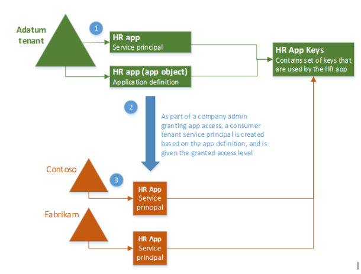

<properties
pageTitle="Azure-Active Directory-Anwendung und Dienst Tilgungsanteile Objekte | Microsoft Azure"
description="Eine Erläuterung der Beziehung zwischen Anwendung und Dienst wichtigsten Objekte in Azure Active Directory"
documentationCenter="dev-center-name"
authors="bryanla"
manager="mbaldwin"
services="active-directory"
editor=""/>

<tags
ms.service="active-directory"
ms.devlang="na"
ms.topic="article"
ms.tgt_pltfrm="na"
ms.workload="identity"
ms.date="08/10/2016"
ms.author="bryanla;mbaldwin"/>

# Anwendung und Dienst wichtigsten Objekte in Azure Active Directory
Wenn Sie über eine Azure Active Directory (AD) "Anwendung" gelesen haben, ist es nicht immer löschen genau wie vom Autor Bezug genommen wird. Das Ziel dieses Artikels ist, übersichtlicher, wird die konzeptionelle und Beton Aspekte der Azure AD-Anwendungsintegration mit ein Beispiel für die Registrierung und Zustimmung für eine [Anwendung mit mehreren Mandanten](active-directory-dev-glossary.md#multi-tenant-application)definieren.

## (Übersicht)
Eine Azure AD-Anwendung ist breitere als nur ein Werk der Software. Es ist eine konzeptionelle Begriff nicht nur für alle Anwendungssoftware, sondern auch seine Registrierung (QuickInfos: Identität Konfiguration) mit Azure AD, wodurch sie zur Teilnahme an Authentifizierung und Autorisierung "Unterhaltungen" zur Laufzeit. Durch die Definition kann eine Anwendung in einer [Client](active-directory-dev-glossary.md#client-application) -Rolle (Verarbeitung einer Ressource), einer [Ressourcenserver](active-directory-dev-glossary.md#resource-server) Rolle (verfügbar machen von APIs mit Clients) oder sogar beides fungieren. Das Protokoll Unterhaltung wird durch ein [Fluss OAuth 2.0 Autorisierung erteilen](active-directory-dev-glossary.md#authorization-grant), mit dem Ziel Client/Ressource wird für Access/einer Ressource Hilfethemas Datenschutz definiert. Jetzt sehen wir einen Ebene tiefer, und sehen, wie das Modell Azure AD-Anwendung Anwendung intern darstellt. 

## Registrierung Anwendung
Wenn Sie eine Anwendung im [Azure klassischen Portal]registrieren[AZURE-Classic-Portal], zwei Objekte in Ihrem Azure AD-Mandanten erstellt werden: ein Objekt Application und ein Hauptbenutzer Service-Objekt.

#### Application-Objekt
Azure AD-Anwendung wird nach deren eine *definiert* und nur Application-Objekt, die sich in den Azure AD-Mandanten befindet, in dem die Anwendung registriert wurde, als "Privat" Mandanten der Anwendung bezeichnet. Das Application-Objekt enthält Informationen für eine Anwendung, und die Vorlage aus dem zugehörigen entsprechenden Dienst wichtigsten Objekte sind für die Verwendung zur Laufzeit *abgeleitet* wird. 

Sie können die Anwendung als *globale* Darstellung der Anwendung (zur Verwendung für alle Mandanten), und der Dienst Tilgungsanteile als *lokale* Darstellung (zur Verwendung in einem bestimmten Mandanten) vorstellen. Die Azure AD Graph- [Anwendung Entität] [ AAD-Graph-App-Entity] definiert das Schema für ein Application-Objekt. Anwendungsobjekt daher weist eine 1:1-Beziehung mit der Software-Anwendung, und eine 1:*n* -Beziehung mit den entsprechenden *n* Dienst wichtigsten Objekte.

#### Hauptbenutzer Service-Objekt
Das wichtigsten Service-Objekt definiert die Richtlinie und die Berechtigungen für eine Anwendung, die die Grundlage für eine Sicherheit Tilgungsanteile zur Darstellung der Anwendung beim Zugriff auf Ressourcen zur Laufzeit bereitstellen. Die Azure AD Graph [ServicePrincipal Entität] [ AAD-Graph-Sp-Entity] definiert das Schema für ein Hauptbenutzer Service-Objekt. 

Für die eine Instanz der Verwendung der Anwendung muss sicheren Zugriff auf Ressourcen, die im Besitz von Benutzerkonten von diesem Mandanten aktivieren dargestellt werden, ein Hauptbenutzer Service-Objekt in jeder Mandanten benötigt. Eine einzelne-Mandanten Anwendung kann nur einen Dienst Tilgungsanteile (in deren Start Mandant) sind. Ein mit mehreren Mandanten [Webanwendung](active-directory-dev-glossary.md#web-client) ist ebenfalls ein Dienst Tilgungsanteile in jeder Mandanten festgelegt Wenn ein Administrator oder Benutzer von diesem Mandanten Zustimmung, gemacht haben sie Zugriff auf ihre Ressourcen gleicht. Folgenden Zustimmung werden das wichtigsten Dienstobjekt für zukünftige Autorisierungsanfragen anzuhören. 

> [AZURE.NOTE] Änderungen, die Sie an Ihrer Anwendungsobjekt, sind auch erscheinen, deren wichtigsten Service-Objekt in der Anwendung Start Mandanten nur (den Mandanten, wo es registriert wurde). Für Applikationen mit mehreren Mandanten werden erst nach der Mandanten Consumer Access entfernt und erneut Zugriff gewährt Änderungen an der Anwendungsobjekt in alle Consumer Mandanten Dienst wichtigsten Objekte nicht widergespiegelt.

## Beispiel
Das folgende Diagramm veranschaulicht die Beziehung zwischen einer Anwendungs Application-Objekt und den entsprechenden service wichtigsten Objekte im Kontext einer Stichprobe mit mehreren Mandanten Anwendung **HR app**bezeichnet. Es gibt drei Azure AD-Mandanten in diesem Szenario: 

- **Adatum** - den Mandanten vom Unternehmen, das die **HR app** entwickelt verwendet
- **Contoso** - den Mandanten, von der Contoso-Organisation, also ein Consumer der **HR app** verwendet
- **Fabrikam** - den Mandanten untersuchten Fabrikam Organisation, bei die auch die **HR app** verbraucht

In der vorherigen Abbildung ist Schritt 1 die Vorgehensweise zum Erstellen der Anwendung und die wichtigsten Service-Objekte in der Anwendung Start Mandanten.

Klicken Sie unter Schritt2 bei Contoso und Fabrikam Administratoren Zustimmung, führen Sie ein Dienst Hauptbenutzer Objekt erstellt in Azure AD-Mandanten ihres Unternehmens und zugewiesen die Berechtigungen, die der Administrator erteilt. Beachten Sie auch, dass die app HR konfiguriert/entworfen konnte werden Zustimmung dürfen von Benutzern für einzelne verwenden.

In Schritt 3 müssen die Consumer Mandanten der HR-Anwendung (Contoso und Fabrikam) jedes eigene Hauptbenutzer Service-Objekt. Jede steht, die die Verwendung einer Instanz der Anwendung zur Laufzeit, die Berechtigungen unterliegt zugestimmt vom jeweiligen Administrator.

## Nächste Schritte
Die Anwendung Anwendungsobjekt kann über die Azure AD Graph-API, zugegriffen werden, dargestellt durch den OData- [Anwendung Entität][AAD-Graph-App-Entity]

Die dienstanwendung Hauptbenutzer Objekt kann über die Azure AD Graph-API, zugegriffen werden, dargestellt durch den OData- [ServicePrincipal Entität][AAD-Graph-Sp-Entity]

<!--Image references-->

<!--Reference style links -->
[AAD-Graph-App-Entity]: https://msdn.microsoft.com/Library/Azure/Ad/Graph/api/entity-and-complex-type-reference#application-entity
[AAD-Graph-Sp-Entity]: https://msdn.microsoft.com/Library/Azure/Ad/Graph/api/entity-and-complex-type-reference#serviceprincipal-entity
[AZURE-Classic-Portal]: https://manage.windowsazure.com