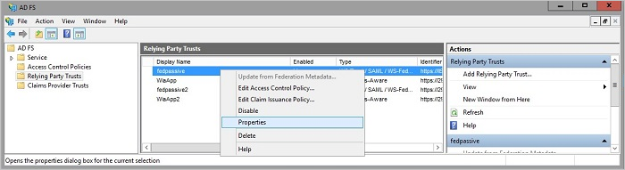

<properties
    pageTitle="Arbeiten mit Ansprüchen bei beachten Apps in Anwendungsproxy"
    description="Erläutert, wie Einstieg und die Verwendung mit Azure AD-Anwendungsproxy zu erzielen."
    services="active-directory"
    documentationCenter=""
    authors="kgremban"
    manager="femila"
    editor=""/>

<tags
    ms.service="active-directory"
    ms.workload="identity"
    ms.tgt_pltfrm="na"
    ms.devlang="na"
    ms.topic="article"
    ms.date="06/22/2016"
    ms.author="kgremban"/>

# Arbeiten mit Ansprüchen bei beachten apps im Proxy-Anwendung

Ansprüche bewusst apps, sondern eine Umleitung zu der Sicherheit Token Service (STS), die wiederum Anmeldeinformationen vom Benutzer gegen ein Token anfordert, vor dem Umleiten des Benutzers zur Anwendung. Um Anwendungsproxy für die Arbeit mit diesen leitet aktivieren zu können, müssen die folgenden Schritte absolviert werden.

## Erforderliche Komponenten
Sicherstellen Sie bevor Sie dieses Verfahren durchführen, dass der STS leitet die Ansprüche bewusst app zu außerhalb des lokalen Netzwerks verfügbar ist.

## Azure klassischen Portal Konfiguration

1. Veröffentlichen Sie die Anwendung gemäß den Anweisungen in [Clientanwendungen veröffentlichen, mit der Anwendungsproxy](active-directory-application-proxy-publish.md)beschrieben.
2. Wählen Sie in der Liste der Anwendungen die Ansprüche bewusst app aus, und klicken Sie auf **Konfigurieren**.
3. Wenn Sie Ihre **Präauthentifizierung Methode** **Pass-Through-** ausgewählt haben, stellen Sie sicher, um **HTTPS** als Ihre **Externe URL** des Farbschemas auswählen.
4. Wenn Sie Ihre **Präauthentifizierung Methode** **Azure Active Directory** ausgewählt haben, wählen Sie **keine** als Ihre **Internen Authentifizierungsmethode**.

## ADFS-Konfiguration

1. Öffnen Sie die ADFS-Verwaltung.
2. Wechseln Sie zu **Verlassen vertrauen**, klicken Sie mit der rechten Maustaste auf die app, die Sie mit der Anwendungsproxy veröffentlichen, die und wählen Sie **Eigenschaften**aus.  
    
3. Wählen Sie auf der Registerkarte **Endpunkte** klicken Sie unter **Typ Endpunkt** **WS-Verbund**aus.
4. Geben Sie unter **Vertrauenswürdige URL** die URL, die Sie in der Anwendungsproxy unter **Externe URL** eingegeben haben, und klicken Sie auf **OK**.  
    

## Siehe auch

- [Veröffentlichen von Applications mit Proxy-Anwendung](active-directory-application-proxy-publish.md)
- [Aktivieren Sie auf einmalige Anmelden](active-directory-application-proxy-sso-using-kcd.md)
- [Behandeln von Problemen, die Sie mit der Anwendungsproxy haben](active-directory-application-proxy-troubleshoot.md)
- [Aktivieren Sie native Client apps Interaktion mit Proxyanwendungen](active-directory-application-proxy-native-client.md)

Sehen Sie für die neuesten Informationen und Updates sich die [Anwendungsproxy-blog](http://blogs.technet.com/b/applicationproxyblog/)
