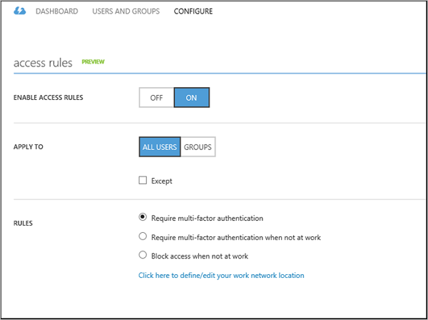

<properties
    pageTitle="Bedingte Zugriff für Applikationen mit Azure AD-Anwendungsproxy veröffentlicht"
    description="Erläutert, wie bedingte Zugriffsrechte für Applikationen einrichten, die Sie veröffentlichen, um per Remotezugriff mit Azure AD-Anwendungsproxy zugegriffen werden."
    services="active-directory"
    documentationCenter=""
    authors="kgremban"
    manager="femila"
    editor=""/>

<tags
    ms.service="active-directory"
    ms.workload="identity"
    ms.tgt_pltfrm="na"
    ms.devlang="na"
    ms.topic="article"
    ms.date="06/22/2016"
    ms.author="kgremban"/>

# Arbeiten mit bedingten Zugriff

Sie können festlegen, um den bedingten Zugriff auf Applikationen mithilfe der Anwendungsproxy veröffentlicht gewähren konfigurieren. So können Sie:

- Verlangen der kombinierte Authentifizierung pro Anwendung
- Mehrstufige Authentifizierung erforderlich, nur, wenn Benutzer nicht im Büro sind.
- Verhindern Sie, dass Benutzer auf die Anwendung zugreifen, wenn sie nicht im Büro sind

Diese Regeln können für alle Benutzer und Gruppen oder nur für bestimmte Benutzer und Gruppen angewendet werden. Standardmäßig wird die Regel für alle Benutzer anwenden, die auf die Anwendung zugreifen. Die Regel kann jedoch auch auf Benutzer beschränkt werden, die Mitglieder der angegebenen Sicherheitsgruppen sind.  

Access-Regeln werden ausgewertet, wenn ein Benutzer eine partnerverbundkontakte Anwendung greift auf, die OAuth 2.0, OpenID verbinden, SAML oder WS-Verbund verwendet. Darüber hinaus werden Access Regeln mit OAuth 2.0, und verbinden Sie OpenID ausgewertet, wenn ein Token aktualisieren, erhalten eine Access-Token verwendet wird.

## Bedingte Access erforderliche Komponenten

- Azure-Active Directory-Premium-Abonnement
- Eine partnerverbundkontakte oder verwalteten Azure Active Directory-Mandanten
- Partnerverbundkontakte Mandanten erfordern die kombinierte Authentifizierung (MFA) aktiviert werden  
    

## Konfigurieren Sie die kombinierte Authentifizierung pro Anwendung
1. Melden Sie sich als Administrator im klassischen Azure-Portal aus.
2. Wechseln Sie zu Active Directory, und wählen Sie das Verzeichnis, in dem Sie die Anwendungsproxy aktivieren möchten.
3. Klicken Sie auf **Anwendungen** und führen Sie einen Bildlauf nach unten bis zum Abschnitt **Access Regeln** . Im Abschnitt Zugriff Regeln wird nur für Applikationen veröffentlicht mit Proxy-Anwendung, die partnerverbundkontakte Authentifizierung verwenden angezeigt.
4. Aktivieren Sie die Regel, indem Sie die **Access-Regeln aktivieren** , **Klicken Sie auf**auswählen.
5. Geben Sie die Benutzer und Gruppen, die die Regeln angewendet werden. Verwenden Sie die Schaltfläche **Gruppe hinzufügen** , um eine oder mehrere Gruppen auszuwählen, die die Regel gelten soll. Mithilfe dieses Dialogfelds kann auch zum Entfernen der ausgewählter Gruppen verwendet werden.  Wenn die Regeln auf Gruppen anwenden ausgewählt ist, werden die Access-Regeln nur für Benutzer, die einem angegebenen Sicherheitsgruppen gehören erzwungen.  

  - Um die Regel explizit Sicherheitsgruppen ausschließen, **außer** überprüfen Sie, und geben Sie eine oder mehrere Gruppen. Benutzer, die Mitglieder einer Gruppe in der Liste mit Ausnahme sind nicht müssen kombinierte Authentifizierung ausführen.  

  - Wenn ein Benutzer mit dem pro Benutzer kombinierte Authentifizierungsfeature konfiguriert wurde, wird diese Einstellung die Anwendung kombinierte Authentifizierungsregeln Vorrang. Dies bedeutet, dass ein Benutzer, der für die kombinierte Benutzerauthentifizierung konfiguriert wurde für kombinierte Authentifizierung erforderlich, auch wenn der Anwendung kombinierte Authentifizierungsregeln ausgenommen wurden. Weitere Informationen zu [kombinierte Authentifizierung und Einzelbenutzer - Einstellungen](../multi-factor-authentication/multi-factor-authentication.md).

6. Wählen Sie die Regel, die Sie festlegen möchten:
    - **Mehrstufige erfordern Authentifizierung**: wem Access Regeln anwenden Benutzer abgeschlossen kombinierte Authentifizierung vor dem Zugriff auf die Anwendung die Regel gilt erforderlich.
    - **Kombinierte erfordern Authentifizierung nicht am Arbeitsplatz**: Benutzer versuchen, den Zugriff auf die Anwendung von einer vertrauenswürdigen IP-Adresse werden nicht ausführen mehrstufige Authentifizierung erforderlich werden. Klicken Sie auf der Einstellungsseite kombinierte Authentifizierung können die vertrauenswürdigen IP-Adressbereiche konfiguriert werden.
    - **Blockieren von Access nicht am Arbeitsplatz**: Benutzer versuchen, den Zugriff auf die Anwendung von außerhalb Ihres Unternehmensnetzwerks Zugriff auf die Anwendung nicht möglich.

## Konfigurieren von MFA für Federation services
Partnerverbundkontakte Mandanten, kann kombinierte Authentifizierung (MFA) durch Azure Active Directory oder durch die lokale durchgeführt werden AD FS-Server. Standardmäßig treten MFA auf einer beliebigen Seite von Azure Active Directory gehostet wird. Die Konfiguration MFA lokalen Windows PowerShell ausgeführt und mithilfe der Eigenschaft SupportsMFA – das Modul Azure AD-einzurichten.

Im folgenden Beispiel wird gezeigt, wie lokale MFA mithilfe von das [Cmdlet "Set-MsolDomainFederationSettings"](https://msdn.microsoft.com/library/azure/dn194088.aspx) auf den Mandanten "contoso.com" zu aktivieren:`Set-MsolDomainFederationSettings -DomainName contoso.com -SupportsMFA $true `

Zusätzlich zum Festlegen dieser Kennzeichnung, muss die partnerverbundkontakte Mandanten AD FS-Instanz für die Durchführung kombinierte Authentifizierung konfiguriert werden. Folgen Sie den Anweisungen für die [Bereitstellung von Microsoft Azure kombinierte Authentifizierung lokalen](../multi-factor-authentication/multi-factor-authentication-get-started-server.md).

## Siehe auch

- [Arbeiten mit Ansprüche bewusst Applikationen](active-directory-application-proxy-claims-aware-apps.md)
- [Veröffentlichen von Applications mit Proxy-Anwendung](active-directory-application-proxy-publish.md)
- [Aktivieren Sie auf einmalige Anmelden](active-directory-application-proxy-sso-using-kcd.md)
- [Veröffentlichen von Applications, die Ihren eigenen Domänennamen verwenden](active-directory-application-proxy-custom-domains.md)

Sehen Sie für die neuesten Informationen und Updates sich die [Anwendungsproxy-blog](http://blogs.technet.com/b/applicationproxyblog/)
