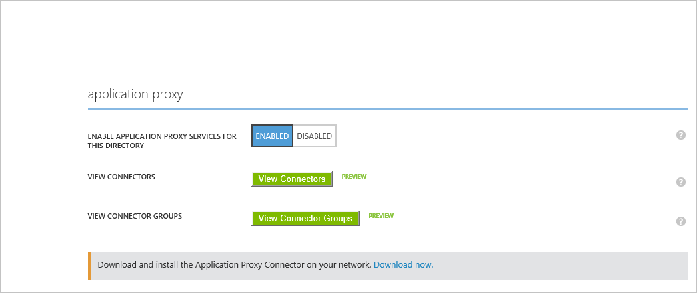
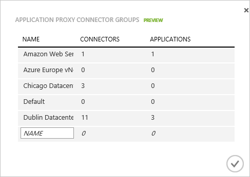
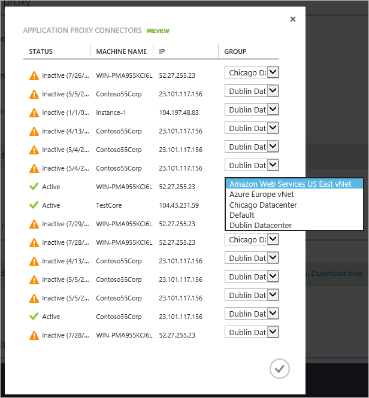

<properties
    pageTitle="Arbeiten mit Azure AD-Anwendungsproxy Verbinder | Microsoft Azure"
    description="Erläutert, wie der Verbinder in Azure AD-Anwendungsproxy Gruppen erstellen und verwalten."
    services="active-directory"
    documentationCenter=""
    authors="kgremban"
    manager="femila"
    editor=""/>

<tags
    ms.service="active-directory"
    ms.workload="identity"
    ms.tgt_pltfrm="na"
    ms.devlang="na"
    ms.topic="article"
    ms.date="09/09/2016"
    ms.author="kgremban"/>

# Veröffentlichen von Applications in separaten Netzwerken und Orte Entwurfsphase Verbinder

> [AZURE.SELECTOR]
- [Azure-portal](active-directory-application-proxy-connectors-azure-portal.md)
- [Azure klassischen-portal](active-directory-application-proxy-connectors.md)

Verbinder Gruppen sind nützlich für verschiedene Szenarios, einschließlich:

- Websites mit mehreren verbundener Rechenzentren. In diesem Fall möchten Sie soviel Datenverkehr innerhalb des Datencenters wie möglich beibehalten, da Cross-Datacenter Links in der Regel teure und welche langsam sind. Sie können in jedem Datencenter, um nur die Programme, die innerhalb der Datacenter befinden, dienen Verbinder bereitstellen. Dieser Ansatz minimiert Cross-Datacenter Links und bietet eine vollständig transparent für Ihre Benutzer.
- Verwalten von Applications auf isoliert Netzwerke, die nicht Bestandteil der Hauptfenster Unternehmensnetzwerk sind installiert. Connector-Gruppen können Sie um dedizierte Verbinder auf isoliert Netzwerke auch Isolieren von Applications mit dem Netzwerk zu installieren.
- Für Applikationen auf IaaS cloudzugriff installiert bieten Verbinder Gruppen einen allgemeinen Dienst, um den Zugriff auf die Datei apps zu sichern. Verbinder Gruppen nicht zusätzliche Abhängigkeit in Ihrem Netzwerk Ihres Unternehmens erstellen oder die app-Oberfläche fragment. Verbinder auf jeder Cloud Datacenter installiert werden können und dienen nur die Programme, die in diesem Netzwerk befinden. Sie können mehrere Verbinder, um hohe Verfügbarkeit zu erreichen installieren.
- Unterstützung für Umgebungen mit mehreren Gesamtstrukturen, in denen bestimmte Verbinder pro Gesamtstruktur bereitgestellt und zu bestimmte Applikationen dienen festgelegt werden können.
- Verbinder Gruppen können in Wiederherstellung Websites entweder Failover erkennen oder als Sicherung für die wichtigsten Website verwendet werden.
- Verbinder Gruppen können auch verwendet werden, um mehrere Unternehmen von einem einzelnen Mandanten dienen.

## Voraussetzung: Erstellen der Verbinder
Um Ihre Verbinder zu gruppieren, stellen Sie sicher, dass Ihnen [mehrere Connectors installiert](active-directory-application-proxy-enable.md), und Sie Namen haben, und gruppieren Sie sie. Schließlich müssen Sie diese bestimmte apps zuweisen.

## Schritt 1: Erstellen von Gruppen für Verbinder
Sie können beliebig viele Verbinder-Gruppen erstellen. Erstellung der Verbinder wird in der klassischen Azure-Portal erreicht.

1. Wählen Sie das Verzeichnis aus, und klicken Sie auf **Konfigurieren**.  
    

2. Klicken Sie unter Proxy-Anwendung klicken Sie auf **Verbinder Gruppen verwalten** , und erstellen Sie eine neue Verbinder Gruppe, indem Sie der Gruppe einen Namen zuweisen.  
    

## Schritt 2: Zuordnen von Verbindern zu Ihren Gruppen
Sobald die Connector-Gruppen erstellt wurden, verschieben Sie die Verbinder in die entsprechende Gruppe aus.

1. Klicken Sie unter **Anwendungsproxy**klicken Sie auf **Verbinder verwalten**.
2. Wählen Sie unter **Gruppe**die Gruppe aus, die für jeden Verbinder aus. Es kann die Verbinder in der Gruppe neu aktiv, bis zu 10 Minuten dauern.  
    

## Schritt 3: Zuweisen von Applications zu Ihren Connector-Gruppen
Der letzte Schritt darin, wird jede Anwendung zur Gruppe "Verbinder" festlegen, die es dient.

1. Wählen Sie die Azure klassischen Portal in Ihrem Verzeichnis die Anwendung, die Sie in der Gruppe zuweisen, und klicken Sie auf **Konfigurieren**möchten.
2. Wählen Sie unter **Verbinder Gruppe**der Gruppe der Anwendung verwendet werden soll. Diese Änderung wird sofort angewendet.  
    

## Siehe auch

- [Aktivieren Sie die Anwendungsproxy](active-directory-application-proxy-enable.md)
- [Aktivieren Sie auf einmalige Anmelden](active-directory-application-proxy-sso-using-kcd.md)
- [Aktivieren von bedingten Zugriff](active-directory-application-proxy-conditional-access.md)
- [Behandeln von Problemen, die mit der Anwendungsproxy](active-directory-application-proxy-troubleshoot.md)

Sehen Sie für die neuesten Informationen und Updates sich die [Anwendungsproxy-blog](http://blogs.technet.com/b/applicationproxyblog/)
