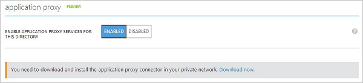
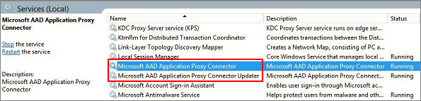

<properties
    pageTitle="Aktivieren Sie die Anwendungsproxy Azure AD-| Microsoft Azure"
    description="In der klassischen Azure-Portal Anwendungsproxy aktivieren Sie, und installieren Sie die Verbinder für den reverse Proxy."
    services="active-directory"
    documentationCenter=""
    authors="kgremban"
    manager="femila"
    editor=""/>

<tags
    ms.service="active-directory"
    ms.workload="identity"
    ms.tgt_pltfrm="na"
    ms.devlang="na"
    ms.topic="get-started-article"
    ms.date="07/19/2016"
    ms.author="kgremban"/>

# Aktivieren der Anwendungsproxy Azure-Portal

In diesem Artikel führt Sie durch die Schritte zum Microsoft Azure AD-Anwendungsproxy für Ihr Cloud-Verzeichnis in Azure AD aktivieren.

Wenn Sie nicht vertraut sind, mit welcher Anwendungsproxy befinden helfen Ihnen führen, erfahren Sie mehr über die [zum Bereitstellen von sicheren Remotezugriff auf lokale Applications](active-directory-application-proxy-get-started.md).

## Anwendung Proxy erforderliche Komponenten
Bevor Sie aktivieren und Anwendungsproxy-Dienste verwenden können, müssen Sie haben:

- Ein [Microsoft Azure AD grundlegende oder Premium-Abonnement](active-directory-editions.md) und einem Azure AD-Verzeichnis für die Sie als globaler Administrator angemeldet sind.
- Einem Server mit Windows Server 2012 R2 oder Windows 8.1 oder höher, auf dem Sie die Anwendung Proxy-Connector installieren können. Der Server sendet Anfragen an die Anwendungsproxy-Dienste in der Cloud, und es benötigt einer HTTP- oder HTTPS-Verbindungs zu der Anwendung, die Sie veröffentlichen.

    - Für einmaliges Anmelden den veröffentlichten Clientanwendungen sollten diesem Computer in der gleichen AD-Domäne als die Anwendungen Domäne sein, die Sie veröffentlichen.

- Wenn eine Firewall in den Pfad vorhanden ist, stellen Sie sicher, dass er geöffnet ist, dass der Verbinder HTTPS (TCP) Anfragen an den Proxy-Anwendung vornehmen kann. Der Verbinder verwendet diese Ports zusammen mit Unterdomänen, die Teil der Domänen auf hoher Ebene msappproxy.net und servicebus.windows.net sind. Vergewissern Sie sich, um die folgenden Ports auf **ausgehenden** Datenverkehr zu öffnen:

  	| Port-Nummer | Beschreibung |
  	| --- | --- |
  	| 80 | Aktivieren Sie ausgehenden HTTP-Verkehr für die Gültigkeit der Sicherheit. |
  	| 443 | Aktivieren Sie Benutzerauthentifizierung anhand von Azure AD-(nur für den Prozess der Connector-Registrierung erforderlich) |
  	| 10100 – 10120 | LOB gesendete HTTP-Antworten an den Proxy wieder aktivieren |
  	| 9352, 5671 | Aktivieren der Kommunikation zwischen den Verbinder in Richtung der Azure Service für eingehenden Anfragen. |
  	| 9350 | Optional, um eine bessere Leistung bei eingehenden Anfragen zu aktivieren. |
  	| 8080 | Aktivieren Sie der Verbinder bootstrap Sequenz und Verbinder automatische Aktualisierung |
  	| 9090 | Aktivieren Sie Verbinder Registrierung (nur für den Prozess der Connector-Registrierung erforderlich) |
  	| 9091 | Aktivieren Sie Verbinder Trust Zertifikat automatische Erneuerung |

    Wenn Ihre Firewall Datenverkehr entsprechend mit Ursprung Benutzer erzwingt, öffnen Sie diese Ports für den Datenverkehr aus der Windows-Dienste, die als Netzwerkdienst ausgeführt. Stellen Sie außerdem sicher, dass Anschluss 8080 für Systemkonto: aktiviert.

- Wenn Ihre Organisation Proxy-Servern verwendet, um mit dem Internet verbinden, sehen Sie sich bitte an den Blogbeitrag [Arbeiten mit vorhandenen lokalen Proxy-Servern](https://blogs.technet.microsoft.com/applicationproxyblog/2016/03/07/working-with-existing-on-prem-proxy-servers-configuration-considerations-for-your-connectors/) Details erfahren Sie, wie sie konfigurieren.

## Schritt 1: Aktivieren der Anwendungsproxy in Azure Active Directory
1. Melden Sie sich als Administrator im [Azure klassischen Portal](https://manage.windowsazure.com/)aus.
2. Wechseln Sie zu Active Directory, und wählen Sie das Verzeichnis, in dem Sie die Anwendungsproxy aktivieren möchten.

    

3. Wählen Sie auf der Seite Verzeichnis **Konfigurieren** aus, und führen Sie einen Bildlauf nach unten bis zum **Anwendungsproxy**.
4. Umschaltfläche **Proxy Anwendungsdienste für dieses Verzeichnis aktivieren** **aktiviert**.

    

5. Wählen Sie **jetzt herunterladen**. Dadurch gelangen Sie die **Azure AD Anwendung Proxy Verbinder herunterladen**. Lesen die Lizenzbedingungen akzeptieren, und klicken Sie auf **herunterladen** , um die Windows Installer-Datei (.exe) für den Verbinder zu speichern.

## Schritt 2: Installieren und Registrieren des Verbinders
1. Führen Sie auf dem Server, die, den Sie nach der erforderlichen Komponenten vorbereitet, **AADApplicationProxyConnectorInstaller.exe** .
2. Folgen Sie den Anweisungen im Assistenten zum Installieren.
3. Während der Installation Sie werden aufgefordert, den Verbinder mit der Anwendungsproxy Ihre Azure AD-Mandanten registriert werden.

  - Geben Sie Ihre Anmeldeinformationen ein globaler Administrator Azure AD-. Ihrem Mandanten globaler Administrator möglicherweise Ihre Anmeldeinformationen ein Microsoft Azure abweicht.
  - Stellen Sie sicher, dass der Administrator, der sich den Verbinder registriert im selben Verzeichnis ist, in dem Sie den Anwendungsproxy-Dienst aktiviert. Angenommen, wenn die Mandant Domäne "contoso.com" ist, der Administrator sollten admin@contoso.com oder andere Aliasnamen in dieser Domäne.
  - Wenn **IE Erweiterte Sicherheitskonfiguration** , **Klicken Sie auf** auf dem Server festgelegt wurde, auf dem Sie den Verbinder installieren, kann der Bildschirm zur Registrierung blockiert wird. Folgen Sie den Anweisungen in der Fehlermeldung, zugreifen dürfen. Stellen Sie sicher, dass Internet Explorer Enhanced Security deaktiviert ist.
  - Wenn Verbinder Registrierung nicht erfolgreich ist, finden Sie unter [Problembehandlung bei Anwendungsproxy](active-directory-application-proxy-troubleshoot.md).  

4. Klicken Sie nach Abschluss die Installation werden zwei neue Dienste auf dem Server hinzugefügt:

    - **Microsoft AAD Anwendung Proxy-Connector** aktiviert die Verbindung
    - **Microsoft AAD Anwendung Proxy Verbinder Updater** ist eine automatisierte Update-Dienst, der regelmäßig sucht nach neuen Versionen des Verbinders und den Verbinder aktualisiert bei Bedarf an.

    

5. Klicken Sie auf **Fertig stellen** , in das Installationsfenster.

Aus Gründen der hohen Verfügbarkeit sollten Sie mindestens zwei Verbinder bereitstellen. Um weitere Connectors bereitstellen möchten, wiederholen Sie die Schritte 2 und 3, über. Jeder Connector muss separat registriert sein.

Wenn Sie den Verbinder deinstallieren möchten, deinstallieren Sie den Connector-Dienst und den Updater-Dienst. Starten Sie Ihren Computer, um den Dienst zu entfernen.

## Nächste Schritte

Sie können nun zum [Veröffentlichen von Applications mit Anwendungsproxy](active-directory-application-proxy-publish.md).

Wenn Sie Applikationen, die in separaten Netzwerken oder unterschiedlichen Standorten sind verfügen, können Sie Verbinder Gruppen zum Organisieren von den verschiedenen Connectors in logischen Einheiten verwenden. Weitere Informationen zum [Arbeiten mit der Anwendungsproxy-Verbinder](active-directory-application-proxy-connectors.md).
