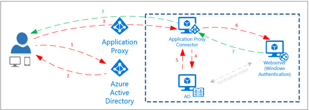

<properties
    pageTitle="So sicheren Remotezugriff auf lokale apps bereitstellen"
    description="Erläutert, wie mit Azure AD-Anwendungsproxy sicheren Remotezugriff auf Ihrem lokalen apps bereitstellen."
    services="active-directory"
    documentationCenter=""
    authors="kgremban"
    manager="femila"
    editor=""/>

<tags
    ms.service="active-directory"
    ms.workload="identity"
    ms.tgt_pltfrm="na"
    ms.devlang="na"
    ms.topic="article"
    ms.date="08/25/2016"
    ms.author="kgremban"/>

# Wie sicheren Remotezugriff auf lokale Anwendungen bereitgestellt.

> [AZURE.NOTE] Anwendungsproxy ist ein Feature, das ist nur verfügbar, wenn Sie auf die Premium oder Basisversion von Azure Active Directory aktualisiert haben. Weitere Informationen finden Sie unter [Azure Active Directory-Editionen](active-directory-editions.md).

Mitarbeiter möchten heute produktiv an einer beliebigen Stelle, zu einem beliebigen Zeitpunkt und von jedem Gerät aus. Diese auf ihren eigenen Geräten, arbeiten möchten, ob diese Laptops, Mobiltelefonen oder Tablets sein. Und sie nicht vorhaben, alle Webanwendungen, beide SaaS apps in der Cloud und corporate apps lokal zugreifen können. Bereitstellung des Zugriffs auf lokale Applikationen weist normalerweise beteiligen virtuelle private Netzwerke (VPN), demilitarisierte Zonen (DMZ), oder lokal reverse Proxys. Nicht nur diese Lösungen sind, komplex und schwierig zu sicher gestalten, sie sind aber teure zum Einrichten und verwalten.

Es gibt eine bessere Möglichkeit!

Eine moderne Mitarbeiter in das Mobile-erste, benötigt Cloud-First Welt eine moderne RAS-Lösung. Azure AD-Anwendungsproxy ist ein Feature des Angebots Azure Active Directory Premium und RAS als Dienst bietet. Das heißt, es ist einfach bereitzustellen, zu verwenden und zu verwalten.

## Was ist Azure Active Directory-Anwendungsproxy?
Azure AD-Anwendungsproxy bietet einmaliges Anmelden (SSO) und sicheren Remotezugriff für Webanwendungen gehostet lokalen. Dies kann umfassen SharePoint-Websites, Outlook Web Access oder einer beliebigen anderen LOB Webanwendungen, die Sie installiert haben. Diese lokalen Webanwendungen sind integriert mit Azure AD, die gleiche Identität und Steuerelement-Plattform, die von Office 365 verwendet wird. Endbenutzer können dann zugreifen Ihrer lokalen Applikationen die gleiche Weise, wie sie Office 365 und andere SaaS-apps mit Azure AD integriert zugreifen. Sie benötigen keine Infrastruktur des ändern oder VPN zum Bereitstellen dieser Lösung für die Benutzer erforderlich.

## Warum ist dies eine bessere Lösung?
Azure AD-Anwendungsproxy bietet eine einfache, sicheren und kostenwirksamen RAS-Lösung für sämtliche lokalen Anwendung.

Azure AD-Anwendungsproxy:  

- Arbeitet in der Cloud, damit Sie Zeit und Geld sparen können. Lokalen Lösungen ist es erforderlich, einrichten und Verwalten von DMZ, Kante-Servern oder andere komplexe Infrastruktur.  

- Ist einfacher, einrichten und sicherer lokalen Lösungen, weil Sie besitzen, um alle eingehenden Verbindungen über die Firewall zu öffnen.  

- Bietet hervorragende Sicherheit an. Wenn Sie Ihre apps mit Azure AD-Anwendungsproxy veröffentlichen, können Sie die Autorisierung Rich-Steuerelemente und Sicherheit Analytics in Azure nutzen. Dies bedeutet, dass Sie Sicherheitsfunktionen für alle Ihrer vorhandenen apps erweiterte erhalten, ohne eine beliebige app, ändern.  

- Erhalten die Benutzer eine konsistente Authentifizierung Erfahrung. Einmaliges Anmelden bietet Ihre Endbenutzer das Center für erleichterte und einfach zu verwendenden Zugriff auf alle apps benötigten mit einem Kennwort produktiv zu sein.  

## Welche Art von Applications arbeiten mit Azure AD-Anwendungsproxy?
Mit Azure AD-Anwendungsproxy können Sie die verschiedene Arten von Applications internen zugreifen:

- Webanwendungen, die integrierte Windows-Authentifizierung für die Authentifizierung verwenden  
- Webanwendungen, die formularbasierte Access verwenden.  
- Web-APIs, die Sie für Rich-Anwendungen auf verschiedenen Geräten verfügbar machen möchten.  
- Applikationen hinter einem Remote Desktop-Gateway gehostet  

## Wie funktioniert dies?
Anwendungsproxy funktioniert, wenn der Installation von einem schlanken Windows Server-Dienst namens ein Verbinders in Ihrem Netzwerk. Mit den Verbinder müssen Sie keine eingehenden Ports Öffnen des Menüs oder setzen etwas in der DMZ. Bei hoher Auslastung in Ihrer apps können Sie die weitere Verbindern und der Dienst sorgt dafür, dass die Lastenausgleich hinzufügen. Der Verbinder sind statusfrei, und ziehen alle Elemente aus der Cloud nach Bedarf.

Wenn Benutzer Applikationen Remotezugriff, verbinden diese an den Endpunkt veröffentlichten ein. Benutzer in Azure AD authentifizieren und dann über den Verbinder, um die Anwendung lokal weitergeleitet werden.

 

1. Der Benutzer greift auf die Anwendung über die Anwendungsproxy und zum Authentifizieren an Azure AD-Anmeldeseite geleitet.
2. Nach der erfolgreichen Anmeldung ein Token generiert und an den Benutzer gesendet.
3. Der Benutzer sendet das Token an Anwendungsproxy, auf den Benutzerprinzipalnamen (UPN) und Sicherheit (Dienstprinzipalname) aus dem Token abgerufen und dann leitet die Anfrage des Verbinders an.
4. Im Namen des Benutzers fordert der Verbinder ein Kerberos-Ticket, die für interne (Windows) Authentifizierung verwendet werden kann. Dies wird als Startzeile Kerberos-Delegierung bezeichnet.
5. Active Directory ruft Kerberos-Ticket ab.
6. Das Ticket an den Anwendungsserver gesendet und überprüft.
7. Die Antwort wird durch die Anwendungsproxy für dem Benutzer gesendet.

### Einmaliges Anmelden
Azure AD-Anwendungsproxy bietet einmaliges Anmelden (SSO) an, die integrierte Windows-Authentifizierung (IWA) verwenden, oder Ansprüche unterstützende Anwendung. Wenn eine Anwendung IWA verwendet, die Identität Anwendungsproxy des der Benutzers mit eingeschränkter Kerberos-Delegierung um SSO zu ermöglichen. Wenn Sie eine Ansprüche unterstützende Anwendung, die Azure Active Directory vertraut verfügen, SSO erreicht, da der Benutzer bereits von Azure AD authentifiziert wurde.

## Erste Schritte
Stellen Sie sicher, dass Sie verfügen über ein Azure AD-einfacher oder Premium-Abonnement und einem Azure AD-Verzeichnis für die Sie als globaler Administrator angemeldet sind. Sie benötigen ferner Azure AD-einfache oder Premium Lizenzen für das Directory-Administrator und Benutzern den Zugriff auf die Datei apps. Weitere Informationen finden Sie unter [Azure Active Directory-Editionen](active-directory-editions.md) .

Einrichten der Anwendungsproxy erfolgt in zwei Schritten:

1. [Proxy-Anwendung zu aktivieren und Konfigurieren des Verbinders](active-directory-application-proxy-enable.md)    
2. [Veröffentlichen von Applications](active-directory-application-proxy-publish.md) - mit dem Assistenten schnell und einfach Ihre apps lokal veröffentlichten erhalten, Remote zugegriffen werden.

## Wie geht's weiter?
Es gibt eine Vielzahl weiterer Anwendungsproxy gebotenen Möglichkeiten:

- [Veröffentlichen von Applications, die Ihren eigenen Domänennamen verwenden](active-directory-application-proxy-custom-domains.md)
- [Aktivieren Sie auf einmalige Anmelden](active-directory-application-proxy-sso-using-kcd.md)
- [Arbeiten mit Ansprüche bewusst Applikationen](active-directory-application-proxy-claims-aware-apps.md)
- [Aktivieren von bedingten Zugriff](active-directory-application-proxy-conditional-access.md)

Sehen Sie für die neuesten Informationen und Updates sich die [Anwendungsproxy-blog](http://blogs.technet.com/b/applicationproxyblog/)
