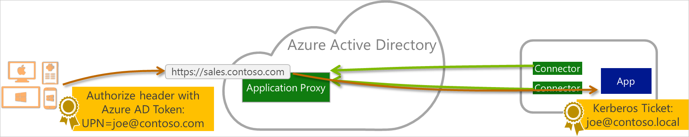
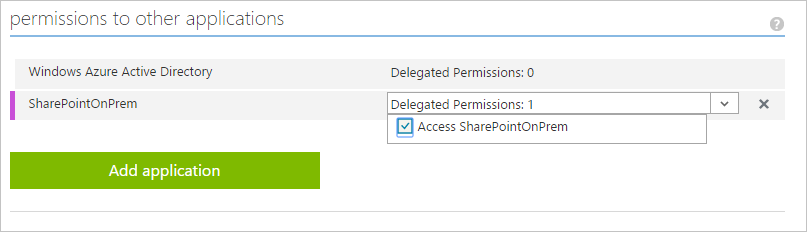
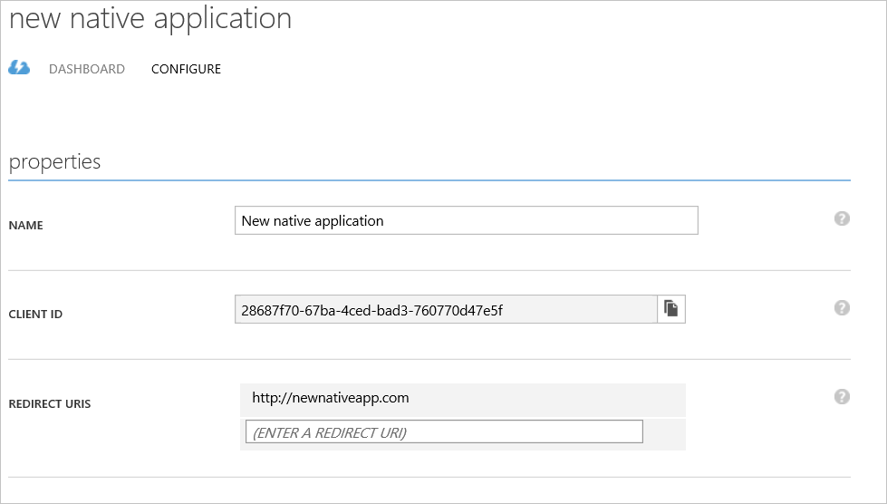

<properties
    pageTitle="Aktivieren der Veröffentlichung von native Client-apps mit Proxyanwendungen | Microsoft Azure"
    description="Erläutert, wie native Client apps zur Kommunikation mit Azure AD-Anwendung Proxy Verbinder sicheren Remotezugriff auf Ihrem lokalen apps bereitstellen zu aktivieren."
    services="active-directory"
    documentationCenter=""
    authors="kgremban"
    manager="femila"
    editor=""/>

<tags
    ms.service="active-directory"
    ms.workload="identity"
    ms.tgt_pltfrm="na"
    ms.devlang="na"
    ms.topic="article"
    ms.date="06/22/2016"
    ms.author="kgremban"/>

# Wie Sie native Client apps Interaktion mit Proxy Applikationen aktivieren

Azure Active Directory-Anwendungsproxy wird häufig verwendet, Browseranwendungen wie SharePoint, Outlook Web Access und benutzerdefinierte Linie branchenanwendungen veröffentlichen. Es kann auch So veröffentlichen Sie native Client-apps, die von Web apps unterscheiden, da diese auf einem Gerät installiert abrufen verwendet werden. Dies ist durch die Unterstützung von Azure AD ausgestellt Token, die in standard zu autorisieren HTTP-Header gesendet werden.

Die empfohlene Methode zum Veröffentlichen der Antrag ist die Verwendung der Azure AD-Authentifizierungsbibliothek sorgt dafür, dass alle Umstände der Authentifizierung und viele andere Clientumgebungen unterstützt. Anwendungsproxy passt in die [Native Anwendung Web-API Szenario](active-directory-authentication-scenarios.md#native-application-to-web-api). Der Prozess, um dies zu erreichen sieht wie folgt aus:

## Schritt 1: Veröffentlichen Sie die Anwendung

Veröffentlichen Sie die Proxyanwendung, wie Sie eine andere Anwendung verwenden, Zuweisen von Benutzern und gewähren sie Premium- oder grundlegende Lizenzen. Weitere Informationen finden Sie unter [Veröffentlichen von Applications mit Anwendungsproxy](active-directory-application-proxy-publish.md).

## Schritt 2: Konfigurieren von Ihrer Anwendung

Konfigurieren Sie Ihre systemeigene Anwendung wie folgt:

1. Melden Sie sich zum klassischen Azure-Portal aus.
2. Wählen Sie im linken Menü auf das Active Directory-Symbol, und wählen Sie dann Ihre Verzeichnis.
3. Klicken Sie im oberen Menü auf **Applications**. Wenn Sie keine apps zu Ihrem Verzeichnis hinzugefügt wurden, wird diese Seite nur den Link zum **Hinzufügen einer App** angezeigt. Klicken Sie auf den Link, oder Sie können Alternativ klicken Sie auf die Schaltfläche " **Hinzufügen** " auf der Befehlsleiste.
4. Klicken Sie auf der Seite **Was möchten Sie tun** klicken Sie auf den Link, um **eine Anwendung, die zur Entwicklung von meinem Unternehmen hinzufügen**.
5. Klicken Sie auf der Seite **Teilen Sie uns über die Anwendung** Geben Sie einen Namen für die Anwendung, und wählen Sie **Native Client-Anwendung**. Klicken Sie auf das Pfeilsymbol, um den Vorgang fortzusetzen.
6. Klicken Sie auf der Seite **Anwendungsinformationen** Erläutern Sie die notwendigen **Umleiten URI** für die native Client-Anwendung, und dann klicken Sie auf das Häkchen auf Fertig stellen.

Ihrer Anwendung hinzugefügt wurde, und Sie werden zur Seite Schnellstart für eine Anwendung weitergeleitet werden.

## Schritt 3: Erteilen des Zugriffs für andere Programme

Aktivieren Sie die ursprüngliche Anwendung, andere Programme in Ihrem Verzeichnis angezeigt werden soll:

1. Im oberen Menü klicken Sie auf **Applikationen**, wählen Sie die neue systemeigene Anwendung aus und klicken Sie dann auf **Konfigurieren**.
2. Führen Sie einen Bildlauf nach unten bis zum Abschnitt **Berechtigungen für andere Programme** . Klicken Sie auf die Schaltfläche **Anwendung hinzufügen** und wählen Sie die Proxyanwendung, der Sie Zugriff auf systemeigene Anwendung gewähren möchten, und klicken Sie auf das Häkchen in der unteren rechten Ecke. Wählen Sie im Dropdown-Menü **Delegierte Berechtigungen** die neue Berechtigungsstufe ein.

## Schritt 4: Bearbeiten der Active Directory-Authentifizierung-Bibliothek

Bearbeiten Sie den Code systemeigene Anwendung im Kontext Authentifizierung von der Active Directory Authentifizierung Bibliothek (ADAL) um Folgendes einzuschließen:

        // Acquire Access Token from AAD for Proxy Application
        AuthenticationContext authContext = new AuthenticationContext("https://login.microsoftonline.com/<TenantId>");
        AuthenticationResult result = authContext.AcquireToken("< Frontend Url of Proxy App >",
                                                        "< Client Id of the Native app>",
                                                        new Uri("< Redirect Uri of the Native App>"),
                                                        PromptBehavior.Never);

        //Use the Access Token to access the Proxy Application
        HttpClient httpClient = new HttpClient();
        httpClient.DefaultRequestHeaders.Authorization = new AuthenticationHeaderValue("Bearer", result.AccessToken);
        HttpResponseMessage response = await httpClient.GetAsync("< Proxy App API Url >");

Die Variablen sollte wie folgt ersetzt werden:

- **TenantId** können die GUID in der URL der Seite **Konfiguration** der Anwendung, direkt nach "/ Verzeichnis /" gefunden werden.
- **Front-End-URL** ist die front-End-URL eingegeben haben, in der Proxy-Anwendung, und finden Sie auf der Seite **Konfiguration** der Proxy-app.
- **Client-Id** der systemeigenen app kann auf der Seite zum **Konfigurieren** der systemeigenen Anwendung gefunden werden.
- **Umleiten URI der systemeigenen app** finden Sie auf der Seite zum **Konfigurieren** der systemeigenen Anwendung.

Weitere Informationen zu den Datenfluss systemeigene Anwendung finden Sie unter [Web-API systemeigene Anwendung](active-directory-authentication-scenarios.md#native-application-to-web-api).

## Siehe auch

- [Veröffentlichen von Applications, die Ihren eigenen Domänennamen verwenden](active-directory-application-proxy-custom-domains.md)
- [Aktivieren von bedingten Zugriff](active-directory-application-proxy-conditional-access.md)
- [Arbeiten mit Ansprüche bewusst Applikationen](active-directory-application-proxy-claims-aware-apps.md)
- [Aktivieren Sie auf einmalige Anmelden](active-directory-application-proxy-sso-using-kcd.md)

Sehen Sie für die neuesten Informationen und Updates sich die [Anwendungsproxy-blog](http://blogs.technet.com/b/applicationproxyblog/)
