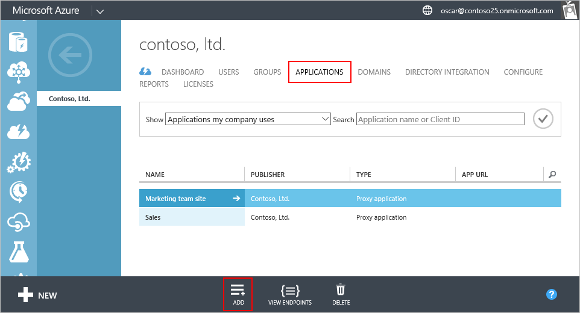
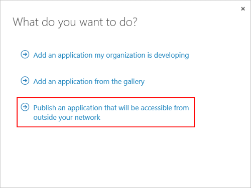
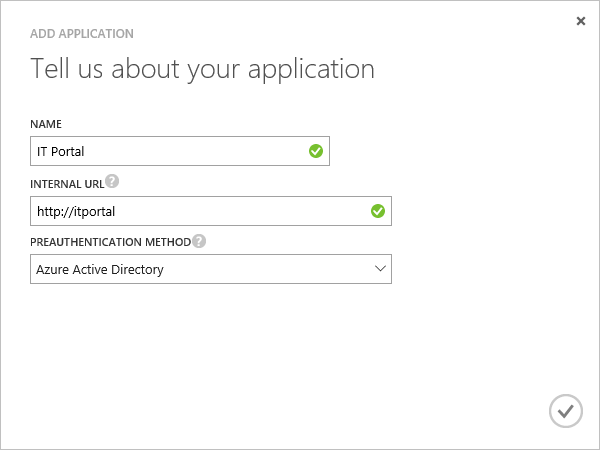
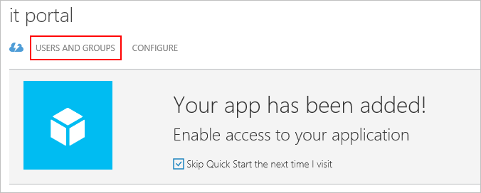
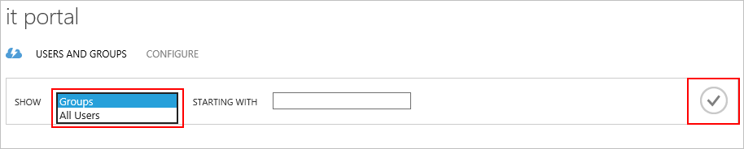
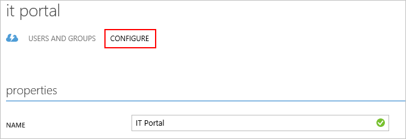

<properties
    pageTitle="Veröffentlichen von apps mit Azure AD-Anwendungsproxy | Microsoft Azure"
    description="Lokale Applications in der Cloud mit Azure AD-Anwendungsproxy zu veröffentlichen."
    services="active-directory"
    documentationCenter=""
    authors="kgremban"
    manager="femila"
    editor=""/>

<tags
    ms.service="active-directory"
    ms.workload="identity"
    ms.tgt_pltfrm="na"
    ms.devlang="na"
    ms.topic="get-started-article"
    ms.date="07/19/2016"
    ms.author="kgremban"/>

# Veröffentlichen von Applications Azure AD-Anwendungsproxy verwenden

Azure AD-Anwendungsproxy hilft Ihnen, remote Worker unterstützen, indem Sie die Veröffentlichung der lokalen Applikationen über das Internet zugegriffen werden. Zu diesem Zeitpunkt sollten Sie bereits [Anwendungsproxy im klassischen Azure-Portal aktiviert](active-directory-application-proxy-enable.md)haben. In diesem Artikel führt Sie durch die Schritte zum Veröffentlichen von Applications, die auf Ihr lokales Netzwerk ausführen und sicheren remote-Zugriff außerhalb Ihres Netzwerks. Nach Abschluss dieses Artikels zwar Sie bereit zum Konfigurieren der Anwendung mit personalisierte Informationen oder Sicherheit einzuhalten.

> [AZURE.NOTE] Anwendungsproxy ist ein Feature, das ist nur verfügbar, wenn Sie auf die Premium- oder Basisversion von Azure Active Directory aktualisiert haben. Weitere Informationen finden Sie unter [Azure Active Directory-Editionen](active-directory-editions.md).

## Veröffentlichen einer app mithilfe des Assistenten

1. Melden Sie sich als Administrator im [Azure klassischen Portal](https://manage.windowsazure.com/)aus.
2. Wechseln Sie zu Active Directory, und wählen Sie das Verzeichnis, in dem Sie die Anwendungsproxy aktiviert.

    

3. Klicken Sie auf die Registerkarte **Applications** aus, und klicken Sie dann auf die Schaltfläche " **Hinzufügen** " am unteren Rand des Bildschirms

    

4. Wählen Sie **Veröffentlichen einer Anwendung, die von außerhalb Ihres Netzwerks zugänglich sind**.

    

5. Geben Sie die folgenden Informationen über die Anwendung:

    - **Name**: den benutzerfreundlichen Namen für die Anwendung. Sie müssen in Ihrem Verzeichnis eindeutig sein.
    - **Interne URL**: die Adresse, die der Anwendung Proxy Verbinder wird verwendet, um die Anwendung von in Ihr privates Netzwerk zugreifen. Sie können einen bestimmten Pfad bereitstellen, auf dem Back-End-Server zu veröffentlichen, während der Rest des Servers aufgehoben wird. Auf diese Weise können Sie anderen Websites auf demselben Server veröffentlichen, und geben jeden eigene Namen und Access-Regeln.

        > [AZURE.TIP] Wenn Sie einen Pfad veröffentlichen, stellen Sie sicher, dass sie alle notwendigen Bildern, Skripts und Stylesheets für eine Anwendung enthält. Beispielsweise, wenn Ihre app befindet sich am https://yourapp/app und Bilder am https://yourapp/media verwendet, sollten dann Sie https://yourapp/ als den Pfad veröffentlichen.

    - **Präauthentifizierung Methode**: wie Anwendungsproxy überprüft Benutzern vor dem Gewähren von Zugriff auf eine Anwendung. Wählen Sie eine der Optionen aus dem Dropdownmenü aus.

        - Azure-Active Directory: Anwendungsproxy leitet Benutzer sich mit Azure AD, der seine Berechtigungen für das Verzeichnis und die Anwendung authentifiziert.
        - Pass-Through-: Benutzer nicht authentifizieren, um die Anwendung zugreifen können.

      

6. Klicken Sie auf das Häkchen am unteren Rand des Bildschirms, um den Assistenten zu beenden. Die Anwendung wird jetzt in Azure AD definiert.

## Zuweisen von Benutzern und Gruppen zur Anwendung

Damit für Ihre Benutzer zu Ihrer veröffentlichte Anwendung zugreifen können müssen Sie sie entweder einzeln oder in Gruppen zuweisen. (Denken Sie daran, sich selbst zu Access, zuweisen). Dies ist erforderlich, dass jeder Benutzer eine Lizenz für grundlegende Azure oder höher verfügen. Sie können Lizenzen einzeln oder Gruppen zuweisen. Weitere Informationen hierzu finden Sie unter [Zuweisen von Benutzern zu einer Anwendung](active-directory-applications-guiding-developers-assigning-users.md) . 

Für apps, die Vorauthentifizierung erfordern, erteilt dies die app zu verwenden. Für apps, die Vorauthentifizierung nicht erforderlich ist, können Benutzer weiterhin bei der app zugeordnet werden, damit es in ihre Liste der Anwendung, z. B. MyApps angezeigt wird.

1. Nach dem Beenden der Assistent App hinzufügen, wird die Seite Schnellstart für eine Anwendung angezeigt. Wählen Sie, wer Zugriff auf die app kann zum Verwalten von **Benutzern und Gruppen**aus.

    

2. Suchen nach bestimmten Gruppen in Ihrem Verzeichnis oder alle Benutzer anzeigen. Um die Suchergebnisse anzuzeigen, klicken Sie auf das Häkchen.

    

2. Wählen Sie die einzelnen Benutzer oder Gruppen, die Sie zuweisen, diese App, und klicken Sie auf **zuweisen**möchten. Sie werden aufgefordert, diese Aktion zu bestätigen.

> [AZURE.NOTE] Für integrierte Windows-Authentifizierung apps weisen Sie nur Benutzer und Gruppen aus, die synchronisiert werden aus Ihrem lokalen Active Directory. Melden Sie sich mit einem Microsoft-Konto und Gäste Benutzer können für apps mit Azure Active Directory-Anwendungsproxy veröffentlicht zugewiesen werden. Stellen Sie sicher, dass Ihre Benutzer melden Sie sich mit den Anmeldeinformationen, die dieselbe Domäne als die app gehören, die Sie veröffentlichen.

## Testen der veröffentlichten Anwendungs

Nachdem Sie die Anwendung veröffentlicht haben, können Sie es einfach durch Navigieren zur URL, die Sie veröffentlicht testen. Stellen Sie sicher, dass Sie zugreifen können, dass er korrekt wiedergegeben, und zwar, dass alles wie erwartet funktioniert. Wenn Sie Probleme haben oder eine Fehlermeldung erhalten, versuchen Sie, die [Leitfadens zur Problembehandlung](active-directory-application-proxy-troubleshoot.md).

## Konfigurieren der Anwendungs

Sie können veröffentlichten apps ändern oder richten Sie erweiterte Optionen auf der Seite konfigurieren. Auf dieser Seite können Sie Ihre app anpassen, indem Sie durch Ändern des Namens oder ein Logo hochladen. Sie können auch Access Regeln wie die Vorauthentifizierung Methode oder kombinierte Authentifizierung verwalten.

Nach dem Veröffentlichen von Applications Azure Active Directory-Anwendungsproxy verwenden sie angezeigt werden, in der Liste von Applications in Azure AD, und Sie können sie es verwalten.

Wenn Sie die Anwendungsproxy-Dienste deaktivieren, nachdem Sie Applikationen veröffentlicht haben, sind sie nicht mehr außerhalb Ihres privaten Netzwerks zugegriffen werden. Dadurch wird die Anwendungen nicht gelöscht.

Zum Anzeigen der Anwendung, und stellen Sie sicher, dass es möglich ist, doppelklicken Sie auf den Namen der Anwendung. Wenn der Anwendungsproxy-Dienst deaktiviert ist, und die Anwendung nicht verfügbar ist, wird eine Warnmeldung am oberen Rand des Bildschirms angezeigt.

Um eine Anwendung zu löschen, wählen Sie in der Liste eine Anwendung aus, und klicken Sie dann auf **Löschen**.

## Nächste Schritte

- [Veröffentlichen von Applications, die Ihren eigenen Domänennamen verwenden](active-directory-application-proxy-custom-domains.md)
- [Aktivieren Sie auf einmalige Anmelden](active-directory-application-proxy-sso-using-kcd.md)
- [Aktivieren von bedingten Zugriff](active-directory-application-proxy-conditional-access.md)
- [Arbeiten mit Ansprüche bewusst Applikationen](active-directory-application-proxy-claims-aware-apps.md)

Sehen Sie für die neuesten Informationen und Updates sich die [Anwendungsproxy-blog](http://blogs.technet.com/b/applicationproxyblog/)
