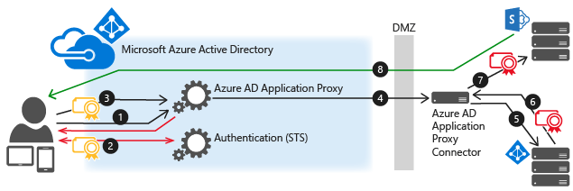
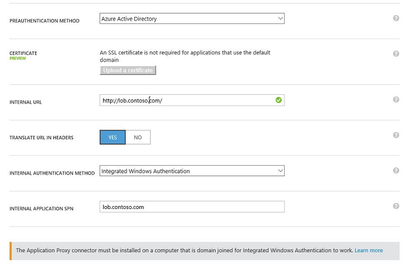
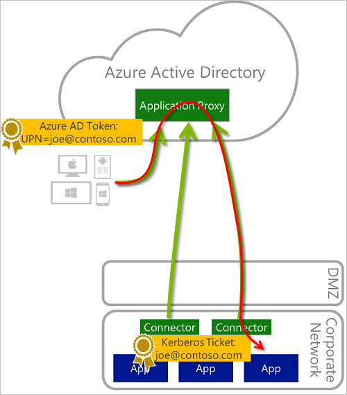
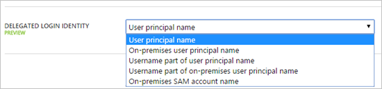

<properties
    pageTitle="Einmaliges Anmelden mit Anwendungsproxy | Microsoft Azure"
    description="Erläutert, wie einmaliges Anmelden mit Azure AD-Anwendungsproxy bereitstellen."
    services="active-directory"
    documentationCenter=""
    authors="kgremban"
    manager="femila"
    editor=""/>

<tags
    ms.service="active-directory"
    ms.workload="identity"
    ms.tgt_pltfrm="na"
    ms.devlang="na"
    ms.topic="article"
    ms.date="08/10/2016"
    ms.author="kgremban"/>

# Einmaliges Anmelden mit Proxy-Anwendung

Einmaliges Anmelden die ist ein wichtiges Element des Azure AD-Anwendungsproxy aus. Es bietet die beste Benutzerfunktionalität die folgenden Schritte aus:

1. Ein Benutzer anmeldet in der cloud  
2. Alle Sicherheit Validierungen erfolgen in der Cloud (Präauthentifizierung)  
3. Wenn die Anfrage zur Anwendung auf Prem gesendet wird, die Identität der Anwendung Proxy Verbinder des Benutzers. Die Back-End-Anwendung geht davon aus, dass dies ein normaler Benutzer in Kürze auf einem Gerät Domänenverbund ist.

Azure AD-Anwendungsproxy hilft Ihnen, eine Benutzeroberfläche für einmaliges Anmelden (SSO) für Ihre Benutzer bereitstellen. Gehen Sie folgendermaßen vor, veröffentlichen Sie Ihre apps über SSO:

## SSO für auf Prem IWA apps mit KCD mit Proxy-Anwendung
Sie können einmaliges Anmelden aktivieren, den Clientanwendungen verwenden integrierte Windows-Authentifizierung (IWA) durch die Anwendung Proxy Verbinder Berechtigung in Active Directory zugewiesen, um die Identität von Benutzern, annehmen und senden und Empfangen von Token in deren Auftrag.

### Netzwerkdiagramm

Wenn ein Benutzer versucht, eine Anwendung auf Prem zugreifen, die IWA verwendet, wird, wird dieses Diagramm des Ablaufs erläutert.

1. Der Benutzer gibt die URL, um die Anwendung auf Prem über Proxy-Anwendung zuzugreifen.
2. Anwendungsproxy leitet die Anfrage in Azure AD-Authentifizierung Services vorauthentifiziert werden soll. Zu diesem Zeitpunkt gilt Azure AD alle ergänzenden Authentifizierung und Autorisierungsrichtlinien, wie z. B. kombinierte Authentifizierung. Wenn der Benutzer überprüft wird, wird Azure AD erstellt ein Token und wird an den Benutzer gesendet.
3. Der Benutzer übergibt das Token Proxy-Anwendung.
4. Anwendungsproxy das Token überprüft und die wichtigsten UPN (User Name) Es ruft und dann des Verbinders durch eine Masterdetailseiten authentifizierten Kanal sendet die Anforderung, Benutzerprinzipalnamen und den Namen (SPN).
5. Der Verbinder führt Kerberos Startzeile Delegation (KCD) Aushandlung mit der Prem AD, Benutzeridentität um ein Kerberos-Token zur Anwendung zu gelangen.
6. Active Directory sendet das Kerberos-Token für die Anwendung des Verbinders an.
7. Der Verbinder sendet die ursprüngliche Anforderung Anwendungsserver, mit dem Kerberos-Token, aus dem Active Directory empfangen wurde.
8. Die Anwendung sendet die Antwort an den Verbinder, die dann an die Anwendungsproxy-Dienst zurückgegeben wird, und klicken Sie abschließend auf den Benutzer.

### Erforderliche Komponenten

Bevor Sie mit SSO für Proxy-Anwendung beginnen, stellen Sie sicher, dass Ihre Umgebung mit den folgenden Einstellungen und Konfigurationen bereit ist:

- Ihre apps, wie SharePoint Web apps, festgelegt sind, dass integrierte Windows-Authentifizierung verwenden. Weitere Informationen finden Sie unter [Aktivieren der Unterstützung für Kerberos-Authentifizierung](https://technet.microsoft.com/library/dd759186.aspx)oder SharePoint finden Sie unter [Planen von Kerberos-Authentifizierung in SharePoint 2013](https://technet.microsoft.com/library/ee806870.aspx).

- Alle Ihre apps müssen Dienst Tilgungsanteile Namen.

- Der Server mit den Verbinder und dem die app-Server sind Domäne hinzugefügt und Teil der gleichen Domäne oder vertrauen. Weitere Informationen zum Beitreten zu einer Domäne finden Sie unter [Teilnehmen an einem Computer mit einer Domäne](https://technet.microsoft.com/library/dd807102.aspx).

- Der Server mit den Verbinder hat Zugriff auf die TokenGroupsGlobalAndUniversal Benutzer finden Sie unter. Dies ist eine Standardeinstellung, die Sicherheit Sichern von der Umgebung beeinträchtigt werden kann. Weitere Hilfestellung mit diesem in [KB2009157](https://support.microsoft.com/en-us/kb/2009157).

### Active Directory-Konfiguration

Active Directory-Konfiguration variiert, je nachdem, ob Ihre Anwendung Proxy-Connector und dem veröffentlichten Server in der gleichen Domäne oder nicht sind.

#### Verbinder und veröffentlichten Server in derselben Domäne

1. Wechseln Sie in Active Directory **Tools** > **Benutzer und Computer**.
2. Wählen Sie den Server mit den Verbinder aus.
3. Mit der rechten Maustaste, und wählen Sie **Eigenschaften**aus > **Delegation**.
4. Wählen Sie die **Computer für die Delegierung bestimmter Dienste vertrauen** , und klicken Sie unter **Diensten, dem dieses Konto delegierte Anmeldeinformationen präsentieren kann**, fügen Sie den Wert für die SPN Identität des Servers der.
5. Dadurch wird die Anwendung Proxy Verbinder AD Benutzer gegen die Anwendungen definiert, in der Liste der Identität.

#### Verbinder und veröffentlichten Server in unterschiedlichen Domänen

1. Eine Liste der erforderlichen Komponenten für die Arbeit mit KCD über Domänen finden Sie unter [Startzeile Kerberos-Delegierung über Domänen](https://technet.microsoft.com/library/hh831477.aspx).
2. Verwenden Sie in Windows 2012 R2, die `principalsallowedtodelegateto` Eigenschaft auf dem Server Verbinder, aktivieren Sie die Anwendungsproxy für den Server Verbinder delegieren Wo finde ich der veröffentlichte Server `sharepointserviceaccount` und der delegierende Server ist `connectormachineaccount`.

        $connector= Get-ADComputer -Identity connectormachineaccount -server dc.connectordomain.com

        Set-ADComputer -Identity sharepointserviceaccount -PrincipalsAllowedToDelegateToAccount $connector

        Get-ADComputer sharepointserviceaccount -Properties PrincipalsAllowedToDelegateToAccount

>[AZURE.NOTE] `sharepointserviceaccount`ist das SPS Computerkonto oder ein Dienstkonto, unter dem Pool app SPS ausgeführt wird.

### Azure klassischen Portal Konfiguration

1. Veröffentlichen Sie die Anwendung gemäß den Anweisungen in [Clientanwendungen veröffentlichen, mit der Anwendungsproxy](active-directory-application-proxy-publish.md)beschrieben. Vergewissern Sie sich, **Azure Active Directory** als die **Präauthentifizierung Methode**auszuwählen.
2. Nach Ihrer Anwendung in der Liste der Programme angezeigt wird, wählen Sie ihn aus, und klicken Sie auf **Konfigurieren**.
3. Legen Sie unter **Eigenschaften** **Internen Authentifizierungsmethode** auf **Integrierte Windows-Authentifizierung**ein.  
    
4. Geben Sie den **Internen Anwendung SPN** des Anwendungsserver aus. In diesem Beispiel wird der SPN für unsere veröffentlichten Anwendung http/lob.contoso.com.  

>[AZURE.IMPORTANT] Wenn der lokale Benutzerprinzipalnamen und Benutzerprinzipalnamen in Azure Active Directory nicht identisch sind, müssen Sie die [delegierte Login Identität](#delegated-login-identity) für die Vorauthentifizierung entwickelt konfigurieren.

|  |  |
| --- | --- |
| Interner Authentifizierungsmethode | Wenn Sie für die Vorauthentifizierung Azure AD verwenden, können Sie eine interne Authentifizierungsmethode So aktivieren Sie die Benutzer von einmaliges Anmelden (SSO) zu dieser Anwendung profitieren festlegen.    Wählen Sie **Integrierte Windows-Authentifizierung** (IWA), wenn Ihre Anwendung IWA verwendet und Sie, dass Kerberos Startzeile Delegation (KCD konfigurieren können) um SSO für diese Anwendung zu aktivieren. Anwendungen, die IWA verwenden mit KCD konfiguriert sein, andernfalls Anwendungsproxy ist nicht möglich, veröffentlichen diese Applications.    Wählen Sie **keine** aus, wenn eine Anwendung keine IWA verwendet werden. |
| Interne Anwendung SPN | Dies ist der internen Anwendung des Service-Tilgungsanteile-Name (SPN) aus, wie in der auf-Prem Azure AD konfiguriert. Der SPN wird durch die Anwendung Proxy-Verbindung verwendet, Kerberos-Token für die Anwendung mit KCD abgerufen werden sollen. |

## SSO für nicht Windows-apps
Kerberos Delegation illustrieren in Azure AD-Anwendungsproxy wird gestartet, wenn Azure AD-des Benutzers in der Cloud Authentifizierung. Nachdem die Anfrage lokalen ankommt, Probleme der Azure AD-Anwendung Proxy Verbinder ein Kerberos-Ticket im Namen des Benutzers durch die Interaktion mit der lokalen Active Directory. Dieses Verfahren wird als Kerberos Startzeile Delegation (KCD) bezeichnet. Klicken Sie in die nächste Phase wird eine Anforderung an die Back-End-Anwendung mit dieser Kerberos-Ticket gesendet. Es gibt eine Reihe von Protokollen, die Informationen zum Senden von solche Anfragen definieren. Die meisten nicht Windows Server erwarten Negotiate/SPNego, die nun auf Azure AD-Anwendungsproxy unterstützt wird.

### Delegierte Login Identität
Delegierte Login Identität hilft Ihnen die zwei verschiedenen Login Szenarien behandeln:

- Nicht-Windows-Anwendungen, die in der Regel Benutzeridentität in Form einer Username oder SAM-Kontonamen, nicht auf eine e-Mail-Adresse erhalten (username@domain).
- Alternative Login Konfigurationen, wo Benutzerprinzipalnamen in Azure Active Directory und der UPN in Ihrem lokalen Active Directory unterscheiden sich.

Wählen Sie mit Proxy-Anwendung welche Identität verwenden, um das Kerberos-Ticket erhalten. Diese Einstellung ist pro Anwendung. Einige dieser Optionen eignen sich für Systeme, die keine e-Mail-Adressformat akzeptieren, andere wurden dazu ausgelegt für alternative Login.

Wenn Sie delegierte Login Identität verwendet wird, möglicherweise der Wert nicht für alle Domänen oder Gesamtstrukturen in Ihrer Organisation eindeutig. Sie können dieses Problem vermeiden, indem Sie diese zweimal mit zwei unterschiedlichen Verbinder Gruppen Applikationen veröffentlichen. Da jede Anwendung eine anderen Benutzers Zielgruppe verfügt, können Sie deren Verbinder in eine andere Domäne verknüpfen.

## Arbeiten mit SSO beim lokalen und Cloud Identitäten nicht identisch sind.
Sofern nicht anderweitig konfiguriert ist, vorausgesetzt Anwendungsproxy Benutzer genau die gleiche Identität in der Cloud und lokale. Sie können, für jede Anwendung Konfigurieren der Identität verwendet werden soll, wenn die Durchführung einmaliges Anmelden.  

Dieser Funktion können viele Organisationen, die verschiedene auf Prem und Cloud Identitäten SSO aus der Cloud auf apps auf Prem haben, ohne dass die Benutzer von unterschiedlichen Benutzernamen und Kennwörter eingeben müssen. Dies umfasst Organisationen, die:

- Haben Sie mehrere Domänen intern (joe@us.contoso.com, joe@eu.contoso.com) und einer einzelnen Domäne in der Cloud (joe@contoso.com).

- Haben Sie nicht geroutet Domänennamen intern (joe@contoso.usa) und eine rechtliche Hinweise in der Cloud.

- Verwenden Sie Domänennamen nicht intern (Helmut)

- Verwenden Sie unterschiedliche Aliase auf Prem und in der Cloud. Z. B. joe-johns@contoso.comim Vergleich zujoej@contoso.com  

Es wird auch für Applikationen hilfreich, die nicht in Form von e-Mail-Adresse Adressen akzeptieren also ein gängiges Vorgehen für nicht Windows Back-End-Server.

### Festlegen von SSO für verschiedene Cloud und auf Prem Identitäten

1. Konfigurieren von Einstellungen für Azure AD-Verbindung herstellen, sodass die Hauptfenster Identität die e-Mail-Adresse (e-Mail) genommen wird. Als Teil der Prozess anpassen dazu das **Prinzip Benutzernamen** -Feld in der synchronisierungseinstellungen ändern. Beachten Sie, dass diese Einstellungen auch bestimmen, wie Benutzer zu Office 365, Windows10 Geräte, melden Sie sich und andere Programme, die als ihre Identität Store Azure AD zu verwenden.  
    
2. Die Anwendungskonfiguration Einstellungen für die Anwendung, die Sie ändern möchten, wählen Sie die **Delegierte Login Identität** verwendet werden:
  - Name des Benutzers Prinzip:joe@contoso.com  
  - Alternative Benutzerprinzipalnamen:joed@contoso.local  
  - UserName-Teil Benutzerprinzipalnamen: Helmut  
  - UserName-Teil des alternativen Benutzerprinzipalnamen: Joed  
  - Lokale SAM-Kontoname: je nach auf Prem Konfiguration

    

### Problembehandlung SSO für verschiedene Identitäten
Ist es ein Fehler im SSO-Prozess wird im Ereignisprotokoll Verbinder maschinellen angezeigt wie in der [Problembehandlung](active-directory-application-proxy-troubleshoot.md)erläutert.
Aber in einigen Fällen die Anfrage erfolgreich gesendet an die Back-End-Anwendung während dieser Anwendung in verschiedenen HTTP-Antworten Antworten wird. Problembehandlung bei diesen Fällen sollte durch Untersuchen Ereignis Zahl 24029 auf dem Computer Verbinder im Ereignisprotokoll Anwendungsproxy-Sitzung beginnen. Die Identität des Benutzers, die für die Delegierung verwendet wurde, wird im Feld "Benutzer" in den Ereignisdetails angezeigt. Wählen Sie zum Sitzungsprotokoll aktivieren, **analytisches anzeigen und Debuggen von Protokollen** im Falle Viewer Menü anzeigen.

## Siehe auch

- [Veröffentlichen von Applications mit Proxy-Anwendung](active-directory-application-proxy-publish.md)
- [Behandeln von Problemen, die Sie mit der Anwendungsproxy haben](active-directory-application-proxy-troubleshoot.md)
- [Arbeiten mit Ansprüche bewusst Applikationen](active-directory-application-proxy-claims-aware-apps.md)
- [Aktivieren von bedingten Zugriff](active-directory-application-proxy-conditional-access.md)

Sehen Sie für die neuesten Informationen und Updates sich die [Anwendungsproxy-blog](http://blogs.technet.com/b/applicationproxyblog/)

<!--Image references-->
[1]: ./media/active-directory-application-proxy-sso-using-kcd/AuthDiagram.png
[2]: ./media/active-directory-application-proxy-sso-using-kcd/Properties.jpg
