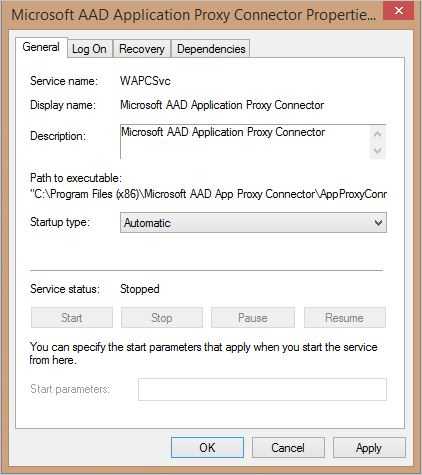

<properties
    pageTitle="Behandeln von Problemen mit der Anwendungsproxy | Microsoft Azure"
    description="Erläutert, wie Sie zur Problembehandlung in Azure AD-Anwendungsproxy."
    services="active-directory"
    documentationCenter=""
    authors="kgremban"
    manager="femila"
    editor=""/>

<tags
    ms.service="active-directory"
    ms.workload="identity"
    ms.tgt_pltfrm="na"
    ms.devlang="na"
    ms.topic="article"
    ms.date="08/19/2016"
    ms.author="kgremban"/>

# Behandeln von Problemen mit der Anwendungsproxy

Treten Fehler beim Zugriff auf eine veröffentlichte Anwendung oder in Clientanwendungen veröffentlichen, überprüfen Sie die folgenden Optionen aus, um festzustellen, ob Microsoft Azure AD-Anwendungsproxy ordnungsgemäß funktioniert:

- Öffnen Sie die Windows-Dienste-Verwaltungskonsole, stellen Sie sicher, dass der **Microsoft AAD Anwendung Proxy-Connector** -Dienst aktiviert ist und ausgeführt wird. Möglicherweise empfiehlt es sich, zu der Seite Eigenschaften Anwendungsproxy-Dienst eigenständig wie in der folgenden Abbildung dargestellt:  
  

- Öffnen Sie die Ereignisanzeige und suchen Sie nach Anwendungsproxy Verbinder Ereignisse in **Anwendungen und Dienste Protokolle** > **Microsoft** > **AadApplicationProxy** > **Verbinder** > **Administrator**.
- Falls erforderlich, sind durch Analytics für das Debuggen von Protokollen und die Anwendungsproxy Verbinder Sitzungsprotokoll einschalten einschalten ausführlichere Protokolle verfügbar.

## Die Seite wird nicht richtig dargestellt.

Wenn Sie eine bestimmte Fehlermeldung nicht wiedergegeben werden, müssen Sie die Probleme mit der Anwendung darstellen oder falsch funktionsfähiges eventuell. Dies kann auftreten, wenn Sie den Artikel Pfad veröffentlicht, aber die Anwendung erfordert Inhalt, der außerhalb, dass der Pfad vorhanden ist.

Beispielsweise wird nicht, wenn Sie den Pfad https://yourapp/app veröffentlichen, aber die Anwendung Bilder in https://yourapp/media Ruft, sie dargestellt werden. Stellen Sie sicher, dass veröffentlichen Sie die Anwendung, die mit der höchsten Ebene Pfad, den Sie alle relevanten Inhalte einschließen müssen. In diesem Beispiel wäre es http://yourapp/.

Wenn Sie den Pfad zum verwiesen wird ändern, sondern es Benutzer auf einen tieferen Link in den Pfad landen noch benötigen, finden Sie im Blogbeitrag [den richtigen Link für die Anwendungsproxy-Anwendungen in der Access-Systemsteuerung Azure AD- und Startprogramm für ein Office 365-app festlegen](https://blogs.technet.microsoft.com/applicationproxyblog/2016/04/06/setting-the-right-link-for-application-proxy-applications-in-the-azure-ad-access-panel-and-office-365-app-launcher/).

## Allgemeine Fehler

Fehler | Beschreibung | Auflösung
--- | --- | ---
Diese app corporate kann nicht zugegriffen werden. Sie sind nicht berechtigt, auf diese Anwendung zuzugreifen. Fehler bei der Autorisierung. Vergewissern Sie sich den Benutzer mit Zugriff auf diese Anwendung zuweisen. | Sie können nicht den Benutzer für diese Anwendung zugewiesen haben. | Wechseln Sie zur Registerkarte **Anwendung** , und klicken Sie unter **Benutzer und Gruppen**, weisen Sie diesem Benutzer oder eine Benutzergruppe zu dieser Anwendung.
Diese app corporate kann nicht zugegriffen werden. Sie sind nicht berechtigt, auf diese Anwendung zuzugreifen. Fehler bei der Autorisierung. Stellen Sie sicher, dass der Benutzer eine Lizenz für Azure Active Directory Premium oder Basic verfügt. | Ihre Benutzer möglicherweise dieser Fehler bei dem Versuch, die app zugreifen, wenn, die Sie diese explizit mit einer Lizenz Premium/Basic vom Administrator des Teilnehmers zugewiesen wurden nicht veröffentlicht. | Wechseln Sie zur Registerkarte für des Abonnenten Active Directory- **Lizenzen** , und stellen Sie sicher, dass diese Benutzer oder eine Benutzergruppe einer Premium- oder grundlegende Lizenz zugeordnet ist.

## Problembehandlung Netzwerke
Wenn die Registrierung während der Installation des Connector-Assistenten fehlschlägt, gibt es zwei Methoden, um den Grund für den Fehler anzuzeigen. Entweder im Ereignisprotokoll unter **Anwendungen und Dienste Logs\Microsoft\AadApplicationProxy\Connector\Admin**suchen Sie, oder führen Sie den folgenden Windows PowerShell-Befehl.

    Get-EventLog application –source “Microsoft AAD Application Proxy Connector” –EntryType “Error” –Newest 1

| Fehler | Beschreibung | Auflösung |
| --- | --- | --- |
| Fehler beim Registrieren der Verbinder: sicherstellen, dass Sie aktiviert Anwendungsproxy im Verwaltungsportal Azure und, dass Sie Ihren Active Directory-Benutzernamen und Ihr Kennwort richtig eingegeben haben. Fehler: "mindestens ein Fehler aufgetreten." | Sie das Registrierungsfenster ohne Anmeldung bei Azure AD geschlossen. | Den Connector-Assistenten erneut ausführen und den Verbinder zu registrieren. |
| Fehler beim Registrieren der Verbinder: sicherstellen, dass Sie aktiviert Anwendungsproxy im Verwaltungsportal Azure und, dass Sie Ihren Active Directory-Benutzernamen und Ihr Kennwort richtig eingegeben haben. Fehler: "AADSTS50001: Ressource `https://proxy.cloudwebappproxy.net /registerapp` deaktiviert ist." | Anwendungsproxy deaktiviert ist.  | Stellen Sie sicher, dass die Anwendungsproxy im klassischen Azure-Portal aktivieren, bevor Sie versuchen, den Verbinder zu registrieren. Weitere Informationen zum Aktivieren der Anwendungsproxy finden Sie unter [Aktivieren der Anwendungsproxy-Dienste](active-directory-application-proxy-enable.md). |
| Fehler beim Registrieren der Verbinder: sicherstellen, dass Sie aktiviert Anwendungsproxy im Verwaltungsportal Azure und, dass Sie Ihren Active Directory-Benutzernamen und Ihr Kennwort richtig eingegeben haben. Fehler: "mindestens ein Fehler aufgetreten." | Wenn das Fenster Registration wird geöffnet und sofort wieder geschlossen wird, ohne dass Sie sich anmelden, werden Sie wahrscheinlich dieser Fehler zurückgegeben. Dieser Fehler tritt auf, wenn auf Ihrem System Netzwerke Fehler ist. | Stellen Sie sicher, dass es möglich ist, die über einen Browser zu einer öffentlichen Website verbinden und die Ports gemäß Angabe in den [Voraussetzungen für die Anwendungsproxy](active-directory-application-proxy-enable.md)geöffnet sind. |
| Fehler beim Registrieren der Verbinder: Stellen Sie sicher, dass Ihr Computer mit dem Internet verbunden ist. Fehler: "Es wurde keine Endpunkt hört `https://connector.msappproxy.net :9090/register/RegisterConnector` konnte, die die Nachricht annehmen. Dies wird häufig durch eine fehlerhafte Adresse oder SOAP-Aktion verursacht. Finden Sie unter InnerException, falls vorhanden, weitere Details. " | Wenn Sie melden Sie sich mit Ihrer Azure AD-Benutzernamen und Ihr Kennwort aber erhalten Sie diese Fehlermeldung, ist es wahrscheinlich, dass alle Ports über 8081 blockiert werden. | Stellen Sie sicher, dass die erforderlichen Ports geöffnet sind. Weitere Informationen finden Sie unter [Voraussetzungen für die Anwendungsproxy](active-directory-application-proxy-enable.md). |
| Löschen Fehler in der Registrierungsfenster angezeigt. Kann nicht fortgesetzt werden nur zum Schließen des Fensters –. | Die eingegebene die falschen Benutzernamen oder Kennwort. | Wiederholen. |
| Fehler beim Registrieren der Verbinder: sicherstellen, dass Sie aktiviert Anwendungsproxy im Verwaltungsportal Azure und, dass Sie Ihren Active Directory-Benutzernamen und Ihr Kennwort richtig eingegeben haben. Fehler: "AADSTS50059: Es werden keine Informationen Mandanten identifizieren übertragen die Anfrage gefunden oder durch alle eingegebenen Anmeldeinformationen impliziert und Fehler bei der Suche nach Dienst Prinzip URI. | Sie versuchen, melden Sie sich mit einem Microsoft-Account und nicht zu einer Domäne, die die Organisations-ID des Verzeichnisses gehört, die Sie für den Zugriff auf. | Stellen Sie sicher, dass der Administrator ist Teil der gleichen Domänennamen, wie die Domäne Mandanten, beispielsweise wenn die Azure AD-Domäne "contoso.com" ist, des Administrators sollte admin@contoso.com. |
| Fehler beim Abrufen der aktuellen Ausführungsrichtlinie zum Ausführen von PowerShell Skripts. | Wenn die Connector-Installation fehlschlägt, stellen Sie sicher, dass PowerShell Ausführungsrichtlinie nicht deaktiviert ist. | Öffnen Sie die Gruppenrichtlinien-Editor. Wechseln Sie zu dem **Computerkonfiguration** > **Administrative Vorlagen** > **Windows-Komponenten** > **Windows PowerShell** und doppelklicken Sie auf die **Ausführung von Skripts aktivieren**. Dies kann **Nicht konfiguriert** oder **aktiviert**festgelegt werden. Wenn auf **aktiviert**festgelegt, stellen Sie sicher, dass unter Optionen die Ausführungsrichtlinie können entweder **Zulassen lokale Skripts und remote signierte Skripts** oder **Alle Skripts zulassen**festgelegt ist. |
| Fehler beim Herunterladen der Konfigurations Verbinder. | Des Verbinders Client-Zertifikat, das für die Authentifizierung verwendet wird, ist abgelaufen. Dies kann auch auftreten, wenn Sie den Verbinder, die einen Proxyserver installiert haben. In diesem Fall der Verbinder kann nicht auf das Internet zugreifen und werden nicht Clientanwendungen remote-Benutzern zu sorgen. | Erneuern Vertrauensstellung manuell mithilfe der `Register-AppProxyConnector` Cmdlet in Windows PowerShell. Wenn Sie der Verbinder hinter einem Proxyserver befindet, ist es erforderlich, vor erteilen Zugriff auf das Internet an den Verbinder Konten "Network Services" und "Lokales System". Dies kann von ihnen an den Proxy Zugriff gewähren oder indem Sie festlegen, um den Proxy umgehen erfolgen. |
| Fehler beim Registrieren der Verbinder: sicherstellen, dass Sie ein globaler Administrator von Active Directory zum Registrieren des Verbinders sind. Fehler: "die Registrierung Anforderung wurde verweigert." | Rufen Sie der Alias, den Sie für die Anmeldung nicht Administrator in dieser Domäne. Der Verbinder ist immer für das Verzeichnis installiert, die Domäne des Benutzers besitzt. | Stellen Sie sicher, dass der Administrator Ihnen gesuchten melden Sie sich als globale Berechtigungen zur Verwaltung der Azure AD-Mandanten wurde.|

## Kerberos-Fehler

| Fehler | Beschreibung | Auflösung |
| --- | --- | --- |
| Fehler beim Abrufen der aktuellen Ausführungsrichtlinie zum Ausführen von PowerShell Skripts. | Wenn die Connector-Installation fehlschlägt, stellen Sie sicher, dass PowerShell Ausführungsrichtlinie nicht deaktiviert ist. | Öffnen Sie die Gruppenrichtlinien-Editor. Wechseln Sie zu dem **Computerkonfiguration** > **Administrative Vorlagen** > **Windows-Komponenten** > **Windows PowerShell** und doppelklicken Sie auf die **Ausführung von Skripts aktivieren**. Dies kann **Nicht konfiguriert** oder **aktiviert**festgelegt werden. Wenn auf **aktiviert**festgelegt, stellen Sie sicher, dass unter Optionen die Ausführungsrichtlinie können entweder **Zulassen lokale Skripts und remote signierte Skripts** oder **Alle Skripts zulassen**festgelegt ist. |
| 12008 - Azure AD überschritten haben die maximale Anzahl von zulässigen Kerberos-Authentifizierung auch auf dem Back-End-Server. | Dieses Ereignis möglicherweise fehlerhafte Konfiguration zwischen Azure AD anzugeben und die Back-End-Anwendungsserver oder ein Problem in Datum und Uhrzeit Konfiguration auf beiden Computern. | Der Back-End-Server abgelehnt das Kerberos-Ticket Azure AD erstellt. Vergewissern Sie sich diese Azure AD- und der Back-End-Anwendungsserver ordnungsgemäß konfiguriert sind. Stellen Sie sicher, dass die Konfiguration Datum und Uhrzeit auf Azure AD- und der Back-End-Anwendungsserver synchronisiert werden. |
| 13016 - Azure AD kann kein Kerberos-Ticket im Namen des Benutzers abgerufen werden, da es kein UPN im Token Kante oder in der Access-Cookie ist. | Es liegt ein Problem mit der Konfiguration STS ein. | Beheben Sie die Konfiguration der UPN Anfordern der STS. |
| 13019 - Azure AD kann nicht im Namen des Benutzers ein Kerberos-Ticket aufgrund der folgende allgemeine API Fehler abrufen. | Dieses Ereignis kann fehlerhafte Konfiguration zwischen Azure AD hinweisen und der Domänencontroller-Server oder ein Problem in Datum und Uhrzeit Konfiguration auf beiden Computern. | Der Domänencontroller abgelehnt das Kerberos-Ticket Azure AD erstellt. Vergewissern Sie sich diese Azure AD- und der Back-End-Anwendungsserver sind richtig, insbesondere die SPN Konfiguration konfiguriert ist. Sicherstellen Sie, dass das Azure AD ist die Domäne der gleichen Domäne als Domänencontroller um sicherzustellen, dass der Domänencontroller mit Azure AD Trust richtet. Stellen Sie sicher, dass die Konfiguration Datum und Uhrzeit auf Azure AD- und der Domänencontroller synchronisiert werden. |
| 13020 - Azure AD kann kein Kerberos-Ticket im Namen des Benutzers abgerufen werden, da der Back-End-Server SPN nicht definiert ist. | Dieses Ereignis kann fehlerhafte Konfiguration zwischen Azure AD hinweisen und der Domänencontroller-Server oder ein Problem in Datum und Uhrzeit Konfiguration auf beiden Computern. | Der Domänencontroller abgelehnt das Kerberos-Ticket Azure AD erstellt. Vergewissern Sie sich diese Azure AD- und der Back-End-Anwendungsserver sind richtig, insbesondere die SPN Konfiguration konfiguriert ist. Sicherstellen Sie, dass das Azure AD ist die Domäne der gleichen Domäne als Domänencontroller um sicherzustellen, dass der Domänencontroller mit Azure AD Trust richtet. Stellen Sie sicher, dass die Konfiguration Datum und Uhrzeit auf Azure AD- und der Domänencontroller synchronisiert werden. |
| 13022 - Azure AD Authentifizierung des Benutzers nicht möglich, weil der Back-End-Server Kerberos-Authentifizierung auch mit der Fehlermeldung HTTP 401 beantwortet. | Dieses Ereignis möglicherweise fehlerhafte Konfiguration zwischen Azure AD anzugeben und die Back-End-Anwendungsserver oder ein Problem in Datum und Uhrzeit Konfiguration auf beiden Computern. | Der Back-End-Server abgelehnt das Kerberos-Ticket Azure AD erstellt. Vergewissern Sie sich diese Azure AD- und der Back-End-Anwendungsserver ordnungsgemäß konfiguriert sind. Stellen Sie sicher, dass die Konfiguration Datum und Uhrzeit auf Azure AD- und der Back-End-Anwendungsserver synchronisiert werden. |
| Die Website kann nicht auf der Seite angezeigt. | Der Benutzer kann dieser Fehler bei dem Versuch, die app zugreifen, wenn, die Sie die Anwendung ist eine Anwendung IWA veröffentlicht. Der definierte SPN für diese Anwendung ist möglicherweise falsch. | Für IWA apps: sicherstellen, dass der für diese Anwendung konfigurierten SPN korrekt ist. |
| Die Website kann nicht auf der Seite angezeigt. | Der Benutzer kann dieser Fehler bei dem Versuch, die app zugreifen, wenn, die Sie die Anwendung ist eine Anwendung OWA veröffentlicht. Dies kann eine der folgenden Ursachen haben:   -Der definierte SPN für diese Anwendung ist falsch.   -Der Benutzer, der versucht, den Zugriff auf die Anwendung verwendet ein Microsoft-Konto statt der richtigen corporate-Konto anmelden, oder der Benutzer ist ein Gastbenutzer.   -Der Benutzer, die die Anwendung zugreifen wollten, ist nicht ordnungsgemäß für diese Anwendung auf der Seite auf Prem definiert. | Die Schritte zum Verringern entsprechend:   -Stellen Sie sicher, dass der für diese Anwendung konfigurierten SPN korrekt ist.   -Stellen Sie sicher, dass meldet den Benutzer bei der Verwendung von deren Konto Ihres Unternehmens, die die Domäne der veröffentlichten Anwendung entspricht. Microsoft Account Benutzer und Gast zugreifen nicht IWA Applikationen.   -Stellen Sie sicher, dass diese Benutzer über die entsprechenden Berechtigungen verfügt, wie für diese Back-End-Anwendung auf dem Computer auf Prem definiert sind. |
| Diese app corporate kann nicht zugegriffen werden. Sie sind nicht berechtigt, auf diese Anwendung zuzugreifen. Fehler bei der Autorisierung. Vergewissern Sie sich den Benutzer mit Zugriff auf diese Anwendung zuweisen. | Ihre Benutzer möglicherweise dieser Fehler bei dem Versuch, die app zugreifen, die Sie veröffentlicht werden, wenn sie Microsoft-Konten anmelden statt corporate-Konto verwenden. Gastbenutzer möglicherweise auch dieser Fehler zurückgegeben. | Microsoft Account Benutzer und Gäste zugreifen nicht IWA Applikationen. Stellen Sie sicher, dass der Benutzer, die sich mit ihrer Konto Ihres Unternehmens, die die Domäne der veröffentlichten Anwendung entspricht signiert. |
| Diese app im Unternehmen kann sofort zugegriffen werden. Versuchen Sie es später erneut... Der Verbinder Timeout. | Ihre Benutzer möglicherweise dieser Fehler bei dem Versuch, die app zugreifen, die Sie veröffentlicht werden, wenn sie nicht ordnungsgemäß für diese Anwendung auf der Seite auf Prem definiert sind. | Stellen Sie sicher, dass die Benutzer die entsprechenden Berechtigungen verfügen, wie für diese Back-End-Anwendung auf dem Computer auf Prem definiert sind. |

## Siehe auch

- [Aktivieren Sie die Anwendungsproxy für Azure-Active Directory](active-directory-application-proxy-enable.md)
- [Veröffentlichen von Applications mit Proxy-Anwendung](active-directory-application-proxy-publish.md)
- [Einmaliges Anmelden aktivieren](active-directory-application-proxy-sso-using-kcd.md)
- [Aktivieren von bedingten Zugriff](active-directory-application-proxy-conditional-access.md)

Sehen Sie für die neuesten Informationen und Updates sich die [Anwendungsproxy-blog](http://blogs.technet.com/b/applicationproxyblog/)

<!--Image references-->
[1]: ./media/active-directory-application-proxy-troubleshoot/connectorproperties.png
[2]: ./media/active-directory-application-proxy-troubleshoot/sessionlog.png
