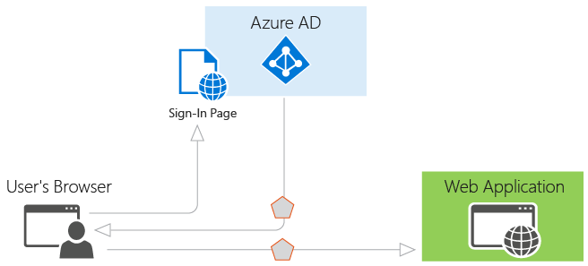

<properties
   pageTitle="Authentifizierungsszenarien Azure AD-| Microsoft Azure"
   description="Übersicht über die fünf häufigsten Authentifizierungsszenarien für Azure Active Directory (AAD)"
   services="active-directory"
   documentationCenter="dev-center-name"
   authors="bryanla"
   manager="mbaldwin"
   editor=""/>

<tags
   ms.service="active-directory"
   ms.devlang="na"
   ms.topic="article"
   ms.tgt_pltfrm="na"
   ms.workload="identity"
   ms.date="09/16/2016"
   ms.author="mbaldwin"/>

# Authentifizierungsszenarien Azure AD-

Azure Active Directory (Azure AD) vereinfacht Authentifizierung für Entwickler durch Identität als Quelle Dienst, mit Unterstützung für Industriestandard-Protokolle, wie z. B. OAuth 2.0, und verbinden Sie OpenID sowie geöffneten Bibliotheken für unterschiedliche Plattformen, damit Sie schnell Programmieren beginnen können. Dieses Dokument hilft Ihnen grundlegende Informationen zu den verschiedenen Szenarios Azure AD unterstützt und wird gezeigt, wie Sie die ersten Schritte. Es ist in die folgenden Abschnitte unterteilt:

- [Grundlagen der Azure AD-Authentifizierung](#basics-of-authentication-in-azure-ad)

- [Ansprüche in Sicherheitstokens Azure AD-](#claims-in-azure-ad-security-tokens)

- [Grundlagen zum Registrieren einer Anwendung in Azure Active Directory](#basics-of-registering-an-application-in-azure-ad)

- [Anwendungstypen und Szenarien](#application-types-and-scenarios)

  - [Webbrowser zu Webanwendung](#web-browser-to-web-application)

  - [Einzelne Seite Anwendung (SP a)](#single-page-application-spa)

  - [Systemeigene Anwendung Web-API](#native-application-to-web-api)

  - [Webanwendung Web-API](#web-application-to-web-api)

  - [Daemon oder Server-Anwendung Web-API](#daemon-or-server-application-to-web-api)

## Grundlagen der Azure AD-Authentifizierung

Wenn Sie mit der grundlegenden Konzepte der Authentifizierung in Azure AD nicht vertraut sind, lesen Sie diesen Abschnitt. Andernfalls, wenn Sie nach unten zu [Anwendungstypen und Szenarien](#application-types-and-scenarios)überspringen möchten.

Sehen Sie sich das grundlegendste Szenario, in dem Identität erforderlich: ein Benutzer in einem Webbrowser zu einer Webanwendung Authentifizierung erforderlich. Dieses Szenario wird im [Webbrowser zu Webanwendung](#web-browser-to-web-application) Abschnitt ausführlicher beschrieben, aber es ist sinnvoll Ausgangspunkt veranschaulichen die Funktionen von Azure AD-und Begriffen wie das Szenario funktioniert. Erwägen Sie das folgende Diagramm für dieses Szenario:

Wie das Diagramm über Punkte hier müssen die verschiedenen Komponenten kennen:

- Azure AD ist der Identitätsanbieter zum Überprüfen der Identität von Benutzern und Anwendungen, die in einer Organisation Verzeichnis vorhanden sind, sowie zum schließlich ausgeben Sicherheitstokens nach der erfolgreichen Authentifizierung von diesen Benutzern und Applikationen verantwortlich ist.

- Eine Anwendung, die möchte Azure AD-Authentifizierung auslagern muss in Azure AD registriert sein, der registriert und identifiziert die app im Verzeichnis.

- Entwickler können die Quelle öffnen Azure AD-Authentifizierung Bibliotheken verwenden, um Authentifizierung einfach zu machen, indem Sie die Protokolldetails für Sie behandeln. Weitere Informationen finden Sie unter [Azure Active Directory-Authentifizierung Bibliotheken](active-directory-authentication-libraries.md) .

•, Nachdem ein Benutzer authentifiziert wurde, muss die Anwendung überprüfen Sicherheitstoken des Benutzers, um sicherzustellen, dass die Authentifizierung für den beabsichtigten Parteien erfolgreich war. Die bereitgestellte Authentifizierung Bibliotheken können Entwickler um Validierung von einem beliebigen Token aus Azure Active Directory, einschließlich JSON Web Token (JWT) oder SAML 2.0 zu behandeln. Wenn Sie die Überprüfung manuell ausführen möchten, finden Sie in der Dokumentation [JWT Token Ereignishandler](https://msdn.microsoft.com/library/dn205065.aspx) .

> [AZURE.IMPORTANT] Azure AD verwendet öffentlichem Schlüssel Token melden, und stellen Sie sicher, dass sie gültig sind. Lesen Sie [Wichtige Informationen zu signieren Schlüssel Rollover in Azure AD](active-directory-signing-key-rollover.md) Weitere Informationen zu den erforderlichen Logik müssen in Ihrer Anwendung, um sicherzustellen, dass verfügen immer mit den neuesten Schlüsseln aktualisiert wird.

• Des Ablaufs Besprechungsanfragen und Antworten für den Authentifizierungsprozess wird durch das Authentication-Protokoll, das verwendet wurde, wie OAuth 2.0, OpenID verbinden, bestimmt WS-Verbund oder SAML 2.0. Diese Protokolle werden im Thema [Azure Active Directory-Authentifizierungsprotokolle](active-directory-authentication-protocols.md) und in den folgenden Abschnitten ausführlicher erläutert.

> [AZURE.NOTE] Azure AD unterstützt OAuth 2.0 und verbinden OpenID Standards umfassenden machen wiederzuverwenden Person Token, einschließlich der Person Token als JWTs dargestellt. Eine Person Token ist ein einfaches Sicherheitstoken, den "Person" den Zugriff auf eine geschützte Ressource gewährt. In diesem Sinne ist die "Person" einer Partei, die das Token präsentieren kann. Obwohl eine Party zuerst mit Azure AD erhalten das Token Person authentifizieren muss, wenn die erforderlichen Schritte zum Token im Übertragung und Speicherung gesichert nicht geöffnet werden, können Sie abgefangen und durch einen dritten unbeabsichtigte verwendet werden. Während einige Sicherheitstokens eine integrierte Funktionalität für verhindern, dass unbefugten sie verwendet haben, werden Person Token verfügen nicht über dieses Verfahren und in einem sicheren Kanal wie z. B. Transport Layer Security (HTTPS) übertragen werden müssen. Bei der Übertragung einer Person Token als Klartext kann ein Mann-in der mittleren Angriffen verwendet werden durch bösartige dritte das Token erfassen und diese für einen nicht autorisierten Zugriff auf eine geschützte Ressource verwenden. Diese Sicherheitsprinzipien gelten beim Speichern oder Person Token zur späteren Verwendung zwischenspeichern. Immer Stellen Sie sicher, dass eine Anwendung übermittelt und Person Token auf sichere Weise speichert. Weitere Sicherheitsaspekte auf Person Token finden Sie unter [RFC 6750 Abschnitt 5](http://tools.ietf.org/html/rfc6750).

Jetzt, da Sie einen Überblick über die Grundlagen verfügen, lesen Sie die Abschnitte unten, um das Verständnis der Funktionsweise der Bereitstellung in Azure AD und die allgemeinen Szenarien Azure AD unterstützt.

## Ansprüche in Sicherheitstokens Azure AD-

Ausgestellt von Azure AD Sicherheitstokens enthalten Ansprüche oder Assertionen von Informationen über den Betreff, der authentifiziert wurde. Diese Ansprüche können von der Anwendung für verschiedene Aufgaben verwendet werden. Beispielsweise können sie das Token überprüfen, identifizieren den Betreff des Directory Mandanten, Benutzerinformationen anzeigen, bestimmen den Betreff der Autorisierung und usw. verwendet werden. Die Ansprüche in einem beliebigen angegebenen Sicherheitstoken vorhanden sind hängt von der Art der Token, den Typ der Anmeldeinformationen zum Authentifizieren des Benutzers und der Anwendungskonfiguration verwendet. Eine kurze Beschreibung der einzelnen Anfordern von Azure AD ausgegeben wird in der folgenden Tabelle bereitgestellt. Weitere Informationen finden Sie in [Token unterstützt und Ansprüche](active-directory-token-and-claims.md).

| Anfordern | Beschreibung |
|-------|-------------|
| ID der Anwendung | Identifiziert die Anwendung, die das Token verwendet wird.
| Zielgruppe | Gibt die Empfänger Ressource, die, der für das Token vorgesehen ist. |
| Referenz für Kontext die Anwendung Authentifizierung | Gibt an, wie der Client authentifizierten (öffentlich-Clients im Vergleich zu vertraulichen Client) wurde. |
| Chatnachrichten Authentifizierung | Einträge Datum und Uhrzeit, wann die Authentifizierung stattgefunden hat. |
| Authentifizierungsmethode | Zeigt an, wie der gewünschten Betreff für die Token authentifiziert wurde (Kennwort, Zertifikat usw.). |
| Vorname | Der Vorname des Benutzers bietet gemäß Azure AD. |
| Gruppen | Enthält die Ids Azure AD-Objektgruppen, die, denen der Benutzer ein Mitglied ist. |
| Identitätsanbieter | Einträge der Identitätsanbieter, die den gewünschten Betreff für die Token authentifiziert. |
| Ausgestellt am | Einträge die Uhrzeit, an der das Token für token Aktualität häufig verwendet ausgestellt wurde. |
| Herausgeber | Gibt den STS, die das Token als auch den Azure AD-Mandanten ausgegeben. |
| Nachname | Der Nachname des Benutzers bietet gemäß Azure AD. |
| Namen | Stellt einen Menschen lesbaren Wert, der den gewünschten Betreff für die Token bezeichnet. |
| Objekt-Id | Enthält einen unveränderlichen, eindeutigen Bezeichner des Betreffs in Azure Active Directory. |
| Rollen | Enthält die Anzeigenamen von Azure AD-Anwendungsrollen, die der Benutzer gewährt wurde. |
| Bereich | Zeigt die Berechtigungen der Clientanwendung an. |
| Betreff | Zeigt an, die der Tilgungsanteile darüber, die welche Informationen von das Token bestätigt. |
| Mandanten-Id | Enthält einen unveränderlichen, eindeutigen Bezeichner im Verzeichnis Mandanten, die das Token ausgestellt. |
| Token Lebensdauer | Definiert das Zeitintervall, in dem ein Token gültig ist. |
| Benutzerprinzipalnamen | Enthält die Benutzerprinzipalnamen des Betreff an. |
| Version | Enthält die Versionsnummer der das Token. |

## Grundlagen zum Registrieren einer Anwendung in Azure Active Directory

Jede Anwendung, die mit dem Konfigurieren Azure AD-Authentifizierung beauftragt muss im Verzeichnis registriert werden. Dieser Schritt umfasst besagt Azure AD zu Ihrer Anwendung, einschließlich der URL an, wo es hat abgelegt, die URL nach der Authentifizierung, den URI zum Identifizieren der Anwendung und weitere Antworten senden. Diese Informationen sind ein paar wichtige Gründen erforderlich:

- Azure AD benötigt Koordinaten zur Kommunikation mit der Anwendung, bei der Behandlung von anmelden oder Austausch von Token. Hierzu gehören folgende:

  - Anwendung-ID-URI: Der Bezeichner für eine Anwendung. Dieser Wert wird an Azure AD während der Authentifizierung gesendet, um anzugeben, welche Anwendung Anrufer Token für möchte. Darüber hinaus ist dieser Wert im Token enthalten, damit die Anwendung weiß, dass sie das gewünschte Ziel wurde.

  - URL und URI umleiten antworten: im Falle einer Web-API oder Web-Anwendung, die Antwort-URL ist die Position, an die Azure AD die Authentifizierungsantwort senden wird, einschließlich ein Token aus, wenn die Authentifizierung erfolgreich war. Im Falle einer systemeigenen Anwendung ist der URI umleiten einen eindeutigen Bezeichner zu dem Azure AD des Benutzer-Agents in einer Anforderung OAuth 2.0 umleiten wird.

  - Client-ID: Die ID für eine Anwendung von Azure AD generiert wird, wenn die Anwendung registriert ist. Beim Anfordern einer Autorisierungscode oder Token werden das Client-ID und Schlüssel zu Azure AD während der Authentifizierung gesendet.

  - Schlüssel: Der Schlüssel, der zusammen mit einer Client-ID gesendet wird bei der Authentifizierung zu Azure AD eine Web-API aufrufen.

- Azure AD muss, um sicherzustellen, dass die Anwendung verfügt über die erforderlichen Berechtigungen zum Zugriff auf Ihre Daten Directory anderer Anwendungen in Ihrer Organisation, usw.

Bereitgestellt wird übersichtlicher, wenn Sie wissen, dass es gibt zwei Feldkategorien für Applikationen, die entwickelt und mit Azure AD integriert werden können:

- Einzelne Anwendung Mandanten: eine einzelne Mandanten Anwendung für die Verwendung in einer Organisation vorgesehen ist. Dies sind in der Regel Line-of-Business (LoB) Applications von einem Enterprise-Entwickler geschrieben. Nur eine einzelne Mandanten Anwendung von Benutzern in einem Verzeichnis zugegriffen werden muss, und daher nur muss in einem Verzeichnis bereitgestellt werden. Diese Anwendungen werden in der Regel durch ein Entwickler in der Organisation registriert.

- Mehrere Mandanten Anwendung: eine Anwendung mit mehreren Mandanten ist für die Verwendung in vielen Organisationen vorgesehen, nicht nur eine Organisation. Dies sind in der Regel Software-as-a-Service (SaaS) Applications geschrieben durch eine unabhängige Software Softwareanbietern (). Mehrere Mandanten Applications in jedem Verzeichnis, in dem sie verwendet werden, die Benutzer oder Administrator Zustimmung zur Registrierung erforderlich ist, bereitgestellt werden müssen. Dieses Verfahren Zustimmung wird gestartet, wenn eine Anwendung im Verzeichnis registriert wurde und der Zugriff auf die Graph-API oder mögliches anderes Web API gewährt wird. Wenn ein Benutzer oder Administrator aus einer anderen Organisation anmeldet, die Anwendung zu verwenden, sind sie ein Dialogfeld angezeigt, in dem die Berechtigungen angezeigt, die die Anwendung erfordert. Der Benutzer oder der Administrator kann dann mit der Anwendung, Zustimmung ermöglicht die Anwendungszugriff auf die angegebenen Daten und schließlich registriert die Anwendung in ihrem Verzeichnis. Weitere Informationen finden Sie unter [Übersicht über das Framework Zustimmung](active-directory-integrating-applications.md#overview-of-the-consent-framework).

Einige weitere Aspekte treten bei der Entwicklung einer Anwendungs mit mehreren Mandanten anstelle einer einzelnen Mandanten Anwendung. Beispielsweise wenn Sie Benutzer in mehreren Verzeichnissen Ihrer Anwendung verfügbar gemacht werden, benötigen Sie ein Verfahren zum bestimmen, welche Mandanten diese sich befinden. Eine einzelne Mandanten Anwendung muss nur in einem eigenen Verzeichnis für einen Benutzer, suchen Sie während ein bestimmtes Benutzers aus allen Verzeichnissen in Azure AD identifizieren eine Anwendung mit mehreren Mandanten muss. Um diese Aufgabe auszuführen, stellt Azure AD einen gemeinsamen Authentifizierung Endpunkt, wo eine Anwendung mit mehreren Mandanten anmeldeanforderungen, statt einen Mandanten-spezifische Endpunkt direkte kann. Dieser Endpunkt ist https://login.microsoftonline.com/common für alle Verzeichnisse in Azure AD während ein Endpunkt Mandanten-spezifische https://login.microsoftonline.com/contoso.onmicrosoft.com ist. Der gemeinsame Endpunkt ist besonders wichtig, bei der Entwicklung Ihrer Anwendungs, da Sie die notwendigen Logik verarbeitet mehrere Mandanten während Anmeldung, Abmeldung und token Überprüfung benötigen.

Wenn Sie aktuell eine einzelnen Mandanten-Anwendung entwickeln, aber es zu viele Organisationen zur Verfügung stellen möchten, können Sie einfach die Anwendung und seine Konfiguration in Azure AD, mit mehreren Mandanten wird in ändern. Darüber hinaus verwendet Azure AD demselben signierenden Schlüssel für alle Token in allen Verzeichnissen, ob Sie in einer einzelnen Mandanten oder mit mehreren Mandanten Anwendung Authentifizierung bereitstellen.

Jedes Szenario aufgeführt, die in diesem Dokument enthält einen untergeordnete Abschnitt, der die Anforderungen provisioning beschrieben. Umfassender Informationen für die Bereitstellung der Anwendung in Azure Active Directory und die Unterschiede zwischen einzelner und mehrerer Mandanten Clientanwendungen finden Sie unter [Integration von Applications mit Azure Active Directory](active-directory-integrating-applications.md) für Weitere Informationen. Die häufige Anwendungsszenarien in Azure AD Grundlegendes zum Lesen Sie weiter.

## Anwendungstypen und Szenarien

Jedes der in diesem Dokument beschriebenen Szenarien kann mit verschiedenen Sprachen und Plattformen entwickelt werden. Diese werden alle von abgeschlossen Codebeispielen unterstützt die unsere [Codebeispielen Leitfaden](active-directory-code-samples.md)oder direkt aus den entsprechenden [Github Stichprobe Repositorys](https://github.com/Azure-Samples?utf8=%E2%9C%93&query=active-directory)verfügbar sind. Darüber hinaus, wenn die Anwendung eines bestimmten Stück oder Segment einer End-to-End-Szenario benötigt, kann in den meisten Fällen die Funktionalität unabhängig voneinander hinzugefügt werden. Beispielsweise, wenn Sie eine systemeigene Anwendung, die eine Web-API ruft verfügen, können Sie einfach eine Webanwendung hinzufügen, die auch im Web API ruft. Das folgende Diagramm veranschaulicht diese Szenarien und den Anwendungstypen, und wie die verschiedene Komponenten hinzugefügt werden können:

Dies sind die fünf primären Anwendungsszenarien von Azure AD unterstützt:

- [Webbrowser zu Webanwendung](#web-browser-to-web-application): ein Benutzer muss eine Webanwendung anmelden, der durch Azure AD gesichert wird.

- [(Gesicherte KENNWORTAUTHENTIFIZIERUNG einzelne Seite Anwendung)](#single-page-application-spa): ein Benutzer muss eine einzelne Seite Anwendung anmelden, der durch Azure AD gesichert wird.

- [Systemeigene Anwendung Web-API](#native-application-to-web-api): authentifizieren ein Benutzers zum Abrufen von Ressourcen aus einem Web-API, der durch Azure AD gesichert wird muss eine systemeigene Anwendung, die auf einem Mobiltelefon, PC oder einem Tablet-PC ausgeführt wird.

- [Webanwendung mit Web-API](#web-application-to-web-api): eine Webanwendung aus einem Web-API durch Azure AD gesicherte Ressourcen abrufen muss.

- [Daemon oder eine Anwendung Server Web-API](#daemon-or-server-application-to-web-api): einer Daemon oder einer Anwendung Server ohne Web-Benutzeroberfläche aus einem Web-API durch Azure AD gesicherte Ressourcen abrufen muss.

### Webbrowser zu Webanwendung

In diesem Abschnitt werden die Anwendung, die ein Benutzer in einem Webbrowser zu einer Webanwendung authentifiziert. In diesem Szenario weist die Webanwendung Browser des Benutzers zu Azure AD anmelden. Azure AD gibt eine Antwort Anmeldung über den Browser des Benutzers, der über den Benutzer in ein Sicherheitstoken Ansprüche enthält. Dieses Szenario unterstützt anmelden über die Protokolle WS-Verbund, SAML 2.0 und OpenID verbinden.

#### Diagramm

#### Beschreibung der Protokoll Fluss

1. Wenn ein Benutzer die Anwendung und muss anmelden besucht, werden sie über eine Anforderung Anmeldung an den Endpunkt Authentifizierung in Azure AD umgeleitet.

2. Der Benutzer, die auf der Anmeldeseite signiert werden.

3. Wenn Authentifizierung erfolgreich ist, wird Azure AD erstellt eine Authentifizierungstoken und gibt eine Antwort Anmeldung, auf die URL der Anwendung Antworten, die im Verwaltungsportal Azure konfiguriert wurde. Für eine Anwendung Herstellung sollten diese URL Antworten HTTPS aus. Das zurückgegebene Token enthält Ansprüche Azure AD-und Benutzer, die von der Anwendung überprüft das Token erforderlich sind.

4. Die Anwendung überprüft das Token mithilfe von einem öffentlichen signierenden und Herausgeber-Informationen verfügbar am Dokument Metadaten Föderation, für Azure AD an. Nachdem Sie die Anwendung das Token überprüft wurde, startet Azure AD eine neue Sitzung mit dem Benutzer. Diese Sitzung ermöglicht dem Benutzer die Anwendung zugreifen, bis sie abgelaufen ist.

#### Codebeispielen

Webanwendung Szenarien finden Sie unter der Codebeispielen für Webbrowser. Und, aktivieren Sie häufig – wir fügen neue Beispiele immer hinzu. [Webbrowser zu Webanwendung](active-directory-code-samples.md#web-browser-to-web-application).

#### Registrieren

- Einzelne Mandanten: Wenn Sie nur für Ihre Organisation eine Anwendung erstellen, muss es im Verzeichnis Ihres Unternehmens registriert sein mithilfe der Azure-Verwaltungsportal.

- Mit mehreren Mandanten: Wenn Sie eine Anwendung erstellen, die von Benutzern außerhalb Ihrer Organisation verwendet werden können, es im Verzeichnis Ihres Unternehmens registriert sein muss, aber auch muss registriert im Verzeichnis für jede Organisation, die die Anwendung verwendet wird. Um eine Anwendung in ihrem Verzeichnis verfügbar zu machen, können Sie einen Anmeldevorgang für Ihre Kunden, die sie an Ihrer Anwendung Zustimmung ermöglicht einbeziehen. Wenn sie für eine Anwendung registrieren, werden sie für ein Dialogfeld, in dem die Berechtigungen angezeigt, die die Anwendung erfordert, und klicken Sie dann die Option zum Zustimmung angezeigt werden. Je nach den erforderlichen Berechtigungen möglicherweise ein Administrator in der anderen Organisation müssen Sie Zustimmung erteilen. Wenn der Benutzer oder Administrator einwilligt, wird die Anwendung in ihrem Verzeichnis registriert. Weitere Informationen finden Sie unter [Integration von Applications mit Azure Active Directory](active-directory-integrating-applications.md).

#### Token Ablauf

Die Sitzung des Benutzers läuft ab, wenn die Gültigkeitsdauer des das Token ausgestellt von Azure AD läuft ab. Eine Anwendung kann dieses Zeitraums gegebenenfalls wie Benutzer auf Grundlage einer Zeitspanne Abmelden kürzen. Wenn die Sitzung abläuft, wird der Benutzer aufgefordert werden, erneut anmelden.

### Einzelne Seite Anwendung (SP a)

In diesem Abschnitt werden die Authentifizierung für eine einzelne Seite-Anwendung, die verwendet Azure AD und der OAuth 2.0 implizit Autorisierung erteilen, um secure sein Web API wieder zu beenden. Einzelne Seite Applikationen sind in der Regel als JavaScript Präsentation Layer (front-End) strukturiert, die im Browser und in einem Web-API Back-End, die auf einem Server ausgeführt wird und der Anwendung von Geschäftslogik implementiert wird ausgeführt. Weitere Informationen zu den implizite Autorisierung, finden Sie unter erteilen, und Sie entscheiden, ob er für Ihr Anwendungsszenario richtig ist Hilfe [Grundlegendes zu den OAuth2 implizit erteilen Fluss in Azure Active Directory](active-directory-dev-understanding-oauth2-implicit-grant.md).

In diesem Szenario Wenn sich der Benutzer signiert des JavaScript front-End verwendet [Active Directory-Authentifizierungsbibliothek für JavaScript (ADAL. JS)](https://github.com/AzureAD/azure-activedirectory-library-for-js/tree/dev) und die implizite Autorisierung erteilen Azure AD ein ID-Token (Id_token) erhältlich. Das Token wird zwischengespeichert und der Client fügt ihn an die Anfrage als Person Token Wenn Anrufe an die Web-API back-End, die durch die OWIN Middleware abgesichert. 
#### Diagramm

#### Beschreibung der Protokoll Fluss

1. Der Benutzer navigiert an den Webanwendung.

2. Die Anwendung gibt das JavaScript-front-End (Präsentation Layer) an den Browser.

3. Der Benutzer initiiert beispielsweise anmelden, indem Sie auf Link bei der Anmeldung bei. Im Browser sendet einen GET an den Endpunkt des Azure AD-Autorisierung an eine Token-ID anfordern. Diese Anforderung umfasst die Abfrageparameter die Client-ID "und" Antwort-URL.

4. Azure AD überprüft, ob die Antwort URL gegen die registrierten Antwort-URL, die im Verwaltungsportal Azure konfiguriert wurde.

5. Der Benutzer, die auf der Anmeldeseite signiert werden.

6. Wenn die Authentifizierung erfolgreich ist, Azure AD erstellt ein ID-Token abgerufen und als ein URL-Fragment (#) auf die URL der Anwendung Antworten. Für eine Anwendung Herstellung sollten diese URL Antworten HTTPS aus. Das zurückgegebene Token enthält Ansprüche Azure AD-und Benutzer, die von der Anwendung überprüft das Token erforderlich sind.

7. Im Browser ausgeführtes JavaScript-Client-Code extrahiert das Token aus einer Antwort mit Sichern von Anrufe an der Anwendung Web, dass API wieder zu beenden.

8. Der Browser ruft der Anwendung Web-API zurück, die mit dem Access-Token in der Kopfzeile Autorisierung beenden.

#### Codebeispielen

Finden Sie in den Codebeispielen für Szenarien (gesicherte KENNWORTAUTHENTIFIZIERUNG einzelne Seite Anwendung) aus. Achten Sie darauf, um wieder zu häufig prüfen – wir fügen neue Beispiele immer hinzu. [Einzelne Seite Anwendung (SP a)](active-directory-code-samples.md#single-page-application-spa).

#### Registrieren

- Einzelne Mandanten: Wenn Sie nur für Ihre Organisation eine Anwendung erstellen, muss es im Verzeichnis Ihres Unternehmens registriert sein mithilfe der Azure-Verwaltungsportal.

- Mit mehreren Mandanten: Wenn Sie eine Anwendung erstellen, die von Benutzern außerhalb Ihrer Organisation verwendet werden können, es im Verzeichnis Ihres Unternehmens registriert sein muss, aber auch muss registriert im Verzeichnis für jede Organisation, die die Anwendung verwendet wird. Um eine Anwendung in ihrem Verzeichnis verfügbar zu machen, können Sie einen Anmeldevorgang für Ihre Kunden, die sie an Ihrer Anwendung Zustimmung ermöglicht einbeziehen. Wenn sie für eine Anwendung registrieren, werden sie für ein Dialogfeld, in dem die Berechtigungen angezeigt, die die Anwendung erfordert, und klicken Sie dann die Option zum Zustimmung angezeigt werden. Je nach den erforderlichen Berechtigungen möglicherweise ein Administrator in der anderen Organisation müssen Sie Zustimmung erteilen. Wenn der Benutzer oder Administrator einwilligt, wird die Anwendung in ihrem Verzeichnis registriert. Weitere Informationen finden Sie unter [Integration von Applications mit Azure Active Directory](active-directory-integrating-applications.md).

Nach dem Registrieren der Anwendungs, muss es OAuth 2.0 implizit erteilen Protokoll konfiguriert sein. Standardmäßig ist dieses Protokoll für Applikationen deaktiviert. Um das Protokoll OAuth2 implizit erteilen für eine Anwendung zu aktivieren, herunterladen Sie Anwendungsmanifest aus dem Azure-Verwaltungsportal, setzen Sie den Wert "oauth2AllowImplicitFlow" auf True, und Laden Sie die Manifesten zurück-Portal an. Weitere Informationen finden Sie unter [Aktivieren OAuth 2.0 implizit Grant für einzelne Seite Applikationen](active-directory-integrating-applications.md).

#### Token Ablauf

Wenn Sie ADAL.js zum Verwalten der Authentifizierung mit Azure AD verwenden, haben Sie mehrere Features, die erleichtern Aktualisieren einer abgelaufenen Token sowie das erste Token für zusätzliche Web-API Ressourcen, die von der Anwendung aufgerufen werden können. Bei erfolgreicher des Benutzers mit Azure AD Authentifizierung wird eine Sitzung, die durch ein Cookie gesicherte für den Benutzer, die im Browser und in Azure AD-eingerichtet. Es ist wichtig, beachten Sie, dass die Sitzung zwischen dem Benutzer und Azure AD- und nicht zwischen dem Benutzer und der Webanwendung auf dem Server vorhanden ist. Wenn ein Sicherheitstoken abläuft, wird mit ADAL.js dieser Sitzung im Hintergrund ein anderes Token abgerufen. Dies geschieht mithilfe einen ausgeblendeten iFrame zum Senden und empfangen die Anforderung über das Protokoll OAuth implizit erteilen. ADAL.js können auch diese gleiche Verfahren im Hintergrund Access Token Azure AD für andere Web erhältlich API Ressourcen, die die Anwendung ruft als Unterstützung für diese Ressourcen Cross-Origin Ressource Freigabe (CORS), werden in dem Verzeichnis des Benutzers registriert, und alle erforderlichen Zustimmung durch den Benutzer bei der Anmeldung angegeben wurde.

### Systemeigene Anwendung Web-API

In diesem Abschnitt werden eine systemeigene Anwendung, die eine Web-API im Auftrag eines Benutzers Anrufe an. Dieses Szenario basiert auf dem OAuth 2.0 Autorisierung Code erteilen mit einem öffentlichen Client, wie im Abschnitt 4.1 der [OAuth 2.0-Spezifikation](http://tools.ietf.org/html/rfc6749)beschrieben. Die native Anwendung erhält eine Access-Token für den Benutzer mit dem OAuth 2.0-Protokoll. Dieses Token Access wird in der Besprechungsanfrage im Web-API, die autorisiert den Benutzer, und gibt die gewünschte Ressource gesendet.

#### Diagramm

#### Authentifizierung Fluss für systemeigene Anwendung-API

#### Beschreibung der Protokoll Fluss

Wenn Sie die AD-Authentifizierung Bibliotheken verwenden, werden die meisten nachfolgend beschriebenen Protokolldetails für Sie, wie der Browser Popup, Zwischenspeichern von token und Behandlung von aktualisieren Token behandelt.

1. Verwenden eines Browsers Popupmenü, die ursprüngliche Anwendung in Azure Active Directory eine Anforderung an den Endpunkt Autorisierung stellt. Diese Anforderung enthält die Client-ID und die Umleitung URI der systemeigenen Anwendung wie im Verwaltungsportal und die Anwendung URI-ID für das Web-API dargestellt. Wenn der Benutzer bereits angemeldet noch nicht, werden sie aufgefordert, sich erneut anmelden

2. Azure AD authentifiziert den Benutzer. Wenn es eine Anwendung mit mehreren Mandanten ist und Zustimmung erforderlich ist, um die Anwendung verwenden, wird der Benutzer müssen Sie Zustimmung, wenn sie dies noch nicht getan haben. Nach der Zustimmung erteilen und nach der erfolgreichen Authentifizierung Probleme Azure AD eine Antwort für Autorisierung Code wieder in der Clientanwendung umleiten URI aus.

3. Wenn Azure AD eine Autorisierung Code Antwort an den URI-Umleitung Probleme, wird der Clientanwendung Browser Interaktion Tabstopps und der Autorisierungscode aus der Antwort extrahiert. Mithilfe des folgenden Autorisierungscodes, sendet die Clientanwendung eine Anforderung an token Azure AD-Endpunkt, die den Autorisierungscode enthält, die details zu der Clientanwendung (Client-ID und URI-Umleitung), und die gewünschte Ressource (Anwendung URI-ID für das Web-API).

4. Die Autorisierungscode und Informationen zu den Client-Anwendung und Web-API werden durch Azure AD überprüft. Bei einer erfolgreichen Validierung gibt Azure AD zwei Token: ein JWT Access Token und ein JWT aktualisieren Token. Darüber hinaus gibt Azure AD grundlegenden Informationen zu den Benutzer, wie z. B. deren Anzeige Name und Mandanten-ID an.

5. Über HTTPS mithilfe die Clientanwendung das zurückgegebene JWT Access Token JWT Zeichenfolge mit einer Bezeichnung "Person" in der Kopfzeile Autorisierung der Anfrage im Web-API hinzugefügt. Das Web-API das JWT Token überprüft und wenn die Überprüfung erfolgreich ist, gibt die gewünschte Ressource.

6. Wenn die Access-Sicherheitstoken abläuft, wird die Clientanwendung eine Fehlermeldung angezeigt, die angibt, dass der Benutzer muss erneut authentifizieren. Wenn die Anwendung ein aktualisieren gültiger Token verfügt, kann es, ein neues Access Token zu erhalten, ohne dass der Benutzer erneut anmelden verwendet werden. Wenn das Aktualisierung Token abläuft, müssen die Anwendung interaktiv erneut authentifizieren des Benutzers.

> [AZURE.NOTE] Das Aktualisieren Token ausgestellt von Azure AD kann Zugriff auf mehrere Ressourcen verwendet werden. Wenn Sie eine Clientanwendung, die Berechtigung zum Aufrufen von zwei Web APIs hat verfügen, kann beispielsweise das Aktualisieren Token verwendet werden token im anderen Web API sowie eine zugreifen.

#### Codebeispielen

Systemeigene Anwendung zu Web-API Szenarien finden Sie unter den Codebeispielen. Und, aktivieren Sie häufig – wir fügen neue Beispiele immer hinzu. [Systemeigene Anwendung Web API](active-directory-code-samples.md#native-application-to-web-api).

#### Registrieren

- Einzelne Mandanten: Beide systemeigenen Anwendung und das Web API müssen im selben Verzeichnis in Azure AD registriert sein. Im Web API kann konfiguriert werden, um einen Satz von Berechtigungen, die verwendet werden, um die ursprüngliche Anwendung Zugriff auf ihre Ressourcen zu beschränken, verfügbar zu machen. Klicken Sie dann die Clientanwendung markiert die gewünschten Berechtigungen aus der Dropdown-Menü "Berechtigungen zu anderen Applications" im Verwaltungsportal Azure.

- Mehrere Mandanten: Zuerst registriert die ursprüngliche Anwendung immer nur in der Entwickler oder des Herausgebers Verzeichnis. Zweites, ist die ursprüngliche Anwendung so konfiguriert, dass die Berechtigungen anzugeben, die gesamte Funktionalität erforderlich ist. Diese Liste der erforderlichen Berechtigungen wird in einem Dialogfeld angezeigt, wenn ein Benutzer oder Administrator im Zielverzeichnis Zustimmung zur Anwendung, bietet, sodass sie für ihre Organisation verfügbar ist. Einige Programme erfordern nur Benutzerdatensicherheits-Berechtigungen, die jeder Benutzer in der Organisation zu Zustimmung kann. Andere Programme erfordern Administratorrechte, die ein Benutzer in der Organisation zu Zustimmung nicht möglich. Ein Directory-Administrator kann Zustimmung auf Applikationen gewähren, die diese Berechtigungsstufe benötigen. Wenn der Benutzer oder Administrator einwilligt, wird nur das Web-API in ihrem Verzeichnis registriert. Weitere Informationen finden Sie unter [Integration von Applications mit Azure Active Directory](active-directory-integrating-applications.md).

#### Token Ablauf

Wenn die ursprüngliche Anwendung deren Autorisierungscode wird verwendet, um eine Access JWT token erhalten, erhält das Programm auch ein JWT aktualisieren Token. Wenn die Access-Sicherheitstoken abläuft, kann das Aktualisieren Token erneut Authentifizierung des Benutzers, ohne dass diese erneut anmelden verwendet werden. Dieses Token aktualisieren wird dann zum Authentifizieren des Benutzers, die Ergebnisse in einer neuen Access-Token und Token aktualisieren.

### Webanwendung Web-API

In diesem Abschnitt werden eine Anwendung, die aus einem Web-API abzurufenden Ressourcen benötigt. In diesem Szenario stehen zwei Identität, die die Webanwendung zum Authentifizieren und rufen Sie das Web-API verwenden können: eine Anwendungsidentität oder delegierte Benutzeridentität.

*Anwendungsidentität:* Dieses Szenario verwendet OAuth 2.0 Client Anmeldeinformationen erteilen die Authentifizierung als die Anwendung und das Web-API zugreifen. Wenn eine Anwendungsidentität, das Web mit API nur erkennen kann, dass die Webanwendung, das Anrufen als im Web erhält API alle Informationen der Benutzer nicht. Wenn die Anwendung Informationen über den Benutzer empfängt, über das Anwendungsprotokoll gesendet wird, und es ist nicht von Azure AD signiert. Im Web API vertraut, dass die Anwendung der Benutzer authentifiziert. Aus diesem Grund heißt dieses Muster ein vertrauenswürdiges Subsystem.

*Delegiert Benutzeridentität:* Dieses Szenario auf zwei Arten durchgeführt werden kann: OpenID verbinden und OAuth 2.0 Autorisierung Code erteilen mit einem vertraulichen Client. Die Webanwendung erhält eine Access-Token für den Benutzer, die der Benutzer erfolgreich authentifiziert, mit der Webanwendung und die Web-Anwendung konnte delegierten Benutzeridentität zum Aufrufen des Web-API abzurufenden, erweist sich im Web API als. Dieses Token Access wird in der Besprechungsanfrage im Web-API gesendet, die autorisiert den Benutzer, und gibt die gewünschte Ressource.

#### Diagramm

#### Beschreibung der Protokoll Fluss

Die Anwendungsidentität und delegierten Identität Benutzertypen werden in den folgenden Fluss erläutert. Der wesentliche Unterschied zwischen den beiden ist, dass die delegierte Benutzeridentität zuerst einen Autorisierungscode erwerben muss, bevor der Benutzer kann Anmeldung und auf im Web-API zugreifen.

##### Anwendungsidentität mit OAuth 2.0 Client Anmeldeinformationen erteilen

1. Ein Benutzer bei Azure AD in der Webanwendung angemeldet ist (siehe oben [Webbrowser zu Webanwendung](#web-browser-to-web-application) ).

2. Die Anwendung muss eine Access-Token zu erfassen, damit es im Web-API authentifizieren und die gewünschte Ressource abrufen kann. Dies ist eine Anforderung an Azure AD-token Endpunkt, die Anmeldeinformationen, Client-ID und Webanwendung-APIs URI-ID bereitstellen.

3. Azure AD authentifiziert die Anwendung, und gibt eine JWT Access Token, die Nummer im Web API verwendet wird.

4. Über HTTPS verwendet die Anwendung das zurückgegebene JWT Access Token JWT Zeichenfolge mit einer Bezeichnung "Person" in der Kopfzeile Autorisierung der Anfrage im Web-API hinzuzufügen. Das Web-API das JWT Token überprüft und wenn die Überprüfung erfolgreich ist, gibt die gewünschte Ressource.

##### Verbinden mit OpenID delegierten Benutzeridentität

1. Ein Benutzer bei einer Webanwendung mithilfe von Azure AD angemeldet ist (siehe Abschnitt [Webbrowser zu Webanwendung](#web-browser-to-web-application) ). Wenn der Benutzer im Webanwendung noch nicht bis zum Zulassen der Anwendung im Web API in seinem Namen aufrufen zugestimmt hat, muss der Benutzer Zustimmung. Die Anwendung zeigt die Berechtigungen, die erforderlich ist, und wenn der Berechtigungen der Stufe Administrator sind, normaler Benutzer im Verzeichnis ist nicht möglich, Zustimmung. Dieses Verfahren Zustimmung gilt nur für mehrere Mandanten Applications, keine einzelnen Mandanten-Anwendungen, wie die Anwendung bereits über die erforderlichen Berechtigungen verfügt. Bei der Anmeldung des Benutzers, erhalten die Webanwendung ein ID-Token mit Informationen zu den Benutzer als auch eine Autorisierungscode ein.

2. Verwenden den Autorisierungscode ausgestellt von Azure AD, sendet die Anwendung eine Anforderung an token Azure AD-Endpunkt, die den Autorisierungscode enthält, die details zu der Clientanwendung (Client-ID und URI-Umleitung), und die gewünschte Ressource (Anwendung URI-ID für das Web-API) an.

3. Die Autorisierungscode und Informationen zu den Web-Anwendung und Web-API werden durch Azure AD überprüft. Bei einer erfolgreichen Validierung gibt Azure AD zwei Token: ein JWT Access Token und ein JWT aktualisieren Token.

4. Über HTTPS verwendet die Anwendung das zurückgegebene JWT Access Token JWT Zeichenfolge mit einer Bezeichnung "Person" in der Kopfzeile Autorisierung der Anfrage im Web-API hinzuzufügen. Das Web-API das JWT Token überprüft und wenn die Überprüfung erfolgreich ist, gibt die gewünschte Ressource.

##### Delegierte Benutzeridentität mit OAuth 2.0 Autorisierung Code erteilen

1. Ein Benutzer ist bereits mit einem Webanwendung, angemeldet, deren Authentifizierungsmethode unabhängig von Azure AD ist.

2. Die Webanwendung ist einen Autorisierungscode zum Erfassen von einer Access-Token, sodass es eine Anforderung über den Browser zu Azure AD-Autorisierung Endpunkt, die Client-ID bereitstellen Probleme und umleiten URI für die Web-Anwendung nach dem erfolgreiche Authentifizierung erforderlich. Der Benutzer meldet sich bei Azure AD.

3. Wenn der Benutzer im Webanwendung noch nicht bis zum Zulassen der Anwendung im Web API in seinem Namen aufrufen zugestimmt hat, muss der Benutzer Zustimmung. Die Anwendung zeigt die Berechtigungen, die erforderlich ist, und wenn der Berechtigungen der Stufe Administrator sind, normaler Benutzer im Verzeichnis ist nicht möglich, Zustimmung. Dieses Verfahren Zustimmung gilt nur für mehrere Mandanten Applications, keine einzelnen Mandanten-Anwendungen, wie die Anwendung bereits über die erforderlichen Berechtigungen verfügt.

4. Nach der Benutzer zugestimmt hat, erhält die Webanwendung den Autorisierungscode, den es einer Access-Token abrufen muss.

5. Verwenden den Autorisierungscode ausgestellt von Azure AD, sendet die Anwendung eine Anforderung an token Azure AD-Endpunkt, die den Autorisierungscode enthält, die details zu der Clientanwendung (Client-ID und URI-Umleitung), und die gewünschte Ressource (Anwendung URI-ID für das Web-API) an.

6. Die Autorisierungscode und Informationen zu den Web-Anwendung und Web-API werden durch Azure AD überprüft. Bei einer erfolgreichen Validierung gibt Azure AD zwei Token: ein JWT Access Token und ein JWT aktualisieren Token.

7. Über HTTPS verwendet die Anwendung das zurückgegebene JWT Access Token JWT Zeichenfolge mit einer Bezeichnung "Person" in der Kopfzeile Autorisierung der Anfrage im Web-API hinzuzufügen. Das Web-API das JWT Token überprüft und wenn die Überprüfung erfolgreich ist, gibt die gewünschte Ressource.

#### Codebeispielen

Web Application to Web-API Szenarien finden Sie unter den Codebeispielen. Und, aktivieren Sie häufig – wir fügen neue Beispiele immer hinzu. Web- [Anwendung Web API](active-directory-code-samples.md#web-application-to-web-api).

#### Registrieren

- Einzelne Mandanten: Für die Anwendungsidentität und delegierter Benutzer Identität Fällen muss die Webanwendung und die Web-API im selben Verzeichnis in Azure AD registriert werden. Im Web API kann konfiguriert werden, um einen Satz von Berechtigungen, die zum Einschränken der Web-Anwendung Zugriff auf ihre Ressourcen verwendet werden, verfügbar zu machen. Wenn Sie ein delegierten Identität Benutzertyp verwendet wird, muss die Webanwendung wählen Sie die gewünschten Berechtigungen aus der Dropdown-Menü "Berechtigungen to Other Applications" im Verwaltungsportal Azure. Dieser Schritt ist nicht erforderlich, wenn der Typ der Identität verwendet wird.

- Mehrere Mandanten: Zuerst wird die Webanwendung konfiguriert um die Berechtigungen anzugeben, die gesamte Funktionalität erforderlich ist. Diese Liste der erforderlichen Berechtigungen wird in einem Dialogfeld angezeigt, wenn ein Benutzer oder Administrator im Zielverzeichnis Zustimmung zur Anwendung, bietet, sodass sie für ihre Organisation verfügbar ist. Einige Programme erfordern nur Benutzerdatensicherheits-Berechtigungen, die jeder Benutzer in der Organisation zu Zustimmung kann. Andere Programme erfordern Administratorrechte, die ein Benutzer in der Organisation zu Zustimmung nicht möglich. Ein Directory-Administrator kann Zustimmung auf Applikationen gewähren, die diese Berechtigungsstufe benötigen. Wenn der Benutzer oder Administrator einwilligt, werden die Webanwendung und die Web-API beide in ihrem Verzeichnis erfasst.

#### Token Ablauf

Wenn Sie die Webanwendung deren Autorisierungscode wird verwendet, um eine Access JWT token abrufen, erhält das Programm auch ein JWT aktualisieren Token. Wenn die Access-Sicherheitstoken abläuft, kann das Aktualisieren Token erneut Authentifizierung des Benutzers, ohne dass diese erneut anmelden verwendet werden. Dieses Token aktualisieren wird dann zum Authentifizieren des Benutzers, die Ergebnisse in einer neuen Access-Token und Token aktualisieren.

### Daemon oder Server-Anwendung Web-API

In diesem Abschnitt werden eine Daemon oder Server-Anwendung, die aus einem Web-API abzurufenden Ressourcen benötigt. Es gibt zwei untergeordnete Szenarien, die in diesem Abschnitt anwenden: Daemon, die eine Web-API auf OAuth 2.0 Anmeldeinformationen erteilen Clienttyp; erstellt anrufen muss und eine Server-Anwendung (beispielsweise ein Web-API), die eine Web-API auf OAuth 2.0 On-Behalf-Of Entwurfsspezifikation erstellt anrufen muss.

Für das Szenario ist es, wenn eine Anwendung Daemon eine Web-API aufrufen muss wichtig, ein paar Punkte zu verstehen. Interaktion mit dem Benutzer ist zunächst nicht möglich, mit einer Daemon-Anwendung, die die Anwendung, dass ihre eigene Identität erforderlich ist. Ein Beispiel für eine Anwendung Daemon ist eine Stapelverarbeitung oder einen Betriebssystem-Dienst im Hintergrund ausgeführt. Diese Art von Anwendung einer Access-Token anfordert, indem Sie seine Anwendungsidentität und präsentieren dessen Client-ID, Anmeldeinformationen (Kennwort oder Zertifikat) und Anwendung zu Azure AD-ID-URI. Nach der erfolgreichen Authentifizierung empfängt der Daemon eine Access-Token aus Azure Active Directory, die dann im Web API Aufrufen verwendet wird.

Für das Szenario ist es, wenn eine Server-Anwendung eine Web-API aufrufen muss hilfreich, verwenden Sie ein Beispiel. Stellen Sie sich vor, dass ein Benutzer auf einer systemeigenen Anwendung authentifiziert hat, und diese systemeigene Anwendung eine Web-API aufrufen muss. Azure AD Probleme ein JWT Access Token, um im Web-API aufzurufen. Wenn die Web-API ein anderes untergeordneten Web API aufrufen muss, können es im Auftrag von illustrieren Stellvertretung die Identität des Benutzers und der zweiten Ebene Web API authentifizieren verwenden.

#### Diagramm

#### Beschreibung der Protokoll Fluss

##### Anwendungsidentität mit OAuth 2.0 Client Anmeldeinformationen erteilen

1. Zunächst erforderlich die Server-Anwendung mit Azure AD als solches, ohne Eingriff Menschen wie eine interaktive Anmeldung-Dialogfeld Authentifizierung. Dies ist eine Anforderung an Azure AD-token Endpunkt, die Anmeldeinformationen, Client-ID und Anwendung URI-ID bereitstellen.

2. Azure AD authentifiziert die Anwendung, und gibt eine JWT Access Token, die Nummer im Web API verwendet wird.

3. Über HTTPS verwendet die Anwendung das zurückgegebene JWT Access Token JWT Zeichenfolge mit einer Bezeichnung "Person" in der Kopfzeile Autorisierung der Anfrage im Web-API hinzuzufügen. Das Web-API das JWT Token überprüft und wenn die Überprüfung erfolgreich ist, gibt die gewünschte Ressource.

##### Delegierte Benutzeridentität OAuth 2.0 im Auftrag von Entwurf-Spezifikation

Illustrieren erläutert wird vorausgesetzt, dass auf einer anderen Anwendung (beispielsweise eine systemeigene Anwendung) ein Benutzer authentifiziert wurde und die Identität des Benutzers verwendet wurde, um eine Access-Token der ersten Ebene Web API zu erfassen.

1. Die ursprüngliche Anwendung sendet das Access-Token der ersten Ebene Web API.

2. Die ersten Ebene Web-API sendet eine Anforderung an token Azure AD-Endpunkt, Bereitstellen von dessen Client-ID und Anmeldeinformationen als auch die Access Token des Benutzers. Darüber hinaus wird die Anfrage gesendet, mit einer on_behalf_of Parameter, die im Web zeigt an, API neue Token Aufrufen eine untergeordnete Web API im Auftrag des ursprünglichen Benutzers anfordert.

3. Azure AD überprüft, ob das ersten Ebene Web API verfügt über Berechtigungen zum Zugriff auf das zweite Ebene Web-API und die Anforderung einer JWT Access Token zurückgeben überprüft und eine JWT Aktualisieren der ersten Ebene Web API Token.

4. Über HTTPS Ruft die ersten Ebene Web-API klicken Sie dann im zweiten Ebene Web API ZugewiesenAn token in der Kopfzeile Autorisierung in der Besprechungsanfrage auf. Im ersten Ebene Web API kann fahren Sie mit das zweiten Ebene Web API aufrufen, solange die Access-Token und aktualisieren Token gültig sind.

#### Codebeispielen

Daemon oder eine Anwendung Server Web-API Szenarien finden Sie unter den Codebeispielen. Und, aktivieren Sie häufig – wir fügen neue Beispiele immer hinzu. [Server- oder Daemon Anwendung Web-API](active-directory-code-samples.md#server-or-daemon-application-to-web-api)

#### Registrieren

- Einzelne Mandanten: Für die Anwendungsidentität und delegierter Benutzer Identität Fällen muss die Anwendung Daemon oder Server im selben Verzeichnis in Azure AD registriert werden. Im Web API kann konfiguriert werden, um einen Satz von Berechtigungen, die zum Einschränken der Daemon oder des Servers Zugriff auf ihre Ressourcen verwendet werden, verfügbar zu machen. Wenn ein delegierter Identität Benutzertyp verwendet wird, muss wählen Sie die gewünschten Berechtigungen aus der Dropdown-Menü "Berechtigungen zu anderen Applications" im Verwaltungsportal Azure die Server-Anwendung. Dieser Schritt ist nicht erforderlich, wenn der Typ der Identität verwendet wird.

- Mehrere Mandanten: Zuerst ist die Anwendung Daemon oder Server konfiguriert um die Berechtigungen anzugeben, die gesamte Funktionalität erforderlich ist. Diese Liste der erforderlichen Berechtigungen wird in einem Dialogfeld angezeigt, wenn ein Benutzer oder Administrator im Zielverzeichnis Zustimmung zur Anwendung, bietet, sodass sie für ihre Organisation verfügbar ist. Einige Programme erfordern nur Benutzerdatensicherheits-Berechtigungen, die jeder Benutzer in der Organisation zu Zustimmung kann. Andere Programme erfordern Administratorrechte, die ein Benutzer in der Organisation zu Zustimmung nicht möglich. Ein Directory-Administrator kann Zustimmung auf Applikationen gewähren, die diese Berechtigungsstufe benötigen. Wenn der Benutzer oder Administrator einwilligt, registriert beide im Web-APIs in ihrem Verzeichnis.

#### Token Ablauf

Wenn die erste Anwendung deren Autorisierungscode wird verwendet, um eine Access JWT token erhalten, erhält das Programm auch ein JWT aktualisieren Token. Wenn die Access-Sicherheitstoken abläuft, können Sie das Token aktualisieren verwendet werden zum Authentifizieren des Benutzers erneut ohne Anmeldeinformationen anzufordern. Dieses Token aktualisieren wird dann zum Authentifizieren des Benutzers, die Ergebnisse in einer neuen Access-Token und Token aktualisieren.

## Siehe auch

[Azure-Active Directory Developer's Guide](active-directory-developers-guide.md)

[Azure-Active Directory-Codebeispielen](active-directory-code-samples.md)

[Wichtige Informationen zur Azure AD Key Rollover anmelden](active-directory-signing-key-rollover.md)

[OAuth 2.0 in Azure Active Directory](https://msdn.microsoft.com/library/azure/dn645545.aspx)
