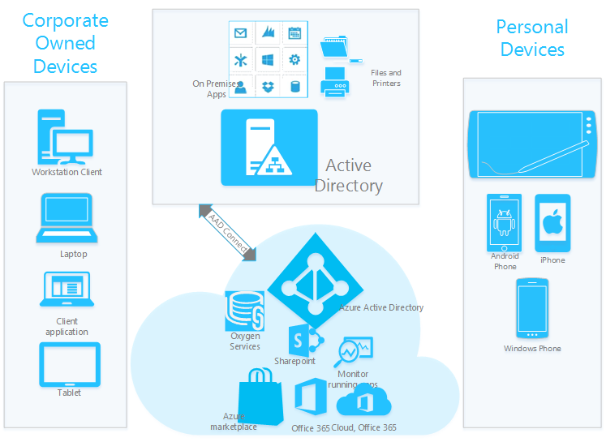

<properties
    pageTitle="Erweitern von Cloud-Funktionen, die auf Windows-10-Geräte über Azure Active Directory teilnehmen | Microsoft Azure"
    description="Stellt einen detaillierten Überblick darüber, wie Windows 10 Geräte als Azure AD Verknüpfung auf Azure Active Directory registriert erhalten nutzen können."
    services="active-directory"
    documentationCenter=""
    authors="femila"
    manager="swadhwa"
    editor=""
    tags="azure-classic-portal"/>

<tags
    ms.service="active-directory"
    ms.workload="identity"
    ms.tgt_pltfrm="na"
    ms.devlang="na"
    ms.topic="article"
    ms.date="09/27/2016"
    ms.author="femila"/>

# Erweitern Sie die Cloud-Funktionen, die auf Windows-10-Geräte über Azure Active Directory teilnehmen

## Was ist Azure Active Directory teilnehmen?
Azure Active Directory teilnehmen (Azure AD-Join) steht die Funktionalität, die ein Gerät im Besitz eines Unternehmens in Azure Active Directory zentrale Verwaltung des Geräts aktivieren registriert. Es ermöglicht es für Benutzer, z. B. Mitarbeiter und Studierende Verbindung in der Cloud Enterprise über Azure Active Directory. Dadurch vereinfachte Windows-Bereitstellungen und Zugriff auf organisationsinterne apps und Ressourcen aus einem beliebigen Gerät Windows beide corporate im Besitz und privat genutzte (BYOD).

Azure AD-Verknüpfung ist für Unternehmen, die Cloud ersten/Cloud nur-– sind in der Regel kleine und mittlere Unternehmen vorgesehen, die nicht über eine lokale Windows Server Active Directory-Infrastruktur verfügen. Diese genannten, Azure AD-Verknüpfung kann und auch verwendet werden große Organisationen auf Geräten, die nicht in der Lage Ausführen einer Verknüpfung traditionelle Domäne (mobilen Geräten, beispielsweise), oder für Benutzer, die hauptsächlich benötigen Zugriff auf Office 365 oder andere Azure AD SaaS apps sind.

Obwohl die Verknüpfung traditionelle Domäne weiterhin, dass die beste lokal auf Geräten nutzen möchten, in der Domäne beitritt sind, bietet, eignet sich Azure AD-Verknüpfung für Geräte, die beitreten zu einer Domäne nicht möglich. Azure AD-Verknüpfung eignet sich auch zum Verwalten von Benutzern in der Cloud. Dies geschieht mithilfe von Funktionen von mobilen Geräten Management statt mithilfe von Tools zum Projektmanagement traditionell die Domäne wie Gruppenrichtlinien und System Center Konfigurations-Manager (SCCM).

## Warum sollte Unternehmen Azure AD teilnehmen annehmen?

* **Unternehmen, die hauptsächlich in der Cloud befinden**: Wenn Sie verschoben wurde oder in einem Modell, in dem Sie sind der lokalen verkleinern und weiteren Funktionen in der Cloud arbeiten möchten, verschieben, Azure AD teilnehmen konnte profitieren Sie. Sie haben vielleicht Azure AD-Konten manuell oder über das Synchronisieren von Ihrem lokalen Active Directory erstellt. In beiden Fällen müssen Sie ein Konto in Azure AD, und sie Anmeldung bei Windows 10 verwenden können. Ihre Benutzer können ihre Computer mit Azure AD über entweder die Out-of-Box-Experience (OOBE) oder über das Menü Einstellungen zu verknüpfen. Nach dem Beitritt, werden Benutzer einzelne einmaliges Anmelden (SSO) Zugriff auf Cloudressourcen wie Office 365 in einem Browser oder in Office-Clientanwendungen genießen.

* **Bildungseinrichtungen**: einer der wir zu häufig hören Szenarios ist, dass Bildungseinrichtungen zwei Benutzertypen: Fakultäten und Studenten. Lehrkräfte gelten längerfristige Mitglieder der Organisation, damit wünschenswert lokale Konten erstellen ist. Aber Schüler sind shorter-term Mitglieder der Organisation und können daher in Azure Active Directory verwaltet werden. Dies bedeutet, dass in der Cloud gespeicherten lokalen Verzeichnis Maßstab abgelegt werden kann. Dies bedeutet auch, dass Schüler melden Sie sich bei Windows mit ihren Azure AD-Konten und Zugriff auf Office 365-Ressourcen in einem Browser oder in Office-Clientanwendungen können.

* **Einzelhandel Unternehmen**: ein weiteres Szenario wir einmal von Kunden schon haben wird ihrem Wunsch saisonale Kollegen einfacher verwalten.  Konten für längerfristige, permanente Mitarbeiter werden erneut in der Regel erstellt, während der lokalen Konten auf Computern Domänenverbund. Aber saisonale Worker angehören shorter-term der Organisation, damit es ist sinnvoll, die sie verwalten, in dem Benutzerlizenzen einfacher verschoben werden können. Erstellen diese Benutzerkonten in der Cloud mit Office 365-Lizenzen kann die Benutzer können Sie die Vorteile einer Anmeldung bei Windows und Office-Anwendungen mit einem Azure AD-Konto zu gelangen. In der Zwischenzeit verwalten Sie größere Flexibilität mit ihren Lizenzen aus, wenn sie verlassen haben.
* **Andere Unternehmen**:, obwohl Sie Benutzer in Ihrem lokalen Active Directory verwalten, Sie konnte weiterhin nutzbringend müssen Benutzer Azure AD-verknüpft werden. Dies liegt daran Azure AD bietet ein einfacheres verknüpfen, effiziente Gerätemanagement, automatische Mobilgerät Management Registrierung und Funktion zum einmaligen Anmelden für Azure AD- und lokalen Ressourcen.  

## Welche Funktionen bietet Azure AD teilnehmen?
Bei Azure AD teilnehmen erhalten Sie Folgendes:

* **Eigene Bereitstellung von Geräten im Unternehmen im Besitz**: unter Windows 10 Benutzer ein Gerät ganz neuen, eingeschweißt in der Out-of-Box-Oberfläche ohne IT Einbeziehung konfigurieren können.

* **Unterstützung für moderne Formularfaktoren**: Azure AD-Verknüpfung funktioniert auf Geräten, die Funktionen teilnehmen traditionelle die Domäne besitzen.  

* **Unterstützung für vorhandene Organisationskonten**: Benutzer nicht mehr benötigen, erstellen und Verwalten eines persönlichen Microsoft-Konto können Sie am besten auf Unternehmen ausgestellt Geräten zu gelangen, wie mit Windows 8. Sie können ihre vorhandene Arbeit Konten in Azure AD stattdessen verwenden. Für viele Organisationen bedeutet dies im Wesentlichen, dass Benutzer eingerichtet und melden Sie sich bei Windows mit den gleichen Anmeldeinformationen, die sie für den Zugriff auf Office 365 verwenden können.

* **Automatische Mobilgerät Management Registrierung**: Geräte automatisch in mobilen Gerät-Verwaltung, sofern mit Azure AD verbunden registriert werden können. Dieses Verfahren funktioniert mit Microsoft Intune und Partner Mobilgerät Management-Lösungen. Wenn Gerätemanagement mit Intune fertig ist, können IT-Administratoren Monitor/Azure AD-beigetreten Geräte entlang Domänenverbund Geräte in der SCCM-Verwaltungskonsole verwalten.

* **Einmaliges Anmelden zu Unternehmensressourcen**: Benutzer Einfacheres einmaliges Anmelden aus dem Windows-Desktop-apps und Ressourcen in der Cloud, wie Office 365 und Tausende von branchenanwendungen, die auf Azure AD für Authentifizierung über [Azure AD verbinden](active-directory-azureadjoin-deployment-aadjoindirect.md)aufsetzen. Im Besitz eines Corporate Geräte, die Azure AD angehören, Einbindung von auch SSO auf lokale Ressourcen das Gerät wird in einem Netzwerk Ihres Unternehmens, von überall aus, wenn diese Ressourcen über den [Azure AD-Anwendungsproxy](https://msdn.microsoft.com/library/azure/Dn768219.aspx)verfügbar gemacht werden.

* **OS Zustand Roaming**: barrierefreiheitseinstellungen, Websites, Wi-Fi-Kennwörter und andere Einstellungen über Geräte Ihres Unternehmens im Besitz eines synchronisiert, ohne dass ein persönliches Microsoft-Konto.

* **Enterprise-fähige Windows Store**: im Windows Store unterstützt app Acquisition und Lizenzierung mit Azure AD-Konten. Organisationen können Volumenlizenz apps, und nehmen sie an die Benutzer in ihrer Organisation.

## Wie arbeite verschiedene Geräte mit Azure AD teilnehmen?

| Corporate Gerät (Verbindung zu lokalen Domäne)                                                                                                                                                                                         | Corporate Gerät (beigetreten in der Cloud)                                                                                                                                                                                                                                                                                                                                                                                                                                                                                                                     | Persönliches Gerät                                                                                                         |
|-----------------------------------------------------------------------------------------------------------------------------------------------------------------------------------------------------------------------------------------|-------------------------------------------------------------------------------------------------------------------------------------------------------------------------------------------------------------------------------------------------------------------------------------------------------------------------------------------------------------------------------------------------------------------------------------------------------------------------------------------------------------------------------------------------------------|------------------------------------------------------------------------------------------------------------------------|
| Benutzer können mit Arbeit Anmeldeinformationen bei Windows anmelden, (wie bisher).                                                                                                                                                                        | Benutzer können Windows mit Arbeit Anmeldeinformationen anmelden, die in Azure Active Directory verwaltet werden. Dies trifft für corporate Geräte in drei Fällen: 1) die Organisation nicht Active Directory lokal (beispielsweise ein kleines Unternehmen) haben. 2) die Organisation nicht alle Benutzerkonten in Active Directory erstellen (z. B. Konten für Schüler, Berater oder saisonale Kollegen werden nicht erstellt in Active Directory). 3) in der Organisation wurde corporate Geräte, die an eine Domäne (lokal), wie Mobiltelefonen oder Tablets eine Mobile SKU (beispielsweise einer sekundären Gerät getroffen, um eine Fabrik/Retail Etage) ausgeführt Join möglich ist. Azure AD-Verknüpfung unterstützt corporate Geräte für verwaltete und partnerverbundkontakte Organisationen teilnehmen an. | Benutzer melden sich bei Windows mit ihren persönlichen Microsoft-Konto-Anmeldeinformationen (keine Änderung).                                                |
| Benutzer können den Zugriff auf roaming Einstellungen und die Enterprise-Windows Store. Diese Dienste arbeiten mit Arbeit Konten und kein persönliches Microsoft-Konto erforderlich. Organisationen, deren lokalen Active Directory Azure AD Verbindung setzt.                                        | Benutzer können Self-service-Setup ausführen. Er können durchlaufen die erste Ausführung (FRX) über ihre Arbeit-Konto als Alternative zum Bereitstellen von IT Probleme die Geräte, obwohl beide Methoden unterstützt werden.                                                                                                                                                                                                                                                                                                                                                                             | Benutzer können einfach ein Arbeit-Konto, das verwaltet wird in Active Directory oder Azure AD-hinzufügen.                                                      |
| Benutzer können SSO Möglichkeit vom Desktop entwickelt apps, Websites und Ressourcen – einschließlich lokalen Ressourcen und Cloud-apps, die für die Authentifizierung Azure AD verwenden.                                                                                                            | Geräte werden automatisch im Verzeichnis Enterprise (Azure AD-) registriert und registriert automatisch in die Verwaltung mobiler Geräte. (Azure AD-Premium Feature).                                                                                                                                                                                                                                                                                                                                                                                                                                                  | Benutzer können SSO Möglichkeit über apps und Websites/Ressourcen mit diesem Konto Arbeit.                                              |
| Benutzer können ihre persönlichen Microsoft-Konten Zugriff auf ihre persönlichen Bildern und Dateien beeinträchtigt Enterprise-Daten hinzufügen. (Roaming Settings weiterhin ihre Arbeit Konten konzipiert.) Das Microsoft-Konto ermöglicht SSO und nicht mehr Laufwerke das roaming von Einstellungen.  | Benutzer haben das Zurücksetzen eines Kennworts Self-service (SSPR) auf Winlogon, was bedeutet, dass sie ein vergessenes Kennwort zurücksetzen können. (Azure AD-Premium Feature).                                                                                                                                                                                                                                                                                                                                                                                                                                   | Benutzer haben Zugriff auf die Enterprise-Windows Store aus, damit sie erfassen und Branchen apps auf ihren persönlichen Geräten verwenden können. |                                                               |

## Weitere Informationen
* [Windows-10 für das Unternehmen: Methoden für die Arbeit mit Geräten](active-directory-azureadjoin-windows10-devices-overview.md)
* [Erweitern Sie die Cloud-Funktionen, die auf Windows-10-Geräte über Azure Active Directory teilnehmen](active-directory-azureadjoin-user-upgrade.md)
* [Authentifizieren von Identitäten ohne Kennwörter über Microsoft Passport](active-directory-azureadjoin-passport.md)
* [Informationen Sie zu Szenarios für die Verwendung für Azure AD teilnehmen](active-directory-azureadjoin-deployment-aadjoindirect.md)
* [Herstellen einer Verbindung Azure AD für Windows 10 Erfahrung mit Domänenverbund Geräte](active-directory-azureadjoin-devices-group-policy.md)
* [Einrichten von Azure AD teilnehmen](active-directory-azureadjoin-setup.md)
