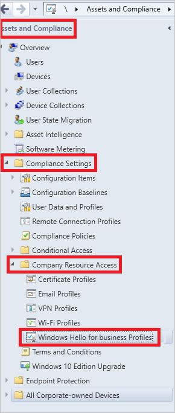
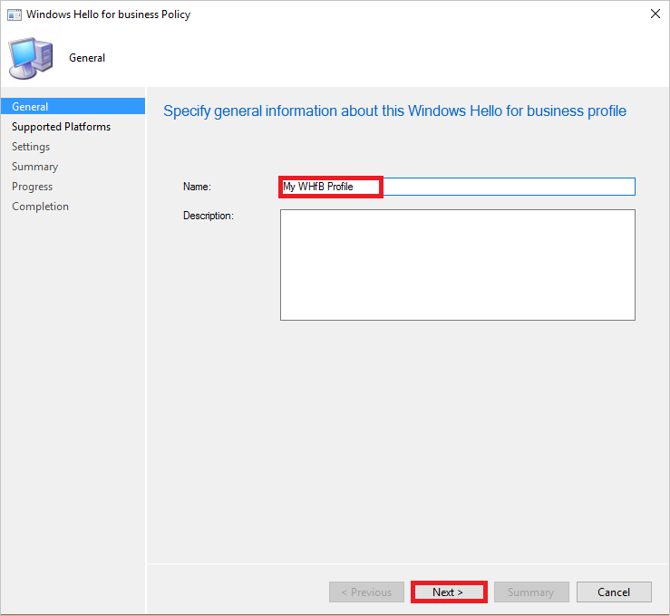
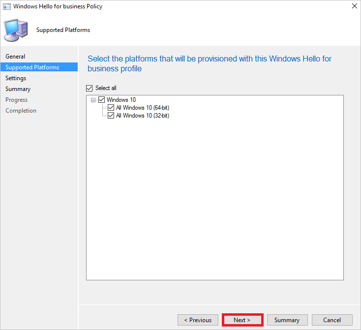
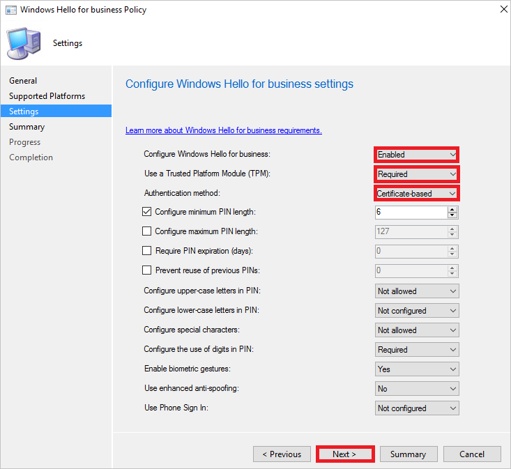

<properties
    pageTitle="Aktivieren Sie das Microsoft Windows Hallo for Business in Ihrer Organisation | Microsoft Azure"
    description="Bereitstellung Anweisungen Microsoft Passport in Ihrer Organisation zu aktivieren."
    services="active-directory"
    documentationCenter=""
    keywords="Konfigurieren von Microsoft Passport, Microsoft Windows Hallo für Business-Bereitstellung"
    authors="markusvi"
    manager="femila"
    editor=""
    tags="azure-classic-portal"/>

<tags
    ms.service="active-directory"
    ms.workload="identity"
    ms.tgt_pltfrm="na"
    ms.devlang="na"
    ms.topic="article"
    ms.date="10/11/2016"
    ms.author="markvi"/>

# Aktivieren Sie das Microsoft Windows Hallo for Business in Ihrer Organisation

Nach dem [Herstellen einer Verbindung Windows 10 Domänenverbund Geräte mit Azure Active Directory](active-directory-azureadjoin-devices-group-policy.md)gehen Sie wie folgt vor, um Microsoft Windows Hallo for Business in Ihrer Organisation zu aktivieren:

1. Bereitstellen von System Center-Konfigurations-Manager  

2. Konfigurieren von Richtlinieneinstellungen

3. Konfigurieren des Zertifikats Profils  

## Bereitstellen von System Center-Konfigurations-Manager 

Um Benutzerzertifikate basierend auf Windows Hallo für Business Schlüssel bereitstellen zu können, benötigen Sie Folgendes:

- **System Center-Konfigurations-Manager aktuellen Zweig** - Version 1606 oder eine bessere installieren müssen. Weitere Informationen finden Sie in der [Dokumentation für System Center-Konfigurations-Manager](https://technet.microsoft.com/library/mt346023.aspx) und [System Center-Konfigurations-Manager-Teamblog](http://blogs.technet.com/b/configmgrteam/archive/2015/09/23/now-available-update-for-system-center-config-manager-tp3.aspx).
- **Öffentlicher Schlüssel Infrastruktur** - Microsoft Windows Hallo für Unternehmen aktivieren unter Verwendung von Benutzerzertifikaten, müssen Sie eine Infrastruktur öffentlicher Schlüssel angeordnet. Wenn verfügen Sie nicht über eine oder nicht es für von Benutzerzertifikaten verwenden möchten, können Sie einen neuen Domain Controller bereitstellen, der Windows Server 2016 Build 10551 (oder besser) installiert wurde. Führen Sie die Schritte zum [Installieren von Active Directory in einer vorhandenen Domäne](https://technet.microsoft.com/library/jj574134.aspx) oder [eine neue Active Directory-Gesamtstruktur, wenn Sie eine neue Umgebung erstellen, zu installieren](https://technet.microsoft.com/library/jj574166). (Die ISOs sind zum Download auf [Signiant Medien Exchange](https://datatransfer.microsoft.com/signiant_media_exchange/spring/main?sdkAccessible=true)zur Verfügung.)

## Konfigurieren von Richtlinieneinstellungen

Wenn Sie die Microsoft Windows Hallo für Einstellungen für die Informationsverwaltungsrichtlinie konfigurieren, haben Sie zwei Optionen:

- Gruppenrichtlinien in Active Directory. 
- Die System Center-Konfigurations-Manager 

Mithilfe von Gruppenrichtlinien in Active Directory ist die empfohlene Methode zum Microsoft Windows Hallo für Einstellungen für die Informationsverwaltungsrichtlinie konfigurieren. 

Mit System Center-Konfigurations-Manager ist die bevorzugte Methode, wenn Sie auch zum Bereitstellen von Zertifikaten verwenden. Dieses Szenario:

- Gewährleistet Kompatibilität mit der neueren Bereitstellungsszenarien
- Auf dem Client Windows 10 Version 1607 oder besser erfordert.

### Konfigurieren von Microsoft Windows Hallo für Unternehmen über Gruppenrichtlinien in Active Directory.

 
**Schritte aus**:

1.  Server-Manager zu öffnen, und navigieren Sie zu **Tools** > **Gruppenrichtlinien-Verwaltungskonsole**.
2.  Navigieren Sie zu den Domänenknoten, der die Domäne entspricht, in dem Sie Azure AD teilnehmen aktivieren möchten, aus der Gruppenrichtlinien-Verwaltungskonsole.
3.  Mit der rechten Maustaste in **Die Richtlinienobjekte gruppieren**, und wählen Sie **neu**aus. Benennen Sie Ihre Gruppenrichtlinienobjekt, z. B. aktivieren Windows Hallo für Unternehmen. Klicken Sie auf **OK**.
4.  Mit der rechten Maustaste in das neue Gruppenrichtlinienobjekt, und wählen Sie dann auf **Bearbeiten**.
5.  Navigieren Sie zur **Konfiguration des Computers** > **Richtlinien** > **Administrative Vorlagen** > **Windows-Komponenten** > **Windows Hallo für Unternehmen**.
6.  Mit der rechten Maustaste **Aktivieren Windows Hallo für Unternehmen**, und wählen Sie dann auf **Bearbeiten**.
7.  Wählen Sie das Optionsfeld **aktiviert** , und klicken Sie dann auf **Übernehmen**. Klicken Sie auf **OK**.
8.  Sie können jetzt das Gruppenrichtlinienobjekt an einem Speicherort Ihrer Wahl verknüpfen. Um diese Richtlinie für alle Domänenverbund Windows 10 Geräte in Ihrer Organisation zu aktivieren, verknüpfen Sie die Gruppenrichtlinien mit der Domäne aus. Beispiel:
 - Eine bestimmte Organisationseinheit (Organisationseinheit) in Active Directory, in dem Windows 10 Domänenverbund Computern gespeichert werden sollen.
 - Eine bestimmte Sicherheitsgruppe, die Windows 10 Domänenverbund Computern enthält, die automatisch mit Azure AD erfasst werden soll

### Konfigurieren von Windows Hallo for Business mit System Center-Konfigurations-Manager

**Schritte aus**:

1. Öffnen Sie das **System Center-Konfigurations-Manager**, und navigieren Sie zu **Anlagen und Compliance > Compliance-Einstellungen > Unternehmen Ressource Access > Windows Hallo für Business Profile**.

    

2. Klicken Sie oben auf der Symbolleiste **Erstellen Windows Hallo für Business Profil**ein.

    

2. Klicken Sie im Dialogfeld **Allgemeine** führen Sie die folgenden Schritte aus:

    

    ein. Geben Sie in das Textfeld **Name** einen Namen für Ihr Profil, beispielsweise **Mein WHfB Profil**ein.

    b. Klicken Sie auf **Weiter**.

2. Wählen Sie die Plattformen, die mit diesem Windows Hallo für Business Profil bereitgestellt werden sollen, und klicken Sie dann auf **Weiter**, klicken Sie im Dialogfeld **Unterstützte Plattformen** .

    

2. Führen Sie die folgenden Schritte aus, klicken Sie im Dialogfeld **Einstellungen** :

    

    ein. Wählen Sie unter **Konfigurieren von Windows Hallo für Unternehmen** **aktiviert**.

    b. Wählen Sie als **eine vertrauenswürdige Platform-Modul (TPM) verwenden** **erforderlich**. 

    c. Wählen Sie als **Authentifizierungsmethode** **basierenden Zertifikats**ein.

    d. Klicken Sie auf **Weiter**.

2. Klicken Sie im Dialogfeld **Zusammenfassung** auf **Weiter**.

2. Klicken Sie auf **Schließen**, klicken Sie im Dialogfeld **Abschluss** .

2. Klicken Sie oben auf der Symbolleiste auf **Bereitstellen**.

    

## Konfigurieren des Zertifikats Profils 

Wenn Sie Zertifikaten basierende Authentifizierung für lokale Authentifizierung verwenden, müssen Sie konfigurieren und Bereitstellen eines Profils Zertifikat. Diese Aufgabe erfordert die Einrichtung einer NDES Server und die Einfügemarke Zertifikat Website Rolle im System Center-Konfigurations-Manager. Weitere Informationen hierzu finden Sie unter der [Voraussetzung für Zertifikatsprofile im Konfigurations-Manager](https://technet.microsoft.com/library/dn261205.aspx).

1. Öffnen Sie das **System Center-Konfigurations-Manager**, und navigieren Sie zu **Anlagen und Compliance > Compliance-Einstellungen > Unternehmen Ressource Access > Zertifikatsprofile**.

2. Wählen Sie eine Vorlage, die Smartcard Anmeldung erweiterte Key Verwendung (EKU) enthält.

Auf der Seite **SCEP Registrierung** des Profils Zertifikat müssen Sie wählen Sie als **Key Storage Provider** **Installieren Passport für die Arbeit, die andernfalls ein Fehler auftreten** .

## Nächste Schritte
* [Windows-10 für das Unternehmen: Methoden für die Arbeit mit Geräten](active-directory-azureadjoin-windows10-devices-overview.md)
* [Erweitern Sie die Cloud-Funktionen, die auf Windows-10-Geräte über Azure Active Directory teilnehmen](active-directory-azureadjoin-user-upgrade.md)
* [Authentifizieren von Identitäten ohne Kennwörter über Microsoft Passport](active-directory-azureadjoin-passport.md)
* [Informationen Sie zu Szenarios für die Verwendung für Azure AD teilnehmen](active-directory-azureadjoin-deployment-aadjoindirect.md)
* [Herstellen einer Verbindung Azure AD für Windows 10 Erfahrung mit Domänenverbund Geräte](active-directory-azureadjoin-devices-group-policy.md)
* [Einrichten von Azure AD teilnehmen](active-directory-azureadjoin-setup.md)
