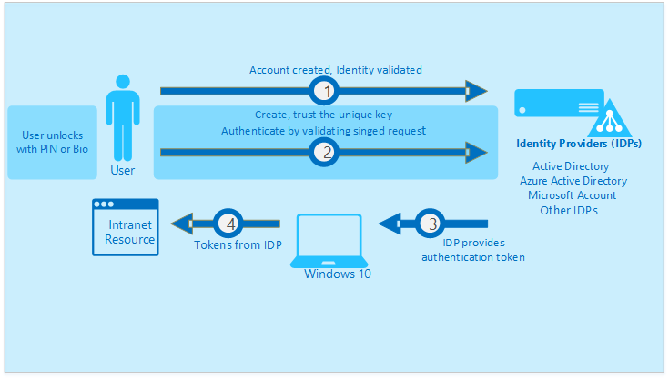

<properties
    pageTitle="Authentifizieren von Identitäten ohne Kennwörter über Microsoft Passport | Microsoft Azure"
    description="Enthält eine Übersicht über Microsoft Passport und Weitere Informationen zum Bereitstellen von Microsoft Passport an."
    services="active-directory"
    documentationCenter=""
    authors="femila"
    manager="swadhwa"
    editor=""
    tags="azure-classic-portal"/>

<tags
    ms.service="active-directory"
    ms.workload="identity"
    ms.tgt_pltfrm="na"
    ms.devlang="na"
    ms.topic="article"
    ms.date="09/27/2016"
    ms.author="femila"/>

# Authentifizieren von Identitäten ohne Kennwörter über Microsoft Passport

Die aktuellen Methoden der Authentifizierung mit Kennwörter allein sind nicht ausreichend für Benutzer zu schützen. Benutzer wiederverwenden und Kennwörter vergessen. Kennwörter sind breachable, Phishable, zu Risse und erratende. Sie werden auch schwer zu merken und zu Angriffen wie "[Hash übergeben](https://technet.microsoft.com/dn785092.aspx)".

## Informationen zu Microsoft Passport
Microsoft Passport ist eine Private/öffentliche Schlüssel oder Zertifikaten basierende Authentifizierung Ansatz für Organisationen und Nutzer, die jenseits Kennwörter wechselt. Diese Art der Authentifizierung beruht auf Key Paar Anmeldeinformationen, die können Kennwörter ersetzen und bieten Schutz gegen Phishing, Diebstahl und aus.

 Microsoft Passport ermöglicht einen Benutzer authentifiziert zu einem Microsoft-Konto, ein Windows Server Active Directory-Konto, ein Konto Microsoft Azure-Active Directory (Azure AD) oder ein nicht-Microsoft-Dienst, der schnelles Identität Online (Fido kommt die Nachricht)-Authentifizierung unterstützt. Nach einer Überprüfung initial in zwei Schritten während der Registrierung von Microsoft Passport Microsoft Passport eingerichtet wurde, klicken Sie auf dem Gerät des Benutzers, und der Benutzer legt eine Bewegung, die Windows-Hallo oder eine PIN dienen. Der Benutzer gibt die Bewegung um seine Identität zu überprüfen. Windows wird dann Microsoft Passport zum Authentifizieren des Benutzers und dabei unterstützen sollen, die Zugriff auf geschützte Ressourcen und Dienste verwendet.

Der private Schlüssel ist allein durch eine "Benutzeraktion" wie eine PIN, Biometrik oder einem entfernten Gerät wie eine Smartcard, die der Benutzer zum Anmelden bei des Geräts verwendet zur Verfügung gestellt. Diese Informationen wird ein Zertifikat oder eine asymmetrische Key Paar verknüpft. Der private Schlüssel ist Hardware bestätigt, wenn das Gerät einen Chip vertrauenswürdige Platform-Modul (TPM) verfügt. Der private Schlüssel bleibt immer das Gerät aus.

Öffentliche Schlüssel wird mit Azure Active Directory und Windows Server Active Directory (lokal) erfasst. Identitätsanbieter (IDPs) durch Zuordnung von den öffentlichen Schlüssel des Benutzers für den privaten Schlüssel des Benutzers zu überprüfen, und geben die Anmeldung Informationen über eine Uhrzeit Kennwort (OTP), PhoneFactor oder einer anderen Benachrichtigung Verfahren.

## Warum sollte Unternehmen Microsoft Passport annehmen

Aktivieren Sie Microsoft Passport, können Unternehmen ihre Ressourcen durch sogar noch sicherer vornehmen:

* Einrichten von Microsoft Passport mit einer Option Hardware bevorzugte. Dies bedeutet, dass die Tasten auf TPM 1.2 oder TPM 2.0, wenn verfügbar generiert werden. Wenn TPM nicht verfügbar ist, wird die Taste generieren.

* Definieren, die Komplexität und Länge des die PIN, und ob Hallo Verwendung in Ihrer Organisation aktiviert ist.

* Konfigurieren von Microsoft Passport zur Unterstützung von Smartcard-ähnliche Szenarios mithilfe von Zertifikaten basierende Trust aus.

## Funktionsweise von Microsoft Passport
1. Tasten werden vom TPM oder Software auf der Hardware generiert. Viele Geräte weisen einen integrierten TPM-Chip, der die Hardware sichert durch die Integration von cryptographic Tasten in Geräte. TPM 1.2 oder TPM 2.0 generiert Schlüssel oder Zertifikate, die über die generierten Schlüssel erstellt werden.

2. Das TPM bestätigt diese gebundene Hardware Schlüssel.

3. Eine einzelne entsperren Bewegung freigibt das Gerät. Dieser Bewegung ermöglicht Zugriff auf mehrere Ressourcen ist das Gerät Domänenverbund oder Azure AD-verknüpft.

## Funktionsweise des Microsoft Passport-Lebenszyklus

Die vorherige Abbildung zeigt ein Paar aus der privaten/öffentlichen Schlüssel und der Validierung vom Identitätsanbieter. Jeder dieser Schritte wird hier ausführlich erläutert:

1. Der Benutzer weist ihre Identität über mehrere integrierte Rechtschreibprüfung Methoden (Gesten, physische Smart-Karten, mehrstufige Authentifizierung) und sendet diese Informationen zu einer Identität Anbieter (IDP) wie Azure Active Directory oder lokalen Active Directory.

2. Das Gerät klicken Sie dann die Taste erstellt, bestätigt die Taste, stellt den öffentlichen Teil der Schlüssel, Anweisungen für die Station angefügt, anmeldet und sendet es an die IDP registriert die Taste.

4. Sobald die IDP den öffentlichen Teil der Schlüssel registriert, fordert die IDP das Gerät, die mit den privaten Teil der Schlüssel signiert.

5. Die IDP dann überprüft und Probleme mit dem Authentifizierungstoken, in dem der Benutzer und dem Gerätezugriff kann die geschützten Ressourcen. IDPs können Plattform-apps zu schreiben oder Browserunterstützung (über JavaScript/Webcrypto-APIs) erstellen und Verwenden von Microsoft Passport Anmeldeinformationen für die Benutzer verwenden.

## Die Bereitstellung Anforderungen für Microsoft Passport
### Auf Organisationsebene

* Das Unternehmen hat eine Azure-Abonnement.

### Auf Benutzerebene

* Den Computer des Benutzers ausgeführt wird, Windows 10 Professional oder Enterprise.

Bereitstellung ausführliche Anweisungen finden Sie unter [Aktivieren von Microsoft Passport für die Arbeit in der Organisation](active-directory-azureadjoin-passport-deployment.md).

## Weitere Informationen

* [Windows-10 für das Unternehmen: Methoden für die Arbeit mit Geräten](active-directory-azureadjoin-windows10-devices-overview.md)
* [Erweitern Sie die Cloud-Funktionen, die auf Windows-10-Geräte über Azure Active Directory teilnehmen](active-directory-azureadjoin-user-upgrade.md)
* [Informationen Sie zu Szenarios für die Verwendung für Azure AD teilnehmen](active-directory-azureadjoin-deployment-aadjoindirect.md)
* [Herstellen einer Verbindung Azure AD für Windows 10 Erfahrung mit Domänenverbund Geräte](active-directory-azureadjoin-devices-group-policy.md)
* [Einrichten von Azure AD teilnehmen](active-directory-azureadjoin-setup.md)
