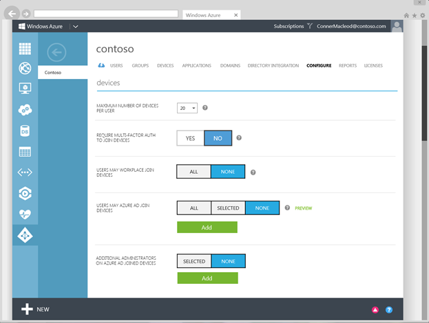

<properties
    pageTitle="Einrichten von Azure AD teilnehmen für Ihre Benutzer | Microsoft Azure"
    description="Erläutert, wie Administratoren Azure AD Beitreten zur lokalen Verzeichnis und Gerät Registrierung einrichten können."
    services="active-directory"
    documentationCenter=""
    authors="femila"
    manager="swadhwa"
    editor=""
    tags="azure-classic-portal"/>

<tags
    ms.service="active-directory"
    ms.workload="identity"
    ms.tgt_pltfrm="na"
    ms.devlang="na"
    ms.topic="get-started-article"
    ms.date="09/27/2016"
    ms.author="femila"/>

# Einrichten von Azure AD teilnehmen in Ihrer Organisation

Vor dem Einrichten von Azure Active Directory teilnehmen (Azure AD-Join), müssen Sie entweder von Ihrem lokalen Verzeichnis von Benutzern in der Cloud synchronisieren oder Azure AD manuell verwaltete Konten erstellen.

Ausführliche Anweisungen für die Synchronisierung Ihrer lokalen Benutzer Azure AD-in [Ihrer lokalen Identitäten mit Azure Active Directory Integration](active-directory-aadconnect.md)abgedeckt.

So erstellen und Verwalten von Benutzern in Azure AD manuell, finden Sie unter [Benutzermanagement in Azure Active Directory](https://msdn.microsoft.com/library/azure/hh967609.aspx).

## Einrichten von Gerät Registrierung
1. Melden Sie sich als Administrator Azure-Portal an.
2. Wählen Sie im linken Bereich aus **Active Directory**.
3. Wählen Sie auf der Registerkarte **Verzeichnis** aus Ihrem Verzeichnis.
4. Wählen Sie die Registerkarte **Konfigurieren** .
5. Wechseln Sie zum Abschnitt **Geräte** .
6. Legen Sie auf der Registerkarte **Geräte** Folgendes ein:  
   * **Maximale Anzahl der Geräte pro Benutzer**: Wählen Sie die maximale Anzahl von Geräten, die ein Benutzer in Azure AD enthalten kann.  Wenn ein Benutzer dieses Kontingents erreicht wird, kann er. nicht zusätzliche Geräte hinzufügen, bis eine oder mehrere ihrer vorhandenen Geräte entfernt werden.
   * **VORSCHREIBEN MEHRSTUFIGE Authentifizierung auf Verknüpfung Geräte**: fest, ob Benutzer erforderlich sind, um eine zweite Authentifizierung Faktor um Geräts mit Azure AD verknüpfen bereitzustellen. Weitere Informationen zum Azure mehrstufige Authentifizierung finden Sie unter [Erste Schritte mit Azure kombinierte Authentifizierung in der Cloud](..\multi-factor-authentication\multi-factor-authentication-get-started-cloud.md).
   * **Benutzer möglicherweise AZURE AD Verknüpfung Geräte**: Wählen Sie die Benutzer und Gruppen, die berechtigt sind, Geräte mit Azure AD zu verknüpfen.
   * **Zusätzliche Administratoren auf AZURE AD BEIGETRETEN Geräte**: mit Azure AD-Premium- oder Enterprise Mobilität Suite (EMS), können Sie auswählen, welchen Benutzern lokale Administratorrechte verfügen, um das Gerät erteilt werden. Globale Administratoren und Gerät Besitzer werden standardmäßig lokale Administratorrechte erteilt.

Nach dem Einrichten Azure AD teilnehmen für Ihre Benutzer, können sie durch den Geräten im Unternehmen oder personal Azure AD verbinden.

Im folgenden werden die drei Szenarien, die Sie verwenden können, aktivieren Sie die Benutzer einrichten Azure AD teilnehmen:

- Benutzer teilnehmen eines Unternehmens Gerät direkt an Azure AD an.
- Benutzer-beitreten zu einer Domäne ein Gerät im Besitz eines Unternehmens im lokalen Active Directory und dann das Gerät zu Azure AD erweitern.
- Benutzer hinzufügen geschäftlichen oder schulnotizbücher Konten zu Windows auf einem Gerät mit persönlichen

## Weitere Informationen
* [Windows-10 für das Unternehmen: Methoden für die Arbeit mit Geräten](active-directory-azureadjoin-windows10-devices-overview.md)
* [Erweitern Sie die Cloud-Funktionen, die auf Windows-10-Geräte über Azure Active Directory teilnehmen](active-directory-azureadjoin-user-upgrade.md)
* [Informationen Sie zu Szenarios für die Verwendung für Azure AD teilnehmen](active-directory-azureadjoin-deployment-aadjoindirect.md)
* [Herstellen einer Verbindung Azure AD für Windows 10 Erfahrung mit Domänenverbund Geräte](active-directory-azureadjoin-devices-group-policy.md)
* [Einrichten von Azure AD teilnehmen](active-directory-azureadjoin-setup.md)
