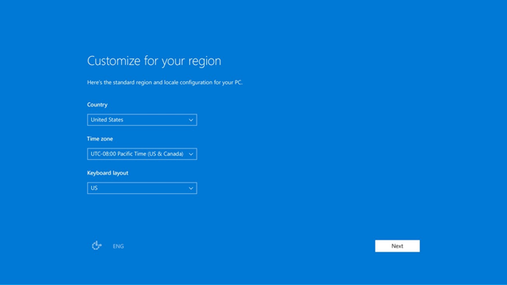
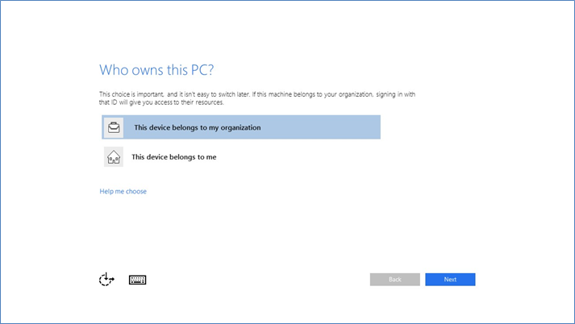
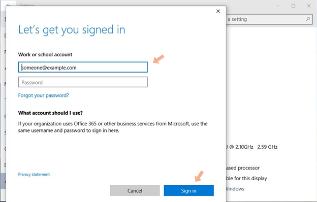

<properties
    pageTitle="Einrichten eines neuen Geräts mit Azure AD während der Installation | Microsoft Azure"
    description="Ein Thema, das wird erläutert, wie Benutzer Azure AD teilnehmen während ihrer ersten Ausführen Erfahrung einrichten können."
    services="active-directory"
    documentationCenter=""
    authors="femila"
    manager="swadhwa"
    editor=""
    tags="azure-classic-portal"/>

<tags
    ms.service="active-directory"
    ms.workload="identity"
    ms.tgt_pltfrm="na"
    ms.devlang="na"
    ms.topic="article"
    ms.date="09/27/2016"
    ms.author="femila"/>

# Einrichten eines neuen Geräts mit Azure AD während der Installation

In Windows 10 können Benutzer in die erste Ausführung (FRX) aktivierten Geräte mit Azure Active Directory (Azure AD) verknüpfen. Dies kann Organisationen eingeschweißt Geräten ihre Mitarbeiter oder Kursteilnehmer verteilen, oder lassen sie eigene Geräte (CYOD) auswählen.
Wenn Windows 10 Professional oder Windows 10 Enterprise-Editionen auf einem Gerät installiert ist, wird standardmäßig die Erfahrung mit den Installationsvorgang für Geräte im Besitz eines Unternehmens.

## Auf einem Gerät mit Azure AD verknüpfen

1. Wenn Sie das neue Gerät aktivieren und den Installationsvorgang zu starten, sollte die **Erste bereit** Nachricht angezeigt werden. Führen Sie die Anweisungen, um die Einrichtung Ihres Geräts aus.
2. Zunächst die Anpassung Ihrer Region und Sprache. Klicken Sie dann annehmen der Microsoft Software-Lizenzbedingungen.

3. Wählen Sie das Netzwerk, die, das Sie zum Herstellen einer Verbindung mit dem Internet verwenden möchten.
4. Wählen Sie aus, ob Sie eine persönliche oder im Besitz eines Unternehmens Geräten verwenden. Wenn es im Besitz eines Unternehmens ist, klicken Sie auf **dieses Gerät zu meiner Organisation gehört**. Hierdurch wird die Oberfläche Azure AD teilnehmen. Es folgt eine Bildschirm sind, dass Sie sehen, wenn Sie Windows 10 Professional verwenden.

5.  Geben Sie die Anmeldeinformationen, die Sie von Ihrer Organisation bereitgestellt wurden.

6.  Nachdem Sie Ihren Benutzernamen eingegeben haben, befindet sich ein übereinstimmende Mandanten in Azure AD. Wenn Sie in einer verbunddomäne sind, werden Sie zu Ihrem lokalen Secure Token Service (STS) Server – beispielsweise, Active Directory Federation Services (AD FS) weitergeleitet werden.
7. Wenn Sie einen Benutzer in einer Domäne nicht Partnerbenutzern sind, geben Sie Ihre Anmeldeinformationen direkt auf der Azure AD gehostete Seite. Wenn Unternehmen branding konfiguriert wurde, werden Sie auch finden Sie unter dem Logo Ihrer Organisation und Text unterstützt.
8.  Sie werden aufgefordert für eine kombinierte Authentifizierung Herausforderung. Diese Herausforderung kann von einem IT-Administrator konfiguriert werden.
9.  Azure AD überprüft, ob dieser Benutzer-Gerät Registrierung in mobilen Gerätemanagement erforderlich ist.
10. Windows das Gerät im Verzeichnis der Organisation in Azure AD registriert und registriert in mobilen Gerät Verwaltung wird, sofern zutreffend.
11. Wenn Sie eine verwaltete Benutzer sind, öffnet Windows den Desktop durch das Verfahren für die automatische Anmeldung.
12. Wenn Sie eine Partnerbenutzer sind, werden Sie die Windows-Anmeldebildschirm Ihre Anmeldeinformationen eingeben geleitet.

> [AZURE.NOTE] Teilnehmen an einer lokalen Windows Server Active Directory-Domäne in der Windows-Out-of-Box-Oberfläche wird nicht unterstützt. Also, wenn Sie einen Computer zu einer Domäne hinzufügen möchten, sollten Sie den Link **Einrichten von Windows mit einem lokalen Konto** stattdessen aktivieren. Sie können die Domäne in den Einstellungen klicken Sie dann auf Ihrem Computer teilnehmen, wie Sie vor dem vorgenommen haben.

## Weitere Informationen
* [Windows-10 für das Unternehmen: Methoden für die Arbeit mit Geräten](active-directory-azureadjoin-windows10-devices-overview.md)
* [Erweitern Sie die Cloud-Funktionen, die auf Windows-10-Geräte über Azure Active Directory teilnehmen](active-directory-azureadjoin-user-upgrade.md)
* [Authentifizieren von Identitäten ohne Kennwörter über Microsoft Passport](active-directory-azureadjoin-passport.md)
* [Informationen Sie zu Szenarios für die Verwendung für Azure AD teilnehmen](active-directory-azureadjoin-deployment-aadjoindirect.md)
* [Herstellen einer Verbindung Azure AD für Windows 10 Erfahrung mit Domänenverbund Geräte](active-directory-azureadjoin-devices-group-policy.md)
* [Einrichten von Azure AD teilnehmen](active-directory-azureadjoin-setup.md)
