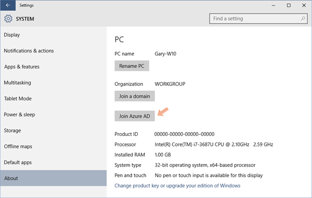
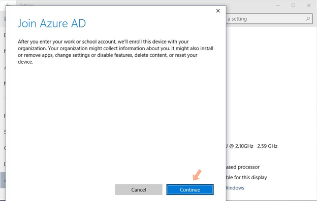

<properties
    pageTitle="Einrichten von Windows 10 Geräten mit Azure AD-in Einstellungen | Microsoft Azure"
    description="Erläutert, wie Benutzer mit Azure AD über das Menü Einstellungen verknüpfen können."
    services="active-directory"
    documentationCenter=""
    authors="femila"
    manager="swadhwa"
    editor=""
    tags="azure-classic-portal"/>

<tags
    ms.service="active-directory"
    ms.workload="identity"
    ms.tgt_pltfrm="na"
    ms.devlang="na"
    ms.topic="article"
    ms.date="09/27/2016"
    ms.author="femila"/>

# Einrichten von Windows 10 Geräten mit Azure AD-in Einstellungen
Wenn Sie bereits Windows 7 oder Windows 8 verwenden und Ihrem Computer oder Gerät auf Windows 10 aktualisiert wurde, können Sie über das Menü Einstellungen Azure Active Directory (Azure AD) teilnehmen.

## Die Teilnahme an Azure AD über das Menü Einstellungen

1. Klicken Sie im Menü **Start** auf den Charm **Einstellungen** .
2. Wählen Sie in **Einstellungen** **System**->**zu**->**teilnehmen Azure AD an**.

3. Klicken Sie auf **Weiter** klicken Sie im Nachrichtenfenster Azure AD teilnehmen.

4. Geben Sie Ihre Anmeldeinformationen ein. Diese Anmeldeverhalten, werden alle erforderlichen Schritte enthalten, die für die Authentifizierung erforderlich sind. Wenn Sie einen Mandanten partnerverbundkontakte gehören, wird der Administrator Sie die Föderation nutzen können, die von Ihrer Organisation gehostet wird.

5. Wenn Ihre Organisation Azure kombinierte Authentifizierung für das Verknüpfen mit Azure AD konfiguriert hat, bieten des zweiten Faktors, bevor Sie fortfahren.
6. Klicken Sie auf **akzeptieren** , auf dem Bildschirm **das Gerät kann verwaltet werden** .
7. Die Meldung sollte "Ihr Gerät wird jetzt mit Ihrer Organisation in Azure AD verknüpft" angezeigt werden.

## Weitere Informationen
* [Informationen Sie zu Szenarios für die Verwendung für Azure AD teilnehmen](active-directory-azureadjoin-deployment-aadjoindirect.md)
* [Herstellen einer Verbindung Azure AD für Windows 10 Erfahrung mit Domänenverbund Geräte](active-directory-azureadjoin-devices-group-policy.md)
* [Einrichten von Azure AD teilnehmen](active-directory-azureadjoin-setup.md)
* [Authentifizieren von Identitäten ohne Kennwörter über Microsoft Passport](active-directory-azureadjoin-passport.md)
