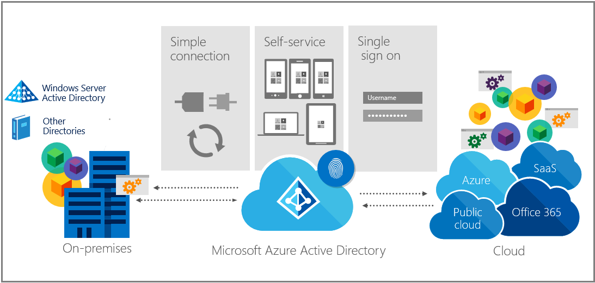

<properties
    pageTitle="Windows-10 für das Unternehmen: Methoden für die Arbeit mit Geräten | Microsoft Azure"
    description="Übersicht über die Windows-10-Geräten für Unternehmen und wie Sie für die Cloud Windows Azure Active Directory integrieren. Unterscheidet sich die verschiedenen Wege ein Gerät können nach der Bereitstellung und in einem Unternehmen über das Portal Azure verwendet werden."
    keywords="Windows-cloud, Windows Azure Active Directory, Windows 10 Geräte auf Azure, Windows Azure-Geräten"
    services="active-directory"
    documentationCenter=""
    authors="femila"
    manager="swadhwa"
    editor=""
    tags="azure-classic-portal"/>

< tags ms.service= "Active Directory" ms.workload="identity" ms.tgt_pltfrm="na" ms.devlang="na" ms.topic="article" ms.date="09/27/2016"

    ms.author="femila"/>

# Windows-10 für das Unternehmen: Methoden für die Arbeit mit Geräten

Windows-10 gibt Ihnen die Möglichkeit zur Nutzung von Azure Active Directory (Azure AD). Sie können die Windows-10-Geräte mit Azure AD herstellen, sodass die Benutzer auf Windows Azure AD-Konten mit oder durch Hinzufügen ihrer Azure-IDs sich anmelden können auf Geschäfts-apps und Ressourcen zugreifen.

## Integrieren von Windows 10 Geräte mit Azure Active Directory – ein Schema Inhalt

Die folgenden Themen enthalten Einblicke in anderen Funktionen von Windows-10-Geräte in Ihrer Organisation an.

|              | Themen                                                                                                                                                                                                    |
|--------------------------------|-------------------------------------------------------------------------------------------------------------------------------------------------------------------------------------------------------------------------------------------------------------------------------------------------------------|
| Erste Schritte                  | [Verwenden Windows 10 Geräte in Ihrem Arbeitsplatz](active-directory-azureadjoin-windows10-devices.md)     [Erweitern Sie die Cloud-Funktionen, die auf Windows-10-Geräte über Azure Active Directory teilnehmen](active-directory-azureadjoin-overview.md)     [Authentifizieren von Identitäten ohne Kennwörter über Microsoft Passport](active-directory-azureadjoin-passport.md)                              |
| Bereitstellung     | [Verwendungsszenarien und Aspekte der Bereitstellung Azure AD teilnehmen](active-directory-azureadjoin-deployment-aadjoindirect.md)    [Herstellen einer Verbindung Domänenverbund Geräte mit Azure AD für Windows 10 auftritt](active-directory-azureadjoin-devices-group-policy.md)  [Aktivieren von Microsoft Passport für die Arbeit in der Organisation](active-directory-azureadjoin-passport-deployment.md)   [Aktivieren der Enterprise-Zustand Roaming für Windows 10](active-directory-windows-enterprise-state-roaming-overview.md)   |
| Benutzeraufgaben    | [Einrichten eines neuen Windows-10-Geräts mit Azure AD-während der Installation](active-directory-azureadjoin-user-frx.md)    [Einrichten von einem Windows-10-Gerät mit Azure AD-über das Einstellungsmenü](active-directory-azureadjoin-user-upgrade.md)    [Teilnehmen an einer persönlichen Windows 10 Gerät Ihrer Organisation](active-directory-azureadjoin-personal-device.md) |
