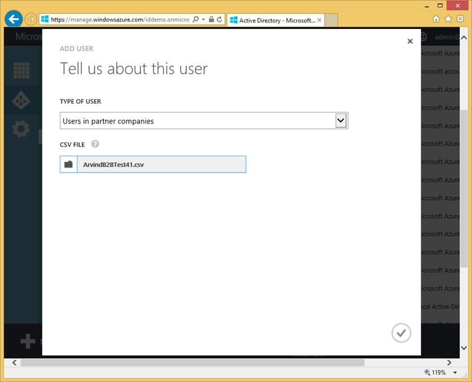

<properties
   pageTitle="Zusammenarbeit an Dokumenten Azure Active Directory B2B | Microsoft Azure"
   description="Azure Active Directory B2B Zusammenarbeit ermöglicht Business Partner für den Zugriff auf Ihre corporate Applikationen Konto mit allen ihren Benutzern von einer einzelnen Azure AD dargestellt"
   services="active-directory"
   documentationCenter=""
   authors="curtand"
   manager="femila"
   editor=""/>

<tags
   ms.service="active-directory"
   ms.devlang="na"
   ms.topic="article"
   ms.tgt_pltfrm="na"
   ms.workload="identity"
   ms.date="08/23/2016"
   ms.author="curtand"/>

# Azure Active Directory B2B für die Zusammenarbeit

Zusammenarbeit an Dokumenten Azure Active Directory (Azure AD) B2B können Sie Access den corporate Clientanwendungen aus Partner verwaltete Identitäten zu aktivieren. Sie können unternehmensweit Beziehungen erstellen, indem Sie eingeladen und Autorisieren von Benutzern von Partnerunternehmen Zugriff auf Ihre Ressourcen. Komplexität wird verringert, da jedes Unternehmen einmal mit Azure Active Directory Verbindung und jeder Benutzer wird durch ein einzelnes dargestellt Azure AD-Konto. Wenn Azure AD Ihrer Business Partner ihre Konten verwalten, da Access gesperrt ist, wenn Partnerbenutzer aus ihren Organisationen beendet werden und unbeabsichtigte Zugriff über die Mitgliedschaft in interne Verzeichnisse wird verhindert, wird die Sicherheit erhöht. Für Business-Partner, die noch keine Azure AD haben, weist B2B Zusammenarbeit einer optimierten Anmelde-Oberfläche auf Azure AD-Konten Ihrer Business-Partner zur Verfügung stellen.

-   Ihren Partnern Business verwenden ihrer eigenen Anmeldeinformationen, die Sie Verwalten von einem Partnerverzeichnis externe und muss Access zu entfernen, wenn Benutzer die Partnerorganisation verlassen freigibt.

-   Sie Verwalten des Zugriffs auf Ihre apps unabhängig von Ihrer Business Partners Konto Lebenszyklus. Dies bedeutet z. B., dass Sie Zugriff widerrufen können, ohne die IT-Abteilung Ihres Business Partners nichts Unternehmen, bitten.

## Funktionen

B2B Zusammenarbeit vereinfacht das Management und verbesserte Sicherheit von Partner Access Ihres Unternehmens Ressourcen einschließlich SaaS apps, wie Office 365, Vertrieb, Azure Services und jeder Mobile cloud und lokale Ansprüche unterstützende Anwendung. B2B Zusammenarbeit ermöglicht Partnern Verwalten ihrer eigenen Konten und Unternehmen Sicherheitsrichtlinien auf Partnerzugriff anwenden können.

Azure Active Directory B2B, die für die Zusammenarbeit mit konfigurieren ist vereinfachtes melden Sie sich für Partner aller Größen, auch wenn sie nicht über eigene Azure Active Directory über ein e-Mail-überprüft Prozess verfügen. Es ist auch einfach zu mit keine externen Verzeichnisse oder pro Partner Föderation Konfigurationen verwalten.

## B2B Zusammenarbeit Prozess

1. Azure AD B2B Zusammenarbeit ermöglicht ein Unternehmensadministrator einladen und eine Reihe von externen Benutzern durch Hochladen einer Wertedatei durch Trennzeichen getrennte (CSV) nicht mehr als 2000 Linien für die Zusammenarbeit B2B-Portal zu autorisieren.

  

2. Im Portal werden e-Mail-Einladungen an diese externen Benutzer senden.

3. Der eingeladene Benutzer wird entweder melden Sie sich mit einem vorhandenen Konto für die Arbeit mit Microsoft (verwaltet in Azure AD) oder ein neues Konto für die Arbeit in Azure AD abrufen.

4. Nachdem angemeldet haben, wird der Benutzer bei der app umgeleitet werden, die für sie freigegeben wurde.

Von Einladungen an Consumer e-Mail-Adressen (z. B. Google Mail oder [*für comcast.net*](http://comcast.net/)) werden derzeit nicht unterstützt.

Weitere Informationen zur Funktionsweise von B2B Zusammenarbeit schauen Sie sich [dieses Video an](http://aka.ms/aadshowb2b).

## Nächste Schritte
Navigieren Sie unseren Weitere Artikel auf Azure AD B2B für die Zusammenarbeit an.

- [Was ist für die Zusammenarbeit Azure AD B2B?](active-directory-b2b-what-is-azure-ad-b2b.md)
- [So funktioniert es](active-directory-b2b-how-it-works.md)
- [Ausführliche exemplarische Vorgehensweise](active-directory-b2b-detailed-walkthrough.md)
- [Übersicht der CSV-Datei](active-directory-b2b-references-csv-file-format.md)
- [Token Format für externe Benutzer](active-directory-b2b-references-external-user-token-format.md)
- [Externe Benutzer Objekt Attribut Änderungen](active-directory-b2b-references-external-user-object-attribute-changes.md)
- [Aktuelle Vorschau Einschränkungen](active-directory-b2b-current-preview-limitations.md)
- [Artikel Index für Anwendungsverwaltung in Azure-Active Directory](active-directory-apps-index.md)
