<properties
   pageTitle="Ausführliche exemplarische Vorgehensweise mit Azure Active Directory B2B Zusammenarbeit Preview | Microsoft Azure"
   description="Azure Active Directory B2B Zusammenarbeit unterstützt Ihrer Beziehungen unternehmensweit Business Partner an Ihre corporate Applikationen Selektives Zugriff auf"
   services="active-directory"
   documentationCenter=""
   authors="viv-liu"
   manager="cliffdi"
   editor=""
   tags=""/>

<tags
   ms.service="active-directory"
   ms.devlang="NA"
   ms.topic="get-started-article"
   ms.tgt_pltfrm="NA"
   ms.workload="identity"
   ms.date="05/09/2016"
   ms.author="viviali"/>

# Azure AD B2B Zusammenarbeit Vorschau: ausführliche exemplarische Vorgehensweise

Diese exemplarische Vorgehensweise wird beschrieben, wie Azure AD B2B für die Zusammenarbeit verwendet wird. Als IT-Administrator von Contoso möchten wir Applikationen für Mitarbeiter aus drei Partnerunternehmen freigeben. Keines der Partnerunternehmen muss Azure AD sein.

- Alice von einfachen Partner Organigramm
- Bob, von Medium Partner Organigramm, benötigt Zugriff auf eine Reihe von apps
- Carol, von komplexen Partner Organigramm, benötigt Zugriff auf eine Reihe von apps und Mitgliedschaft in Gruppen von Contoso

Nach Einladungen für Partnerbenutzer gesendet werden, können wir ihnen in Azure Active Directory, den Zugriff auf apps und die Mitgliedschaft in Gruppen über die Azure Portal gewähren konfiguriert werden. Beginnen wir mit Alice hinzufügen.

## Hinzufügen von Alice zu Contoso-Verzeichnis
1. Erstellen Sie eine CSV-Datei mit der Überschriften Siehe Auffüllen von nur Annas **E-Mail**, **DisplayName**und **InviteContactUsUrl**. **DisplayName** ist der Name, der in der Einladung angezeigt wird, und den Namen, der im Verzeichnis "Contoso" Azure AD angezeigt wird. **InviteContactUsUrl** ist eine Möglichkeit für Alice Contoso Kontakt mit Ihnen aufnehmen. Im folgenden Beispiel wird das LinkedIn-Profil von Contoso gibt InviteContactUsUrl an. Es ist wichtig, um die Rechtschreibung der Etiketten in der ersten Zeile der CSV-Datei genau wie in der [CSV-Datei Format Bezug](active-directory-b2b-references-csv-file-format.md)angegeben.  
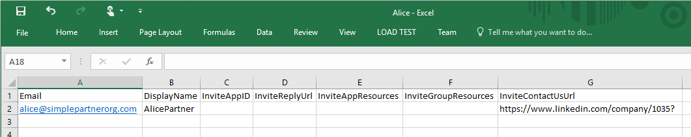

2. Im Portal Azure Hinzufügen eines Benutzers in das Contoso-Verzeichnis (Active Directory > Contoso > Benutzer > Benutzer hinzufügen). Wählen Sie im Dropdownmenü "Typ der Benutzer" "Benutzer in Partnerunternehmen" ein. Hochladen der CSV-Datei. Stellen Sie sicher, dass die CSV-Datei vor dem Hochladen geschlossen ist.  
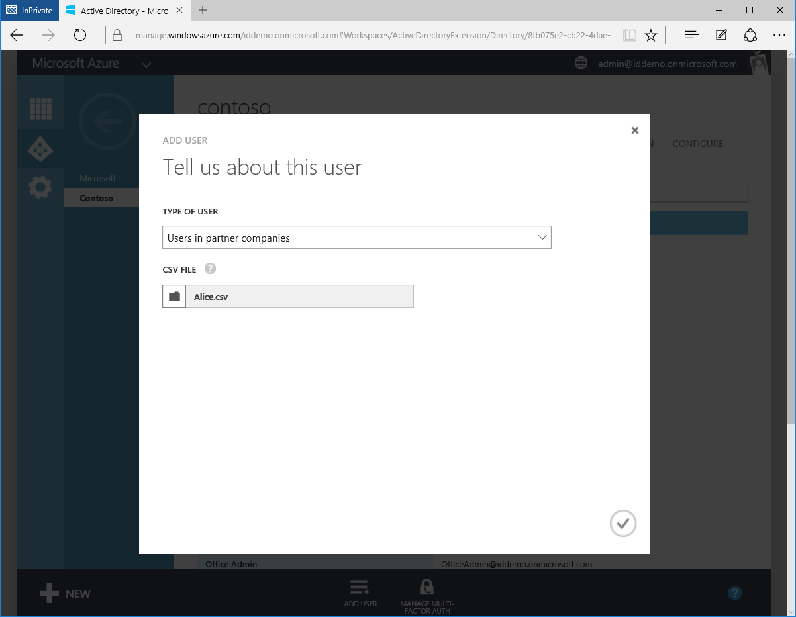

3. Alice wird jetzt als externer Benutzer im Verzeichnis "Contoso" Azure AD dargestellt.  
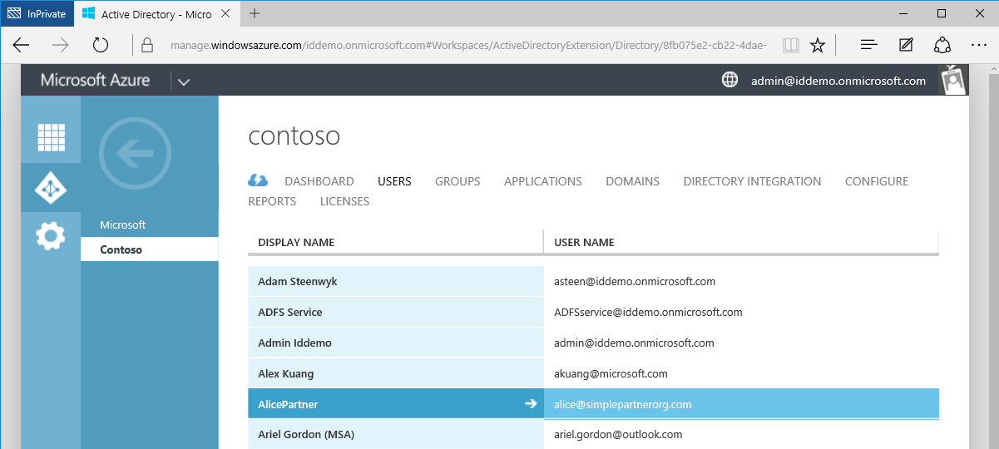

4. Alice empfängt die folgende e-Mail an.  
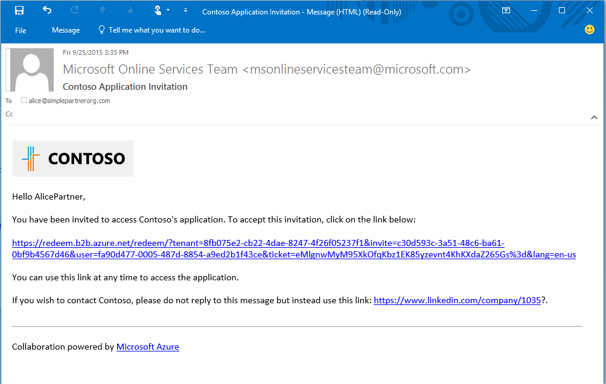

5. Alice klickt auf den Hyperlink, und Anna wird die Einladung annehmen, und melden Sie sich mit ihrer Arbeit Anmeldeinformationen aufgefordert. Wenn Alice nicht im Verzeichnis Azure AD-ist, ist Alice dazu aufgefordert werden, zu registrieren.  
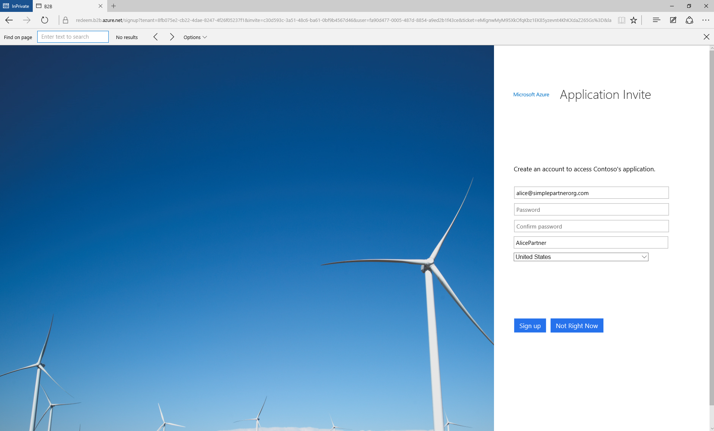

6. Alice wird auf der App Access Systemsteuerung leeren umgeleitet, bis Anna apps zugreifen kann.  
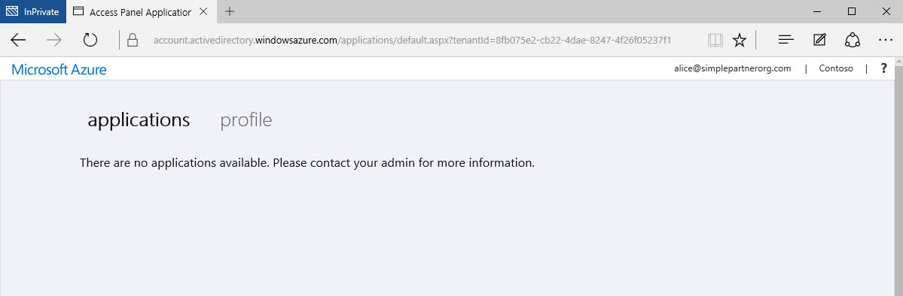

Mit diesem Verfahren können die einfachste Form der Zusammenarbeit an Dokumenten B2B. Als Benutzer im Verzeichnis "Contoso" Azure AD kann Alice Zugriff auf Anwendungen und Gruppen über das Azure Portal erteilt werden. Jetzt fügen wir Bob, wer Zugriff auf die Anwendungen Moodle und Vertrieb benötigt.

## Contoso-Verzeichnis Bob hinzu, und gewähren des Zugriffs auf apps
1. Verwenden von Windows PowerShell mit dem Azure AD-Modul installiert haben, um die Anwendung IDs von Moodle und Vertrieb zu suchen. Die IDs mithilfe des Cmdlets abgerufen werden können: `Get-MsolServicePrincipal | fl DisplayName, AppPrincipalId` Dadurch wird eine Liste der verfügbaren universell in Contoso und deren AppPrincialIds.  
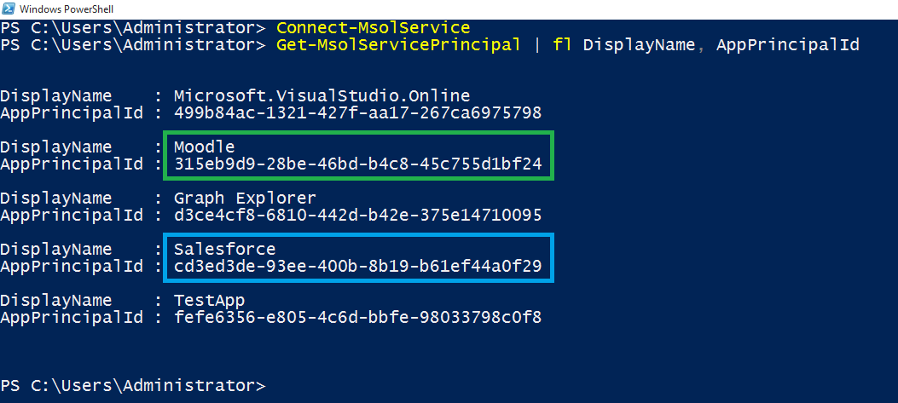

2. Erstellen einer CSV-Datei, die e-Mail- und DisplayName, **InviteAppID**, **InviteAppResources**und InviteContactUsUrl Bobs enthält. Füllen Sie **InviteAppResources** mit dem AppPrincipalIds von Moodle und Vertrieb von PowerShell durch ein Leerzeichen getrennt gefunden. **InviteAppId** mit demselben AppPrincipalId Moodle kennzeichnen der e-Mails, und melden Sie sich mit einem Moodle Logo Seiten zu füllen.  
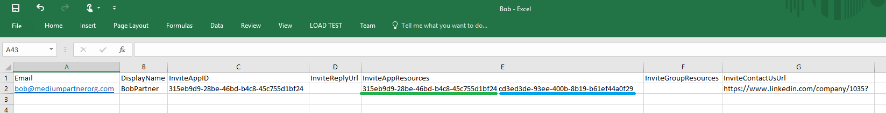

3. Hochladen der CSV-Datei über das Azure-Portal an, wie es für Alice durchgeführt wurde. Bob ist jetzt ein externer Benutzer im Verzeichnis Contoso-Azure Active Directory.

4. Bob empfängt die folgende e-Mail an.  
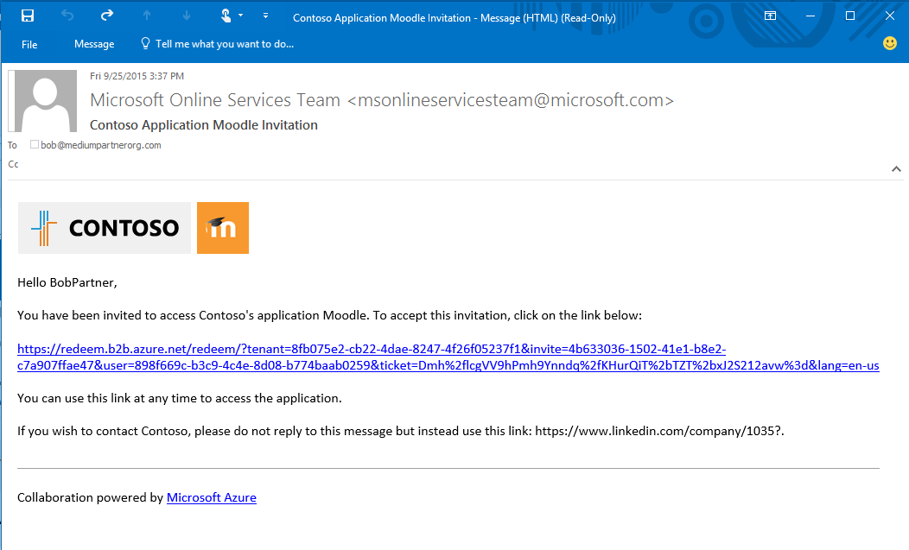

5. Bob auf den Link klickt und wird aufgefordert, die Einladung anzunehmen. Nachdem er angemeldet ist, wird er ist, auf die Access-Systemsteuerung geleitet und kann bereits Moodle und Vertrieb.  
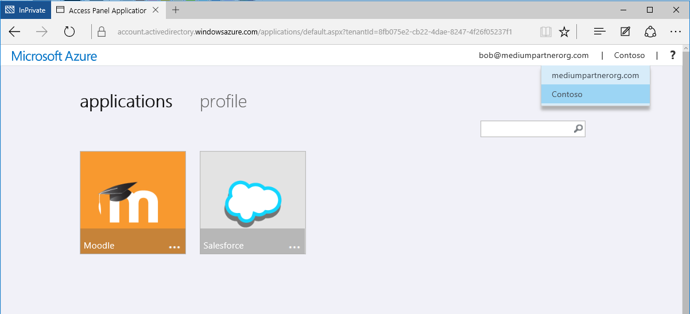

Wir werden Carol als Nächstes hinzufügen, die Zugriff auf Programme und die Mitgliedschaft in Gruppen im Verzeichnis "Contoso" benötigt.

## Die Contoso-Verzeichnis Carol hinzufügt, gewähren des Zugriffs auf apps und Gruppenmitgliedschaft zugewiesen

1. Verwenden von Windows PowerShell mit dem Azure AD-Modul installiert haben, um die Anwendung-IDs und Gruppen-IDs in Contoso suchen.
 - Abrufen von AppPrincipalId mithilfe des Cmdlets `Get-MsolServicePrincipal | fl DisplayName, AppPrincipalId`, wie bei Bob
 - Abrufen von ObjectId für Gruppen mit Cmdlet `Get-MsolGroup | fl DisplayName, ObjectId`. Dadurch wird eine Liste aller Gruppen in Contoso und deren Pluszeichen. Gruppen-IDs können auch als die Objekt-ID in der Gruppe der Azure-Portal die Registerkarte "Zelleigenschaften" abgerufen werden.  
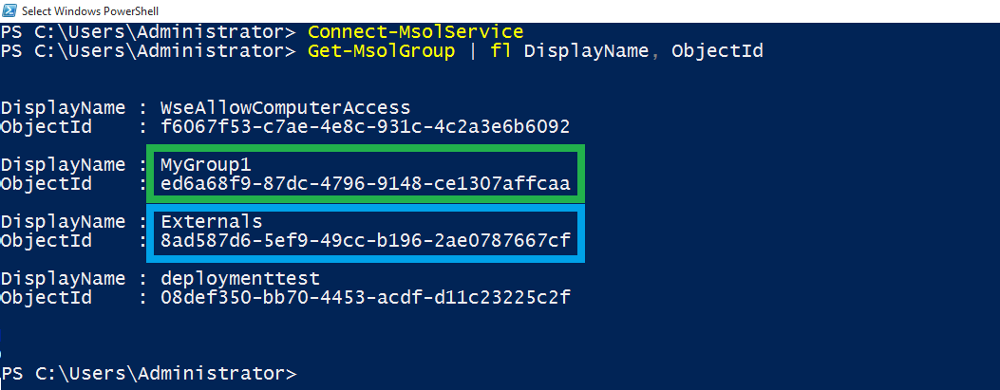

2. Auffüllen von Carols e-Mail-, DisplayName, InviteAppID, InviteAppResources, **InviteGroupResources**und InviteContactUsUrl CSV-Datei zu erstellen. **InviteGroupResources** wird durch das Pluszeichen der Gruppen MyGroup1 und externe, durch ein Leerzeichen getrennt aufgefüllt.  
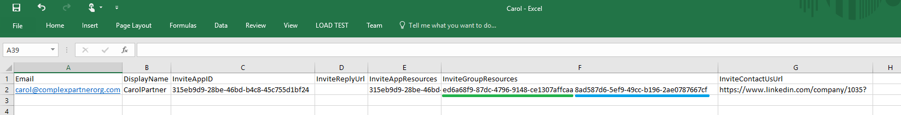

3. Hochladen der CSV-Datei über das Azure-Portal an.

4. Carol ist ein Benutzer im Verzeichnis "Contoso" und ist ebenfalls ein Mitglied der Gruppen MyGroup1 und externe, wie in der Azure-Portal zu sehen.  
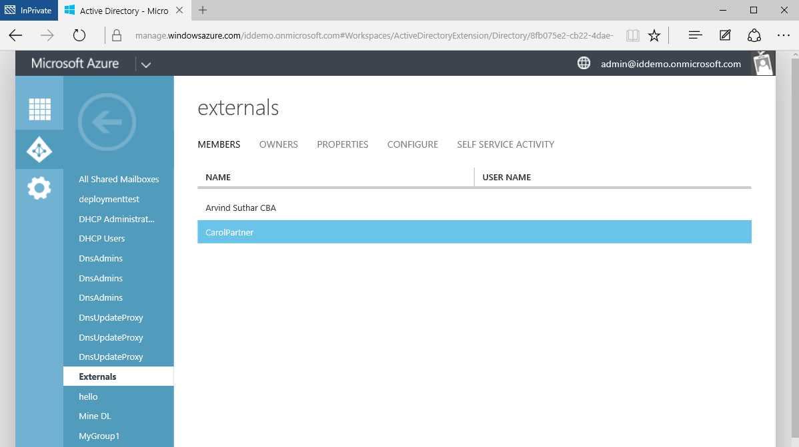

5. Carol erhält eine e-Mail mit einem Link, um die Einladung anzunehmen. Nach Anna anmeldet, wird sie in den Bereich des App-Access haben Zugriff auf Moodle und Vertrieb geleitet.  

Das ist alles zum Hinzufügen von Benutzern aus Partner Unternehmen Azure AD B2B-Zusammenarbeit vorhanden ist. Diese exemplarische Vorgehensweise gezeigt, wie Benutzer Alice, Bob und Carol Contoso Verzeichnis mit drei separate CSV-Dateien hinzufügen. Dieses Verfahren kann einfacher gemacht werden, durch kondensierend die getrennten CSV-Dateien in einer einzigen Datei.  
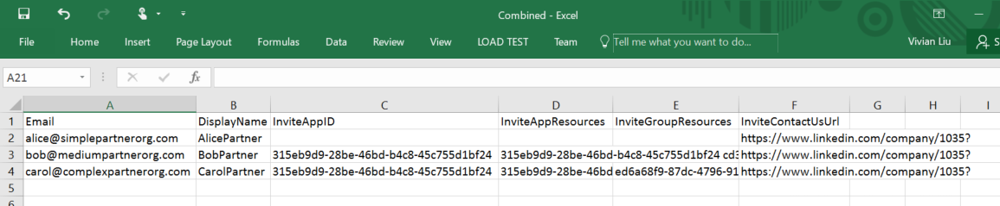

## Verwandte Artikel
Durchsuchen Sie unsere Weitere Artikel auf Azure AD B2B für die Zusammenarbeit an:

- [Was ist für die Zusammenarbeit Azure AD B2B?](active-directory-b2b-what-is-azure-ad-b2b.md)
- [So funktioniert es](active-directory-b2b-how-it-works.md)
- [Übersicht der CSV-Datei](active-directory-b2b-references-csv-file-format.md)
- [Token Format für externe Benutzer](active-directory-b2b-references-external-user-token-format.md)
- [Externe Benutzer Objekt Attribut Änderungen](active-directory-b2b-references-external-user-object-attribute-changes.md)
- [Aktuelle Vorschau Einschränkungen](active-directory-b2b-current-preview-limitations.md)
- [Artikel Index für Anwendungsverwaltung in Azure-Active Directory](active-directory-apps-index.md)
