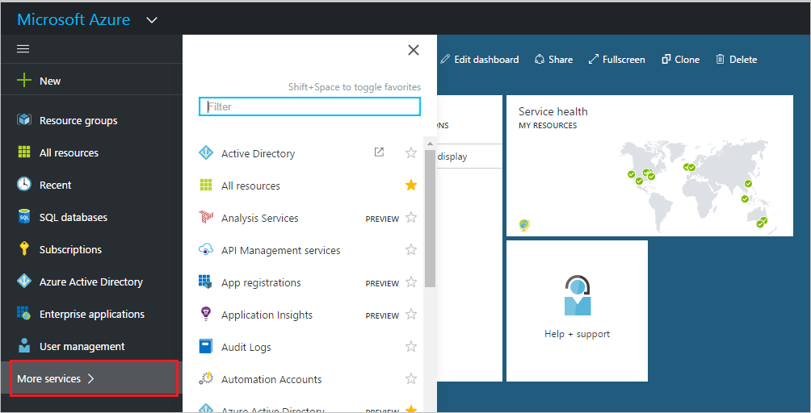

<properties
pageTitle="Anpassen der Anmeldeseite in der Vorschau Azure Active Directory | Microsoft Azure"
description="Informationen Sie zum Hinzufügen eines Unternehmens branding bis hin zu den Azure-Anmeldeseite"
services="active-directory"
documentationCenter=""
authors="curtand"
manager="femila"
editor=""/>

<tags
ms.service="active-directory"
ms.workload="identity"
ms.tgt_pltfrm="na"
ms.devlang="na"
ms.topic="article"
ms.date="09/30/2016"
ms.author="curtand"/>

# Fügen Sie Unternehmen, die auf der Anmeldeseite in der Vorschau Azure Active Directory branding hinzu

Viele Unternehmen möchten, um Verwirrung zu vermeiden, anwenden ein einheitliches Aussehen und Verhalten für alle Websites und Diensten, die sie verwalten. Azure Active Directory-Vorschau bietet diese Möglichkeit, sodass Sie die Darstellung der Seite Anmeldung mit Ihrem Firmenlogo und benutzerdefinierte Farbschemas anzupassen. [Was ist in der Vorschau?](active-directory-preview-explainer.md) Die Anmeldeseite wird die Seite, die angezeigt wird, wenn Sie melden Sie sich bei Office 365 oder einer anderen webbasierten Anwendung, die als Ihre Identitätsanbieter Azure AD verwenden. Interaktion mit dieser Seite können Sie Ihre Anmeldeinformationen eingeben.

Wenn Sie auf dieser Seite Ihres Unternehmens Brandings, Farben und andere anpassbare Elemente anzeigen möchten, finden Sie unter die folgenden Bilder, um den Unterschied zwischen den beiden Erfahrung zu verstehen.

Die folgenden Screenshot zeigt und Beispiel für die Office 365-Anmeldeseite auf einen Desktopcomputer **vor** einer Anpassung:

Die folgenden Screenshot zeigt und Beispiel für die Office 365-Anmeldeseite auf eine Desktopcomputer, **nachdem** eine Anpassung:

## Anpassen der Anmeldeseite

Wenn Sie browserbasierten Zugriff auf Ihre Cloud-apps und Dienste benötigen, denen die Ihre Organisation abonniert, verwenden Sie in der Regel die Anmeldeseite an.

Wenn Sie Änderungen auf der Anmeldeseite angewendet haben, können sie bis zu einer Stunde, damit die Änderungen angezeigt werden dauern.

Firmenspezifischen Anmeldeseite wird nur angezeigt, wenn Sie einen Dienst mit einem Mandanten-spezifische URL wie https://outlook.com/**Contoso**.com oder https://mail besuchen. **Contoso**. com.

Beim Besuch eines Diensts mit bestimmten URLs nicht Mandanten (z. B.: https://mail.office365.com), ein nicht-Branding-Anmeldeseite angezeigt wird. In diesem Fall wird Ihr branding, nachdem Sie haben Ihre Benutzer-ID eingegeben, oder Sie, dass eine Benutzerkachel ausgewählt haben.

> [AZURE.NOTE]
>
- Der Domänenname muss angezeigt werden als "Aktiv" in den **Domänen** Teil des Azure Portals in dem Sie konfiguriert haben branding. Weitere Informationen finden Sie unter [benutzerdefinierten Domänennamen hinzufügen](active-directory-domains-add-azure-portal.md).
- Branding-Anmeldeseite übertragen nicht auf der Anmeldeseite Consumer von Microsoft. Wenn Sie sich mit einem Microsoft-Konto anmelden, wird möglicherweise eine firmenspezifischen Liste der Benutzer Kacheln von Azure AD gerendert, aber das branding Ihrer Organisation gilt nicht für die Microsoft-Konto-Anmeldeseite.

Klicken Sie auf der Anmeldeseite ermöglicht das Kontrollkästchen **angemeldet bleiben** einen Benutzer angemeldet zu bleiben, wenn sie schließen und erneut öffnen Sie ihren Browser. 

   

Es hat keinen Einfluss auf Sitzung Lebensdauer. Sie können das Kontrollkästchen in der Azure-Active Directory-Anmeldeseite ausblenden.
Gibt an, ob das Kontrollkästchen angezeigt wird, hängt von der Einstellung für **deaktiviert angemeldet bleiben**.

   

Wenn Sie das Kontrollkästchen ausblenden, konfigurieren Sie diese Einstellung auf **Ja**. 

> [AZURE.NOTE] Einige Features von SharePoint Online und Office 2010 abhängig Benutzer können dieses Kontrollkästchen aktivieren. Wenn Sie diese Einstellung, um ausgeblendete konfiguriert haben, wird möglicherweise Ihre Benutzer zusätzliche – und unerwartet Aufforderung zum Anmelden angezeigt.

**So fügen Sie Unternehmen branding bis hin zu Ihrem Verzeichnis hinzu:**

1.  Melden Sie sich mit dem [Azure-Portal](https://portal.azure.com) mit einem Konto, eines globalen Administrators für das Verzeichnis ist.

2.  Wählen Sie **Weitere Dienste**aus, geben Sie **Benutzer und Gruppen** in das Textfeld ein, und wählen Sie dann die **EINGABETASTE**.

    

3. Wählen Sie in der Blade **Benutzer und Gruppen** **branding Unternehmen**ein.

4. Klicken Sie auf der **Benutzer und Gruppen - branding des Unternehmens** Blade, wählen Sie den Befehl **Bearbeiten** aus.

    

5. Ändern Sie die Elemente, die Sie anpassen möchten. Alle Elemente sind optional.

6. Klicken Sie auf **Speichern**.

Es kann bis zu einer Stunde für alle Änderungen dauern vorgenommenen zu der Seite Anmeldung branding angezeigt werden.

## Nächste Schritte

[Hinzufügen von sprachspezifischen Unternehmen branding](active-directory-branding-localize-azure-portal.md)
