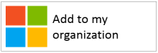
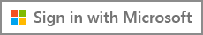

<properties
   pageTitle="Richtlinien für Applikationen Branding | Microsoft Azure"
   description="Eine umfassende Anleitung für Entwickler Orientierung Ressourcen für Azure Active Directory"
   services="active-directory"
   documentationCenter="dev-center-name"
   authors="msmbaldwin"
   manager="mbaldwin"
   editor=""/>

<tags
   ms.service="active-directory"
   ms.devlang="na"
   ms.topic="article"
   ms.tgt_pltfrm="na"
   ms.workload="identity"
   ms.date="06/23/2016"
   ms.author="mbaldwin"/>

# Richtlinien für Applikationen Branding

In diesem Thema werden die branding Richtlinien, die bei der Entwicklung von Applications mit Azure Active Directory (Azure AD) verwendet werden sollen. Diese Richtlinien unterstützen, verweisen Sie Ihre Kunden ein, wenn sie ihr Konto geschäftlichen oder schulnotizbücher verwaltete in Azure AD verwenden möchten oder im persönlichen Konto für die Anmeldung und Anmelden an Ihrer Anwendung.

## Persönliche Konten im Vergleich zu Arbeit oder Schule-Konten von Microsoft

Microsoft verwaltet zwei Arten von Benutzerkonten:

- **Persönliche Konten** (vormals als Windows Live ID bezeichnet). Diese Konten darstellen die Beziehung zwischen *einzelner* Benutzer und Microsoft und werden verwendet, um die Consumer Geräte und Dienste von Microsoft zugreifen. Diese Konten sind für die persönliche Verwendung vorgesehen.

- **Geschäftlichen oder schulnotizbücher Konten.** Diese Konten werden von Microsoft für Organisationen verwaltet, die Azure Active Directory verwenden. Diese Konten werden von Microsoft Office 365 und andere Dienste Business Anmelden verwendet.

Microsoft, geschäftlichen oder schulnotizbücher Konten nach ihren Organisationen (Unternehmen, Schule, Government Stelle) in der Regel Endbenutzer (Mitarbeiter, Studenten und federal Mitarbeiter) zugeordnet sind. Diese Konten sind entweder direkt in der Cloud, in der Azure AD-Plattform beherrschen oder zu Azure AD aus einem lokalen Verzeichnis, wie etwa Windows Server Active Directory synchronisiert. Microsoft ist der *Verwaltungsberechtigte* der geschäftlichen oder schulnotizbücher Konten, aber die Konten gehört und von der Organisation kontrolliert werden.

## Verweisen auf Azure AD-Konten in Ihrer Anwendung

Microsoft nicht der Azure oder die Namen der Active Directory-Marke und weder Endbenutzer verfügbar machen, sollten Sie folgende Schritte.

- Nachdem Benutzer angemeldet sind, sollten Sie der Organisation Name und Logo so weit wie möglich verwenden. Dies ist besser als mit generische Begriffe wie "Ihrer Organisation".

- Wenn der Benutzer nicht angemeldet sind, verweisen Sie auf ihren Konten als "Arbeit oder Schule Konten", und verwenden Sie das Microsoft-Logo um zu vermitteln, dass diese Konten von Microsoft verwaltet werden. Verwenden Sie keine Begriffe wie "Enterprise-Konto", "Business-Konto" oder "Konto Ihres Unternehmens" die Benutzer Verwirrung zu erstellen.

## Benutzer Konto Piktogramm
In einer früheren Version von diesen Richtlinien empfehlen wir eine Piktogramm "blauen Badge" verwenden. Basierend auf Benutzer und Entwicklertools Feedback, empfehlen wir nun die Verwendung von Microsoft-Logo stattdessen. Dadurch wird Benutzer wissen, dass sie das Konto, dass diese mit Office 365 oder andere Microsoft BusinessServices verwenden, um zu Ihrer Anwendung anmelden wiederverwenden können.

## Anmelden und bei der Anmeldung mit Azure AD

Ihre app möglicherweise separate Pfade für die Anmeldung und-Anmeldung präsentieren, und die folgenden Abschnitte enthalten visuellen Anleitung für beide Szenarien.

**, Wenn Ihre app Signieren des Endbenutzers unterstützt (z. B. kostenlose Testversion oder Freemium Modell) oben**: können Sie anzeigen, eine **Anmelden** Schaltfläche, die Benutzer Ihre app mit ihrem Konto arbeiten oder ihre persönlichen Konto zugreifen kann. Azure AD wird eine Aufforderung Zustimmung beim ersten anzeigen sie Ihre app zugreifen.

**Wenn Ihre app, die nur Administratoren, Zustimmung können Berechtigungen erforderlich ist oder wenn Ihre app organisationsinterne Lizenzierung erfordert**: sollten Sie Administrator Erwerb von Benutzer anmelden trennen. Die **Schaltfläche "Diese app abrufen"** leiten Sie Administratoren zum Anmelden, und klicken Sie dann bitten Zustimmung für Benutzer in ihrer Organisation gewähren. Dies hat den zusätzlichen Vorteil von Endbenutzern Zustimmung Anweisungen, um Ihre app unterdrücken.

## Visuelle Hinweise zur app acquisition

Der Link "erhalten Sie die app" Umleiten des Benutzers der Azure AD-gewähren des Zugriffs (autorisieren) Seite an, damit eine Organisation Administrator zu autorisieren Ihre app zu ihrer Organisation Daten zugreifen können, die von Microsoft gehostet wird. Details zum Anfordern des Zugriffs sind in der [Integration von Applications mit Azure Active Directory](active-directory-integrating-applications.md) -Artikel erläutert.

Nachdem Administratoren zu Ihrer Anwendung bekommen, können sie auswählen, es zu ihrer Benutzer Office 365-app Startprogramm für das Experience (barrierefreien aus der Waffle und [https://portal.office.com/myapps](https://portal.office.com/myapps)) hinzufügen. Wenn Sie diese Funktion ankündigen möchten, können Sie Begriffe wie "Diese app Ihrer Organisation hinzufügen" und einer Schaltfläche wie folgt anzeigen:

Wir empfehlen jedoch einen erläuternden Text auf Schaltflächen angewiesen geschrieben werden. Beispiel:
> *Wenn Sie bereits Office 365 oder einem anderen Business Service von Microsoft verwenden, können Sie einfach < Your_app_name > Zugriff auf Daten Ihrer Organisation erteilen. Dadurch wird die Benutzer < Your_app_name > mit ihren vorhandenen Arbeit Konten zugreifen.*

## Visuelle Hinweise zur Anmeldung
Ihre app sollte bei der Anmeldung in Schaltfläche angezeigt werden, die Benutzer an den Endpunkt Anmeldung umgeleitet, die das Protokoll entspricht, die Sie zur Integration mit Azure AD verwenden. Im folgende Abschnitt enthält Details zum wie die Schaltfläche aussehen sollte.

### Piktogramm und "Melden Sie sich mit Microsoft"
Es ist, dass die Zuordnung von Microsoft-Logo, und der "Melden Sie sich mit In Microsoft" Ausdrücke, die dem anderen Identitätsanbieter Azure AD eindeutig darstellt, die Ihre app unterstützen möglicherweise. Wenn Sie über genügend Speicherplatz für "Melden Sie sich mit In Microsoft" besitzen, ist es ok, um ihn zu "Anmelden" zu verkürzen.

Sie können auch ein dunkel Farbschema für die Schaltflächen verwenden.

## Tipps zur Branding

**Verwenden Sie "Konto geschäftlichen oder schulnotizbücher" in Kombination mit der Schaltfläche "Melden Sie sich mit In Microsoft" um zu bieten zusätzliche Erläuterung um Hilfe Endbenutzer erkennen, ob diese verwendet werden kann.** Verwenden Sie **keine** andere Begriffe wie "Enterprise-Konto", "Business-Konto" oder "Konto Ihres Unternehmens."

Verwenden Sie **keine** "Office 365-ID" oder "Azure-ID". Office 365 ist auch der Name der Consumer Geschenk von Microsoft Azure AD für Authentifizierung verwendet wird nicht.

Ändern **nicht** das Microsoft-Logo.

**Nicht** verfügbar machen Endbenutzer zu Azure oder Active Directory-Marken aus. Es ist jedoch ok zu mit Entwickler, IT-Profis und Administratoren diese Ausdrücke verwenden.

## Navigationsbereich Tipps zur

**Gehen Sie wie folgt** bieten eine Möglichkeit für Benutzer zum Melden Sie sich ab, und wechseln Sie zu einem anderen Benutzerkonto. Während die meisten Personen ein einzelnes persönliches Konto aus Microsoft/Facebook/Google/Twitter haben, sind die Personen häufig mehr als einer Organisation zugeordnet. Unterstützung für mehrere Benutzer angemeldet ist in Kürze zur Verfügung.
