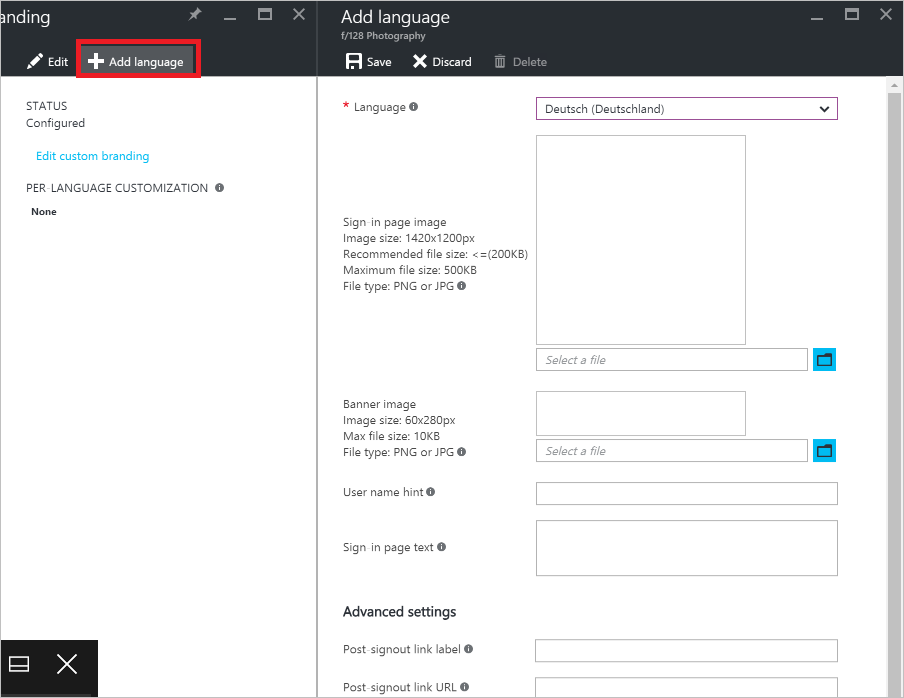

<properties
pageTitle="Hinzufügen von sprachspezifischen Unternehmen Brandings auf der Anmeldeseite in der Vorschau Azure Active Directory | Microsoft Azure"
description="Informationen zum Hinzufügen eines bestimmten Sprache-Mandanten branding Bilder und Text in einer Azure-Anmeldeseite"
services="active-directory"
documentationCenter=""
authors="curtand"
manager="femila"
editor=""/>

<tags
ms.service="active-directory"
ms.workload="identity"
ms.tgt_pltfrm="na"
ms.devlang="na"
ms.topic="article"
ms.date="09/12/2016"
ms.author="curtand"/>

# Hinzufügen von sprachspezifischen Unternehmen Brandings auf der Anmeldeseite in der Vorschau Azure Active Directory

Viele Unternehmen möchten, um Verwirrung zu vermeiden, anwenden ein einheitliches Aussehen und Verhalten für alle Websites und Diensten, die sie verwalten. Azure Active Directory-Vorschau bietet diese Möglichkeit, sodass Sie die Darstellung der Seite Anmeldung mit Ihrem Firmenlogo und benutzerdefinierte Farbschemas anzupassen. [Was ist in der Vorschau?](active-directory-preview-explainer.md) Die Anmeldeseite wird die Seite, die angezeigt wird, wenn Sie melden Sie sich bei Office 365 oder einer anderen webbasierten Anwendung, die als Ihre Identitätsanbieter Azure AD verwenden. Interaktion mit dieser Seite können Sie Ihre Anmeldeinformationen eingeben.

## Anpassen der Anmeldeseite für eine andere Sprache

Sie können Ihre benutzerdefinierten Anmeldeseite sprachspezifische Elemente hinzufügen nur, wenn Sie bereits eine benutzerdefinierte Anmeldeseite als beschrieben [Unternehmen Brandings auf der Anmeldeseite hinzufügen](active-directory-branding-custom-signon-azure-portal.md)erstellt haben. Sie können eine Anmeldeseite pro Verzeichnis mit einer Reihe von anpassbare Elemente konfigurieren. Nachdem Sie die Standardgruppe von Seitenelementen konfiguriert haben, können Sie mehrere Versionen für unterschiedliche Gebietsschemas konfigurieren. Außerdem können Sie mischen und mit verschiedenen Elementen überein. Beispielsweise können Sie folgende Aktionen:

- Erstellen Sie einen Standard **-in-Seite, Bild** , das für alle Kulturen funktioniert, und klicken Sie dann Erstellen von bestimmten Versionen für Englisch und Französisch. Wenn Sie Ihr Browser auf eine dieser beiden Sprachen festlegen, wird das sprachspezifische Bild angezeigt, während die Abbildung Standard für alle anderen Sprachen angezeigt wird.

- Konfigurieren von anderen Logos für Ihre Organisation (z. B. Japanisch oder Hebräisch Versionen).

Es empfiehlt sich, dass die Anzahl der Sprachvariationen, Wartung und Leistung Gründen, gering halten.

**So fügen Sie Unternehmen branding bis hin zu Ihrem Verzeichnis hinzu:**

1.  Melden Sie sich mit dem [Azure-Portal](https://portal.azure.com) mit einem Konto, eines globalen Administrators für das Verzeichnis ist.

2.  Wählen Sie **Weitere Dienste**aus, geben Sie **Benutzer und Gruppen** in das Textfeld ein, und wählen Sie dann die **EINGABETASTE**.

    

3. Wählen Sie in der Blade **Benutzer und Gruppen** **branding Unternehmen**ein.

4. Klicken Sie auf der **Benutzer und Gruppen - branding des Unternehmens** Blade, wählen Sie den Befehl **Sprache hinzufügen** .

    

5. Ändern Sie die Elemente, die Sie anpassen möchten. Alle Elemente sind optional.

6. Klicken Sie auf **Speichern**.

Es kann bis zu einer Stunde für alle Änderungen dauern vorgenommenen zu der Seite Anmeldung branding angezeigt werden.

## Nächste Schritte

[Branding Ihrer Anmeldeseite bis hin zu Unternehmen hinzufügen](active-directory-branding-custom-signon-azure-portal.md)
