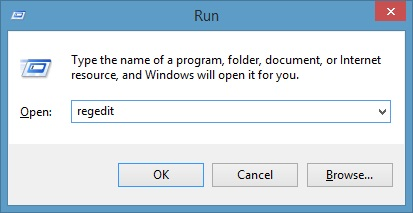
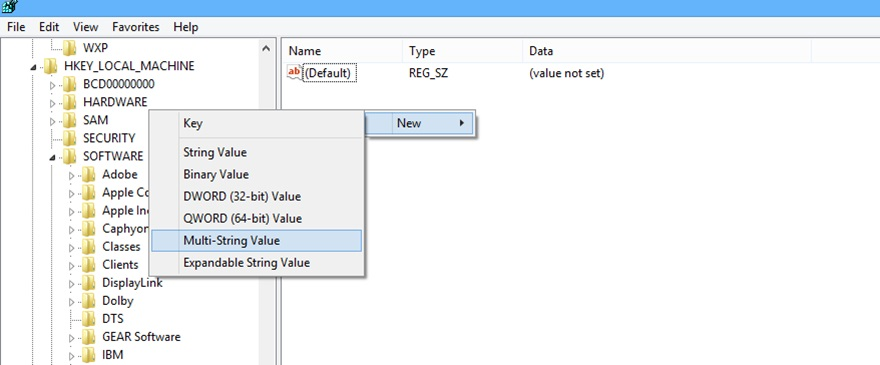
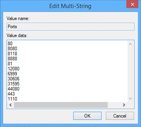

<properties 
    pageTitle="App-Suche Registry Settings für Proxy-Dienste Cloud | Microsoft Azure" 
    description="Ziel dieses Themas ist, Sie die Schritte bereitzustellen, Sie ausführen, um den erforderlichen Anschluss auf den Computern des Cloud App Discovery-Agents festzulegen müssen." 
    services="active-directory" 
    documentationCenter="" 
    authors="markusvi" 
    manager="femila"/>

<tags 
    ms.service="active-directory" 
    ms.workload="identity" 
    ms.tgt_pltfrm="na" 
    ms.devlang="na" 
    ms.topic="article" 
    ms.date="10/10/2016" 
    ms.author="markusvi"/>

# Cloud-App Discovery Registry Settings für Proxy-Dienste

Standardmäßig wird der Cloud App Discovery-Agent konfiguriert, um nur die Ports 80 oder 443 verwenden. Wenn Sie beabsichtigen, zur Installation von Cloud-App-Suche in einer Umgebung mit einem Proxyserver, der einen benutzerdefinierten Port (weder 80 noch 443) verwendet wird, müssen Sie Ihre Agents Verwendung dieses Ports konfigurieren. Die Konfiguration basiert auf einen Registrierungsschlüssel.

Ziel dieses Themas ist, Sie die Schritte bereitzustellen, Sie ausführen, um den erforderlichen Anschluss auf den Computern des Cloud App Discovery-Agents festzulegen müssen.

**Führen Sie zum Ändern des Ports, von dem Computer mit der Cloud App Discovery-Agent verwendet die folgenden Schritte aus:**

1. Starten Sie den Registrierungs-Editor ein.   

2. Navigieren Sie zu, oder erstellen Sie den folgenden Registrierungsschlüssel:   **HKLM_LOCAL_MACHINE\Software\Microsoft\Cloud App Discovery\Endpoint** 

3. Erstellen Sie einen neuen **mit mehreren** Zeichenfolgenwert **Ports**bezeichnet. 

4. Um das Dialogfeld **Mit mehreren Zeichenfolge bearbeiten** zu öffnen, doppelklicken Sie auf den Wert für Ports.

5. Klicken Sie im Textfeld Daten für den Wert Geben Sie die folgenden Werte ein, und fügen Sie alle benutzerdefinierten Ports, die von Ihrer Organisation verwendet werden:   
**80**  
**8080**  
**8118**  
**8888**  
**81**  
**12080**  
**6999**  
**30606**  
**31595**  
**4080**  
**443**  
**1110**   

6. Klicken Sie auf **OK** , um das Dialogfeld **Mit mehreren Zeichenfolge bearbeiten** zu schließen.

**Zusätzliche Ressourcen**

* [Wie kann ich unbestätigter Cloud-apps, die verwendet werden in der eigenen Organisation ermitteln](active-directory-cloudappdiscovery-whatis.md) 

