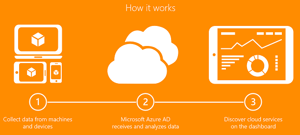

<properties
    pageTitle="Cloud-App Discovery-Sicherheit und Datenschutz Aspekte | Microsoft Azure"
    description="In diesem Thema werden die Sicherheits- und Datenschutzfunktionen Punkte, die im Zusammenhang mit der Cloud App Discovery beschrieben."
    services="active-directory"
    documentationCenter=""
    authors="markusvi"
    manager="femila"
    editor=""/>

<tags
    ms.service="active-directory"
    ms.workload="identity"
    ms.tgt_pltfrm="na"
    ms.devlang="na"
    ms.topic="article"
    ms.date="10/10/2016"
    ms.author="markusvi"/>

# Cloud-App Discovery-Sicherheit und Datenschutz Aspekte

Microsoft sieht sich verpflichtet, Ihre Privatsphäre zu schützen und Schutz der Daten, während der Vorführung-Software und-Diensten, die Ihnen helfen die Sicherheit Ihrer Organisation verwalten.  
Wir erkennt, wenn Sie Ihre Daten an andere Personen, vertrauen, dass engineering Investitionen strengen Sicherheit und Fachkenntnisse, um es zu sichern erforderlich ist.
Microsoft hält strenge Compliance und Sicherheitsrichtlinien von sicherer Software Entwicklung Lebenszyklus Methoden zum Ausführen eines Dienstes.  
Sichern und Schützen von Daten ist höchste Priorität bei Microsoft.

In diesem Thema wird erläutert, wie Daten gesammelt, verarbeitet und in Azure Active Directory Cloud App Discovery geschützt ist

##(Übersicht)

Cloud-App Discovery ist eine Funktion von Azure AD- und in Microsoft Azure gehostet wird.  
Der Cloud App Discovery-Endpunkt Agent wird zum Sammeln von Daten der Anwendung Erkennung von IT-verwaltete Computer verwendet.  
Die gesammelten Daten ist sichere Verbindung über einen verschlüsselten Kanal an der Azure AD-Cloud-App-Discovery-Dienst gesendet.  
Die Cloud App Discovery-Daten für eine Organisation ist der Azure-Portal sichtbar.  

  

In den folgenden Abschnitten des Informationsflusses folgen und beschreiben, wie sie gesichert wird, wie vom Ihrer Organisation in der Cloud App Discovery-Dienst gekürzt und schließlich Cloud App Discovery-Portal an.

## Sammeln von Daten aus der Organisation

Um Azure Active Directory-Cloud-App Discovery-Funktion verwenden, um Einblicke in die Anwendungen, die Mitarbeiter in Ihrer Organisation zu erhalten, müssen Sie zuerst den Azure AD-Cloud-App Discovery-Endpunkt Agent mit Computern in Ihrer Organisation bereitstellen.

Administratoren von den Azure-Active Directory-Mandanten (oder deren Stellvertretung) können das Agent-Installationspaket vom Azure-Portal herunterladen. Der Agent kann manuell installiert oder auf mehreren Computern in der Organisation mithilfe von SCCM oder Gruppenrichtlinien installiert.

Finden Sie weitere Anweisungen auf Bereitstellungsoptionen [Cloud App Discovery Gruppenrichtlinie-Bereitstellungshandbuch](http://social.technet.microsoft.com/wiki/contents/articles/30965.cloud-app-discovery-group-policy-deployment-guide.aspx)aus.
 

### Vom Agent gesammelten Daten

Beim Herstellen eine Verbindung zu einer Webanwendung ist, werden die Informationen in der folgenden Liste beschriebenen vom Agent erfasst. Die Informationen werden nur für diese Applikationen gesammelt, die für die Ermittlung der Administrator konfiguriert hat.  
Sie können die Liste der Cloud-apps, die überwacht der Agent durch Cloud App Discovery vorher in der Microsoft [Azure-Portal](https://portal.azure.com/)unter **Einstellungen**bearbeiten->**Datensammlung**->**App Sammlungsliste**. Weitere Informationen hierzu finden Sie unter [Erste Schritte mit Cloud App Suche](http://social.technet.microsoft.com/wiki/contents/articles/30962.getting-started-with-cloud-app-discovery.aspx)
 
**Kategorie der Informationen**: Benutzerinformationen  
**Beschreibung**:  
Der Windows-Benutzername des Prozesses, der eine an das Ziel Web-Anwendung Anforderung (z. B.: domaene\benutzername) sowie die Windows Sicherheits-ID (SID) des Benutzers.

**Kategorie der Informationen**: Informationen zu verarbeiten  
**Beschreibung**:  
Der Name des Prozesses, die die Anforderung an das Ziel Web-Anwendung (z. B.: "iexplore.exe")

**Kategorie der Informationen**: Informationen zu Computer  
**Beschreibung**:  
Der Name des Computers NetBIOS auf dem der Agent installiert ist.

**Kategorie der Informationen**: App Datenverkehr Informationen  
**Beschreibung**:  

Die folgenden Verbindungsinformationen:

- Die Quelle (lokaler Computer) und Ziel-IP-Adressen und Portnummern

- Die öffentliche IP-Adresse des Unternehmens bis zu dem die Anfrage abgeschaltet.

- Die Uhrzeit der Anforderung

- Der Umfang des Datenverkehrs gesendet und empfangen werden

- Die IP-Version (4 oder 6)

- Für TLS-Verbindungen nur: die Ziel-Hostname entweder die Erweiterung Server Namen festgestellt oder das Serverzertifikat.

Die folgenden HTTP-Informationen:

- Methode (GET, POST usw.).

- Protokoll (HTTP/1.1, usw.).

- Benutzer-Agentzeichenfolge

- Hostname

- Ziel-URI (außer Abfragezeichenfolge)

- Inhaltstypinformationen

- Referenz-URL-Informationen (ausgenommen Abfragezeichenfolge)

> [AZURE.NOTE] Der oben aufgeführten HTTP-Informationen werden für alle Verbindungen mit nicht verschlüsselten erfasst.
Für TLS-Verbindungen werden diese Informationen nur aufgezeichnet, wenn die Einstellung 'Tiefe Prüfung' im Portal aktiviert ist. Die Einstellung ist standardmäßig 'ON' ein.
Für weitere Details finden Sie weiter unten und [Erste Schritte mit Cloud App-Suche](http://social.technet.microsoft.com/wiki/contents/articles/30962.getting-started-with-cloud-app-discovery.aspx)

Zusätzlich zu den Daten, die der Agent über die Netzwerkaktivität sammelt, ermittelt es auch anonyme Informationen zu der Software und Hardwarekonfiguration, Berichte und Informationen, wie der Agent genutzt wird.

  
### Funktionsweise der agent

Die Agent-Installation umfasst zwei Komponenten:

- Ein Benutzer-Modus-Komponente

- Ein Treiber Kernelmoduskomponente (Filtern Windows-Plattform-Treiber)

Bei der Erstinstallation des Agents gespeichert wird ein vertrauenswürdiges Zertifikat von Computer-spezifische auf dem Computer mit dem anschließend eine sichere Verbindung mit der Cloud App Discovery-Dienst herstellen.  
Der Agent ruft regelmäßig Richtlinienkonfiguration aus der Cloud App Discovery-Dienst über diese sichere Verbindung ab.  
Die Richtlinie enthält Informationen über die Cloud Anwendungsmöglichkeiten zu überwachen und ob automatisch aktualisieren, unter anderem aktiviert werden soll.

Während der Web-Verkehr gesendet und empfangen auf dem Computer von Internet Explorer und in Chrome, der Cloud App Discovery-Agent analysiert den Datenverkehr und extrahiert die relevante Metadaten (siehe oben im Abschnitt **Daten vom Agent gesammelte** ).  
Jeder Minute uploads der Agent die zusammengestellten Metadaten in der Cloud App Discovery-Dienst über einen verschlüsselten Kanal.

Die Treiberkomponente hört verschlüsselten Datenverkehr und selbst in den verschlüsselten Stream eingefügt. Weitere Details im Abschnitt **Intercepting Daten von verschlüsselten Verbindungen (Tiefe Prüfung)** .

### Freigestellt Privatsphäre der Benutzer

Unser Ziel ist Administratoren die Tools zum Festlegen des Saldo zwischen detaillierte Schnittstellen in der Anwendung Verwendung und Benutzer private Bedarf für ihre Organisation bereitstellen. Zu diesem Zweck stellen wir die folgenden Regler in der Einstellungsseite im Portal aus:

- **Datensammlung**: Administratoren können auswählen, um anzugeben, welche Applikationen oder Anwendungskategorien diese Discovery-Daten auf erhalten möchten.

- **Tiefe Prüfung**: Administratoren können auswählen, um anzugeben, ob der Agent HTTP-Datenverkehr für SSL/TLS-Verbindungen (QuickInfos **' Tiefe Prüfung '**) sammelt. Mehr dazu im nächsten Abschnitt.

- **Zustimmung Optionen**: können Administratoren das Cloud App Discovery-Portal auswählen, ob Benutzer über die Sammlung von Daten durch den Agent benachrichtigen und, ob Benutzer erforderlich ist Zustimmung, bevor der Agent startet Benutzerdaten sammeln.

Der Cloud App Discovery-Endpunkt Agent sammelt nur die **Daten, die vom Agent gesammelte** Abschnitt oben beschriebene Informationen.

### Daten aus der verschlüsselten Verbindungen (Tiefe Prüfung) abgefangen
Wie bereits zuvor erwähnt, können Administratoren den Agent zum Überwachen der Daten aus der verschlüsselten Verbindungen ('Tiefe Prüfung') konfigurieren. TLS ([Transport Layer Security](https://msdn.microsoft.com/library/windows/desktop/aa380516%28v=vs.85%29.aspx)) ist eines der am häufigsten verwendeten Protokolle im Internet verwendet heute aus. Durch die Verschlüsselung der Kommunikation mit TLS, kann ein Client einen Kommunikationskanal sichere und private mit einem Webserver herstellen; TLS bietet grundlegenden Schutz für die Übergabe von Anmeldeinformationen für die Authentifizierung und verhindern, dass die Offenlegung von vertraulichen Informationen.

Während der End-to-End-verschlüsselte Kanal von TLS bereitgestellten wichtige Sicherheit und Datenschutz ermöglicht, ist das Protokoll häufig für bösartige oder schädliche Zwecke missbraucht. Soviel Ja, wird tatsächlich die TLS häufig als "Umgehung der universal Firewall-Protokoll" bezeichnet. Die die Ursache des Problems ist, dass die meisten Firewalls erfolgreiche TLS-Kommunikation prüfen, da die Anwendung Layer Daten mit SSL verschlüsselt sind. Mit diesem Wissen nutzen Angreifer häufig TLS um bösartige Fracht eines Benutzers sicher, dass die am häufigsten intelligente Anwendung-Layer-Firewalls vollständig TLS Blinde und TLS-Kommunikation zwischen Hosts darf einfach weiterleiten vorführen. Endbenutzer nutzen häufig TLS zum umgehen seitens ihrer corporate Firewalls und Proxyserver, Access-Steuerelemente für die Verbindung zu öffentlichen Proxys und für Tunnel nicht-TLS Protokolle durch die Firewall, die von der Richtlinie andernfalls blockiert werden, verwenden.

Tiefe Prüfung kann der Cloud App Discovery Agent als einer vertrauenswürdigen Mann-in-the-Mitte dienen. Wenn eine Clientanforderung Zugriff auf eine Ressource HTTPS geschützt erfolgt, wird der Endpunkt Agent-Treiber hört die Verbindung und stellt her, dass eine neue Verbindung mit dem Zielserver zu sein SSL-Zertifikat für den Client ruft. Der Agent dann überprüft, ob das Zertifikat vertrauenswürdig sein kann (indem er überprüft, ob es nicht gesperrt wurde, und Durchführung anderer Zertifikat überprüft), und wenn diese Durchgang, klicken Sie dann den Endpunkt-Agent übernimmt die Informationen aus dem Serverzertifikat und erstellt eine eigene Serverzertifikat – bekannt als ein abgefangen Zertifikat – mithilfe dieser Informationen. Das Zertifikat abgefangen wird signierte auf direkt vom Endpunkt-Agent mit einem Stammzertifikat, das in der Windows-Speicher für vertrauenswürdige Zertifikate installiert ist. Dieses Zertifikat selbstsignierten Stamm nicht exportiert gekennzeichnet ist, und ist ACL Administratoren hatten. Es soll nie der Computer befinden, in dem es erstellt wurde. Wenn der Endbenutzer-Clientanwendung abgefangen Zertifikat erhält, wird es vertrauen, da die Kette des Zertifikats ganz nach Root Zertifikat erfolgreich überprüft werden kann. Dieser Vorgang ist hauptsächlich transparent Gesichtspunkt des Endbenutzers mit wenigen Vorsichtsmaßnahmen wie unten beschrieben.

Tiefe Prüfung aktiviert ist, können Sie der Cloud App Discovery-Endpunkt-Agent entschlüsseln und prüfen verschlüsselte TLS-Kommunikation, gleicht den Dienst Rauschen und Rückschlüsse auf die Verwendung der verschlüsselten Cloud apps bereitstellen.

#### Ein Wort der Warnung
Bevor Sie Tiefe Prüfung aktivieren, wird dringend vorgeschlagen, dass Sie Ihre Absichten Legal und HR Abteilungen kommunizieren und ihre Zustimmung zu erhalten. Prüfen des Endbenutzers private verschlüsselte Kommunikation kann sensible Betreff offensichtlich sein. Vor einer Herstellung Verteilen der Überprüfung auf Tiefe stellen sicher, dass Ihre corporate Sicherheit und Richtlinien für zulässige wurden aktualisiert, um darauf hinzuweisen, dass verschlüsselter Kommunikation untersucht wird. Benachrichtigung und Befreiung von Websites als vertrauliche (z. B. Banking- und medizinische Websites) auch möglicherweise notwendig, wenn Sie Cloud App Discovery zum Überwachen der diese konfigurieren. Wie zuvor erwähnt, können Administratoren das Cloud App Discovery-Portal auswählen, ob Benutzer über die Sammlung von Daten durch den Agent benachrichtigen und, ob Zustimmung des Benutzers erforderlich ist, bevor der Agent startet Benutzerdaten sammeln.

### Bekannte Probleme und Nachteile
Es gibt einige Fälle, in dem TLS abgefangen des Endbenutzers beeinträchtigen:

- Erweiterte Überprüfung (EW) Zertifikate Rendern die Adressleiste des Webbrowsers grünen als ein visueller Hinweis fungieren, dass Sie einer vertrauenswürdigen Website besuchen. TLS-Prüfung kann EV also nicht in das Zertifikat, das es an den Client, Probleme, damit Websites, für die Verwendung von EV normal funktionieren, aber die Adressleiste wird nicht grün angezeigt.  

- Öffentlicher Schlüssel anheften (auch als Zertifikat fixieren bezeichnet) sollen Benutzer Mann in zweiter Angriffen schützen und rogue Zertifizierungsstellen helfen. Wenn das Stamm-Zertifikat für eine Website angeheftete nicht mit einem der der bekannten guten Zertifizierungsstelle übereinstimmt, lehnt im Browser die Verbindung mit einem Fehler ab. Diese Verbindungen schlägt fehl, da TLS abgefangen tatsächlich ein Mann-in-the-Mitte ist.

- Wenn Benutzer klicken Sie auf das Schlosssymbol im Browser Browser Adresse/Eingabegebietsschema-Leiste, um die Standortinformationen prüfen, eine Kette, die in der Zertifizierungsstelle verwendet, um die Website Zertifikat signieren nicht angezeigt wird, aber stattdessen eine Kette des Zertifikats, die mit der Windows Store Zertifikat vertrauenswürdige.

Klicken Sie zum Verringern der Vorkommen des diese Probleme verfolgen wir Cloud-Diensten und Clientanwendungen verwenden erweiterter Überprüfung oder öffentlichen Key anheften, und weisen Sie der Endpunkt-Agent bekannt zu vermeiden, abgefangen betroffenen Verbindungen. Auch in diesen Fällen erhalten Sie weiterhin Berichte über die Verwendung von dieser Cloud-apps und übertragenen Datenmengen, jedoch da Tiefe keine überprüft stehen, werden keine Details zur Verwendung von der apps wurden verfügbar sein.

## Senden von Daten an Cloud-App-Suche

Nachdem der Agent Metadaten gesammelt wurden, wird er auf dem Computer zwischengespeichert bis zu einer Minute oder die zwischengespeicherten Daten mit eine Größe von 5 MB erreicht hat. Es ist dann komprimiert und über eine sichere Verbindung mit der Cloud App Discovery-Dienst gesendet.

Wenn der Agent Kommunikation mit der Cloud-App-Discovery-Dienst aus irgendeinem Grund nicht möglich ist, ist die zusammengestellten Metadaten in einem Cache für lokale Dateien gespeichert, die nur von berechtigten Benutzern auf dem Computer (wie etwa die Gruppe der Administratoren) zugegriffen werden kann.  
Der Agent versucht automatisch, die zwischengespeicherte Metadaten erneut zu senden, bis es erfolgreich von der App-Discovery Cloud-Dienst empfangen wurde.

## Die Daten am Ende Dienst empfangen

Die Agents authentifiziert zur Ermittlung App Cloud-Dienst mit dem Computer bestimmte Client-Authentifizierungszertifikat weiter oben erwähnten und Daten über einen verschlüsselten Kanal weitergeleitet werden.  
Der App-Suche Cloud-Dienst Analytics Verkaufspipeline verarbeitet Metadaten für jeden Kunden separat indem sie logisch durch alle Phasen der Verkaufspipeline Analytics partitionieren.
Die analysierte Metadaten Laufwerke verschiedenen Berichte im Portal.

Die nicht verarbeiteten Metadaten und die analysierten Metadaten werden bis zu 180 Tage lang gespeichert. Darüber hinaus können Kunden wählen die analysierte Metadaten in einem Azure Blob-Speicher-Konto ihrer Wahl zu erfassen.
Dies ist nützlich für offline Analyse von Metadaten als auch längere Aufbewahrung der Daten.

## Zugreifen auf die Daten mithilfe des Azure-Portals

In einer Aufwand, um die Metadaten gesammelt schützen Zugang standardmäßig nur globale Administratoren den Mandanten in der Cloud App Discovery-Funktion im Azure-Portal.  
Administratoren können jedoch auch den dieser Zugriff auf andere Benutzer oder Gruppen übertragen.

> [AZURE.NOTE] Weitere Informationen hierzu finden Sie unter [Erste Schritte mit Cloud App Suche](http://social.technet.microsoft.com/wiki/contents/articles/30962.getting-started-with-cloud-app-discovery.aspx)

 
Allen Benutzern den Zugriff auf die Daten im Portal muss mit einer Lizenz Azure AD Premium lizenziert.

##Zusätzliche Ressourcen

* [Wie kann ich unbestätigter Cloud-apps, die verwendet werden in der eigenen Organisation ermitteln](active-directory-cloudappdiscovery-whatis.md)
* [Artikel Index für Anwendungsverwaltung in Azure-Active Directory](active-directory-apps-index.md)
