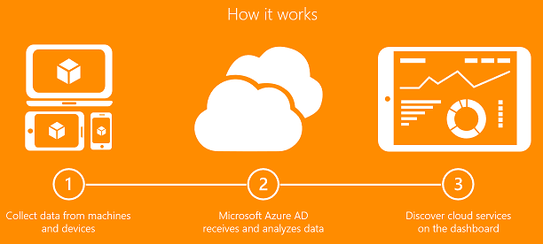

<properties
    pageTitle="Nicht verwaltete Cloud-Programme mit der Cloud-App-Suche suchen | Microsoft Azure"
    description="Informationen zum Suchen und Verwalten von Applications mit Cloud App Discovery, was die Vorteile sind und wie es funktioniert."
    services="active-directory"
    keywords="Cloud-app-Suche, Verwalten von applications"
    documentationCenter=""
    authors="markusvi"
    manager="femila"
    editor=""/>

<tags
    ms.service="active-directory"
    ms.workload="identity"
    ms.tgt_pltfrm="na"
    ms.devlang="na"
    ms.topic="article"
    ms.date="10/10/2016"
    ms.author="markvi"/>

# Suchen nach nicht verwaltete Cloud Applikationen mit der Cloud-App-Suche

## (Übersicht)
In modernen Unternehmen sind IT-Abteilung häufig nicht bewusst die Cloud-Anwendung, die Mitglieder Ihrer eigenen Organisation erledigen ihrer Arbeit zu verwenden. Es ist einfach, finden Sie unter Warum Administratoren Fragen zu dem nicht autorisierten Zugriff auf Unternehmensdaten, möglichen Datenverlust und anderen Risiken haben möchten. Diese fehlende Präsenz umso einen Plan für Umgang mit diesen Risiken scheint schwierig zu erstellen.

Cloud-App Discovery ist ein Feature der Premium Azure Active Directory (AD), die Sie Cloud Applikationen Beantwortung von Personen in Ihrer Organisation ermitteln kann.

**Mit der Cloud App Discovery können Sie folgende Aktionen ausführen:**

- Suchen nach die Cloudanwendungen verwendet wird und messen Sie die Verwendung durch die Anzahl der Benutzer, die Lautstärke Datenverkehr oder die Anzahl der Webanfragen zur Anwendung.
- Identifizieren Sie die Benutzer, die eine Anwendung verwenden.
- Exportieren von Daten für die Analyse offline.
- Zeigen Sie die folgenden Anwendungen unter IT-Steuerung, und aktivieren Sie für einmaliges auf, für die Verwaltung der Benutzer.

## So funktioniert es
1. Anwendung Verwendung Agents werden auf dem Computer des Benutzers installiert.
2. Die Anwendung Verwendungsinformationen erfasst werden, indem Sie die Agents wird über einen sicheren, verschlüsselten Kanal an der Cloud app Discovery-Dienst gesendet.
3. Der App-Discovery Cloud-Dienst wertet die Daten und erstellt Berichte.

Um mit der Cloud-App-Suche anzufangen, finden Sie unter [Erste Schritte mit Cloud App Suche](http://social.technet.microsoft.com/wiki/contents/articles/30962.getting-started-with-cloud-app-discovery.aspx)

## Verwandte Artikel
- [Cloud-App Discovery-Sicherheit und Datenschutz Aspekte](active-directory-cloudappdiscovery-security-and-privacy-considerations.md)  
- [Bereitstellungshandbuch für die Richtlinie Cloud App Discovery-Gruppe](http://social.technet.microsoft.com/wiki/contents/articles/30965.cloud-app-discovery-group-policy-deployment-guide.aspx)
- [Bereitstellungshandbuch für Cloud App Discovery System Center](http://social.technet.microsoft.com/wiki/contents/articles/30968.cloud-app-discovery-system-center-deployment-guide.aspx)
- [Cloud-App Discovery Registry Settings für Proxy-Servern mit benutzerdefinierte Ports](active-directory-cloudappdiscovery-registry-settings-for-proxy-services.md)
- [Cloud-App Discovery-Agent Changelog](http://social.technet.microsoft.com/wiki/contents/articles/24616.cloud-app-discovery-agent-changelog.aspx)
- [Häufig gestellte Fragen zu Cloud-App-Suche](http://social.technet.microsoft.com/wiki/contents/articles/24037.cloud-app-discovery-frequently-asked-questions.aspx)
- [Artikel Index für Anwendungsverwaltung in Azure-Active Directory](active-directory-apps-index.md)
