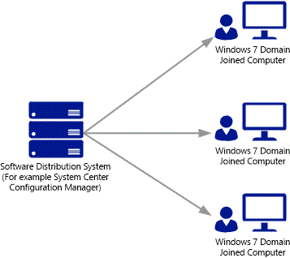
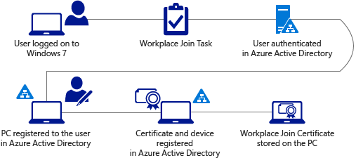

<properties
    pageTitle="# Konfigurieren der automatischen Gerät Registrierung für Windows 7-Domäne beitreten Geräte | Microsoft Azure"
    description="Schritte zum Konfigurieren Ihrer Domäne Windows 7 miteinander Geräte mit Azure AD automatisch registrieren. und vor, um das Gerät Registrierung Software-Paket für Ihre Domäne Windows 7 Bereitstellen beigetreten Geräte mit einer Softwareverteilungssystem wie System Center-Konfigurations-Manager."
    services="active-directory"
    documentationCenter=""
    authors="femila"
    manager="swadhwa"
    editor=""/>

<tags
    ms.service="active-directory"
    ms.workload="identity"
    ms.tgt_pltfrm="na"
    ms.devlang="na"
    ms.topic="article"
    ms.date="09/21/2016"
    ms.author="MarkVi"/>

# Konfigurieren der automatischen Gerät Registrierung für Windows 7-Domäne beitreten-Geräte

Als IT-Administrator können Sie Ihre Windows 7-Domäne hinzugefügt Geräte automatisch mit Azure AD registrieren konfigurieren. Zum Ausführen, damit das Gerät Registrierung Software-Paket auf Ihrem Windows 7-Domäne bereitgestellt werden muss die miteinander Geräte mit einer Softwareverteilungssystem wie System Center-Konfigurations-Manager aus. Achten Sie darauf, lesen Sie durch, und führen Sie die erforderlichen Komponenten automatische Gerät Registrierung mit Azure Active Directory für Windows Domänenverbund Geräte aufgeführt.

>[AZURE.NOTE]
 Neueste Anweisungen zum Einrichten von automatischen Gerät Registrierung finden Sie unter, [zum Einrichten der automatischen Registrierung von Windows-Domäne beigetreten Geräte mit Azure Active Directory](active-directory-conditional-access-automatic-device-registration-setup.md).

##Installieren das Gerät Registrierung Software-Paket unter Windows 7-Domäne beigetreten Geräte

Gerät Registrierung für Windows 7 ist als [herunterladbaren MSI-Paket](https://connect.microsoft.com/site1164)verfügbar. Das Paket muss auf Computern mit Windows 7 installiert sein, die eine Active Directory-Domäne angehören. Sie sollten das Paket mit einem Softwareverteilungssystem wie System Center-Konfigurations-Manager bereitstellen. Das MSI-Paket unterstützt die standard Hintergrundinstallation Optionen/quiet verwenden Parameter.
Software-Paket ist auf der [Website Microsoft verbinden](https://connect.microsoft.com/site1164)zum Download verfügbar. Hier können Sie auswählen, und Laden Sie Arbeitsplatz teilnehmen für Windows 7.

## Arbeitsplatz Verknüpfung mit Azure-Active Directory
Gerät Registrierung für Windows 7-Domäne beitreten Geräte ist nicht erforderlich oder eine Benutzeroberfläche enthalten. Nachdem auf dem Computer installiert ist, wird jeder Domänenbenutzer, die an den Computer anmeldet automatisch und im Hintergrund mit einem Geräteobjekt in Azure AD registriert sein. Kann ein Geräteobjekt in Azure AD für jeden registrierten Benutzer das physische Gerät.

Das Installationsprogramm erstellt einen Vorgang geplant System, die in dem Kontext des Benutzers ausgeführt wird, und klicken Sie auf Benutzer anmelden ausgelöst. Der Vorgang im Hintergrund registriert den Benutzer, und Gerät mit Azure AD nach Vorzeichen des Benutzers in abgeschlossen ist.
Der Vorgang geplant finden Sie in der Aufgabenplanungsbibliothek unter **Microsoft** > **Arbeitsplatz teilnehmen**.
Die Aufgabe wird ausgeführt und registriert alle Active Directory-Benutzer, die den Computer anmelden.
Die folgende Abbildung enthält der Schritt-Anleitung für die automatische Gerät Registrierung.

1. Ein Benutzer (Informationsnutzer) meldet auf einem Windows 7-Client-Computer mithilfe von Anmeldeinformationen für die Domäne Active Directory.
1. Der geplante Arbeitsplatz Join-Vorgang wird ausgeführt.
1. Der Benutzer wird im Hintergrund mit AD FS mithilfe der integrierten Windows-Authentifizierung authentifiziert.
1. Windows 7-PC ist für den Benutzer in Azure AD registriert.
1. Ein Geräteobjekt und das Zertifikat wird in Azure Active Directory erstellt. Das Objekt stellt die user@device.
1. Das Zertifikat Arbeitsplatz teilnehmen wird auf dem Computer gespeichert.

## Aufheben der Registrierung Ihre Windows 7-Domäne beigetreten Geräte

Sie können sich entscheiden aufgehoben werden Ihre Windows 7-Geräte-Domäne hinzugefügt, indem Sie wie folgt vorgehen: Deinstallieren Sie die Teilnahme an Arbeitsplatz Software-Paket aus Ihrem Windows 7-Domäne beigetreten Geräte mit einer Softwareverteilungssystem wie System Center-Konfigurations-Manager.

Klicken Sie dann öffnen Sie ein Eingabeaufforderungsfenster auf dem Windows 7-Computer, und führen Sie den folgenden Befehl aus das Gerät aufgehoben werden:

    %ProgramFiles%\Microsoft Workplace Join\AutoWorkplace.exe /leave

>[AZURE.NOTE]
>Dieser Befehl muss im Kontext jeder Domänenbenutzer, die signiert hat in dem Computer ausgeführt werden.
Ereignisanzeige und Fehler für Windows 7-Domäne beitreten-Geräte.

Windows-Ereignisprotokoll auf dem Computer Windows 7 werden Nachrichten, die im Zusammenhang mit Arbeitsplatz teilnehmen angezeigt. Sie können für erfolgreiche und nicht erfolgreiche Arbeitsplatz teilnehmen Ereignisse Nachrichten suchen. Im Ereignisprotokoll finden Sie im Viewer unter Anwendungen und Dienste Protokolle > Microsoft – Arbeitsplatz teilnehmen.

## Weitere Themen

- [Azure-Active Directory-Gerät Registrierung (Übersicht)](active-directory-conditional-access-device-registration-overview.md)
- [Automatische Gerät Registrierung mit Azure Active Directory for Windows Domain-Joined Geräte](active-directory-conditional-access-automatic-device-registration.md)
- [Konfigurieren der automatischen Gerät Registrierung für Windows 8.1-Domäne beitreten Geräte](active-directory-conditional-access-automatic-device-registration-windows-8-1.md)
- [Automatische Gerät Registrierung mit Azure Active Directory für Windows 10 Domänenverbund Geräte](active-directory-azureadjoin-devices-group-policy.md)
