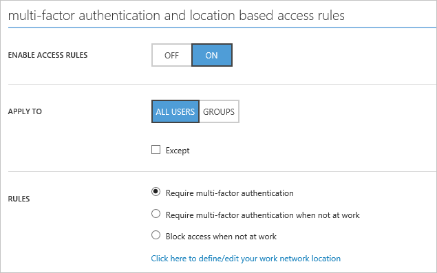

<properties
    pageTitle="Azure bedingten Zugriff für SaaS Apps | Microsoft Azure"
    description="Bedingte Access in Azure AD ermöglicht Ihnen, die pro Anwendung kombinierte Authentifizierung Access Regeln und die Möglichkeit, den Zugriff für Benutzer, die nicht in einem vertrauenswürdigen Netzwerk Sperren konfigurieren. "
    services="active-directory"
    documentationCenter=""
    authors="markusvi"
    manager="femila"
    editor=""/>

<tags
    ms.service="active-directory"
    ms.workload="identity"
    ms.tgt_pltfrm="na"
    ms.devlang="na"
    ms.topic="article"
    ms.date="09/26/2016"
    ms.author="markvi"/>

# Erste Schritte mit Azure Active Directory bedingten Zugriff

Azure Active Directory bedingten Zugriff für [SaaS](https://azure.microsoft.com/overview/what-is-saas/) -apps und Azure AD-verbunden apps können, die Sie bedingte Zugriff basierend auf Gruppieren, Position und Anwendung Vertraulichkeit konfigurieren. 

Mit bedingten Zugriff auf Grundlage der Anwendung Vertraulichkeit können Sie die Access-Regeln pro Anwendung kombinierte Authentifizierung (MFA) festlegen. MFA pro Anwendung bietet die Möglichkeit, Zugriff für Benutzer sperren, die nicht in einem vertrauenswürdigen Netzwerk sind. Sie können für alle Benutzer MFA Regeln anwenden, die mit der Anwendung oder nur für Benutzer in der angegebenen Sicherheitsgruppen zugewiesen sind.  Benutzer der Anforderung MFA möglicherweise ausgeschlossen werden müssen, wenn sie die Anwendung über eine IP-Adresse zugreifen, die innerhalb der Organisation Netzwerk befindet.

Diese Funktionen sind für Kunden verfügbar, die eine Lizenz Azure Active Directory Premium erworben haben.

## Szenario erforderliche Komponenten
* Lizenz für Azure-Active Directory-Premium

* Partnerverbundkontakte oder verwalteten Azure Active Directory-Mandanten

* Partnerverbundkontakte Mandanten erfordern die kombinierte Authentifizierung aktiviert werden.

## Konfigurieren der Access-Anwendung von Regeln

In diesem Abschnitt beschrieben, wie Sie die Access-Anwendung Regeln konfigurieren.

1. Melden Sie sich Azure klassischen-Portal mit einem Konto an, die ein globaler Administrator für Azure AD ist.
2. Wählen Sie im linken Bereich aus **Active Directory**.
3. Wählen Sie auf der Registerkarte Verzeichnis aus Ihrem Verzeichnis.
4. Wählen Sie die Registerkarte **Applications** .
5. Wählen Sie die Anwendung, der für die Regel festgelegt wird.
6. Wählen Sie die Registerkarte **Konfigurieren** .
7. Führen Sie einen Bildlauf nach unten bis zum Abschnitt Regeln Access. Wählen Sie die gewünschte Regel aus.
8. Geben Sie die Benutzer, die, denen die Regel angewendet wird.
9. Aktivieren Sie die Richtlinie durch Auswahl **aktiviert sein muss**.

##Grundlegendes zu Access-Regeln

Dieser Abschnitt enthält eine detaillierte Beschreibung der Regeln Access unterstützt Azure bedingte Anwendung zugreifen.

### Angeben der Benutzer anwenden auf die Access-Regeln

Standardmäßig wird die Richtlinie für alle Benutzer angewendet, die auf die Anwendung zugreifen können. Sie können jedoch auch die Richtlinie für Benutzer einschränken, die Mitglieder der angegebenen Sicherheitsgruppen sind. Die Schaltfläche **Gruppe hinzufügen** wird verwendet, um eine oder mehrere Gruppen Auswahl im Dialogfeld Gruppe auszuwählen, für die die Regel gilt. Mithilfe dieses Dialogfelds kann auch zum Entfernen der ausgewählter Gruppen verwendet werden. Wenn die Regeln auf Gruppen anwenden ausgewählt ist, werden die Access-Regeln nur für Benutzer, die einem angegebenen Sicherheitsgruppen gehören erzwungen.

Sicherheitsgruppen können auch explizit aus der Richtlinie ausgeschlossen werden, indem Sie die Option **außer** und eine oder mehrere Gruppen angeben. Benutzer, die Mitglied einer Gruppe in der Liste **mit Ausnahme** sind werden nicht der Verpflichtung kombinierte Authentifizierung auch wenn sie ein Mitglied der Gruppe sind, denen die Regel gilt.
Die nachfolgend aufgeführte Regel benötigen alle Benutzer in der Gruppe Projektmanager mehrstufige Authentifizierung verwenden, wenn Sie die Anwendung zugreifen.

## Bedingte Access Regeln mit MFA
Wenn ein Benutzer mit dem Feature der pro Benutzer kombinierte Authentifizierung konfiguriert wurde, wird diese Einstellung auf die Benutzer mit die kombinierte Authentifizierungsregeln der app kombinieren. Dies bedeutet, dass ein Benutzer, der für die kombinierte Benutzerauthentifizierung konfiguriert wurde kombinierte Authentifizierung ausführen, auch wenn die Anwendung kombinierte Authentifizierungsregeln ausgenommen wurden erforderlich ist. Weitere Informationen zu mehrstufige Authentifizierung und Einzelbenutzer-Einstellungen.

### Zugriffsoptionen für die Regel
Die folgenden Optionen werden unterstützt:

* **Mehrstufige Authentifizierung erforderlich**: die wem Access gelten die Regeln, die Benutzer erforderlich abgeschlossen kombinierte Authentifizierung vor dem Zugriff auf die Anwendung, die auf die Richtlinie angewendet wird.

* **Verlangen der kombinierte Authentifizierung nicht am Arbeitsplatz**: ein Benutzer, die aus einer vertrauenswürdigen IP-Adresse stammen nicht kombinierte Authentifizierung ausführen muss. Klicken Sie auf der Einstellungsseite kombinierte Authentifizierung können die vertrauenswürdigen IP-Adressbereiche konfiguriert werden.

* **Blockieren von Access nicht am Arbeitsplatz**: ein Benutzer, die nicht aus einer vertrauenswürdigen IP-Adresse stammen blockiert werden. Klicken Sie auf der Einstellungsseite kombinierte Authentifizierung können die vertrauenswürdigen IP-Adressbereiche konfiguriert werden.

### Festlegen der Status einer Regel
Access Regelstatus ermöglicht aktivieren oder Deaktivieren von Regeln. Wenn Sie die Access-Regeln deaktiviert sind, wird die Anforderung kombinierte Authentifizierung nicht erzwungen.

### Auswertung von Access

Access-Regeln werden ausgewertet, wenn ein Benutzer eine partnerverbundkontakte Anwendung greift auf, die OAuth 2.0, OpenID verbinden, SAML oder WS-Verbund verwendet. Darüber hinaus werden Access Regeln ausgewertet, bei der OAuth 2.0 und verbinden OpenID ein Token aktualisieren zum Erfassen von einer Access-Token. Wenn die Auswertung von Richtlinien schlägt fehl, wenn ein Token aktualisieren verwendet wird, wird der Fehler **Invalid_grant** zurückgegeben werden, dies weist darauf hin, dass der Benutzer muss erneut an den Client authentifizieren.

###Konfigurieren von Federation Services um kombinierte Authentifizierung bereitzustellen.

Partnerverbundkontakte Mandanten, kann MFA Azure Active Directory oder der lokalen durchgeführt werden AD FS-Server.

Standardmäßig wird MFA in einer Seite von Azure Active Directory gehostet anfallen. Um MFA lokal zu konfigurieren, muss die Eigenschaft **– SupportsMFA** **Wahr** in Azure Active Directory, mit dem Azure AD-Modul für Windows PowerShell festgelegt werden.

Im folgenden Beispiel wird gezeigt, wie lokale MFA mithilfe von das [Cmdlet "Set-MsolDomainFederationSettings"](https://msdn.microsoft.com/library/azure/dn194088.aspx) auf den Mandanten "contoso.com" zu aktivieren:

    Set-MsolDomainFederationSettings -DomainName contoso.com -SupportsMFA $true

Zusätzlich zum Festlegen dieser Kennzeichnung, muss die partnerverbundkontakte Mandanten AD FS-Instanz für die Durchführung kombinierte Authentifizierung konfiguriert werden. Folgen Sie den Anweisungen für die [Bereitstellung von Azure kombinierte Authentifizierung lokalen](../multi-factor-authentication/multi-factor-authentication-get-started-server.md).

## Verwandte Artikel

- [Sichern des Zugriffs auf Office 365 und andere apps verbunden auf Azure Active Directory](active-directory-conditional-access.md)
- [Artikel Index für Anwendungsverwaltung in Azure-Active Directory](active-directory-apps-index.md)
