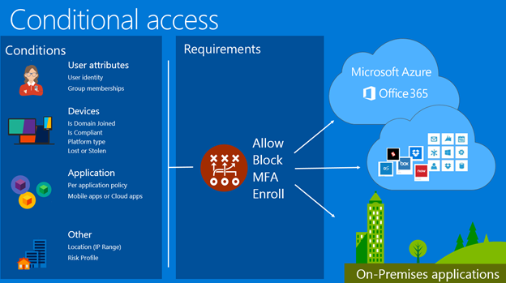

<Properties
    pageTitle="Bedingte Azure Active Directory-Zugriff | Microsoft Azure"  
    description="Verwenden Sie bedingte Access-Steuerelements in Azure Active Directory bestimmter Bedingungen, die bei der Authentifizierung für den Zugriff auf Anwendungen überprüfen."  
    services="active-directory"
    keywords="Bedingte Zugriff auf apps, bedingten Zugriff mit Azure AD, sicheren Zugriff auf Unternehmensressourcen, bedingte Richtlinien"
    documentationCenter=""
    authors="markusvi"
    manager="femila"
    editor=""/>

<tags
    ms.service="active-directory"
    ms.devlang="na"
    ms.topic="article"
    ms.tgt_pltfrm="na"
    ms.workload="identity"
    ms.date="09/21/2016"
    ms.author="markvi"/>

# Bedingte Access in Azure Active Directory   

Die Steuerelement-Funktionen in Azure Active Directory (Azure AD) bedingten Zugriff bieten sichere Ressourcen in der Cloud und lokale Hilfe auf einfache Weise. Bedingte Richtlinien wie mehrstufige Authentifizierung schützen kann gegen das Risiko gestohlen und Phished Anmeldeinformationen. Andere bedingte Richtlinien können Schutz Ihrer Organisation Daten. Beispielsweise können Verbindung mit dem Anmeldeinformationen anfordern, Sie einer Richtlinie dieser nur Geräte verfügen, die in einem mobilen Gerät Managementsystem registriert sind, wie Sie Ihrer Organisation vertrauliche Dienste von Microsoft Intune zugegriffen werden kann.

## Erforderliche Komponenten

Azure AD bedingten Zugriff ist ein Feature von [Azure Active Directory Premium](http://www.microsoft.com/identity). Jeder Benutzer, der eine Anwendung zugegriffen wird, die bedingte Richtlinien angewendet wurde, muss eine Azure AD Premium-Lizenz verfügen. Sie können weitere Informationen zur lizenzanforderungen im [Benutzerbericht nicht lizenzierter](https://aka.ms/utc5ix).

## Wie wird eine bedingte Access Steuerelement erzwungen?  

Mit bedingten Access-Steuerelement direkte Azure AD überprüft, für die spezielle, Sie Bedingungen für einen Benutzer Zugriff auf eine Anwendung festlegen. Nach Access Anforderungen erfüllt ist, wird der Benutzer authentifiziert wird und auf die Anwendung zugreifen kann.  

## Bedingungen

Dies sind die Bedingungen, die in einer bedingten Zugriffsrichtlinie enthalten sein können:

- **Gruppenmitgliedschaft**. Steuern des Zugriffs eines Benutzers basierend auf der Mitgliedschaft in einer Gruppe.

- **Speicherort**. Verwenden Sie den Speicherort des Benutzers zu auslösen mehrstufige Authentifizierung, und verwenden Sie blockieren Steuerelemente, wenn ein Benutzer nicht in einem vertrauenswürdigen Netzwerk befindet.

- **Geräteplattform**. Verwenden Sie die Geräteplattform, beispielsweise iOS, Android, Windows Mobile oder Windows als Bedingung für die Richtlinie anwenden.

- **Gerät aktiviert**. Des Geräts, ist, ob aktiviert oder deaktiviert werden, während der Auswertung von Richtlinien überprüft werden. Wenn Sie ein Gerät Verlust oder Diebstahl im Verzeichnis deaktivieren, kann es nicht mehr Richtlinie Anforderungen erfüllen.

- **Anmelden und Benutzer Risiko**. Sie können für bedingte Risiko-Richtlinien [Azure AD-Schutz](active-directory-identityprotection.md) verwenden. Bedingte Risiko-Richtlinien dabei helfen, Ihre Organisation Advance-Schutz basierend auf Risikoereignisse und ungewöhnliche Aktivitäten zu verleihen.

## Steuerelemente

Hierbei handelt es sich um Steuerelemente, mit denen Sie eine bedingte Zugriffsrichtlinie zu erzwingen:

- **Mehrstufige Authentifizierung**. Sie können die strenge Authentifizierung über kombinierte Authentifizierung erforderlich. Sie können die kombinierte Authentifizierung mit Azure kombinierte Authentifizierung oder mithilfe eines lokalen Anbieters mehrstufige Authentifizierung, kombiniert mit Active Directory Federation Services (AD FS) verwenden. Mehrstufige Authentifizierung mit trägt zum Schutz von Ressourcen vor dem Zugriff durch nicht autorisierte Benutzer, der Zugriff auf die Anmeldeinformationen eines gültigen Benutzers möglicherweise gewonnen haben.

- **Blockieren**. Sie können Bedingungen wie Speicherort für die zu blockierenden des Benutzerzugriffs anwenden. Sie können beispielsweise Zugriff blockieren, wenn ein Benutzer nicht in einem vertrauenswürdigen Netzwerk befindet.

- **Kompatible Geräte**. Bedingte Richtlinien lassen sich auf der Geräteebene. Sie können einer Richtlinie eingerichtet, sodass nur Computern, die Domäne beigetreten sind, oder mobilen Geräten, die in einer mobilen Gerät Management-Anwendung registriert sind Ressourcen Ihrer Organisation zugreifen können. Sie können beispielsweise Intune Gerät Kompatibilität prüfen verwenden, und wenden Sie sich dann an Azure AD für Durchsetzung, wenn der Benutzer versucht, eine Anwendung zugreifen. Ausführliche Anleitung zum Intune zum Schutz apps und Daten verwenden finden Sie unter [schützen apps und Daten mit Microsoft Intune](https://docs.microsoft.com/intune/deploy-use/protect-apps-and-data-with-microsoft-intune). Intune können Sie auch den Datenschutz für Verlust oder Diebstahl Geräte erzwingen. Weitere Informationen finden Sie unter [Schützen von Daten mit vollständigen oder selektiven zurücksetzen Microsoft Intune verwenden](https://docs.microsoft.com/intune/deploy-use/use-remote-wipe-to-help-protect-data-using-microsoft-intune).

## Applikationen

Sie können eine bedingte Zugriffsrichtlinie Ebene der Anwendung erzwingen. Legen Sie in der Cloud oder lokalen Zugriffsebenen für Anwendungen und Dienste. Die Richtlinie wird direkt auf der Website oder einen bestimmten Dienst angewendet. Die Richtlinie für den Zugriff auf im Browser und Anwendungen, die Zugriff auf den Dienst umgesetzt.

## Bedingte Access-basierten Gerät

Sie können den Zugriff einschränken auf Anwendungen von Geräten, Azure AD registriert sind, und die bestimmte Bedingungen erfüllen. Bedingte Access-basierten Gerät Loss eines Unternehmens Ressourcen aus Benutzer versuchen, die Ressourcen aus zugreifen:

- Unbekannten oder nicht verwalteten Geräte.
- Geräte, die den Sicherheitsrichtlinien Ihrer Organisation einrichten entsprechen nicht.

Sie können auf diese Anforderungen basierende Richtlinien festlegen:

- **Domänenverbund Geräte**. Festlegen einer Richtlinie zu beschränken des Zugriffs auf Geräte, die einer lokalen Active Directory-Domäne hinzugefügt werden, und auch registriert worden sind mit Azure AD, an. Diese Richtlinie gilt für Windows-Desktops, Laptops und Enterprise-Tablets.
Weitere Informationen zum Einrichten der automatischen Registrierung von Domänenverbund Geräte mit Azure AD finden Sie unter [Einrichten von automatischen Registrierung von Windows Domänenverbund Geräte mit Azure Active Directory](active-directory-conditional-access-automatic-device-registration-setup.md).

- **Kompatible Geräte**. Festlegen einer Richtlinie zum Einschränken des Zugriffs auf Geräte, die **kompatible** im Projektmanagement-Systemverzeichnis markiert sind. Dieser Richtlinie ist sichergestellt, dass nur Geräte, die Sicherheitsrichtlinien wie die Verschlüsselung der Datei auf einem Gerät erzwingen entsprechen der Zugriff gewährt werden. Sie können diese Richtlinie zum Einschränken des Zugriffs von den folgenden Geräten verwenden:

    - **Windows-Domäne Geräte**. Verwaltet vom System Center Konfigurations-Manager (im aktuellen Zweig) in einer Hybrid-Konfiguration bereitgestellt.
    - **10 unter Windows Mobile geschäftlichen oder persönlichen Geräte**. Verwaltet, indem Sie Intune oder ein unterstütztes Drittanbieter-mobilen Gerät Management-System.
    - **iOS und Android-Geräten**. Durch Intune verwaltet.

Benutzer, die auf Anwendungen zugreifen, die durch ein Gerät-basierten geschützt werden, muss Richtlinien die Anwendung auf einem Gerät zugreifen, die dieser Richtlinie den Anforderungen entspricht. Wenn versucht Zugriff verweigert auf einem Gerät, das nicht erfüllt.

Informationen dazu, wie Sie ein Gerät basierende Richtlinien Azure AD konfigurieren finden Sie unter [Einrichten von Gerät-basierten bedingte Richtlinien für Applikationen Azure Active Directory verbunden](active-directory-conditional-access-policy-connected-applications.md).

## Ressourcen

Finden Sie unter den folgenden Ressourcenkategorien und Artikel, um weitere Informationen zur bedingten Zugriff für Ihre Organisation einrichten.

### Mehrstufige Authentifizierung und einen Speicherort Richtlinien

- [Erste Schritte mit bedingten Zugriff auf Azure AD-verbunden apps basierend auf Gruppieren, Position und Richtlinien kombinierte Authentifizierung](active-directory-conditional-access-azuread-connected-apps.md)
- [Anwendungen, die unterstützt werden](active-directory-conditional-access-supported-apps.md)

### Bedingte Access-basierten Gerät

- [Festlegen Gerät-basierten bedingte Zugriffsrichtlinie für die Steuerung des Zugriffs auf Applikationen Azure Active Directory verbunden](active-directory-conditional-access-policy-connected-applications.md)
- [Einrichten der automatischen Registrierung von Windows Domänenverbund Geräte mit Azure Active Directory](active-directory-conditional-access-automatic-device-registration-setup.md)
- [Problembehandlung bei Azure Active Directory-Zugriffsprobleme](active-directory-conditional-access-device-remediation.md)
- [Schutz der Daten auf Verlust oder Diebstahl Geräte mithilfe von Microsoft Intune](https://docs.microsoft.com/intune/deploy-use/use-remote-wipe-to-help-protect-data-using-microsoft-intune)

### Schützen von Ressourcen auf Grundlage der Anmeldung Risiko

-   [Azure AD-Schutz](active-directory-identityprotection.md)

### Nächste Schritte

- [Bedingte Access häufig gestellte Fragen](active-directory-conditional-faqs.md)
- [Technische Referenz](active-directory-conditional-access-technical-reference.md)
