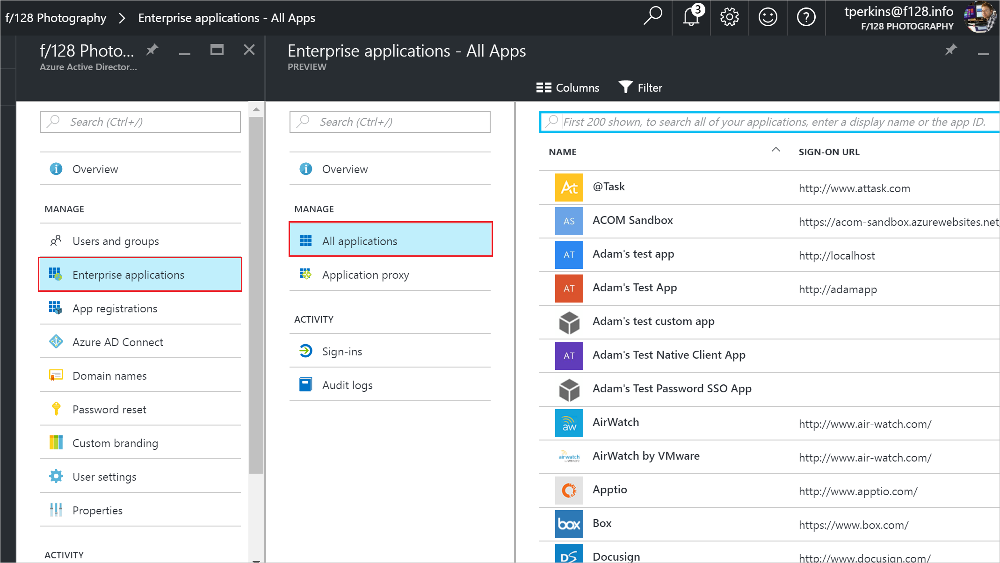
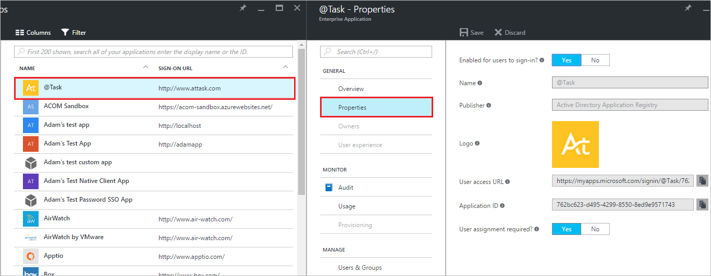

<properties
    pageTitle="Deaktivieren Sie Benutzer anmelden-ins für eine Enterprise-app in Azure Active Directory-Vorschau | Microsoft Azure"
    description="Wie Sie eine Enterprise-Anwendung zu deaktivieren, sodass keine Benutzer in Azure Active Directory darauf anmelden können"
    services="active-directory"
    documentationCenter=""
    authors="curtand"
    manager="femila"
    editor=""/>

<tags
    ms.service="active-directory"
    ms.workload="identity"
    ms.tgt_pltfrm="na"
    ms.devlang="na"
    ms.topic="article"
    ms.date="10/17/2016"
    ms.author="curtand"/>

# Deaktivieren Sie Benutzer anmelden-ins für eine Enterprise-app in Azure Active Directory-Vorschau

Es ist einfach, eine Enterprise-Anwendung zu deaktivieren, sodass keine Benutzer in der Vorschau Azure Active Directory (Azure AD) darauf anmelden können. [Was ist in der Vorschau?](active-directory-preview-explainer.md) Sie müssen die geeigneten Berechtigungen für die Enterprise-app zu verwalten. Klicken Sie in der aktuellen Vorschau müssen Sie globaler Administrator für das Verzeichnis sein.

## Wie deaktiviere ich Benutzer anmelden-ins?

1. Melden Sie sich mit dem [Azure-Portal](https://portal.azure.com) mit einem Konto, eines globalen Administrators für das Verzeichnis ist.

2. Wählen Sie **Weitere Dienste**aus, geben Sie **Azure Active Directory** in das Textfeld ein, und wählen Sie dann die **EINGABETASTE**.

3. Klicken Sie auf der * *Azure-Active Directory - *Directoryname* ** Blade (d. h., das Azure AD-Blade für das Verzeichnis, die Sie verwalten), wählen Sie aus **Enterprise Applications **.

    

4. Wählen Sie in der **Enterprise-Anwendungen** Blade **Alle Programme**. Wird eine Liste der apps, die Sie verwalten können.

5. Wählen Sie das Blade **Enterprise Applications - alle Programme** klicken Sie auf einer app aus.

6. Klicken Sie auf das ***Appname*** Blade (d. h., das Blade mit dem Namen der ausgewählten app in den Titel) Wählen Sie **Eigenschaften**aus.

    

7. Klicken Sie auf die ***Appname*** **-Eigenschaften** Blade select **nicht** für **Benutzer anmelden aktiviert?**.

8. Wählen Sie den Befehl **Speichern** aus.

## Nächste Schritte

- [Finden Sie unter alle meine Gruppen](active-directory-groups-view-azure-portal.md)
- [Weisen Sie einen Benutzer oder eine Gruppe zu einer Enterprise-app](active-directory-coreapps-assign-user-azure-portal.md)
- [Entfernen einer Zuordnungs Benutzer oder eine Gruppe aus einer Enterprise-app](active-directory-coreapps-remove-assignment-azure-portal.md)
- [Ändern des Namens oder des Logos eine Enterprise-app](active-directory-coreapps-change-app-logo-user-azure-portal.md)
