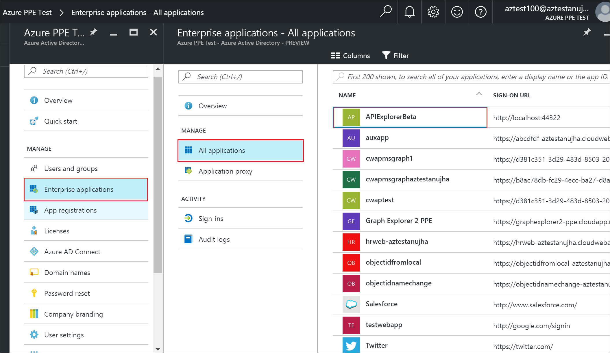

<properties
    pageTitle="Entfernen eine Zuordnung Benutzer oder eine Gruppe aus einer Enterprise-app in Azure Active Directory-Vorschau | Microsoft Azure"
    description="So entfernen Sie die Access-Zuordnung für einen Benutzer oder eine Gruppe aus einer Enterprise-app in Azure Active Directory"
    services="active-directory"
    documentationCenter=""
    authors="curtand"
    manager="femila"
    editor=""/>

<tags
    ms.service="active-directory"
    ms.workload="identity"
    ms.tgt_pltfrm="na"
    ms.devlang="na"
    ms.topic="article"
    ms.date="09/30/2016"
    ms.author="curtand"/>

# Entfernen Sie einen Benutzer oder eine gruppenzuordnung aus einer Enterprise-app in Azure Active Directory-Vorschau

Es ist einfach So entfernen Sie einen Benutzer oder eine Gruppe von Access, das eine Anwendung Enterprise Preview Azure Active Directory (Azure AD) zugewiesen wird. [Was ist in der Vorschau?](active-directory-preview-explainer.md) Sie müssen die geeigneten Berechtigungen für die Enterprise-app zu verwalten. Klicken Sie in der aktuellen Vorschau müssen Sie globaler Administrator für das Verzeichnis sein.

## Wie entferne ich einen Benutzer oder eine gruppenzuordnung?

1. Melden Sie sich mit dem [Azure-Portal](https://portal.azure.com) mit einem Konto, eines globalen Administrators für das Verzeichnis ist.

2. Wählen Sie **Weitere Dienste**aus, geben Sie **Azure Active Directory** in das Textfeld ein, und wählen Sie dann die **EINGABETASTE**.

3. Klicken Sie auf der * *Azure-Active Directory - *Directoryname* ** Blade (d. h., das Azure AD-Blade für das Verzeichnis, die Sie verwalten), wählen Sie aus **Enterprise Applications **.

    

4. Wählen Sie in der **Enterprise-Anwendungen** Blade **Alle Programme**. Sie sehen eine Liste der apps, die Sie verwalten können.

5. Wählen Sie das Blade **Enterprise Applications - alle Programme** klicken Sie auf einer app aus.

6. Wählen Sie das ***Appname*** Blade (d. h., das Blade mit dem Namen der ausgewählten app in den Titel) klicken Sie auf **Benutzer und Gruppen**aus.

    

7. Klicken Sie auf die ***Appname*** **-Benutzer und Gruppenzuordnung** Blade, wählen Sie eine weitere Benutzer oder Gruppen, und wählen Sie dann den Befehl **Entfernen** aus. Bestätigen Sie Ihre Entscheidung aufgefordert werden.

    

## Nächste Schritte

- [Zeigen Sie alle meine Gruppen](active-directory-groups-view-azure-portal.md)
- [Weisen Sie einen Benutzer oder eine Gruppe zu einer Enterprise-app](active-directory-coreapps-assign-user-azure-portal.md)
- [Deaktivieren Sie Benutzer anmelden-ins für eine Enterprise-app](active-directory-coreapps-disable-app-azure-portal.md)
- [Ändern des Namens oder des Logos eine Enterprise-app](active-directory-coreapps-change-app-logo-user-azure-portal.md)
