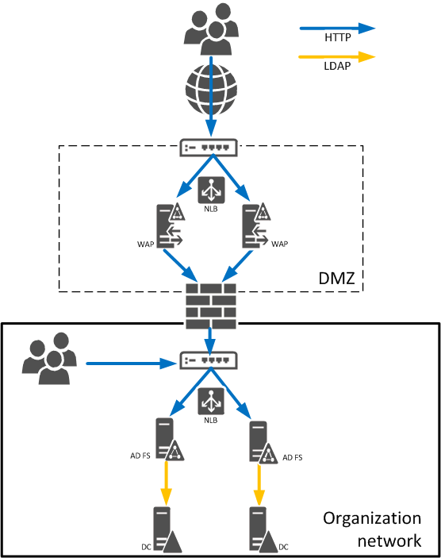
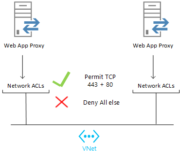
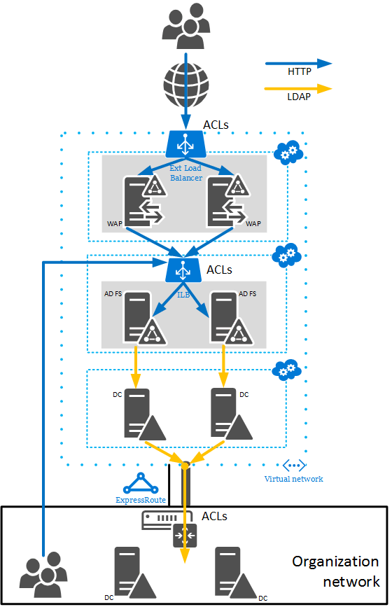
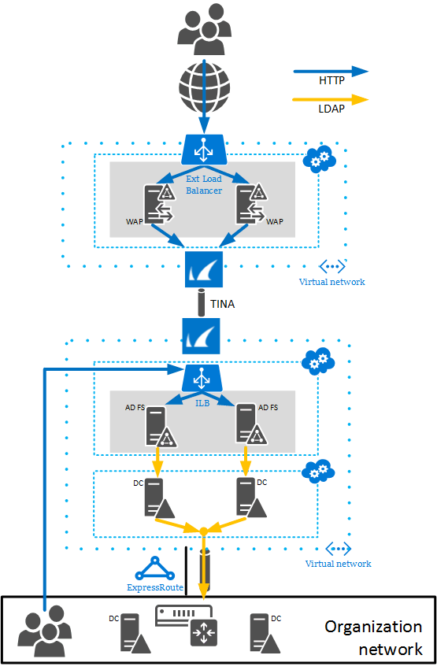
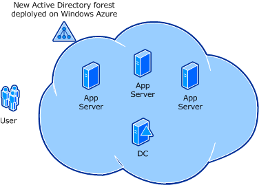
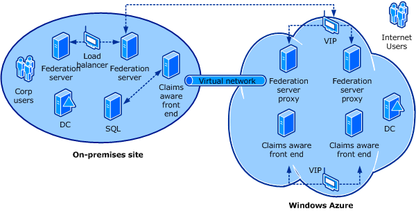
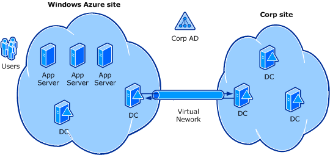

<properties
   pageTitle="Richtlinien für die Bereitstellung von Windows Server Active Directory auf Azure-virtuellen Computern | Microsoft Azure"
   description="Wenn Sie wissen, wie Active Directory-Domänendiensten und Active Directory Federation Services lokal bereitgestellt, erfahren Sie, deren Funktionsweise auf Azure-virtuellen Computern."
   services="active-directory"
   documentationCenter=""
   authors="femila"
   manager="stevenpo"
   editor=""/>

<tags
   ms.service="active-directory"
   ms.devlang="na"
   ms.topic="article"
   ms.tgt_pltfrm="na"
   ms.workload="identity"
   ms.date="09/27/2016"
   ms.author="femila"/>

# Richtlinien für die Bereitstellung von Windows Server Active Directory unter Azure-virtuellen Computern

In diesem Artikel wird erläutert, die wichtigsten Unterschiede zwischen dem Bereitstellen von Windows Server Active Directory-Domänendiensten (AD DS) und lokale im Vergleich zu bereitstellen, klicken Sie auf Microsoft Azure-virtuellen Computern Active Directory Federation Services (AD FS).

## Umfang und Zielgruppe

Im Artikel ist bereits mit der Bereitstellung von Active Directory lokal erfahrener richtet. Es werden die Unterschiede zwischen Bereitstellen von Active Directory auf Microsoft Azure-virtuellen Computern/Azure virtuelle Netzwerke und herkömmlichen lokalen Active Directory-Bereitstellungen erläutert. Azure-virtuellen Computern und Azure virtuelle Netzwerke sind Teil einer Infrastruktur-als-Service (IaaS) für Organisationen Geschenk computing-Ressourcen in der Cloud zu nutzen.

Personen, die nicht mit Active Directory-Bereitstellung vertraut sind, finden Sie im [Bereitstellungshandbuch für AD DS](https://technet.microsoft.com/library/cc753963) oder [Planen der Bereitstellung von AD FS](https://technet.microsoft.com/library/dn151324.aspx) je nach Bedarf.

In diesem Artikel wird vorausgesetzt, dass der Leser mit den folgenden Konzepten vertraut ist:

- Windows Server AD DS-Bereitstellung und Verwaltung
- Bereitstellung und Konfiguration von DNS zur Unterstützung von einer Windows Server AD DS-Infrastruktur
- Windows Server AD FS-Bereitstellung und Verwaltung
- Bereitstellen, konfigurieren und Verwalten von sich verlassen Anwendungen von Drittherstellern (Websites und Web Services), die Windows Server AD FS-Token nutzen können
- Allgemeine virtuellen Computern Konzepte, beispielsweise zum Konfigurieren eines virtuellen Computers, virtuelle Laufwerke und virtuelle Netzwerke

In diesem Artikel werden die Anforderungen für ein Hybrid Bereitstellungsszenario, in denen Windows Server AD DS oder AD FS werden teilweise bereitgestellten lokalen und teilweise auf Azure-virtuellen Computern bereitgestellt, hervorgehoben. Das Dokument behandelt zuerst die kritische Unterschiede zwischen Azure-virtuellen Computern im Vergleich zu lokalen und wichtige Informationen, die Auswirkungen auf Entwurf und Bereitstellung von Windows Server AD DS und AD FS ausgeführt. Im weiteren Verlauf des Papiers wird erläutert, Richtlinien für jede der Entscheidungspunkte ausführlicher und anwenden die Richtlinien zu verschiedenen Bereitstellungsszenarios.

In diesem Artikel behandelt nicht, die Konfiguration von [Azure Active Directory](http://azure.microsoft.com/services/active-directory/), welche ist ein REST-basierten Dienst, der Cloud handelt Identität Verwaltungs- und Access-Steuerelement Funktionen bietet. Azure Active Directory (Azure AD) und Windows Server AD DS, allerdings sollen zusammenarbeiten, um eine Identität und Access-Lösung dafür, dass heutigen Hybrid IT-Umgebungen und moderne Applications. Damit werden die Unterschiede und die Beziehungen zwischen Windows Server AD DS und Azure AD-zu verstehen, sollten beachten Sie Folgendes:

1. Sie können Windows Server AD DS in der Cloud auf Azure-virtuellen Computern ausführen, wenn Sie Azure verwenden, um Ihre lokalen Datacenter in der Cloud zu erweitern.
2. Sie möglicherweise Azure AD verwenden, um Ihre Benutzer einmaliges Anmelden auf Software-as-a-Service (SaaS) Anwendungen zu verleihen. Microsoft Office 365 verwendet diese Technologie, beispielsweise und Azure oder andere Cloud Plattformen ausgeführt Applications können auch verwenden.
3. Azure AD (deren Access Control Service) können Sie Folgendes zulassen, dass Benutzer melden Sie sich mit Identitäten aus Facebook, Google, Microsoft und anderen Identitätsanbietern auf Anwendungen, die in der Cloud oder lokal gehostet werden.

Weitere Informationen zu diesen Unterschieden finden Sie unter [Azure Identität](fundamentals-identity.md).

## Zugehörige Ressourcen

Sie können herunterladen und [Azure-virtuellen Computern Readiness Bewertung](https://www.microsoft.com/download/details.aspx?id=40898)ausführen. Die Bewertung wird automatisch die lokalen Umgebung prüfen und die Erfassung in diesem Artikel helfen Ihnen bei der Migration der Umgebung in Azure gefundene angepassten Bericht generieren.

Es empfiehlt sich, dass Sie auch zuerst lesen, die Lernprogramme, Führungslinien und Videos, die folgende Themen behandelt:

- [Konfigurieren eines virtuellen Netzwerks Cloud nur im Azure-Portal](../virtual-network/virtual-networks-create-vnet-arm-pportal.md)
- [Konfigurieren einer Standort-zu-Standort VPN Azure-Portal](../vpn-gateway/vpn-gateway-site-to-site-create.md)
- [Installieren Sie eine neue Active Directory-Struktur auf ein Azure-virtuellen Netzwerk](active-directory-new-forest-virtual-machine.md)
- [Installieren von Active Directory Active Directory auf Azure](../active-directory/active-directory-install-replica-active-directory-domain-controller.md)
- [Microsoft Azure IT Pro IaaS: (01) virtuellen Computern-Grundlagen](https://channel9.msdn.com/Series/Windows-Azure-IT-Pro-IaaS/01)
- [Microsoft Azure IT Pro IaaS: (05) erstellen virtuelle Netzwerke und Cross lokale Konnektivität](https://channel9.msdn.com/Series/Windows-Azure-IT-Pro-IaaS/05)

## Einführung

Die grundlegenden Anforderungen für die Bereitstellung von Windows Server Active Directory unter Azure-virtuellen Computern unterscheiden sich sehr kleinen aus Bereitstellung virtuellen-lokalen (und zu einem gewissen Grad, physische Computer). Angenommen, wenn die Domänencontroller (DCs), die Sie auf Azure-virtuellen Computern bereitstellen Replikate in einer vorhandenen sind lokale bei Windows Server AD DS, / Unternehmensgesamtstruktur Domäne, und Azure-Bereitstellung weitgehend auf die gleiche Weise behandelt werden kann, wie Sie alle zusätzliche Windows Server Active Directory Website behandeln möglicherweise. D. h., müssen Subnetzen in Windows Server AD DS, einer Website erstellt, die Subnetze für die Website verknüpft und bei einer Verbindung zu anderen Websites, die über die entsprechende Website-Links definiert werden. Es gibt jedoch einige Unterschiede, die gemeinsam alle Azure-Bereitstellungen sind und einige, variieren gemäß dem Szenario spezifische Bereitstellung. Nachstehend werden zwei grundlegende Unterschiede:

### Azure-virtuellen Computern möglicherweise Konnektivität mit dem Firmennetzwerk lokalen benötigen.

Herstellen einer Verbindung Azure-virtuellen Computern wieder in einer lokalen Unternehmensnetzwerk erfordert Azure virtuelles Netzwerk, das umfasst zwischen Standorten oder Website-zu-Punkt-virtuelle private Netzwerk (VPN) Komponente nahtlos Azure-virtuellen Computern eine Verbindung herstellen können und lokalen Computer. Diese VPN-Komponente konnte auch aktivieren lokalen Domäne Mitgliedscomputern auf eine Windows Server Active Directory-Domäne zugreifen, deren Domänencontroller ausschließlich auf Azure-virtuellen Computern gehostet werden. Es ist wichtig, jedoch, beachten Sie, dass, wenn das Option VPN fehlschlägt, Anmelde- und andere Vorgänge, die auf Windows Server Active Directory abhängig sind auch fehl. Während der Benutzer möglicherweise Anmelden mit vorhandenen zwischengespeicherten Anmeldeinformationen, alle Peer-to-Peer- oder -Client-zu-Server-Authentifizierungsversuche für die Tickets noch nicht ausgestellt werden oder veraltete geworden schlägt fehl.

Ein video Demo und eine Liste der Lernprogramme, einschließlich [Konfigurieren einer Standort-zu-Standort VPN Azure-Portal](../vpn-gateway/vpn-gateway-site-to-site-create.md)finden Sie unter [Virtuelles Netzwerk](http://azure.microsoft.com/documentation/services/virtual-network/) .

> [AZURE.NOTE] Sie können auch Windows Server Active Directory eine Azure virtuelle Netzwerk bereitstellen, die nicht über eine Verbindung mit einem lokalen Netzwerk verfügt. Die Richtlinien in diesem Thema wird jedoch davon ausgegangen, dass ein Azure-virtuelles Netzwerk verwendet wird, da es IP bietet-Adressen-Funktionen, die für Windows Server wichtig sind.

### Statische IP-Adressen müssen mit Azure PowerShell konfiguriert werden.

Dynamische Adressen werden standardmäßig zugewiesen, aber verwenden das Cmdlet "Set-AzureStaticVNetIP", um stattdessen eine statische IP-Adresse zuweisen. Eine statische IP-Adresse, die durch Reparatur Dienst und virtueller Computer war(en)/Restart erhalten bleiben festlegt. Weitere Informationen finden Sie unter [statische internen IP-Adresse für virtuelle Computer](http://azure.microsoft.com/blog/static-internal-ip-address-for-virtual-machines/).

## Begriffe und Definitionen

Im folgenden finden eine nicht erschöpfende Liste Ausdrücke für verschiedene Azure Technologien, die in diesem Artikel verwiesen werden.

- **Azure-virtuellen Computern**: das IaaS Angebot in Azure, die Kunden virtuellen Computern ausführen nahezu jedem traditionell bereitstellen kann lokale Server Arbeitsbelastung.

- **Azure virtuelles Netzwerk**: im Netzwerk in Azure, mit denen Kunden erstellen und Verwalten virtueller Netzwerke in Azure und sichere Weise mit verknüpfen, um eigene lokale Netzwerke Infrastruktur mithilfe eines virtuellen privaten Netzwerks (VPN).

- **Virtuelle IP-Adresse**: Internet zugänglichen IP-Adresse, die nicht in eine bestimmte Computer oder Netzwerk Benutzeroberflächen-Karte gebunden ist. Clouddiensten wird eine virtuelle IP-Adresse für den Empfang von Netzwerkverkehr, die an eine Azure-virtuellen Computer umgeleitet wird zugewiesen. Eine virtuelle IP-Adresse ist eine Eigenschaft des einen Clouddienst, der eine oder mehrere Azure virtuellen Computern enthalten können. Beachten Sie auch, dass ein Azure-virtuelles Netzwerk mindestens Cloud-Dienst enthalten kann. Virtuelle IP-Adressen Bereitstellen einer systemeigenen Lastenausgleich Funktionen.

- **Dynamische IP-Adresse**: Dies ist die IP-Adresse, die ausschließlich intern verwendet wird. Es sollte als eine statische IP-Adresse konfiguriert werden (mithilfe des Cmdlets Set-AzureStaticVNetIP) für virtuellen Computern, die die Rollen DC/DNS-Server hosten.

- **Dienst Reparatur**: der Vorgang in der Azure automatisch einen Dienst in einer laufenden Zustand zurück erneut, nachdem das Programm erkennt, dass der Dienst fehlgeschlagen ist. Dienst Reparatur ist einer der Aspekte von Azure, die Verfügbarkeit und Flexibilität unterstützt. Während Sie wahrscheinlich nicht, das Ergebnis, folgen einen Dienst Reparatur Vorfall für einen DC eines virtuellen Computers ausgeführt ist vergleichbar mit einer ungeplanten Neustart, besitzt aber ein paar Seite-Effekte:

 - Ändert sich der virtuelle Netzwerkadapter auf dem virtuellen Computer
 - Ändert sich die MAC-Adresse der virtuellen Netzwerkadapter
 - Ändert sich die Prozessor/CPU-ID den virtuellen Computer
 - Die IP-Konfiguration von den virtuellen Netzwerkadapter ändert sich nicht, solange Sie der virtuellen Computer mit einem virtuellen Netzwerk verbunden ist, und die IP-Adresse des virtuellen Computers ist statisch.

 Keine diese Verhaltensweisen Einfluss auf Windows Server Active Directory, da es keine Abhängigkeit von der MAC-Adresse oder Prozessor/CPU-ID hat und alle Windows Server Active Directory-Bereitstellungen auf Azure empfohlen werden, um auf ein Azure-virtuellen Netzwerk ausgeführt werden, wie oben dargelegt.

## Ist es zur Windows Server Active Directory-Domänencontroller Virtualisierung sicher?

Bereitstellen von Windows Server Active Directory-DCs auf Azure-virtuellen Computern wird unterliegen den Richtlinien DCs lokal in einem virtuellen Computer ausgeführt. Virtualisierten DCs ausgeführt wird als sicher angesehen, solange Richtlinien zum Sichern und Wiederherstellen von DCs eingehalten werden. Weitere Informationen zu Einschränkungen und Richtlinien für die Ausführung von virtualisierten DCs finden Sie unter [Ausführen Controller in Hyper-V](https://technet.microsoft.com/library/dd363553).

Hypervisoren bereitstellen oder trivialize Technologien, die für vielen verteilten Systemen, einschließlich Windows Server Active Directory Probleme verursachen können. Beispielsweise auf einem physischen Server, können Sie einen Datenträger Klonen oder nicht unterstützte Methoden verwenden, um den Status von einem Server, einschließlich der Verwendung von SANs usw., zurückzusetzen dies auf einem physischen Server ist aber viel schwieriger als Momentaufnahme eines virtuellen Computers in ein Hypervisor wiederherstellen. Azure bietet Funktionen, die in der gleichen unerwünschte Bedingung führen kann. Beispielsweise sollten Sie virtuelle Festplatte Dateien DCs nicht kopieren, statt die Durchführung von regelmäßigen Sicherungen, da Wiederherstellen von Benutzern zu einer ähnlichen Situation bei der Verwendung von Momentaufnahme wiederherstellen Features führen kann.

Solche entwurfsbearbeitung vorstellen USN Blasen, die zwischen DCs dauerhaft abweichenden Staaten führen können. Die kann wie Probleme verursachen:

- Veraltete Objekte
- Inkonsistente Kennwörter
- Inkonsistente Attributwerte
- Schema Nichtübereinstimmungen, wenn das Schema Master-Shape rückgängig gemacht wurde

Weitere Informationen darüber, wie DCs beeinträchtigt werden finden Sie unter [USN und USN zurücksetzen](https://technet.microsoft.com/library/virtual_active_directory_domain_controller_virtualization_hyperv.aspx#usn_and_usn_rollback).

Beginnend mit Windows Server 2012, [zusätzliche Sicherheitsmaßnahmen sind in AD DS integriert](https://technet.microsoft.com/library/hh831734.aspx). Dieser Sicherheitsmaßnahmen schützen virtualisierten Domänencontroller gegen die vorstehend beschriebenen Probleme, solange die zugrunde liegende Hypervisor Plattform virtueller Computer-GenerationID unterstützt. Azure unterstützt virtueller Computer-GenerationID, d. h., Domain Controller, die Windows Server 2012 oder höher Azure-virtuellen Computern ausgeführt werden, die zusätzlichen Sicherheitsmaßnahmen haben.

> [AZURE.NOTE] Sie sollten beenden und neu starten ein virtuellen Computers, die die Domänencontrollerrolle in Azure innerhalb des Betriebssystems Gast anstelle von die Option **Beenden** im klassischen Azure-Portal ausgeführt wird. Heute, wird bei der Verwendung des Portals klassischen eines virtuellen Computers beendet den virtuellen Computer freigegeben werden. Freigegeben ein virtuellen Computers hat den Vorteil dabei nicht die Gebühren, aber es auch zurückgesetzt virtueller Computer-GenerationID, die für einen DC unerwünscht ist. Wenn die virtuellen Computer-GenerationID zurückgesetzt wird, der InvocationID der Datenbank AD DS ist auch zurücksetzen, der RID-Pool verworfen und SYSVOL nicht autoritativer markiert. Weitere Informationen finden Sie unter [Einführung in Active Directory-Domänendiensten (AD DS) Virtualisierung](https://technet.microsoft.com/library/hh831734.aspx) und [Sicheres Virtualisierung DFSR](http://blogs.technet.com/b/filecab/archive/2013/04/05/safely-virtualizing-dfsr.aspx).

## Gründe für die Bereitstellung von Windows Server AD DS auf Azure virtuellen Computern

Viele Szenarien für die Bereitstellung von Windows Server AD DS sind für die Bereitstellung als virtuellen Computern auf Azure gut geeignet. Nehmen Sie beispielsweise an, dass Sie einem Unternehmen in Europa vorliegt, die an einem entfernten Standort in Asien Benutzerauthentifizierung. Das Unternehmen wurde nicht zuvor Windows Server Active Directory DCs in Asien aufgrund der Kosten, um diese und eingeschränkte Fachwissen zum Verwalten des Server nach der bereitstellungs bereitstellen bereitgestellt. Daher sind asiatisch-Authentifizierungsanfragen von DCs in Europa mit nicht optimalen Ergebnissen gewartet. In diesem Fall können Sie einen DC eines virtuellen Computers bereitstellen, die Sie angegeben haben, innerhalb der Azure Datencenters in Asien ausgeführt werden muss. Anfügen von diesem DC zu einem Azure-virtuellen Netzwerk, das direkt mit entfernten Standort verbunden ist, verbessern Sie Leistung Authentifizierung.

Azure ist auch als Ersatz für andernfalls teure Wiederherstellung ausgefallener (DR) Standorte gut geeignet. Die relativ LC-Hosting einige wenige Domänencontroller und eines einzelnen virtuellen Netzwerks auf Azure stellt eine attraktive Alternative.

Schließlich sollten Sie eine Netzwerk-Anwendung auf Azure, wie z. B. SharePoint bereitgestellt, die erfordert Windows Server Active Directory, aber keine Abhängigkeit auf dem lokalen Netzwerk oder corporate Windows Server Active Directory hat. In diesem Fall Bereitstellen einer isolierten Struktur auf Azure zu entsprechen die SharePoint Server Anforderungen ist optimal. Bereitstellen von Netzwerk-Anwendungen, die erforderlich, eine Verbindung zu dem lokalen Netzwerk und Active Directory des Unternehmens ist wird erneut ebenfalls unterstützt.

> [AZURE.NOTE] Da es eine Layer-3-Verbindung bereitstellt, kann die VPN-Komponente, die Verbindungen zwischen einer Azure virtuelle Netzwerk und einem lokalen Netzwerk bereitstellt, auch Mitgliedsserver ermöglichen, die ausgeführt lokalen werden um DCs nutzen zu können, die als Azure-virtuellen Computern Azure virtuelle Netzwerk ausgeführt werden. Aber wenn das Option VPN nicht verfügbar ist, Kommunikation zwischen lokalen Computern und Azure-basierte als funktioniert nicht, bei der Authentifizierung und verschiedene andere Fehler bei der resultierende.  

## Gegenüberstellung zwischen Bereitstellen von Windows Server Active Directory-Domänencontroller auf Azure virtuellen Computern im Vergleich zu lokalen

- Für alle Windows Server Active Directory-Bereitstellungsszenario, die mehr als einen einzelnen virtuellen Computer enthält, ist es erforderlich, ein Azure-virtuelles Netzwerk für IP-Adresse Konsistenz verwendet. Beachten Sie, dass mit diesem Leitfaden wird davon ausgegangen, dass eine Azure virtuelle Netzwerk DCs ausgeführt werden.

- Wie bei lokalen DCs, werden statische IP-Adressen empfohlen. Eine statische IP-Adresse kann nur mithilfe von Azure PowerShell konfiguriert werden. Weitere Informationen hierzu finden Sie unter [statische internen IP-Adresse für virtuelle Computer](http://azure.microsoft.com/blog/static-internal-ip-address-for-virtual-machines/) . Wenn Sie die Überwachung Systeme oder andere Lösungen, die für statische IP-Adresskonfiguration innerhalb des Gastbetriebssystems überprüfen verfügen, können Sie die Eigenschaften von Netzwerkadapter für den virtuellen Computer die statische IP-Adresse zuweisen. Aber Achten Sie darauf, dass der Netzwerkadapter verworfen wird, wenn der virtuellen Computers durchläuft Dienst Reparatur oder im Portal Klassisches fahren und seine Adresse freigegeben werden weist. In diesem Fall müssen die statische IP-Adresse innerhalb der Gast zurückgesetzt werden.

- Bereitstellen von virtuellen Computern in einem virtuellen Netzwerk nicht implizieren (Connectivity wieder zu einem lokalen Netzwerk oder erforderlich); das virtuelle Netzwerk ermöglicht lediglich die Möglichkeit. Sie müssen ein virtuelles Netzwerk für private Kommunikation zwischen Azure und Ihrem lokalen Netzwerk erstellen. Sie müssen einen Endpunkt VPN auf dem lokalen Netzwerk bereitstellen. Das Option VPN wird mit dem lokalen Netzwerk aus Azure geöffnet. Weitere Informationen finden Sie unter [Übersicht über Virtual Netzwerk](../virtual-network/virtual-networks-overview.md) und [Konfigurieren einer Standort-zu-Standort VPN Azure-Portal](../vpn-gateway/vpn-gateway-site-to-site-create.md).

> [AZURE.NOTE] Eine Option zum [Erstellen eines Punkt-zu-Standort VPN](../vpn-gateway/vpn-gateway-point-to-site-create.md) steht Verbindung einzelne Windows-Computer direkt mit einem Azure virtuelle Netzwerk.

- Unabhängig davon, ob Sie eine virtuelle erstellen network oder nicht, Azure Gebühren für Ausgang Verkehr aber nicht eingehende. Verschiedene Windows Server Active Directory-Entwurfs können beeinflussen, wie viel Datenverkehr Ausgang von einer Bereitstellung generiert wird. Beispiel: beschränkt Bereitstellen eines schreibgeschützten Domain Controllers (RODC) Ausgang Datenverkehr, da es keine ausgehenden repliziert. Aber die Entscheidung zum Bereitstellen eines RODC gegen die Operationen schreiben gegen den DC und die [Kompatibilität](https://technet.microsoft.com/library/cc755190) , die Anwendungen und Dienste auf der Website mit RODCs enthalten müssen Standardversionen werden muss. Weitere Informationen zu den Datenverkehr Gebühren finden Sie unter [Azure Preise auf einen Blick](http://azure.microsoft.com/pricing/).

- Steuern Sie über welche Server Größe des Datenträgers Ressourcen für virtuellen Computern lokalen, beispielsweise RAM, verwendet und usw., auf Azure Sie müssen auswählen aus einer Liste mit vorkonfigurierten Servergrößen, gedrückt, während Sie abgeschlossen haben. Für einen DC wird ein Datenträger zusätzlich zu den Datenträger Betriebssystem benötigt, um Windows Server Active Directory-Datenbank gespeichert.

## Können Sie Windows Server AD FS auf Azure-virtuellen Computern bereitstellen?

Ja, können Sie Windows Server AD FS auf Azure-virtuellen Computern bereitstellen, und die [bewährte Methoden für die AD FS-Bereitstellung](https://technet.microsoft.com/library/dn151324.aspx) lokale gelten ebenso für AD FS-Bereitstellung auf Azure. Jedoch einige bewährte Methoden wie Lastenausgleich und hohe Verfügbarkeit benötigen Technologien jenseits was AD FS bietet sich selbst. Sie müssen von der zugrunde liegenden Infrastruktur bereitgestellt werden. Lassen Sie uns einige bewährte Methoden für diese überprüfen, und sehen, wie sie mithilfe von Azure-virtuellen Computern und ein Azure-virtuellen Netzwerk erzielt werden können.

1. **Nie verfügbar machen Sie Security token Service (STS)-Servern direkt mit dem Internet aus.**

    Dies ist wichtig, da der STS stellt Sicherheitstokens. Daher sollten STS-Servern, wie z. B. AD FS-Servern mit der gleichen Ebene des Schutzes als Domänencontroller behandelt werden. Wenn ein STS gefährdet wird, haben autorisierte Benutzer die Möglichkeit, Emission Access Token potenziell mit Ansprüche ihrer Wahl sich verlassen Party Applications und andere Server STS in Organisationen vertrauen.

2. **Bereitstellen von Active Directory-Domäne-Controller für Domänen für alle Benutzer im gleichen Netzwerk wie die ADFS-Server.**

    Verwenden Sie Active Directory-Domänendiensten AD FS-Servern zum Authentifizieren von Benutzern. Es wird empfohlen, Domain Controller Netzwerk als AD FS-Servern bereitstellen. Dies stellt Geschäftskontinuität Fall, die Verknüpfung zwischen dem Azure Netzwerk und Ihrem lokalen Netzwerk wird unterbrochen und ermöglicht unteren Wartezeit und mehr Performance für den Benutzernamen.

3. **Bereitstellen von mehreren AD FS-Knoten für hohen Verfügbarkeit und die Last.**

    In den meisten Fällen ist der Ausfall der Anwendung, die AD FS ermöglicht inakzeptabel, da die Programme, die erfordern, dass Sicherheitstokens häufig sind kritisch unternehmenskritischen. Daher und da AD FS des kritischen Wegs zum Zugreifen auf Umwandeln jetzt gespeichert ist, muss der AD FS-Dienst hochgradig über mehrere AD FS Proxys und ADFS-Server verfügbar sein. Um die Verteilung der Anfragen zu erreichen, sind Lastenausgleich normalerweise vor dem AD FS-Proxy, und den AD FS-Servern bereitgestellt.

4. **Bereitstellen von einem oder mehreren Web Anwendungsproxy-Knoten für den Zugriff auf das Internet.**

    Wenn Benutzer vom Dienst AD FS geschützte Anwendung zuzugreifen müssen, muss der AD FS-Dienst aus dem Internet zur Verfügung. Dies ist den Web-Anwendungsproxy-Dienst bereitstellen. Es wird dringend empfohlen, zum Bereitstellen von mehr als einem Knoten für die Zwecke der hohen Verfügbarkeit und Lastenausgleich.

5. **Beschränken des Zugriffs auf interne Netzwerkressourcen aus den Web-Anwendungsproxy-Knoten.**

    Wenn Sie externe Benutzer AD FS aus dem Internet zugreifen können, müssen Sie Web-Anwendungsproxy-Knoten (oder AD FS Proxy in früheren Versionen von Windows Server) bereitstellen. Die Web-Anwendung Proxy-Knoten sind direkt mit dem Internet verbunden. Sie sind nicht erforderlich sein Domänenverbund und nur benötigten Zugriff auf die AD FS-Server über TCP-Ports 443 und 80. Es wird dringend empfohlen, dass die Kommunikation mit allen anderen Computern (besonders Domain Controller) blockiert wird.

    Dies ist in der Regel erreichten lokalen mithilfe einer DMZ. Firewalls verwenden einen weißen Modus des Vorgangs Verkehr aus der DMZ mit dem lokalen Netzwerk eingeschränkt (d. h., nur Datenverkehr aus dem angegebenen IP-Adressen und über bestimmte Ports zulässig ist, und alle anderen Datenverkehr blockiert).

Das folgende Diagramm zeigt eine traditionelle lokalen AD FS-Bereitstellung.

Da Azure keine systemeigenen bereitstellt, müssen jedoch mit vollständigen Funktionen ausgestatteten Firewallfunktion, andere Optionen verwendet werden, um den Datenverkehr einschränken. In der folgenden Tabelle wird jede Option und vor- und Nachteile auf.

| Option | Nutzen | Nachteile |
| ------ | --------- | ------------ |
| [Azure Netzwerk ACLs](virtual-networks-acl.md) | Weniger teure und einfacher anfängliche Konfiguration | Zusätzliche ACL Netzwerkkonfiguration erforderlich, wenn die Bereitstellung eines neuen virtuellen Computern hinzugefügt werden |
| [Barracuda NG firewall](https://www.barracuda.com/products/ngfirewall) | Weißen Modus der Vorgang, sodass es erfordert keine ACL-Netzwerkkonfiguration | Höhere Kosten und Komplexität für ersteinrichtung |

Die allgemeinen Schritte zum Bereitstellen von AD FS werden in diesem Fall wie folgt aus:

1. Erstellen Sie ein virtuelles Netzwerk mit Cross lokale Konnektivität, mit einem VPN oder [ExpressRoute](http://azure.microsoft.com/services/expressroute/)ein.

2. Bereitstellen von Domain Controller auf das virtuelle Netzwerk. Dieser Schritt ist optional, aber empfohlen.

3. Domänenverbund AD FS-Server auf virtuellen Netzwerks bereitstellen.

4. Erstellen Sie eine [interne Lastenausgleich festlegen](http://azure.microsoft.com/blog/internal-load-balancing/) , die die AD FS-Servern enthält, und eine neue private IP-Adresse in das virtuelle Netzwerk (eine dynamische IP-Adresse) verwendet.

  1. Aktualisieren von DNS-Einträge, um den vollqualifizierten Domänennamen der privaten (dynamischen) IP-Adresse des internen Lastenausgleich Satzes verweisen zu erstellen.

5. Erstellen Sie einen Cloud-Service (oder ein separates virtuelle Netzwerk) für die Web-Anwendungsproxy-Knoten.

6. Bereitstellen Sie die Web-Anwendungsproxy-Knoten in der Cloud-Dienst oder virtuelles Netzwerk

  1. Erstellen einer externen Lastenausgleich festlegen, die die Web-Anwendungsproxy-Knoten enthält.

  2. Aktualisieren Sie den externen DNS-Namen (FQDN) auf die Cloud-Dienst öffentliche IP-Adresse (die virtuelle IP-Adresse) verweisen.

  3. Konfigurieren von AD FS-Proxys, um den vollqualifizierten Domänennamen verwenden, die die internen Lastenausgleich Satz für die AD FS-Server entspricht.

  4. Aktualisieren von Websites anspruchsbasierte, um den externen FQDN für ihre Ansprüche Anbieter verwenden.

7. Einschränken des Zugriffs zwischen Web Anwendungsproxy auf einem beliebigen Computer im Netzwerk virtuelle AD FS.

Um den Datenverkehr zu beschränken, der Lastenausgleich Satz für Azure internen Lastenausgleich für nur Datenverkehr für TCP-Ports 80 und 443 konfiguriert sein muss, und alle anderen Datenverkehr an den internen dynamische IP-Adresse des Satzes Lastenausgleich abgelegt.

Datenverkehr für den AD FS-Servern würde nur von den folgenden Quellen zugelassen werden:

- Azure internen Lastenausgleich.
- Die IP-Adresse eines Administrators auf dem lokalen Netzwerk.

> [AZURE.WARNING] Das Design muss Web Anwendungsproxy-Knoten blockieren, sodass alle anderen virtuellen Computern im Netzwerk Azure virtuelle oder alle Speicherorte auf dem lokalen Netzwerk verhindern. Die kann durch Konfigurieren der Firewall-Regeln in der lokalen Einheit für Express-Routing Verbindungen oder das Gerät VPN für den Standort-zu-Standort VPN-Verbindungen erfolgen.

Eine Nachteile auf diese Option wird das Konfigurieren des Netzwerks ACLs für mehrere Geräte, einschließlich internen Lastenausgleich, die ADFS-Server und andere Server, die mit dem virtuellen Netzwerk hinzugefügt werden müssen. Wenn Sie jedem Gerät an die Bereitstellung hinzugefügt wurde, ohne das Konfigurieren von Netzwerk ACLs, um den Datenverkehr darauf einzuschränken, kann die gesamte Bereitstellung gefährdet sein. Wenn die IP-Adressen der Web-Anwendungsproxy Knoten jemals ändern zu können, muss das Netzwerk ACLs zurückgesetzt werden (d. h., dass die Proxys konfiguriert werden soll, um [Statische dynamische IP-Adressen](http://azure.microsoft.com/blog/static-internal-ip-address-for-virtual-machines/)verwenden).

Eine weitere Möglichkeit ist, das [Barracuda von Firewall](https://www.barracuda.com/products/ngfirewall) -Gerät verwenden, um den Datenverkehr zwischen AD FS Proxy-Servern und den AD FS-Servern zu steuern. Diese Option – Konformität mit bewährte Methoden für Sicherheit und hohe Verfügbarkeit und weniger Verwaltungsaufwand nach dem ersten einrichten, da die Einheit Barracuda von Firewall verfügt über einen Modus weißen Liste der Firewall-Verwaltung und direkt auf ein Azure-virtuellen Netzwerk installiert werden kann. Die entfallen Netzwerk jederzeit konfiguriert werden müssen, die die Bereitstellung ein neues Servers hinzugefügt wird. Diese Option fügt erste Bereitstellung Komplexität und Kosten jedoch.

In diesem Fall sind zwei virtuelle Netzwerke statt eine bereitgestellt. Wir werden VNet1 und VNet2 angerufen werden. VNet1 enthält die Proxys und VNet2 enthält die STSs und das Netzwerk wieder mit dem Firmennetzwerk verbunden. VNet1 ist deshalb physisch (obgleich praktisch) isoliert aus VNet2 und wiederum aus dem Firmennetzwerk. VNet1 klicken Sie dann mit VNet2 verbunden ist eine spezielle Tunnelingverfahren bekannt als Transport unabhängigen Netzwerk Architektur (TINA) verwenden. Der TINA Tunnel an den einzelnen virtuellen Netzwerken durch eine Firewall von Barracuda angefügt wird – eine Barracuda auf den einzelnen virtuellen Netzwerken.  Hohe Verfügbarkeit empfiehlt es sich, dass Sie zwei Barrakudas auf jedes virtuelle Netzwerk bereitstellen; ein aktiv, die andere Passiv. Sie bieten sehr umfangreiche durch eine Firewall Funktionen, die uns die Bedienung einer herkömmlichen lokalen DMZ in Azure Nachbilden ermöglichen.

Weitere Informationen finden Sie unter [AD FS: Erweitern eine Ansprüche unterstützende lokalen Front-End-Anwendung mit dem Internet](#BKMK_CloudOnlyFed).

### Eine Alternative zur AD FS-Bereitstellung ist das Ziel Office 365 SSO alleine

Es ist eine andere Alternative zum Bereitstellen von AD FS vollständig Wenn gewünscht ist nur für Office 365 anmelden aktivieren. In diesem Fall können Sie einfach DirSync mit Kennwort synchronisieren lokal bereitstellen und erzielen das gleiche Ergebnis mit minimalen Bereitstellung Komplexität, da dieser Ansatz keine AD FS oder Azure erforderlich ist.

Die folgende Tabelle vergleicht Funktionsweise der Prozesse Anmeldung mit und ohne AD FS bereitstellen.

| Office 365 einzelnen Anmelden mit AD FS und DirSync | Office anmelden 365 identisch mit DirSync + Kennwort synchronisieren |
| ------------- | ------------- |
| 1. der Benutzer mit einem Firmennetzwerk anmeldet und auf Windows Server Active Directory authentifiziert wird. | 1. der Benutzer mit einem Firmennetzwerk anmeldet und auf Windows Server Active Directory authentifiziert wird. |
| 2. der Benutzer versucht, auf Office 365 zugreifen (bin ich @contoso.com). | 2. der Benutzer versucht, auf Office 365 zugreifen (bin ich @contoso.com). |
| 3. Office 365 leitet den Benutzer zur Azure AD an. | 3. Office 365 leitet den Benutzer zur Azure AD an. |
| 4 da Azure AD keine des Benutzers Authentifizierung kann und weiß, dass es besteht eine Vertrauensstellung mit AD FS lokal, leitet sie den Benutzer zur AD FS. | 4. Azure AD kann nicht Kerberos-Tickets direkt annehmen und keine Vertrauensstellung vorhanden ist, sodass es angefordert wird, dass der Benutzer Anmeldeinformationen eingeben. |
| 5. der Benutzer sendet ein Kerberos-Ticket gegenüber dem AD FS STS. | 5. der Benutzer eingibt, dasselbe Kennwort auf eine lokale und Azure AD Ihre Überprüfung den Benutzernamen und das Kennwort ein, die durch DirSync synchronisiert wurde. |
| 6. AD FS das Kerberos-Ticket den erforderlichen token Format/Ansprüchen transformiert und die Benutzerinformationen auf Azure AD aus. | 6. Azure AD leitet den Benutzer zu Office 365 an. |
| 7. der Benutzer authentifiziert zu Azure AD (eine andere Transformation wird). |  7. der Benutzer kann mit dem Token Azure AD-OWA zu Office 365 anmelden. |
| 8. Azure AD leitet den Benutzer zu Office 365 an. |  |
| 9. der Benutzer ist im Hintergrund zu Office 365 angemeldet. |  |

In Office 365 mit DirSync mit Kennwort synchronisieren Szenario (keine AD FS) einmaliges Anmelden Fassung "derselben anmelden", "same" einfach bedeutet, dass Benutzer ihre dieselbe lokale Anmeldeinformationen erneut eingeben müssen, wenn Sie Office 365 zugreifen. Beachten Sie, dass diese Daten vom Browser des Benutzers mit beitragen nachfolgende Anweisungen gedacht werden können.

### Zusätzliche Lebensmittel vorstellen

- Wenn Sie einen AD FS-Proxy auf eine Azure-virtuellen Computern bereitstellen, wird die Verbindung zu den AD FS-Servern benötigt. Wenn sie lokal sind, empfiehlt es sich, dass Sie die Website-zu-Standort VPN-Konnektivität zur Verfügung gestellt, durch das virtuelle Netzwerk an, damit die Web-Anwendungsproxy-Knoten zur Kommunikation mit ihren AD FS-Servern nutzen.

- Wenn Sie einen AD FS-Server oder eine Azure-virtuellen Computern bereitstellen, Connectivity Controller für Windows Server Active Directory-Domäne, Attribut Stores und Konfigurationsdatenbanken ist erforderlich, vor und erfordern möglicherweise auch eine ExpressRoute oder eine Website-zu-Standort VPN-Verbindung zwischen dem Azure virtuelle Netzwerk und im lokalen Netzwerk.

- Gebühren gelten für den gesamten Verkehr aus Azure-virtuellen Computern (Ausgang Datenverkehr). Kosten ist der Faktor, ratsam, die Web-Anwendungsproxy-Knoten auf Azure verlassen der ADFS-Server lokal bereitgestellt. Wenn AD FS-Servern auf Azure-virtuellen Computern ebenfalls bereitgestellt werden, werden zusätzliche Kosten anfallen, damit lokale Benutzer authentifiziert. Ausgang Datenverkehr budgetgerecht Kosten unabhängig davon, ob die ExpressRoute oder die VPN-Verbindung zwischen Standorten durchlaufen ist.

- Wenn Sie den Azure systemeigenen Lastenausgleich der Server-Funktionen, die für eine hohe Verfügbarkeit von AD FS-Servern verwenden möchten, beachten Sie den Lastenausgleich Prüfpunkte bietet, die verwendet werden, um die Integrität des virtueller Computer in die Cloud-Dienst zu bestimmen. Bei Azure-virtuellen Computern (im Gegensatz zu Web oder Arbeitskollegen Rollen) muss eine benutzerdefinierte Probe verwendet werden, da der Agent, der auf die Standard-Stichproben reagiert nicht auf Azure-virtuellen Computern vorhanden ist. Zur Vereinfachung können Sie einen benutzerdefinierten TCP Prüfpunkt verwenden – dies nur erfordert, dass eine TCP-Verbindung (ein Segment TCP SYN gesendet und mit einer TCP SYN Bestätigung Segment reagiert) anhand von virtuellen Computern Gesundheit erfolgreich hergestellt werden. Sie können die benutzerdefinierte Probe, um alle TCP-verwenden, der Ihre virtuellen Computern aktiv überwacht werden, konfigurieren.

> [AZURE.NOTE] Computer den gleichen Satz von Ports direkt mit dem Internet (z. B. Port 80 und 443) verfügbar zu machen müssen, die freigeben nicht den gleichen Clouddienst. Es ist, daher empfohlen, dass Sie eine dedizierte Cloud erstellen Dienst für Ihre Windows Server AD FS-Server, um potenzielle zu vermeiden zwischen Port Anforderungen für eine Anwendung und Windows Server AD FS überlappt.

## Szenarien für die Bereitstellung

Im folgenden Abschnitt werden die erfolgreiche Bereitstellungsszenarien, um die Aufmerksamkeit auf wichtige Aspekte, die durchgeführt werden muss, berücksichtigt. Jedes Szenario enthält Links, um weitere Details zum Entscheidungen und Faktoren berücksichtigen.

1. [AD DS: Bereitstellen einer AD DS-fähige Anwendung mit keine Vorbedingung für corporate Netzwerkkonnektivität](#BKMK_CloudOnly)

    Beispielsweise wird ein Internet zugänglichen SharePoint-Dienst auf eine Azure-virtuellen Computern bereitgestellt. Die Anwendung weist keine Abhängigkeiten Unternehmensnetzwerk Ressourcen auf. Die Anwendung erfordert Windows Server AD DS jedoch die corporate Windows Server AD DS sind nicht erforderlich.

2. [AD FS: Erweitern einer Ansprüche unterstützende lokalen Front-End-Anwendungs mit dem Internet](#BKMK_CloudOnlyFed)

    Beispielsweise muss eine Ansprüche unterstützende Anwendung, die von Benutzern im Unternehmen verwendet und erfolgreich bereitgestellten lokalen wurde aus dem Internet zugänglich machen. Die Anwendung muss direkt über das Internet nach Business Partner verwenden ihrer eigenen corporate Identitäten und vorhandenen Geschäftskunden zugegriffen werden.

3. [AD DS: Bereitstellen einer Windows Server AD DS-fähige Anwendungs, die Verbindung mit dem Firmennetzwerk erforderlich sind.](#BKMK_HybridExt)

    Beispielsweise wird eine LDAP-fähige Anwendung, die integrierte Windows-Authentifizierung unterstützt und verwendet Windows Server AD DS als Repository für Konfiguration und Benutzerprofil Daten, auf einer Azure-virtuellen Computern bereitgestellt. Es empfiehlt sich für die Anwendung nutzen Sie die vorhandenen corporate Windows Server AD DS und einmaliges Anmelden. Die Anwendung wird nicht Ansprüche unterstützt.

### 1. AD DS: Bereitstellen einer AD DS-fähige Anwendung mit keine Vorbedingung für corporate Netzwerkkonnektivität

**Abbildung 1**

#### Beschreibung

SharePoint auf eine Azure-virtuellen Computern bereitgestellt wird, und die Anwendung hat keine Abhängigkeiten Unternehmensnetzwerk Ressourcen. Die Anwendung erfordert Windows Server AD DS jedoch *nicht* im Unternehmen Windows Server AD DS erforderlich. Keine Kerberos oder partnerverbundkontakte Vertrauensstellungen sind erforderlich, da Benutzer selbst bereitgestellte durch die Anwendung in der Windows Server AD DS-Domäne sind, die auch in der Cloud auf Azure-virtuellen Computern gehostet wird.

#### Szenario Aspekte und wie Technologiebereiche auf dem Szenario anwenden

- [Netzwerk Suchtopologie](#BKMK_NetworkTopology): erstellen ein Azure virtuelles Netzwerk ohne Cross lokale Connectivity (auch bekannt als zwischen Standorten Connectivity).

- [Konfiguration von DC Bereitstellung](#BKMK_DeploymentConfig): Bereitstellen einen neuen Domain Controller in eine neue, einzelnen Domäne, Windows Server Active Directory-Gesamtstruktur. Dies sollte zusammen mit dem Windows-DNS-Server bereitgestellt werden.

- [Windows Server Active Directory-Website Suchtopologie](#BKMK_ADSiteTopology): Verwenden Sie die standardmäßigen Windows Server Active Directory-Website (alle Computer werden in Standard-Website Vorname).

- [IP-Adressen und DNS-Einträge](#BKMK_IPAddressDNS):

 - Legen Sie eine statische IP-Adresse für den DC mithilfe des Set-AzureStaticVNetIP Azure PowerShell-Cmdlets.
 - Installieren und Konfigurieren von Windows Server DNS auf die Domäne zum Controller auf Azure.
 - Konfigurieren Sie die Netzwerkeigenschaften virtuelle, mit dem Namen und die IP-Adresse des den virtuellen Computer, auf dem die Rollen für DC und DNS-Server befindet.

- [Globalen Katalog](#BKMK_GC): der erste DC in der Gesamtstruktur muss ein Server für globalen Katalog. Zusätzliche DCs sollte auch als globale Kataloge konfiguriert werden, da in einer einzelnen Domäne der globale Katalog keine zusätzlichen Aufwand vom DC erforderlich ist.

- [Position des Windows Server AD DS-Datenbank und SYSVOL](#BKMK_PlaceDB): Hinzufügen von einen Datenträger zu DCs als Azure-virtuellen Computern ausgeführt werden, damit um die Windows Server Active Directory-Datenbank, Protokolle und SYSVOL zu speichern.

- [Sichern und Wiederherstellen](#BKMK_BUR): bestimmen, wo Systemstatus-Sicherungskopien gespeichert werden sollen. Falls notwendig, fügen Sie einen anderen Daten Datenträger hinzu den DC virtuellen Computer Sicherungen gespeichert.

### 2 AD FS: Erweitern eine Ansprüche unterstützende lokalen Front-End-Anwendung mit dem Internet

**Abbildung 2**

#### Beschreibung

Eine Ansprüche unterstützende Anwendung, die von Benutzern im Unternehmen verwendet und wurde erfolgreich bereitgestellten lokalen muss direkt aus dem Internet zugänglich machen. Die Anwendung dient als ein Web-Front-End mit einer SQL-Datenbank, in der Daten gespeichert sind. Die von der Anwendung verwendeten SQL Server befinden sich auch auf dem Firmennetzwerk. Zwei Windows Server AD FS STSs und ein Lastenausgleich wurden bereitgestellten lokalen Zugriff auf die Benutzer im Unternehmen bereit. Die Anwendung nun muss zusätzlich direkt über das Internet nach Business Partner verwenden ihrer eigenen corporate Identitäten und vorhandenen Geschäftskunden zugegriffen werden.

In einer leistungsgesteuert zur Vereinfachung und die Weitergabe und Konfiguration Anforderungen über diese neue Anforderung, wird entschieden, dass zwei zusätzliche Frontends und zwei web Proxy-Servern Windows Server AD FS auf Azure-virtuellen Computern installiert sein. Alle vier virtuellen Computern direkt mit dem Internet verfügbar gemacht werden und Verbindung mit dem lokalen Netzwerk mit Azure virtuelles Netzwerk Standort-zu-Standort VPN-Funktion bereitgestellt werden.

#### Szenario Aspekte und wie Technologiebereiche auf dem Szenario anwenden

- [Netzwerk Suchtopologie](#BKMK_NetworkTopology): Erstellen einer Azure virtuelles Netzwerk und [Cross lokale Verbindung konfigurieren](../vpn-gateway/vpn-gateway-site-to-site-create.md).

 > [AZURE.NOTE] Für jede der Windows Server AD FS Zertifikate stellen Sie sicher, dass die URL in die Vorlage und die resultierende Zertifikate definiert die auf Windows Azure ausgeführte Windows Server AD FS-Instanzen erreicht werden kann. Dies kann Cross lokale Verbindung zu Teile der Infrastruktur erfordern. Für Beispiel wenn die SPERRLISTEs Endpunkt LDAP-basierte und ausschließlich lokal gehostet dann Cross lokale, dass Connectivity ausgeführt werden muss. Wenn dies nicht erwünscht ist, kann das Verwenden von Zertifikaten von einer Zertifizierungsstelle, deren Zertifikatsperrlisten über das Internet zugänglich ist, erforderlich sein.

- [Cloud Services-Konfiguration](#BKMK_CloudSvcConfig): Stellen Sie sicher, Sie haben zwei Cloud Services nacheinander zwei Lastenausgleich virtuelle IP-Adressen enthalten. Der erste Cloud-Dienst virtuelle IP-Adresse, werden mit den zwei Windows Server AD FS Proxy virtuellen Computern Ports 80 und 443 geleitet. Zeigen Sie auf die IP-Adresse des lokalen Lastenausgleich diesen Punkten der Windows Server AD FS STSs wird der Windows-Server AD FS Proxy virtuellen Computern konfiguriert sein. Die zweite Cloud-Dienst virtuelle IP-Adresse, werden mit den beiden virtuellen Computern erneut ausführen der Web-Front-End Ports 80 und 443 geleitet. Konfigurieren Sie einen benutzerdefinierten Prüfpunkt, um sicherzustellen, dass der Lastenausgleich nur den Datenverkehr in funktionsfähige Windows Server AD FS-Proxy und Web Front-End virtuellen Computern weist ein.

- [Server-Konfiguration Föderation](#BKMK_FedSrvConfig): Konfigurieren von Windows Server AD FS als Föderation Server (STS) zum Generieren des Sicherheitstokens für Windows Server Active Directory-Struktur, die in der Cloud erstellt. Legen Sie Föderation Ansprüche Anbieter Trust Beziehungen mit den anderen Partnern, die, denen Sie Identitäten aus annehmen möchten, und konfigurieren Sie sich zu verlassen Partei Trust Beziehungen mit der verschiedenen Komponenten, denen Token zu generiert werden sollen.

    In den meisten Fällen sind Windows Server AD FS Proxy-Servern in einem internetfähigen Kapazität aus Sicherheitsgründen bereitgestellt, während ihre Windows Server AD FS Föderation Gegenstücken von direkten Internet Connectivity isoliert bleiben. Unabhängig von Ihrem Bereitstellungsszenario müssen Sie Ihre Cloud-Dienst eine virtuelle IP-Adresse konfigurieren, die einer öffentlich zugänglicher IP-Adresse und den Port, den Lastenausgleich über der zwei Instanzen von Windows Server AD FS STS oder Proxyinstanzen kann bereitstellen.

- [Windows Server AD FS Konfiguration mit hoher Verfügbarkeit](#BKMK_ADFSHighAvail): Es wird empfohlen, Bereitstellen einer Windows Server AD FS-Farm mit mindestens zwei Server für Failover und Lastenausgleich. Sie möglicherweise sollten Sie erwägen, mithilfe von Windows internen Datenbank (AID) für Daten von Windows Server AD FS-Konfiguration, und mit den Lastenausgleich internen laden-Funktion eines Azure um eingehende Anfragen auf den Server in der Farm zu verteilen.

Weitere Informationen finden Sie im [Bereitstellungshandbuch für AD DS](https://technet.microsoft.com/library/cc753963).

### 3. AD DS: Bereitstellen einer Windows Server AD DS-fähige Anwendungs, die Verbindung mit dem Firmennetzwerk erforderlich sind.

**Abbildung 3**

#### Beschreibung

LDAP-fähige Anwendung wird auf eine Azure-virtuellen Computern bereitgestellt. Windows-integrierte Authentifizierung unterstützt und Windows Server AD DS als Repository für Konfiguration und Benutzer Profildaten verwendet. Das Ziel ist für die Anwendung nutzen Sie die vorhandenen corporate Windows Server AD DS und einmaliges Anmelden. Die Anwendung wird nicht Ansprüche unterstützt. Benutzer müssen außerdem die Anwendung direkt aus dem Internet zugreifen. Um die Leistung und Kosten zu optimieren wird entschieden, dass zwei zusätzliche Domänencontroller, die Bestandteil der Domäne des Unternehmens sind entlang der Anwendung auf Azure bereitgestellt werden.

#### Szenario Aspekte und wie Technologiebereiche auf dem Szenario anwenden

- [Suchtopologie Netzwerk](#BKMK_NetworkTopology): ein Azure-virtuelles Netzwerk mit [Cross lokale Verbindung](../vpn-gateway/vpn-gateway-site-to-site-create.md)erstellen.

- [Installationsmethode](#BKMK_InstallMethod): Replikat DCs von corporate Windows Server Active Directory-Domäne bereitstellen. Sie können für ein Replikat DC Installieren von Windows Server AD DS des virtuellen Computers und optional das Feature (Installieren von Medien, Medium) verwenden, um die Datenmenge zu reduzieren, während der Installation auf dem neuen DC repliziert werden muss. Ein Lernprogramm finden Sie unter [Installieren von Active Directory Active Directory auf Azure](../active-directory/active-directory-install-replica-active-directory-domain-controller.md). Selbst wenn Sie Medium verwenden, kann das zum Erstellen der virtuellen DC lokalen und verschieben die gesamte virtuelle Festplatte (virtuelle Festplatte) in der Cloud anstelle von Windows Server AD DS während der Installation repliziert effizienter sein. Sicherheit empfiehlt es sich, dass Sie die virtuelle Festplatte aus dem lokalen Netzwerk löschen, nachdem es in Azure kopiert wurde.

- [Windows Server Active Directory-Website Suchtopologie](#BKMK_ADSiteTopology): Erstellen einer neue Azure-Website in Active Directory-Websites und-Diensten. Erstellen Sie ein Windows Server Active Directory-Subnetzobjekt, um das Azure virtuelle Netzwerk darstellen, und fügen das Subnetz zu der Website an. Erstellen eines neuen Websitehyperlinks, das die neue Azure-Website und der Website, in der befindet sich das Azure virtuelle Netzwerk VPN-Endpunkt zur Bekämpfung und Optimieren von Windows Server Active Directory-Verkehr zu und von Azure, enthält.

- [IP-Adressen und DNS-Einträge](#BKMK_IPAddressDNS):

 - Legen Sie eine statische IP-Adresse für den DC mithilfe des Set-AzureStaticVNetIP Azure PowerShell-Cmdlets.
 - Installieren und Konfigurieren von Windows Server DNS auf die Domäne zum Controller auf Azure.
 - Konfigurieren Sie die Netzwerkeigenschaften virtuelle, mit dem Namen und die IP-Adresse des den virtuellen Computer, auf dem die Rollen für DC und DNS-Server befindet.

- [DCs Geo verteilt](#BKMK_DistributedDCs): Konfigurieren Sie bei Bedarf weitere virtuelle Netzwerke. Wenn Ihr Active Directory-Website Suchtopologie DCs in Regionen erforderlich, die auf die verschiedenen Bereiche Azure, entsprechen ist, als Sie entsprechend Active Directory-Websites erstellen möchten.

- [Schreibgeschützte DCs](#BKMK_RODC): Sie möglicherweise einen RODC der Azure-Website bereitstellen, je nach Ihren Anforderungen zur Durchführung schreiben Operationen, die auf dem DC und die Kompatibilität der Anwendungen und Dienste auf der Website mit RODCs. Finden Sie weitere Informationen zur Anwendungskompatibilität die [schreibgeschützt Domänencontroller Anwendung Kompatibilitätsleitfaden](https://technet.microsoft.com/library/cc755190)aus.

- [Globalen Katalog](#BKMK_GC): globale Kataloge für Anmeldung Serviceanfragen in Gesamtstrukturen mit mehreren Domänen erforderlich sind. Wenn Sie einen globalen Katalog in der Azure-Website nicht bereitstellen, werden Sie Ausgang Datenverkehr-Kosten entstehen, wie Authentifizierungsanfragen Abfragen globalen Kataloge in anderen Websites verursachen. Um diesen Verkehr zu minimieren, können Sie das Zwischenspeichern der universeller Gruppenmitgliedschaft für die in Active Directory-Websites und-Diensten Azure-Website aktivieren.

    Wenn Sie einen globalen Katalog bereitstellen, konfigurieren Sie Links zu Websites und Website Links Kosten so, dass der globalen Katalog der Azure-Website nicht als Quelle DC durch andere globale Kataloge bevorzugte ist, die die gleichen teilweise Domänenpartitionen repliziert werden müssen.

- [Position des Windows Server AD DS-Datenbank und SYSVOL](#BKMK_PlaceDB): Hinzufügen von einen Datenträger zu DCs auf Azure-virtuellen Computern ausgeführt werden, damit um die Windows Server Active Directory-Datenbank, Protokolle und SYSVOL zu speichern.

- [Sichern und Wiederherstellen](#BKMK_BUR): bestimmen, wo Systemstatus-Sicherungskopien gespeichert werden sollen. Falls notwendig, fügen Sie einen anderen Daten Datenträger hinzu den DC virtuellen Computer Sicherungen gespeichert.

## Bereitstellung von Entscheidungen und Faktoren

In dieser Tabelle enthält eine Übersicht über den Windows Server Active Directory-Technologiebereichen, die in den oben beschriebenen Szenarien und die entsprechenden Entscheidungen zu berücksichtigende mit Links zu den folgenden genauer betroffen sind. Einige Technologiebereiche möglicherweise nicht anwendbar jeder Bereitstellungsszenario und möglicherweise einige Technologiebereiche zu einem Bereitstellungsszenario wichtiger als andere Technologiebereiche.

Beispielsweise, wenn Sie ein Replikat DC in einem virtuellen Netzwerk bereitstellen und Ihre Gesamtstruktur nur eine Domäne weist, werden wählen Sie dann einen globalen Katalogserver bereitstellen in diesem Fall nicht entscheidend, das Szenario da zusätzliche Replikation Anforderungen nicht erstellt werden. Andererseits, wenn die Gesamtstruktur mehrere Domänen verwendet wird, konnte dann die Entscheidung zur Bereitstellung von eines globalen Katalogs in einem virtuellen Netzwerk verfügbare Bandbreite, Leistung, Authentifizierung, Directory Suchvorgänge und usw. auswirken.

| Bereich für Windows Server Active Directory-Technologie | Entscheidungen | Faktoren |
| ---- | ---- | ---- |
| [Netzwerk Suchtopologie](#BKMK_NetworkTopology) | Erstellen Sie ein virtuelles Netzwerk? | <li>Anforderungen Zugriff auf Ressourcen für Unternehmen</li> <li>Authentifizierung</li> <li>Verwaltung von Konten</li> |
| [Konfiguration von DC-Bereitstellung](#BKMK_DeploymentConfig) | <li>Bereitstellen eine separate Gesamtstruktur ohne Vertrauensstellungen?</li> <li>Bereitstellen einer neu-Struktur, in der Föderation?</li> <li>Bereitstellen einer neu-Struktur, in Windows Server Active Directory-Vertrauensstellung oder Kerberos?</li> <li>Erweitern Sie Gesamtstruktur Unternehmen durch die Bereitstellung von einem Replikat DC?</li> <li>Erweitern Sie Gesamtstruktur Unternehmen, indem Sie eine neue untergeordnete Domäne oder Domänenstruktur bereitstellen?</li> | <li>Sicherheit</li> <li>Compliance</li> <li>Kosten</li> <li>Stabilität und Fehlertoleranz</li> <li>Anwendungskompatibilität</li> |
| [Windows Server Active Directory-Website Suchtopologie](#BKMK_ADSiteTopology) | Wie konfigurieren Sie Subnetze, Websites und Links zu Websites mit Azure virtuelle Netzwerk Datenverkehr optimieren und Kosten minimieren? | <li>Definitionen Subnetz und -Website</li> <li>Verknüpfungseigenschaften-Website, und ändern Sie die Benachrichtigung</li> <li>Replikation Komprimierung</li> |
| [IP-Adressen und DNS](#BKMK_IPAddressDNS) | So konfigurieren Sie IP-Adressen und namensauflösung? | <li>Verwenden Sie das Verwenden der Set-AzureStaticVNetIP-Cmdlet zuweisen eine statische IP-Adresse</li> <li>Installieren von Windows Server-DNS-Server und konfigurieren Sie die virtuelle Netzwerkeigenschaften mit dem Namen und die IP-Adresse des den virtuellen Computer, der die DC und DNS-Serverrollen hostet</li> |
| [DCs Geo verteilt](#BKMK_DistributedDCs) | Wie kann ich auf DCs in separaten virtuellen Netzwerken repliziert? | Wenn Ihr Active Directory-Website Suchtopologie DCs in Regionen, die auf die verschiedenen Bereiche Azure, entspricht erfordert, als Sie entsprechend Active Directory-Websites erstellen möchten. [Konfigurieren virtuelle Netzwerk virtuelles Netzwerk Connectivity](../vpn-gateway/virtual-networks-configure-vnet-to-vnet-connection.md) Replikation zwischen Domänencontroller auf separaten virtuelle Netzwerke. |
| [Schreibgeschützte DCs](#BKMK_RODC) | Verwenden Sie schreibgeschützt oder Aufheben des Schreibschutzes DCs? | <li>HBI/PII Attribute filtern</li> <li>Filtern von vertraulichen Daten</li> <li>Grenzwert für ausgehenden Datenverkehr</li> |
| [Globalen Katalog](#BKMK_GC) | Installieren Sie globalen Katalog? | <li>Nehmen Sie alle DCs globalen Kataloge für einzelne Domänengesamtstruktur</li> <li>Für Gesamtstruktur mit mehreren Domänen werden globale Kataloge für die Authentifizierung erforderlich</li> |
| [Installationsmethode](#BKMK_InstallMethod) | So installieren Sie DC in Azure? | Entweder: <li>Installieren Sie AD DS mithilfe der Windows PowerShell oder Dcpromo</li> <li>Verschieben Sie virtuelle Festplatte, der eine lokale virtuelle DC</li> |
| [Position des Windows Server AD DS-Datenbank und SYSVOL](#BKMK_PlaceDB) | Wo Windows Server AD DS-Datenbank, Protokollen und SYSVOL gespeichert? | Ändern der Standardwerte Dcpromo.exe. Diese kritischen Active Directory Dateien *müssen* platziert werden auf Azure-Daten-CDs statt Betriebssystem Datenträger, die schreiben Zwischenspeichern implementieren. |
| [Sichern und Wiederherstellen](#BKMK_BUR) | So sichern und Wiederherstellen von Daten? | Erstellen von System Zustand Sicherungskopien |
| [Föderation Server-Konfiguration](#BKMK_FedSrvConfig) | <li>Bereitstellen einer neu-Struktur, in der Föderation in die Cloud?</li> <li>Bereitstellen von AD FS lokalen und verfügbar machen ein Proxys in der Cloud?</li> | <li>Sicherheit</li> <li>Compliance</li> <li>Kosten</li> <li>Zugriff auf Anwendungen von Business Partner</li> |
| [Cloud Services-Konfiguration](#BKMK_CloudSvcConfig) | Cloud-Dienst wird implizit beim ersten bereitgestellt eines virtuellen Computers erstellen. Benötigen Sie weitere Cloud Services bereitstellen? | <li>Erfordert eine virtuellen Computers oder virtuellen Computern direkte teilweise über das Internet?</li> <li> Ist der Dienst den Lastenausgleich erforderlich?</li> |
| [Föderation serveranforderungen für öffentliche und private IP-Adressen (dynamische IP im Vergleich zu virtuelle IP-Adresse)](#BKMK_FedReqVIPDIP) | <li>Benötigt die Windows-Server AD FS-Instanz direkt aus dem Internet erreicht werden?</li> <li>Ist die Anwendung bereitgestellt wird, in der Cloud für eine eigene Internet zugänglichen IP-Adresse und den Port erforderlich?</li> | Erstellen Sie einen Cloud-Dienst für jede virtuelle IP-Adresse, die von der Bereitstellung erforderlich ist |
| [Windows Server AD FS-Konfiguration mit hoher Verfügbarkeit](#BKMK_ADFSHighAvail) | <li>Wie viele Knoten in meinem Windows Server AD FS-Serverfarm?</li> <li>Wie viele Knoten in meinem Windows Server AD FS Proxy-Farm bereitgestellt werden?</li> | Stabilität und Fehlertoleranz |

### Netzwerk Suchtopologie

Um die IP-Adresse Konsistenz und DNS von Windows Server AD DS erfüllen, ist es erforderlich, vor zuerst ein [Azure virtuelles Netzwerk](../virtual-network/virtual-networks-overview.md) erstellen und Ihren virtuellen Computern zuordnen. Während der Erstellung, müssen Sie entscheiden, ob Sie optional Verbindung zu Ihrem lokalen Unternehmensnetzwerk, Erweitern der transparent Azure-virtuellen Computern auf dem lokalen Computer eine Verbindung herstellt – Dies erfolgt mithilfe der herkömmliche VPN-Technologien und setzt voraus, dass ein VPN-Endpunkt am Rand des Unternehmensnetzwerks verfügbar gemacht werden. D. h., wird das Option VPN aus Azure mit dem Firmennetzwerk verbunden ist, nicht umgekehrt gestartet.

Beachten Sie, dass zusätzliche Gebühren angewendet werden, wenn ein virtuelles Netzwerk mit Ihrem lokalen Netzwerk jenseits der standard Gebühren zu erweitern, die für jeden virtuellen Computer gelten. Es gibt insbesondere Gebühren für die CPU-Zeit des Gateways Azure-virtuellen Netzwerk und durch jeden virtuellen Computer, mit dem lokalen Computer über das VPN kommuniziert erzeugte Verkehr Ausgang. Weitere Informationen zu Netzwerk Datenverkehr Gebühren finden Sie unter [Azure Preise auf einen Blick](http://azure.microsoft.com/pricing/).

### Konfiguration von DC-Bereitstellung

Das konfigurieren, indem Sie den DC hängt die Anforderungen für den Dienst, dass auf Azure ausgeführt werden soll. Beispielsweise können Sie eine neue Gesamtstruktur, von Ihrer eigenen Unternehmensgesamtstruktur zum Testen einer Prüfung des Konzepts, eine neue Anwendung oder einige andere kurzfristig Projekt, das Directory Services aber nicht spezifisch Zugriff auf interne Ihres Unternehmens Ressourcen benötigt isoliert bereitstellen.

Durch einen Vorteil lokalen eine isolierte Struktur, die, der nicht repliziert DC mit, DCs, resultierender weniger ausgehenden Netzwerkverkehr vom System selbst, generiert direkt Kosten verringern. Weitere Informationen zu Netzwerk Datenverkehr Gebühren finden Sie unter [Azure Preise auf einen Blick](http://azure.microsoft.com/pricing/).

Angenommen Sie, ein weiteres Beispiel Datenschutz Anforderungen für einen Dienst stehen Ihnen, aber der Dienst ist abhängig vom Zugriff auf Ihre internen Windows Server Active Directory. Wenn Sie für den Dienst in der Cloud zu Hostdaten berechtigt sind, können Sie eine neue untergeordnete Domäne für Ihre internen Gesamtstruktur auf Azure bereitstellen. In diesem Fall können Sie einen DC für die neue untergeordnete Domäne (ohne globalen Katalog um Hilfe will) bereitstellen. Dieses Szenario, zusammen mit einem Replikat DC-Bereitstellung erfordert ein virtuelles Netzwerk für Verbindungen mit Ihrem lokalen DCs.

Wenn Sie eine neue Gesamtstruktur erstellen, wählen Sie, ob Sie [Active Directory vertraut](https://technet.microsoft.com/library/cc771397) oder [Föderation vertraut](https://technet.microsoft.com/library/dd807036)zu verwenden. Verteilen Sie die Anforderungen von Kompatibilität, Sicherheit, Compliance, Kosten und Stabilität vorgegeben. Angenommen, um [Ausgewählte Authentifizierung](https://technet.microsoft.com/library/cc755844) nutzen können Sie eine neue Gesamtstruktur auf Azure bereitstellen und erstellen Sie eine Windows Server Active Directory-Vertrauensstellung zwischen der lokalen und Cloud. Ist die Anwendung Ansprüche unterstützt, jedoch möglicherweise Sie Föderation Vertrauensstellungen anstelle von Active Directory-Gesamtstrukturvertrauensstellungen bereitstellen. Ein weiterer Faktor werden die Kosten entweder weitere Daten durch Verlängern der lokalen Windows Server Active Directory in der Cloud repliziert oder mehr ausgehenden Datenverkehr als Ergebnis Anmelde- und Laden der Abfrage generieren.

Anforderungen für Verfügbarkeit und Fehlertoleranz wirken sich auch auf Ihrer Wahl. Beispielsweise der Link unterbrochen wurde, als vertrauenswürdig eingestuft Applikationen Nutzung von entweder Kerberos-Vertrauensstellung oder eine Föderation alle wahrscheinlich vollständig unterbrochen werden, es sei denn, Sie über die erforderlichen Infrastruktur auf Azure bereitgestellt haben. Alternative Bereitstellungskonfigurationen wie Replikat DCs (beschreibbare oder RODCs) erhöhen die Wahrscheinlichkeit, dass er Link Ausfall tolerieren.

### Windows Server Active Directory-Website Suchtopologie

Sie müssen ordnungsgemäß zu definieren, Websites und Websitehyperlinks, um den Datenverkehr optimieren und Kosten zu minimieren. Websites, Website-Links und Subnetze Einfluss auf die Replikation Suchtopologie zwischen DCs und den Datenfluss Authentifizierung. Berücksichtigen Sie die folgenden Datenverkehr Gebühren und Bereitstellen Sie und konfigurieren Sie DCs entsprechend den Anforderungen Ihrer Bereitstellungsszenario:

- Es gibt eine geringe Gebühr pro Stunde für das Gateway selbst aus:

 - Schritte und je nach Bedarf beendet werden kann

 - Wenn angehalten, sind Azure-virtuellen Computern isoliert aus dem Firmennetzwerk verbunden

- Eingehender Datenverkehr ist kostenlos

- Ausgehender Datenverkehr ist, entsprechend der [Azure Preise auf einen Blick](http://azure.microsoft.com/pricing/)in Rechnung gestellt. Sie können die Eigenschaften von der Verknüpfung zwischen lokalen Websites und der Cloud-Websites wie folgt optimieren:

 - Wenn Sie mehrere virtuelle Netzwerke verwenden, konfigurieren Sie die Website-Links und deren Kosten ordnungsgemäß um zu verhindern, dass Windows Server AD DS Priorisieren der Azure-Website über einen, die dieselbe Zugriffsebene kostenlos bereitstellen können. Sie sollten auch deaktivieren der Brücke alle (BASL) Linkoption Website (die standardmäßig aktiviert ist). Dadurch wird sichergestellt, dass nur direkt angeschlossenes Websites miteinander repliziert. DCs in transitiv verbundenen Websites können nicht mehr direkt miteinander repliziert, aber Sie müssen über eine allgemeine Website oder auf Websites repliziert werden. Wenn die dazwischen liegende Sites aus irgendeinem Grund nicht mehr verfügbar sind, treten Replikation zwischen DCs in transitiv verbundenen Websites nicht, wenn die Verbindungen zwischen den Websites verfügbar ist. Wobei Abschnitte von transitiven Replikationsverhalten wünschenswert verbleiben, erstellen Sie Website schließlich Standortverknüpfungsbrücken, die entsprechende Website-Links und Websites, wie z. B. lokal Unternehmensnetzwerk Websites enthalten.

 - [Konfigurieren die Kosten für die Website](https://technet.microsoft.com/library/cc794882) entsprechend um unbeabsichtigte Verkehr zu vermeiden. Wenn **Versuchen nächsten nächstgelegenen Standort** Einstellung aktiviert ist, stellen Sie beispielsweise sicher, dass der virtuelle Netzwerk-Websites nicht vom am nächsten durch erhöhen die Kosten des Objekts Website-Link, der die Azure-Website wieder mit dem Firmennetzwerk verbunden sind.

 - Konfigurieren von Website Link [Intervallen](https://technet.microsoft.com/library/cc794878) und [Terminpläne](https://technet.microsoft.com/library/cc816906) ab Konsistenz Anforderungen und Zinssatz des Objekts geändert wird. Planen der Replikation mit Wartezeit Fehlertoleranz ausrichten DCs repliziert werden nur den letzten Zustand eines Werts durch Verringern des Intervalls Replikation Kosten speichern kann, ist es eine ausreichende Objekt Zins zu ändern.

- Wenn Kosten minimieren eine Priorität, stellen Sie sicher Replikation ist berechnet und Benachrichtigung ändern nicht aktiviert ist. Dies ist die standardmäßige Konfiguration, wenn zwischen verschiedenen Websites repliziert. Dies ist nicht wichtig, wenn Sie einen RODC in einem virtuellen Netzwerk bereitstellen möchten, da der RODC ausgehende Änderungen nicht repliziert werden. Aber wenn Sie einen beschreibbaren DC bereitstellen, Sie sollten sicherstellen, dass der Websitehyperlink nicht für die Updates mit unnötige Häufigkeit Replikation konfiguriert ist. Wenn Sie einen globalen Katalog-Server (globalen Katalog) bereitstellen, stellen Sie sicher, dass repliziert jeden anderen Standort mit einem globalen Katalog Domänenpartitionen aus einer Quelle DC auf einer Website, die mit einem Website-Link oder Website-Links, die eine geringere Kosten als bei der globalen Katalog der Azure-Website enthalten verbunden ist.

- Es ist möglich, durch Replikation zwischen verschiedenen Websites durch Ändern des Replikation Komprimierungsalgorithmus generierten Netzwerkverkehr noch weiter zu verringern. Der Komprimierungsalgorithmus wird vom REG_DWORD Registrierung Eintrag HKEY_LOCAL_MACHINE\SYSTEM\CurrentControlSet\Services\NTDS\Parameters\Replicator Komprimierungsalgorithmus gesteuert. Der Standardwert ist 3, welche entspricht dem Algorithmus Xpress komprimieren. Sie können ändern Sie den Wert 2, die den Algorithmus zu MSZip ändert. Dadurch wird die Komprimierung verbessert in den meisten Fällen, aber dies geschieht auf Kosten der CPU-Auslastung. Weitere Informationen finden Sie unter [wie Active Directory-Replikation Suchtopologie funktioniert](https://technet.microsoft.com/library/cc755994).

### IP-Adressen und DNS

Azure-virtuellen Computern sind "DHCP geleasten Adressen" standardmäßig zugewiesen. Da dynamische Azure virtuelles Netzwerk-Adressen für die Gültigkeitsdauer des virtuellen Computers mit einem virtuellen Computer beibehalten werden, werden die Anforderungen von Windows Server AD DS erfüllt.

Wenn Sie eine dynamische Adresse auf Azure verwenden, können Sie daher in eine statische IP-Adresse verwenden, da es für den Zeitraum der verleasen weitergeleitet wird, und der Zeitraum der verleasen gleich wie die Gültigkeitsdauer des Cloud-Dienst ist wirksam.

Dynamische Adresse wird jedoch freigegeben, ist der virtuellen Computer war(en). Um zu verhindern, dass die IP-Adresse freigegeben werden, können Sie [festlegen – AzureStaticVNetIP zum Zuweisen einer statischen IP-Adresse verwenden](http://social.technet.microsoft.com/wiki/contents/articles/23447.how-to-assign-a-private-static-ip-to-an-azure-vm.aspx).

Für die Auflösung von Namen Bereitstellen eigener (oder nutzen Sie Ihr vorhandenes) DNS-Server-Infrastruktur; Bereitgestellter Azure DNS erfüllt nicht die Anforderungen erweiterte Namen mit einer Auflösung von Windows Server AD DS. Angenommen, es nicht unterstützt wird dynamische SRV-Einträge, und so weiter. Mit einer namensauflösung von ist ein Konfigurationselement kritische für DCs und Domänenverbund Clients. DCs muss in der Registrierung Ressourceneinträge und das Beheben von anderen Domänencontrollereinträge Ressource.
Aus Gründen der Fehlertoleranz Fehlertoleranz und Leistung ist es optimal zum Installieren des Windows Server-DNS-Diensts auf den Domänencontrollern auf Windows Azure ausgeführte. Konfigurieren Sie die Eigenschaften Azure virtuelles Netzwerk mit dem Namen und die IP-Adresse des DNS-Servers. Beim Starten von anderen virtuellen Computern im Netzwerk virtuelle, werden ihre DNS-Auflösung Clienteinstellungen mit DNS-Server als Teil der dynamischen IP-Adresse Verteilung konfiguriert werden.

> [AZURE.NOTE] Auf einem Windows Server AD DS Active Directory-Domäne, die direkt über das Internet auf Azure gehostet wird, können Sie nicht lokalen Computer an. Die Port Anforderungen für Active Directory und der Domäne Join-Vorgang es nicht empfehlenswert, direkt rendern Verfügbarmachen die erforderlichen Ports und wirksam, eine gesamte DC mit dem Internet.

Virtuellen Computern registrieren ihren DNS-Namen automatisch beim Start oder wenn eine Namensänderung vorhanden ist.

Weitere Informationen zu den in diesem Beispiel wird und ein weiteres Beispiel, das zeigt, wie Sie den ersten virtuellen Computer bereitstellen und darauf AD DS installieren, finden Sie unter [installieren eine neue Active Directory-Gesamtstruktur auf Microsoft Azure](active-directory-new-forest-virtual-machine.md). Weitere Informationen zur Verwendung von Windows PowerShell finden Sie unter [Installieren von Azure PowerShell](../powershell-install-configure.md) und [Cmdlets für die Azure-Verwaltung](https://msdn.microsoft.com/library/azure/jj152841).

### DCs Geo verteilt

Azure bietet die Vorteile beim Hosten mehrere DCs in verschiedenen virtuellen Netzwerken:

- Website mit mehreren Fehlertoleranz

- Physische Nähe zu Verzweigung Büros (niedrigere Wartezeit)

Informationen zum Konfigurieren der direkten Kommunikation zwischen virtuelle Netzwerke finden Sie unter [virtuelle Netzwerkkonnektivität virtuelle Netzwerk konfigurieren](../vpn-gateway/virtual-networks-configure-vnet-to-vnet-connection.md).

### Schreibgeschützte DCs

Sie müssen, ob Sie schreibgeschützt oder Aufheben des Schreibschutzes DCs bereitstellen möchten. Sie werden möglicherweise Krängungsversuch RODCs bereitstellen, weil physische Steuerung nicht angezeigt wird, aber RODCs Wo finde ich die physische Sicherheit Risiko, wie z. B. Zweigstellenbüros an Speicherorten bereitgestellt werden sollen.

Azure zeigt das physische Sicherheitsrisiko von einer Zweigstelle, aber RODCs möglicherweise noch Beweisen kostengünstiger sein, da der Features, die sie bieten Obgleich sehr unterschiedlichen Gründen diese Umgebungen gut geeignet sind. Beispielsweise RODCs haben keine ausgehende Replikation und können Selektives Schlüsseln (Kennwörtern) gefüllt wird. Nachteilig auswirken das Fehlen der diese Kennwörter erfordern möglicherweise bei Bedarf ausgehenden Datenverkehr überprüfen als einen Benutzer oder Computer authentifiziert. Aber Kennwörter Selektives bereits ausgefüllt und Cache.

RODCs bieten einen weiteren Vorteil der in und um HBI und PII bedenken, da Sie hinzufügen können, dass Attributen, die auf den RODC vertrauliche Daten enthalten Attribut festlegen (FAS) gefiltert. Die FAS ist eine anpassbare Gruppe von Attributen, die nicht auf RODCs repliziert werden. Sie können der FAS zur Sicherheit verwenden, falls Sie nicht zulässig sind oder nicht PII oder HBI auf Azure speichern möchten. Weitere Informationen finden Sie unter [RODC gefilterten Attribut [(https://technet.microsoft.com/library/cc753459)] festlegen.

Stellen Sie sicher, dass Applikationen mit RODCs kompatibel sein sollen, den Sie verwenden möchten. Viele Windows Server Active Directory-fähigen Programme für RODCs gut arbeiten, jedoch einige Applikationen fehl, wenn sie keinen Zugriff auf eine beschreibbare DC haben oder ineffizient durchführen können. Weitere Informationen finden Sie unter [schreibgeschützten DCs Anwendung Kompatibilität](https://technet.microsoft.com/library/cc755190).

### Globalen Katalog

Sie müssen auswählen, ob einen globalen Katalog zu installieren. In einer einzelnen Domäne sollten Sie alle DCs als globalen Katalog-Servern konfigurieren. Es wird nicht Kosten erhöht, da keine zusätzliche Replikationsdatenverkehr werden.

In einer mit mehreren Domänen sind globale Kataloge erforderlich, um Universal Gruppenmitgliedschaft während der Authentifizierung zu erweitern. Wenn Sie einen globalen Katalog nicht bereitstellen gehen Sie wie folgt, generiert Auslastung auf das virtuelle Netzwerk, die bei einem DC auf Azure authentifizieren indirekt ausgehenden Authentifizierungsdatenverkehr globalen Kataloge lokalen bei jeder Authentifizierungsversuch abgefragt werden soll.

Kosten im Zusammenhang mit globalen Kataloge sind kleiner vorhersehbar, da diese jeder Domäne (in Teil) hosten. Wenn Sie die Arbeitsbelastung hostet ein Internet zugänglichen-Diensts und authentifiziert Benutzer mit Windows Server AD DS, könnte die Kosten vollständig möglicherweise nicht vorhersehbar ist. Um globalen Katalog Abfragen außerhalb des Standorts Cloud während der Authentifizierung reduzieren, können Sie [Zwischenspeichern der universeller Gruppenmitgliedschaft aktivieren](https://technet.microsoft.com/library/cc816928).

### Installationsmethode

Sie müssen auswählen, wie die DCs auf das virtuelle Netzwerk zu installieren:

- Stufen Sie neue DCs. Weitere Informationen finden Sie unter [installieren eine neue Active Directory-Gesamtstruktur einer Azure virtuelle Netzwerk](active-directory-new-forest-virtual-machine.md).

- Verschieben Sie die virtuelle Festplatte von einer lokalen virtuelle DC in der Cloud. In diesem Fall müssen Sie sicherstellen, dass der lokale virtuelle DC ", nicht"kopierte"oder"duplizierten"verschoben wird"

Verwenden Sie nur Azure-virtuellen Computern für DCs (im Gegensatz zu Azure "Web" oder "Worker" Rolle virtuellen Computern). Sie sind beständig und Zuverlässigkeit des Status für einen DC ist erforderlich. Azure-virtuellen Computern sind beispielsweise für DCs ausgelegt.

Verwenden Sie SYSPREP nicht zum Bereitstellen oder Klonen DCs aus. Die Möglichkeit, Klonen DCs ist nur verfügbar Anfang in Windows Server 2012. Das Feature Klonen benötigt Unterstützung VMGenerationID in der zugrunde liegenden Hypervisor. Hyper-V in Windows Server 2012 und Azure-virtuellen Netzwerken unterstützen beide VMGenerationID, ebenso wie Drittanbieter-Virtualisierung Softwarelieferanten.

### Position des Windows Server AD DS-Datenbank und SYSVOL

Wählen Sie aus, wo sich die Windows-Server AD DS-Datenbank, Protokollen und SYSVOL befinden. Sie müssen auf Azure-Daten Festplatten bereitgestellt werden.

> [AZURE.NOTE] Azure Daten Datenträger sind auf 1 TB beschränkt.

Datenlaufwerke kann nicht Cache schreibt standardmäßig an. Verwenden Sie Laufwerke von Daten, die einen virtuellen zugeordnet sind, Schreiben durch Zwischenspeichern. Durchschreibcache sicher ist sieht das Schreiben dauerhaften Azure-Speicher sich verpflichtet, bevor die Transaktion aus der Sicht des Betriebssystems des virtuellen Computers abgeschlossen ist. Zuverlässigkeit, auf Kosten etwas langsamer schreibt darüber.

Hierbei handelt für Windows Server AD DS wichtige, da die DC Annahmen schreiben nach Zwischenspeichern von Datenträger ungültig werden.. Windows Server AD DS So deaktivieren Sie das Schreiben Zwischenspeichern versucht, aber es sieht, auf dem Datenträger EA-System, um ihn berücksichtigt. Fehler beim Zwischenspeichern von deaktivieren kann unter bestimmten Umständen USN zurücksetzen, wodurch für veraltete Objekte und sonstige Probleme vorstellen.

Als bewährte Methode für virtuelle DCs führen Sie folgende Schritte aus:

- Legen Sie die Einstellung Host Cache bevorzugte auf dem Datenträger Azure-Daten für keine ein. Dadurch wird verhindert, dass Probleme mit Schreiben Zwischenspeichern für AD DS-Vorgänge.

- Speichern Sie die Datenbank, Protokolle und SYSVOL auf entweder derselben Daten oder Daten getrennt mehrerer Festplatten. Normalerweise ist dies eine separate Festplatte aus den für das Betriebssystem selbst verwendeten Datenträger aus. Der Punkt ist, dass die Windows Server AD DS-Datenbank und SYSVOL auf einem Datenträger Azure-Betriebssystem nicht gespeichert werden müssen. Standardmäßig installiert der Installationsvorgang AD DS diese Komponenten in Stammordner, was bei Azure nicht empfohlen wird.

### Sichern und Wiederherstellen

Achten Sie darauf, was ist und wird nicht unterstützt für sichern und Wiederherstellen eines Domänencontrollers im Allgemeinen und genauer, die in einen virtuellen Computer ausgeführt. Finden Sie unter [Sicherung und Wiederherstellung für virtualisierten DCs](https://technet.microsoft.com/library/virtual_active_directory_domain_controller_virtualization_hyperv#backup_and_restore_considerations_for_virtualized_domain_controllers).

Erstellen Sie System Zustand Sicherungskopien mithilfe von nur zusätzliche Software, die speziell Sicherung Anforderungen für Windows Server AD DS, beispielsweise Windows Server-Sicherung beachtet.

Kopieren Sie oder Klonen Sie DCs virtuelle Festplatte Dateien Regelmäßiges Sichern von Daten nicht. Sollte eine Wiederherstellung jemals kann erforderlich sein, ausführen, damit mit duplizierten oder kopierten virtuellen Festplatten ohne Windows Server 2012 und eine unterstützte Hypervisor USN Blasen vorstellen.

### Föderation Server-Konfiguration

Die Konfiguration von Windows Server AD FS Föderation Servern (STSs) hängt in einem Teil davon ab, ob die Programme, die Sie auf Azure bereitstellen möchten, die Zugriff auf Ressourcen in Ihrem lokalen Netzwerk benötigen.

Wenn die Anwendung die folgenden Kriterien erfüllen, konnte die Anwendungen in Grad der Isolation aus Ihrem lokalen Netzwerk bereitgestellt werden.

- Übernehmen Sie SAML-Sicherheitstokens

- Sie sind mit dem Internet exposable

- Diese greifen nicht lokalen Ressourcen

In diesem Fall konfigurieren Sie Windows Server AD FS STSs wie folgt ein:

1. Konfigurieren einer isoliert Single Domänengesamtstruktur auf Azure.

2. Bieten Sie Zugriff auf eine Föderation in der Gesamtstruktur durch Konfigurieren einer Serverfarm für Windows Server AD FS Föderation.

3. Konfigurieren von Windows Server AD FS (Serverfarm Föderation und Proxy-Serverfarm Föderation) in der lokalen Gesamtstruktur.

4. Richten Sie eine Föderation Vertrauensstellung zwischen der lokalen und Azure Instanzen von Windows Server AD FS.

Andererseits, wenn die Anwendung Zugriff auf lokale Ressourcen benötigen, könnten Sie Windows Server AD FS mit der Azure-Anwendung wie folgt konfigurieren:

1. Konfigurieren der Konnektivität zwischen lokalen Netzwerken und Azure.

2. Konfigurieren einer Serverfarm für Windows Server AD FS Föderation in der lokalen Gesamtstruktur.

3. Konfigurieren einer Windows Server AD FS Föderation Serverfarm Proxy auf Azure.

Diese Konfiguration hat den Vorteil der Anzeigen von lokalen Ressourcen, ähnlich wie die Konfiguration von Windows Server AD FS mit Anwendungen in einem Netzwerk Umfang verringern.

Beachten Sie, dass in beiden Fällen ist Sie Vertrauensstellungen mit Weitere Identitätsanbieter, herstellen können, wenn Business-to-Business-Zusammenarbeit erforderlich ist.

### Cloud Services-Konfiguration

Cloud Services sind erforderlich, wenn Sie einen virtuellen Computer direkt mit dem Internet verfügbar zu machen oder Internet zugänglichen Lastenausgleich Anwendung verfügbar machen möchten. Dies ist möglich, da jeder Cloud-Dienst eine einzelne konfigurierbare virtuelle IP-Adresse bietet.

### Föderation serveranforderungen für öffentliche und private IP-Adressen (dynamische IP im Vergleich zu virtuelle IP-Adresse)

Jede Azure-virtuellen Computern empfängt eine dynamische IP-Adresse. Eine dynamische IP-Adresse ist eine private Adresse nur in Azure zugegriffen werden kann. In den meisten Fällen jedoch werden so konfigurieren Sie eine virtuelle IP-Adresse für Ihr Windows Server AD FS-Bereitstellungen erforderlich. Die virtuelle IP-Adresse ist erforderlich, vor Windows Server AD FS Endpunkte mit dem Internet verfügbar machen, und von partnerverbundkontakte Partner und Kunden für die Authentifizierung und fortlaufende Verwaltung verwendet wird. Eine virtuelle IP-Adresse ist eine Eigenschaft des einen Clouddienst, der eine oder mehrere Azure virtuellen Computern enthält. Wenn die Ansprüche unterstützende Anwendung bereitgestellt Azure und Windows Server AD FS sowohl Internet zugänglichen und allgemeine Ports freigeben, jede erfordert eine virtuelle IP-Adresse für sich selbst, und daher müssen Sie einen Cloud-Dienst für die Anwendung und eine Sekunde für Windows Server AD FS erstellen werden.

Definitionen der Begriffe virtuelle IP-Adresse und dynamische IP-Adresse finden Sie unter [Begriffe und Definitionen](#BKMK_Glossary).

### Windows Server AD FS-Konfiguration mit hoher Verfügbarkeit

Es ist, zwar möglich, eigenständigen Windows Server AD FS Federation Services bereitstellen empfiehlt es sich zu eine Farm mit mindestens zwei Knoten für AD FS STS und Proxys für die Herstellung Umgebungen bereitstellen.

Finden Sie unter [AD FS 2.0 Bereitstellung Suchtopologie Aspekte](https://technet.microsoft.com/library/gg982489) in den [AD FS 2.0 Design Guide](https://technet.microsoft.com/library/dd807036) entscheiden, welche Bereitstellungsoptionen Konfiguration für optimale Ihre bestimmten Bedürfnisse anpassen.

> [AZURE.NOTE] Um den Lastenausgleich für Windows Server AD FS Endpunkte auf Azure zu gelangen, konfigurieren Sie alle Mitglieder der Windows Server AD FS-Farm in der gleichen Cloud-Dienst und verwenden Sie die Auslastung Lastenausgleich Videofunktionen von Azure für HTTP (Standard 80) oder HTTPS-Ports (Standard: 443). Weitere Informationen finden Sie unter [Azure Lastenausgleich Prüfpunkt](https://msdn.microsoft.com/library/azure/jj151530).
Windows Server Netzwerklastenausgleich (NLB) wird auf Azure nicht unterstützt.
